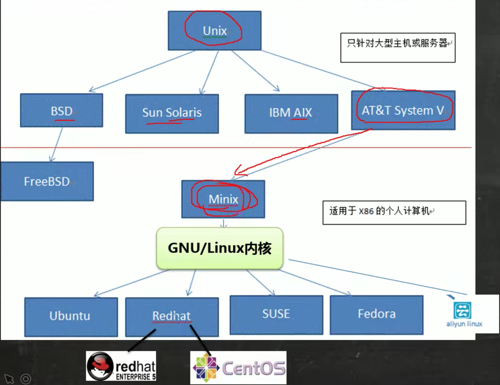

# 概述


**一点历史**

Linux是基于Unix系统二次开发, Sun的solari, IBM的AIX也是基于Unix系统实现的, 但后两者只能运行在特定的大型机上, 而Linux可以运行在x86的个人计算机.




**优点**

免费, 稳定, 高效,  低成本(软件可裁剪, 内核最小可达几百KB).


**应用领域**

桌面, 服务器, 嵌入式


**内核发布**

https://www.kernel.org/


# 安装


**分区规划**

- boot分区,1G

- swap分区, 与内存大小一致, 用于在内存用满的时候与内存交换, 充当虚拟内存.

- 根分区


# 1. Linux目录结构

- /bin (/usr/bin 、 /usr/local/bin)

  是 Binary 的缩写, 这个目录存放着最经常使用的命令

- /sbin (/usr/sbin 、 /usr/local/sbin)
   s 就是 Super User，表示 存放的是系统管理员使用的系统管理程序。

- /home
   存放普通用户的主目录，在 Linux 中每个用户都有一个自己的目录，

- /root

  该目录为系统管理员，也称作超级权限者的用户主目录

- /lib 

     系统开机所需要最基本的动态链接共享库，其作用类似于 Windows 里的 DLL 文件。几乎所有的应用程序都需要用到这些共享库

- /lost+found 

     默认隐藏.  这个目录一般情况下是空的，当系统非法关机后，这里就存放了一些文件

- /etc (editable text configuration)

     所有的系统管理所需要的配置文件和子目录, 比如安装 mysql 数据库 my.conf
     
- /usr 
   这是一个非常重要的目录，用户的很多应用程序和文件都放在这个目录下，类似与 windows 下的 program files 目录。

- /boot 

   Linux启动时使用的一些核心文件，包括一些连接文件以及镜像文件

- /proc `[不能动] `

   这个目录是一个虚拟的目录，它是系统内存的映射，访问这个目录来获取系统信息

- /srv `[不能动] `

   service 缩写，该目录存放一些服务启动之后需要提取的数据

- /sys `[不能动]`

  这是 linux2.6 内核的一个很大的变化。该目录下安装了 2.6 内核中新出现的一个文件系统sysfs

- /tmp 

   这个目录是用来存放一些临时文件的

- /dev

  类似于 windows 的设备管理器，把所有的硬件设备以文件的形式存储.  `在linux世界, 一切皆为文件`.

- /media

  linux 系统会自动识别一些设备，例如 U 盘、光驱等等，当识别后，linux 会把识别的设备挂载到这个目录下

- /mnt 

   系统提供该目录是为了让用户临时挂载别的文件系统的，我们可以将外部的存储挂载在/mnt/上，然后进入该目录就能看到

- /opt 

   存放要给主机安装额外程序的安装包, 如MSQL安装包。默认为空 

- /usr/local

  存放程序安装包解压后的程序文件, 一般是通过编译源码方式安装的程序

- /var

  这个目录中存放着在不断扩充着的东西，习惯将经常被修改的目录放在这个目录下。包括各种日志文件

- /selinux [security-enhanced linux]
  SELinux 是一种安全子系统,它能控制程序只能访问特定文件, 有三种工作模式，可以自行设置.


# 2. 基础认识


## vim

三种模式: 一般模式, 插入模式, 命令行没事


**快捷方式:**

一般模式下,

- `yy` 复制当前行,   `5yy`从当前行开始向下复制5行
- `p` 粘贴
- `dd`删除当前行, `5dd`从当前行开始向下删除5行
- `G或者shift+g`定位到文档的末行, `gg`定位到文档的首行
- `20G`或者 `20shift+g`, 定位到第20行
- `u`, 撤销上次操作

命令行模式下,

- `/`关键字, 可以搜索关键字, `n`搜索下一个, `N`则反向搜索
- `:set nu` 显示行号, `:set nonu`不现实行号


## 开机、重启

关机&重启命令 7.1.1 基本介绍

- shutdown –h now   立该进行关机
- shudown -h 1          1分钟后关机
- shutdown –r now   现在重新启动计算机
- halt                            关机，作用和上面一样. 
- reboot                      现在重新启动计算机
- sync                         把内存的数据同步到磁盘.


>  不管是重启系统还是关闭系统，首先要运行**sync**命令，把内存中的数据写到磁盘中.
>
> 目前的 shutdown/reboot/halt 等命令均已经在关机前进行了 sync. 


# 3. 用户管理
## 用户

**创建用户** 

- `useradd hyc`,  默认创建用户主目录/home/hyc
- `useradd -d  /home/hyc-test  hyc`, 创建用户hyc并且把用户主目录设置为/home/hyc-test

**设置密码**

- passwd hyc, 给hyc用户设置密码.  **[注意]**用户名必须指定, 否则是给当前用户设置密码  

**删除用户**

- userdel hyc, 删除hyc但保留hyc的主目录
- userdel -r hyc, 删除hyc以及主目录

**查看用户信息**

- id hyc

```shell
[root@centos7 ~]# id root
uid=0(root) gid=0(root) 组=0(root)
[root@centos7 ~]# id milan
id: milan: no such user
```

**切换用户**

- su - hyc, 切换到hyc

从权限高的用户切换到权限低的用户，不需要输入密码，反之需要。
当需要返回到原来用户时，使用exit/logout指令

**查看当前第一次登录用户**

- whoami

- who am i

> 如果su到其他用户, 显示的依旧是最初登录的用户
```shell
[root@centos7 ~]# whoami  
root
[root@centos7 ~]# who am i
root     pts/1        2023-10-17 23:33 (172.16.255.1)
```

  

## 用户组

类似于角色的概念. 

新增组 

- groupadd 组名

删除组

- groupdel 组名

增加用户时直接加上组

- `useradd -g g1 hyc`, 新建用户hyc并且添加到g1组
- `useradd hyc`, 新建用户hyc, 并且添加到hyc组

```shell
[root@centos7 ~]# useradd tom
[root@centos7 ~]# id tom
uid=1001(tom) gid=1001(tom) 组=1001(tom)
```

修改用户组

- `usermod -g g2 hyc`, 把用户hyc挪到g2组
- `usermod -d /home/xxx hyc`, 修改用户的主目录为/home/xxx

**用户和组相关文件**

- /etc/passwd, 用户配置文件

记录用户的各种信息 每行的含义:用户名:口令:用户标识号:组标识号:注释性描述:主目录:是否登录 Shell

```shell
[root@centos7 ~]# cat /etc/passwd
root:x:0:0:root:/root:/bin/bash
bin:x:1:1:bin:/bin:/sbin/nologin
daemon:x:2:2:daemon:/sbin:/sbin/nologin
adm:x:3:4:adm:/var/adm:/sbin/nologin
...
hyc:x:1000:1000:hyc:/home/hyc:/bin/bash
tom:x:1001:1001::/home/tom:/bin/bash
```

- /etc/shadow, 口令的配置文件

每行的含义:登录名:加密口令:最后一次修改时间:最小时间间隔:最大时间间隔:警告时间:不活动时间:失效时间:标志

```shell
[root@centos7 ~]# cat /etc/shadow
root:$6$vMpRahDUrG0t9tfD$UT8d8KLr7XXOimNu.iwNfnXYKNoRIRmnbb1Ak/Lg0UI/8zvnPGzXL1vGzclEYse2BxTndI2RRmRd5Ef02qIHS1::0:99999:7:::
bin:*:17834:0:99999:7:::
daemon:*:17834:0:99999:7:::
adm:*:17834:0:99999:7:::
...
hyc:$6$dVbKmIieo3o9DhL5$yshbiHugsT3Q4U17.rYT8opmIitJCXAeWBUL8XGIEXHYzhMFzQq38og5Lc/c38wdGHaBoJHg8Dt1KlmVC6xlP0::0:99999:7:::
tom:!!:19647:0:99999:7:::
```

- /etc/group, 组配置文件，记录组的信息

每行含义:组名:口令:组标识号:组内用户列表

```shell
[root@centos7 ~]# cat /etc/group
root:x:0:
bin:x:1:
daemon:x:2:
sys:x:3:
...
hyc:x:1000:hyc
tom:x:1001:
```


# 4. 实用指令

## 4.1 指定运行级别

`init 0/1/2/3/4/5/6 `, 设置运行级别

运行级别说明:
 0 :关机
 1 :单用户【找回丢失密码】
 2:多用户状态没有网络服务
 3:多用户状态有网络服务
 4:系统未使用保留给用户
 5:图形界面
 6:系统重启
 **常用运行级别是 3 和 5**, centos7简化为3和5级别, 

`init 3`, 将使安装的图形化失效, 回到命令行模式.

`init 5`, 启用图形化界面

centos7之前, 默认运行级别在文件`/etc/inittab`,

centos7之后, 文件内容变更为说明, 讲解怎么设置系统默认运行级别: 

```shell
[root@centos7 ~]# cat /etc/inittab 
# inittab is no longer used when using systemd.
#
# ADDING CONFIGURATION HERE WILL HAVE NO EFFECT ON YOUR SYSTEM.
#
# Ctrl-Alt-Delete is handled by /usr/lib/systemd/system/ctrl-alt-del.target
#
# systemd uses 'targets' instead of runlevels. By default, there are two main targets:
#
# multi-user.target: analogous to runlevel 3
# graphical.target: analogous to runlevel 5
#
# To view current default target, run:
# systemctl get-default
#
# To set a default target, run:
# systemctl set-default TARGET.target
#
```


## 4.2 文件类

### touch指令

`touch xxx`, 创建空文件xxx


### cp指令

拷贝文件到指定目录

`cp [选项] source dest`

常用选项: -r, 递归复制


### mv指令

移动文件与目录或重命

`mv oldNameFile newNameFile`


### cat命令

查看文件内容

`cat [选项] 要查看的文件`

常用选项: -n :显示行号

cat 只能浏览文件，而不能修改文件，为了浏览方便，一般会带上 管道命令` | more `

`cat -n /etc/profile | more`


### more命令

于 VI 编辑器的文本过滤器，它以全屏幕的方式按页显示文本文件的内容。more 指令中内置了若 干快捷键(交互的指令)

`more 要查看的文件`

| 快捷键     | 作用                         |
| ---------- | ---------------------------- |
| Enter      | 向下n行，需要定义。默认为1行 |
| Ctrl+F     | 下翻一屏                     |
| 空格键     | 下翻一屏                     |
| Ctrl+B     | 上翻一页                     |
| =          | 输出当前行的行号             |
| ：f        | 输出文件名和当前行的行号     |
| V          | 调用vi编辑器                 |
| !命令      | 调用Shell并执行              |
| G(shift+g) | 到底                         |
| q          | 退出                         |


### less命令

用来分屏查看文件内容，它的功能与 more 指令类似，但是比 more 指令更加强大，支持各种显示终端。less 指令在显示文件内容时，并不是一次将整个文件加载之后才显示，而是根据显示需要加载内容，对于显示大型文件具有较高的效率。

`less 要查看的文件`

| 快捷键     | 作用                                 |
| ---------- | ------------------------------------ |
| [pageup]   | 下翻一屏                             |
| [pagedown] | 上翻一页                             |
| /字符串    | 向下搜索字符串, n向下查找, N向上查找 |
| ?字符串    | 向上搜索字符串, n向上查找, N向下查找 |
| G(shift+g) | 到底                                 |
| q          | 退出                                 |


### head 指令

显示文件的开头部分内容，默认情况下 head 指令显示文件的前 10 行内容

- `head x文件`  输出文件头10行
- `head -n 5 x文件` 输出文件头 5 行内容


### tail 指令

tail 用于输出文件中尾部的内容，默认情况下 tail 指令显示文件的前 10 行内容

- `tail x文件`  输出文件最后10行
- `tail -n 5 x文件` 输出文件最后5 行内容
- `tail -f x文件`实时跟踪文件的更新内容


### echo 指令

传递给 echo 的参数被打印到标准输出中。

`echo` 通常用于 shell 脚本中，用于显示消息或输出其他命令的结果。

- 语法

`echo [选项] [输出内容]`

- 显示变量

  - `echo $PATH`

- 重定向到一个文件

  - `echo 'The only true wisdom is in knowing you know nothing.' >> /tmp/file.txt`

- 把内容管道给其他命令

  - `echo "echo 'hello again' >> /tmp/at-test.txt" | at now +1 minute`, 

    把内容`echo 'hello again' >> /tmp/at-test.txt`管道给命令at


### \> 指令 和 >> 指令

\> 输出重定向

\>\> 追加

- `ls -l >a.txt`, 列表的内容写入文件 a.txt 中(覆盖写)
- `ls -al >>aa.txt`, 列表的内容追加到文件 aa.txt 的末尾
- `cat 文件1 > 文件2`, 将文件 1 的内容覆盖到文件 2
- `echo "内容">> 文件`, 追加


### ln 指令

软链接也称为符号链接，类似于 windows 里的快捷方式

`ln -s [原文件或目录] [软链接名] `, 给文件创建一个软连接(快捷方式)


`ln -s /root /home/myroot`, 在/home 目录下创建一个软连接 myroot，连接到 /root 目录
`rm /home/myroot`,  删除软连接 myroot


### history 指令

查看已经执行过历史命令,也可以执行历史指令

- `history`, 显示所有的历史命令
- `history 10`, 显示最近使用过的 10 个指令。 
- `!5`, 重新执行编号为5的历史指令


## 4.3 时间日期类

### date指令

**显示当前系统时间**

`date +格式`

```shell
[root@centos7 ~]# date +%Y
2023
[root@centos7 ~]# date +%m
10
[root@centos7 ~]# date +%d
18
[root@centos7 ~]# date '+%Y-%m-%d %H:%M:%S'
2023-10-18 21:04:34
```


**设置系统时间**

`date -s 'yyyyMMdd HH:mm:ss'`


### cal指令

显示日历

- `cal`, 显示当月日历

```shell
[root@centos7 ~]# cal
      十月 2023     
日 一 二 三 四 五 六
 1  2  3  4  5  6  7
 8  9 10 11 12 13 14
15 16 17 18 19 20 21
22 23 24 25 26 27 28
29 30 31
```

- `cal 2023`,显示2023年日历

```shell
[root@centos7 ~]# cal 2023
                               2023                               

        一月                   二月                   三月        
日 一 二 三 四 五 六   日 一 二 三 四 五 六   日 一 二 三 四 五 六
 1  2  3  4  5  6  7             1  2  3  4             1  2  3  4
 8  9 10 11 12 13 14    5  6  7  8  9 10 11    5  6  7  8  9 10 11
15 16 17 18 19 20 21   12 13 14 15 16 17 18   12 13 14 15 16 17 18
22 23 24 25 26 27 28   19 20 21 22 23 24 25   19 20 21 22 23 24 25
29 30 31               26 27 28               26 27 28 29 30 31

        四月                   五月                   六月        
日 一 二 三 四 五 六   日 一 二 三 四 五 六   日 一 二 三 四 五 六
                   1       1  2  3  4  5  6                1  2  3
 2  3  4  5  6  7  8    7  8  9 10 11 12 13    4  5  6  7  8  9 10
 9 10 11 12 13 14 15   14 15 16 17 18 19 20   11 12 13 14 15 16 17
16 17 18 19 20 21 22   21 22 23 24 25 26 27   18 19 20 21 22 23 24
23 24 25 26 27 28 29   28 29 30 31            25 26 27 28 29 30
30
        七月                   八月                   九月        
日 一 二 三 四 五 六   日 一 二 三 四 五 六   日 一 二 三 四 五 六
                   1          1  2  3  4  5                   1  2
 2  3  4  5  6  7  8    6  7  8  9 10 11 12    3  4  5  6  7  8  9
 9 10 11 12 13 14 15   13 14 15 16 17 18 19   10 11 12 13 14 15 16
16 17 18 19 20 21 22   20 21 22 23 24 25 26   17 18 19 20 21 22 23
23 24 25 26 27 28 29   27 28 29 30 31         24 25 26 27 28 29 30
30 31
        十月                  十一月                 十二月       
日 一 二 三 四 五 六   日 一 二 三 四 五 六   日 一 二 三 四 五 六
 1  2  3  4  5  6  7             1  2  3  4                   1  2
 8  9 10 11 12 13 14    5  6  7  8  9 10 11    3  4  5  6  7  8  9
15 16 17 18 19 20 21   12 13 14 15 16 17 18   10 11 12 13 14 15 16
22 23 24 25 26 27 28   19 20 21 22 23 24 25   17 18 19 20 21 22 23
29 30 31               26 27 28 29 30         24 25 26 27 28 29 30
                                              31
```


## 4.4 搜索查找类

### find 指令

从指定目录向下递归地遍历其各个子目录，将满足条件的文件或者目录显示在终端。

`find [搜索范围] [选项]`

| 选项                   | 说明                                                         |
| ---------------------- | ------------------------------------------------------------ |
| -name pattern          | 按文件名查找，支持使用通配符 `*` 和 `?`                      |
| -type type             | 按文件类型查找，type可以是 `f`（普通文件）、`d`（目录）、`l`（符号链接） |
| -user 用户名           | 按照文件所有者查找                                           |
| -size [+-]size[cwbkMG] | 按文件大小查找，支持使用 `+` 或 `-` 表示大于或小于指定大小，单位可以是 `c`（字节）、`w`（字数）、`b`（块数）、`k`（KB）、`M`（MB）或 `G`（GB） |
| -group groupname       | 按文件所属组查找                                             |
|                        |                                                              |


### locate命令

locate命令用于查找符合条件的文档，他会去保存文档和目录名称的数据库内，查找合乎范本样式条件的文档或目录。

由于 locate 指令基于数据库进行查询，所以第一次运行前，必须使用 `updatedb` 指令创建 locate 数据库, 并且建议定期在闲时执行`updatedb`。

- `locate -i xxx`, 忽略大小写查找包含文件名包含`xxx`的文件
- `locate /etc/xx`,查找/etc目录下的`xx`开头文件


### whereis指令

查找**指令**

```shell
[root@centos7 ~]# whereis tar
tar: /usr/bin/tar /usr/include/tar.h /usr/share/man/man5/tar.5.gz /usr/share/man/man1/tar.1.gz
```


### grep指令和 管道符号 |

grep 过滤查找 ， 管道符“|”表示将前一个命令的处理结果输出传递给后面的命令处理。

`grep [选项] 查找内容 源文件`

选项-n,  显示行号

选项-i, 忽略大小写


## 4.5 压缩和解压

### gzip/gunzip 指令

gzip压缩文件, *不压缩目录*, gunzip解压

- `gzip xxx.txt`, 压缩文件xxx.txt为xxx.txt.gz的压缩文件

- `gzip -r /home/test`, 递归压缩/home/test目录下的每一个文件 

  

### zip/unzip 指令

zip 用于压缩文件/文件夹为一个压缩包， unzip 用于解压的

`zip [选项] 文件/目录`

- `zip X.zip x文件`,压缩x文件为x.zip 
- `zip -r X.zip 目录`, 压缩目录为x.zip
- 选项-v, 显示详细的压缩过程信息
- `zip -dv x.zip 文件1` ,  从压缩文件内删除文件1

`unzip [选项] x.zip`

- `unzip -d X.zip`, 把x.zip解压到指定目录

- 选项-l, 显示压缩文件内所包含的文件。
- 选项 -v,  查看压缩文件目录信息，但是不解压该文件


### tar指令

打包指令，最后打包后的文件是 `.tar.gz` 的文件

`tar [选项] XXX.tar.gz 打包的内容1 打包内容2`

| 选项 | 说明                  |
| ---- | --------------------- |
| -c   | 建立新的备份文件      |
| -C   | 切换目录, 解压时候用  |
| -v   | verbose, 显示详细信息 |
| -f   | 执行打包后的文件名    |
| -z   | 打包的同时压缩        |
| -x   | 解压.tar文件          |

- `tar -czvf test.tar.gz /home/test /home/test1` , 把`/home/test`, `/home/test1`目录压缩打包成test.tar.gz文件到当前目录
- `tar -xzvf test.tar.gz `,解压test.tar.gz文件到当前目录
- `tar -xzvf test.tar.gz -C /home` ,解压test.tar.gz文件到/home目录下


# 5. 组管理和权限管理

## 文件权限

```shell
[root@centos7 folder]# ll
总用量 12
-rw-r--r--. 1 root root    0 10月 19 23:23 1.txt
-rw-r--r--. 1 root root   51 10月 19 22:06 1.txt.gz
-rwxr-xr-x. 1 root root    5 10月 19 23:25 cmd.sh     <---以此文件为例
drwxr-xr-x. 2 root root 4096 10月 19 23:22 tmp
```

| 第0未                                                        | 123位                                                        | 456位                   | 789位                   | 1                                                      | root   | root             | 数值 | 时间          | 文件名 |
| ------------------------------------------------------------ | ------------------------------------------------------------ | ----------------------- | ----------------------- | ------------------------------------------------------ | ------ | ---------------- | ---- | ------------- | ------ |
| -<br />类型                                                  | rwx<br />所有者权限                                          | r-x<br />同一组用户权限 | r-x<br />其他组用户权限 | 数值                                                   | 所有者 | 所在组           | 大小 | 10月 19 23:23 | cmd.sh |
| - 表示普通文件 <br />d 表示目录 <br />l 表示符号链接 <br />c 表示字符设备文件,鼠标键盘 <br />b 表示块设备文件, 磁盘等 <br />s 表示套接字文件 <br />p 表示管道文件 | r 表示可读权限 <br />w 表示修改权限<br />x 表示执行文件/进入目录权限 <br />\- 表示没有对应权限 | 同左                    | 同左                    | 目录: 表示子目录个数, <br />文件: 指向次文件的链接个数 | 所有者 | 默认是创建者的组 | 字节 | 最后修改时间  |        |


## 修改权限chmod


第一种方式: + 、-、= 变更权限, 

*u:所有者 g:所有组 o:其他人 a:所有人(u、g、o 的总和)*

- `chmod u=rwx,g=rx,o=x 文件/目录`, 给u(所有者), g(组), o(其他用户)设置对应权限
- `chmod o+w 文件/目录名` ,  给o(其他人)添加w(可读)权限
- `chmod +w 文件/目录名` ,  给所有人添加x(执行)权限
- `chmod a-x 文件/目录名`, 给a(所有人)移出x(执行)权限


第二种方式:通过数字变更权限

r=4 w=2 x=1 

rwx=4+2+1=7

`chmod 751 文件1` 等效于 `chmod u=rwx,g=rx,o=x 文件1`


### 修改所有者chown

- `chown tom a.txt`  修改a.txt的所有者为tom
- `chown tom:g1 a.txt` 改变a.txt的所有者和所在组
- `chown -R tom /home/test` 修改/home/test以及下级所有文件和目录所有者为tom


### 修改文件/目录所在组chgrp

- `chgrp g1 a.txt`, 修改文件组为g1
- `chgrp -R g1 /home/test`, 把/home/test以及下级所有文件和目录的所在组都修改成g1


# 6. 定时任务调度

## crond/crontab

**crond**是Linux系统用来定期执行命令或指定程序的服务的一种服务或软件。crond服务会定期（默认一分钟检查一次）检查系统中是否有要执行的任务工作。

**crontab**是用于设置周期性被执行的指令，该命令从标准输入设备读取指令，并将其存放于“crontab”文件中，以供之后读取与执行。  


**crontab语法**

- ` crontab –e` 当前用户编辑调度任务
  - */5 * * * * `command`, 每天5分钟点执行命令
- `crontab -l` 查看所有当前用户的任务
- `crontab -r` 删除所有当前用户的任务, 若仅要移除一项，请用` -e` 去编辑
- 系统的配置文件: `/etc/crontab`
  - `crontab -e` 命令是针对用户的cron设计的，`crontab -e` 其实是`/usr/bin/crontab`这个文件
  - 系统的例行性任务使用配置文件`/etc/crontab`

```shell
[root@centos7 ~]# cat /etc/crontab   
SHELL=/bin/bash
PATH=/sbin:/bin:/usr/sbin:/usr/bin
MAILTO=root

# For details see man 4 crontabs

# Example of job definition:
# .---------------- minute (0 - 59)
# |  .------------- hour (0 - 23)
# |  |  .---------- day of month (1 - 31)
# |  |  |  .------- month (1 - 12) OR jan,feb,mar,apr ...
# |  |  |  |  .---- day of week (0 - 6) (Sunday=0 or 7) OR sun,mon,tue,wed,thu,fri,sat
# |  |  |  |  |
# *  *  *  *  * user-name  command to be executed

1 * * * * root run-parts /etc/cron.hourly    	//每小时1分执行/etc/cron.hourly目录下的命令
0 1 * * * root run-parts /etc/cron.daily			//每天1点执行/etc/cron.daily目录下的命令
0 4 * * 0 root run-parts /etc/cron.weekly			//每周日4点执行/etc/cron.weekly目录下的命令
0 4 1 * * root run-parts /etc/cron.monthly		//每月1日4点执行/etc/cron.monthly目录下的命令
```


crontab时间格式, 5段符号

| 代表意义 | 分钟 | 小时 | 日期 | 月份 | 周             |
| -------- | ---- | ---- | ---- | ---- | -------------- |
| 数字范围 | 0-59 | 0-23 | 1-31 | 1-12 | 0-6(0/7是周日) |

| 特殊字符 | 代表意义                                                     |
| -------- | ------------------------------------------------------------ |
| *(星号)  | 代表任何时刻都接受的意思！                                   |
| ,(逗号)  | 代表分隔时段的意思。<br />0 3,6 * * * command, 每第3和6分钟执行command |
| -(减号)  | 代表一段时间范围内，<br />20 8-12 * * * command,  8 点到 12 点之间的第20分 |
| /n(斜线) | 每隔 n 单位间隔，<br />*/5 * * * * command, 每五分钟进行一次 |

```shell
systemctl reload crond.service #重启crontab
systemctl start crond.service 
systemctl stop crond.service
systemctl restart crond.service

# 如果不支持systemctl命令
service crond start    //启动服务
service crond stop     //关闭服务
service crond restart  //重启服务
service crond reload   //重新载入配置
service crond status   //查看服务状态 
```


## at

at 命令是一次性定时计划任务，执行完一个任务后不再执行此任务了.

at 的守护进程 atd 会以后台模式运行，每60秒检查作业队列来运行。

在使用at命令的时候，一定要保证atd进程的启动,使用`ps -ef | grep atd` 查看` atd` 是否在运行

- 语法

  ```css
  at [选项] [日期时间]
  ```
  - 选项
  
  ```diff
  -f：指定包含具体指令的任务文件
  -q：指定新任务的队列名称
  -l：显示待执行任务的列表
  -d：删除指定的待执行任务
  -m：任务执行完成后向用户发送 E-mail
  ```
  
  - 日期时间
  
  ```undefined
  YYMMDDhhmm[.ss]（缩写年、月、日、小时、分钟[秒]）
  CCYYMMDDhhmm[.ss]（完整年、月、日、小时、分钟和[秒]）
  now
  midnight
  noon
  teatime（下午4点）
  AM
  PMa
  
  也可以添加一个加号 ( + ) 使它们相对于现在：
  minutes
  hours
  days
  weeks
  months
  years
  ```


推荐使用管道命令添加at命令

`echo "echo 'hello again' >> /tmp/at-test.txt" | at now +1 minute`


# 7. 磁盘分区与挂载

## lsblk命令

lsblk的英文是“list block”，列出所有可用块设备的信息，而且还能显示他们之间的依赖关系，但是它不会列出RAM盘的信息。

块设备有硬盘，闪存盘，CD-ROM等等。

```shell
[root@centos7 ~]# lsblk
NAME   MAJ:MIN RM  SIZE RO TYPE MOUNTPOINT
sda      8:0    0   15G  0 disk 
├─sda1   8:1    0    1G  0 part /boot
├─sda2   8:2    0    2G  0 part [SWAP]
└─sda3   8:3    0   12G  0 part /
sr0     11:0    1 1024M  0 rom  
```


### 硬盘说明

Linux 硬盘分 IDE 硬盘和 SCSI 硬盘，目前基本上是 **SCSI** 硬盘.

- 对于SCSI硬盘则标识为“sdx~”，SCSI硬盘是用“sd”来表示分区所在设备的类型的. “x”为盘号(a为基本盘，b 为基本从属盘，c 为辅助主盘，d 为辅助从属盘),“~”代表分区，前四个分区用数字 1 到 4 表示，它们是主分区或扩展分区，从 5 开始就是逻辑分区.

  以SCSI硬盘为例, `sda2`表示第一块SCSI盘的第二个主分区或拓展分区. `sdb2`表示为第二个 IDE 硬盘上的第二个主分区或扩展分区

- 对于IDE硬盘，驱动器标识符为“hdx~”,其中“hd”表明分区所在设备的类型，其他规则与SCSI硬盘一致。

> IDE和SCSI的区别: 
>
> - IDE的工作方式需要CPU的全程参与，CPU读写数据的时候不能再进行其他操作；而SCSI接口，则完全通过独立的高速的SCSI卡来控制数据的读写操作，CPU就不必浪费时间进行等待，可以提高系统的整体性能。
> - SCSI的扩充性比IDE大，一般每个IDE系统可有2个IDE通道，总共连4个IDE设备，而SCSI接口可连接7—15个设备，比IDE要多很多。 连接的线缆也远长于IDE。
> - 性价比上，在当时IDE更具有优势，SCSI接口价格一般会比IDE接口贵一些。

