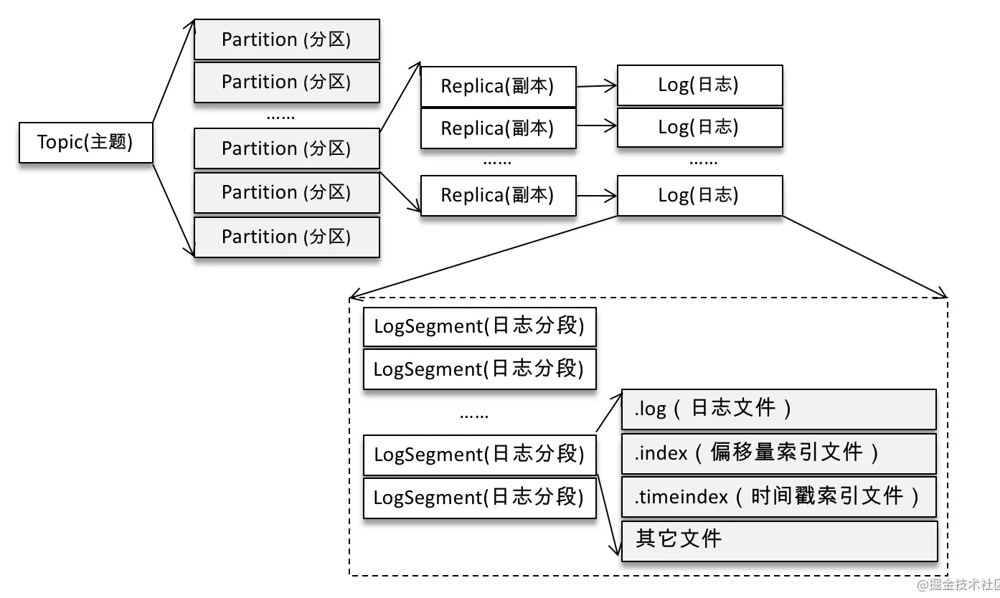
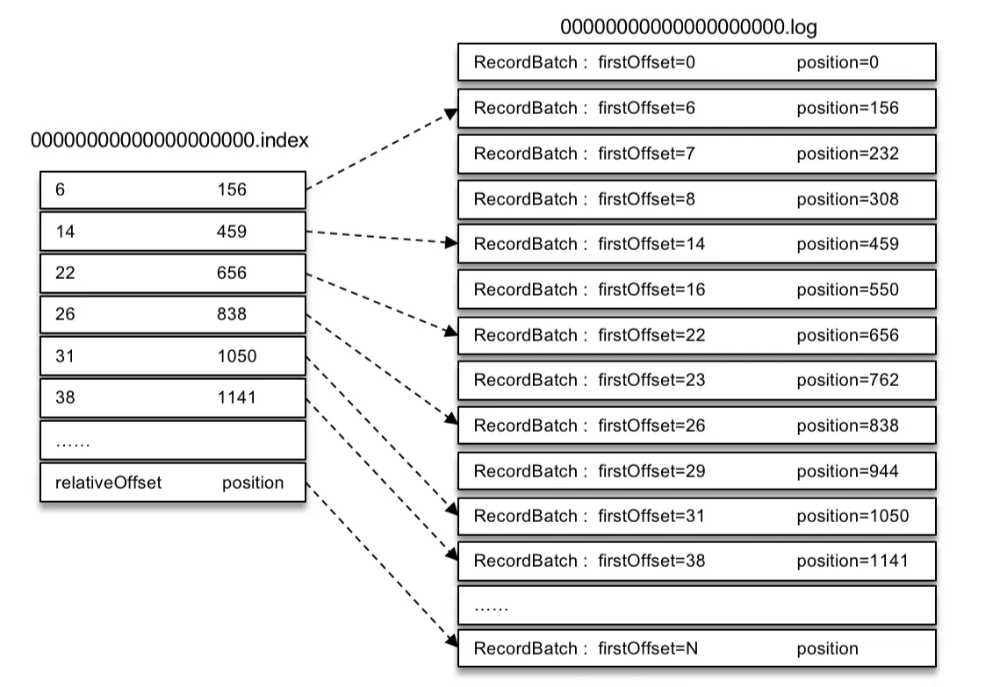

> https://juejin.cn/book/6844733792683458573


# 1. 日志存储



日志是一<topic>-<分区数>来命名目录. 

目录的日志文件如下

```shell
-rw-rw-r-- 1 root root 10485760 8月  27 09:16 00000000000000018913.index
-rw-rw-r-- 1 root root     3963 8月  27 10:01 00000000000000018913.log
-rw-rw-r-- 1 root root       10 8月  24 14:22 00000000000000018913.snapshot
-rw-rw-r-- 1 root root 10485756 8月  24 14:27 00000000000000018913.timeindex
-rw-rw-r-- 1 root root       12 8月  24 14:22 leader-epoch-checkpoint
```

日志数据文件

- log文件: 日志文件
- index文件: 偏移量索引文件
- timeindex文件: 时间戳索引文件

辅助文件

- deleted:  标识文件可以删除, 由"delete-file"延迟任务去执行删除
- cleaned
- swap”等临时文件
- snapshot
- txnindex
- leader-epoch-checkpoint

每个 LogSegment 都有一个`基准偏移量 baseOffset`，用来表示`当前 LogSegment 中第一条消息的 offset`。

基准偏移量是一个64位的长整型数，**日志文件和两个索引文件都是根据基准偏移量（baseOffset）命名**的，名称固定为20位数字，没有达到的位数则用0填充。


# 2. 日志格式


# 3. 日志索引


## 3.1 日志索引方式

Kafka 中的索引文件以`稀疏索引（sparse index, 跳表原理）`的方式构造消息的索引，它并不保证每个消息在索引文件中都有对应的索引项。

每当写入一定量（由 broker 端参数 log.index.interval.bytes 指定，默认值为4096，即 4KB）的消息时，偏移量索引文件和时间戳索引文件分别增加一个偏移量索引项和时间戳索引项，增大或减小 log.index.interval.bytes 的值，对应地可以增加或缩小索引项的密度。

稀疏索引通过 MappedByteBuffer 将索引文件映射到内存中，以加快索引的查询速度。偏移量索引文件中的偏移量是单调递增的，查询指定偏移量时，使用二分查找法来快速定位偏移量的位置，如果指定的偏移量不在索引文件中，则会返回小于指定偏移量的最大偏移量。


## 3.2 日志文件切分策略

日志分段文件达到一定的条件时进行切分，其对应的索引文件也跟着切分.

日志分段文件切分包含以下几个条件，满足其一即可：

1. 当前日志分段文件的大小超过了 broker 端参数 `log.segment.bytes`配置的值。`log.segment.bytes` 参数的默认值为1073741824，即1GB。
2. 当前日志分段中消息的最大时间戳与当前系统的时间戳的差值大于 `log.roll.ms` 或 `log.roll.hours` 参数配置的值。如果同时配置了 `log.roll.ms` 和 `log.roll.hours` 参数，那么 `log.roll.ms` 的优先级高。默认情况下，只配置了 `log.roll.hours` 参数，其值为168，即7天。
3. 偏移量索引文件或时间戳索引文件的大小达到 broker 端参数 `log.index.size.max.bytes`配置的值(默认值为10485760，即10MB)。
4. 追加的消息的偏移量与当前日志分段的偏移量之间的差值大于 `Integer.MAX_VALUE`，即要追加的消息的偏移量不能转变为相对偏移量（offset - baseOffset > Integer.MAX_VALUE）。


## 3.3 偏移量索引


每个偏移量索引项的格式:

- relativeOffset：相对偏移量，4个字节. 表示消息相对于 baseOffset 的偏移量，当前索引文件的文件名即为 baseOffset 的值。

- position：物理地址，4个字节, 也就是消息在日志分段文件中对应的物理位置。


假设00000000000000000000.index, 截取的内容是16进制表示的:

```
0000 0006 0000 009c 
0000 000e 0000 01cb
0000 0016 0000 02fa 
0000 001a 0000 03b0 
0000 001f 0000 0475
```

使用` kafka-dump-log.sh`解析

```
[root@node1 kafka_2.11-2.0.0]# bin/kafka-dump-log.sh --files /tmp/kafka-logs/ topic-log-0/00000000000000000000.index
Dumping /tmp/kafka-logs/topic-log-0/00000000000000000000.index
offset: 6 position: 156
offset: 14 position: 459
offset: 22 position: 656
offset: 26 position: 838
offset: 31 position: 1050
```





## 3.4 时间戳索引


每个索引项占用12个字节，分为两个部分。

1. timestamp：当前日志分段最大的时间戳。
2. relativeOffset：时间戳所对应的消息的相对偏移量。


# 4. 日志清理


Kafka 提供了两种日志清理策略：

1. **日志删除**（Log Retention）：按照一定的保留策略直接删除不符合条件的日志分段。
2. **日志压缩**（Log Compaction）：针对每个消息的 key 进行整合，对于有相同 key 的不同 value 值，只保留最后一个版本。


broker 端参数 `log.cleanup.policy` 来设置日志清理策略, 

log.cleanup.policy = **delete**(默认)

log.cleanup.policy = **compact**, 开启压缩,  还需要 log.cleaner.enable=true(默认)


**清理策略可以指定为topic级别.**


## 4.1 日志删除

日志分段的保留策略有3种：基于时间的保留策略、基于日志大小的保留策略和基于日志起始偏移量的保留策略。


### 4.1.1 基于时间

kafka删除保留时间大于设定阈值的日志文件. 

阈值在broker 端参数

- log.retention.hours: 最高优先级, 默认168, 即7天
- log.retention.minutes: 次优先级
- log.retention.ms: 最低优先级

保留时间判断是根据日志分段中最大的时间戳 largestTimeStamp (时间戳索引文件的最后一条索引项的时间)来判断的. 

若所有日志分段都过期, 则根据最后一个分段切分出一个新的日志分段作为activeSegment来接受新消息, 之后再执行删除操作.


**删除操作**

删除日志分段时，首先会从 Log 对象中所维护日志分段的跳跃表中移除待删除的日志分段，以保证没有线程对这些日志分段进行读取操作。然后将日志分段所对应的所有文件添加上“.deleted”的后缀（当然也包括对应的索引文件）。最后交由一个以“delete-file”命名的延迟任务来删除这些以“.deleted”为后缀的文件，这个任务的延迟执行时间可以通过 file.delete.delay.ms 参数来调配，默认值为60000，单位ms.


### 4.1.2 基于日志大小

基于日志大小(`retentionSize `)指的是所有log日志文件的大小, 并不是单个日志分段的大小.

broker 端参数`log.retention.bytes` 来配置日志文件大小，默认值为-1，表示无穷大.

单个日志分段的大小由 broker 端参数 `log.segment.bytes` 来限制，默认值为1073741824，即 1GB.

计算日志文件的总大小 size 和 retentionSize 的差值 diff，即计算需要删除的日志总大小，然后从日志文件中的第一个日志分段开始进行查找可删除的日志分段的文件集合 deletableSegments。


### 4.1.3 **基于日志起始偏移量**


基于日志起始偏移量的保留策略的判断依据是某日志分段的下一个日志分段的起始偏移量 baseOffset 是否小于等于 logStartOffset，若是，则可以删除此日志分段。


## 4.2 日志压缩


针对每个消息的 key 进行整合，对于有相同 key 的不同 value 值，只保留最后一个版本。

适合持久化存储数据, 例如用户的信息等. 


# 5. 磁盘存储