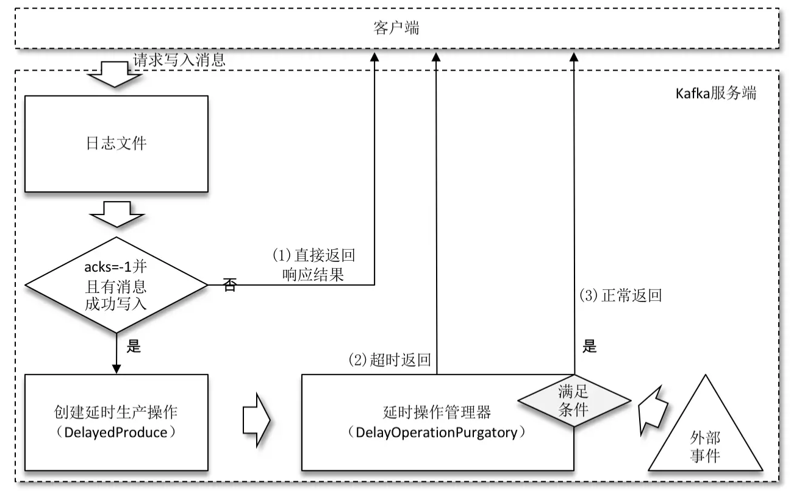

> https://juejin.cn/book/6844733792683458573


# 1. 日志存储


日志是一<topic>-<分区数>来命名目录. 

目录的日志文件如下

```shell
-rw-rw-r-- 1 root root 10485760 8月  27 09:16 00000000000000018913.index
-rw-rw-r-- 1 root root     3963 8月  27 10:01 00000000000000018913.log
-rw-rw-r-- 1 root root       10 8月  24 14:22 00000000000000018913.snapshot
-rw-rw-r-- 1 root root 10485756 8月  24 14:27 00000000000000018913.timeindex
-rw-rw-r-- 1 root root       12 8月  24 14:22 leader-epoch-checkpoint
```

日志数据文件

- log文件: 日志文件
- index文件: 偏移量索引文件
- timeindex文件: 时间戳索引文件

辅助文件

- deleted:  标识文件可以删除, 由"delete-file"延迟任务去执行删除
- cleaned
- swap”等临时文件
- snapshot
- txnindex
- leader-epoch-checkpoint

每个 LogSegment 都有一个`基准偏移量 baseOffset`，用来表示`当前 LogSegment 中第一条消息的 offset`。

基准偏移量是一个64位的长整型数，**日志文件和两个索引文件都是根据基准偏移量（baseOffset）命名**的，名称固定为20位数字，没有达到的位数则用0填充。


# 2. 日志格式


# 3. 日志索引


## 3.1 日志索引方式

Kafka 中的索引文件以`稀疏索引（sparse index, 跳表原理）`的方式构造消息的索引，它并不保证每个消息在索引文件中都有对应的索引项。

每当写入一定量（由 broker 端参数 log.index.interval.bytes 指定，默认值为4096，即 4KB）的消息时，偏移量索引文件和时间戳索引文件分别增加一个偏移量索引项和时间戳索引项，增大或减小 log.index.interval.bytes 的值，对应地可以增加或缩小索引项的密度。

稀疏索引通过 MappedByteBuffer 将索引文件映射到内存中，以加快索引的查询速度。偏移量索引文件中的偏移量是单调递增的，查询指定偏移量时，使用二分查找法来快速定位偏移量的位置，如果指定的偏移量不在索引文件中，则会返回小于指定偏移量的最大偏移量。


## 3.2 日志文件切分策略

日志分段文件达到一定的条件时进行切分，其对应的索引文件也跟着切分.

日志分段文件切分包含以下几个条件，满足其一即可：

1. 当前日志分段文件的大小超过了 broker 端参数 `log.segment.bytes`配置的值。`log.segment.bytes` 参数的默认值为1073741824，即1GB。
2. 当前日志分段中消息的最大时间戳与当前系统的时间戳的差值大于 `log.roll.ms` 或 `log.roll.hours` 参数配置的值。如果同时配置了 `log.roll.ms` 和 `log.roll.hours` 参数，那么 `log.roll.ms` 的优先级高。默认情况下，只配置了 `log.roll.hours` 参数，其值为168，即7天。
3. 偏移量索引文件或时间戳索引文件的大小达到 broker 端参数 `log.index.size.max.bytes`配置的值(默认值为10485760，即10MB)。
4. 追加的消息的偏移量与当前日志分段的偏移量之间的差值大于 `Integer.MAX_VALUE`，即要追加的消息的偏移量不能转变为相对偏移量（offset - baseOffset > Integer.MAX_VALUE）。


## 3.3 偏移量索引


每个偏移量索引项的格式:

- relativeOffset：相对偏移量，4个字节. 表示消息相对于 baseOffset 的偏移量，当前索引文件的文件名即为 baseOffset 的值。

- position：物理地址，4个字节, 也就是消息在日志分段文件中对应的物理位置。


假设00000000000000000000.index, 截取的内容是16进制表示的:

```
0000 0006 0000 009c 
0000 000e 0000 01cb
0000 0016 0000 02fa 
0000 001a 0000 03b0 
0000 001f 0000 0475
```

使用` kafka-dump-log.sh`解析

```
[root@node1 kafka_2.11-2.0.0]# bin/kafka-dump-log.sh --files /tmp/kafka-logs/ topic-log-0/00000000000000000000.index
Dumping /tmp/kafka-logs/topic-log-0/00000000000000000000.index
offset: 6 position: 156
offset: 14 position: 459
offset: 22 position: 656
offset: 26 position: 838
offset: 31 position: 1050
```


## 3.4 时间戳索引


每个索引项占用12个字节，分为两个部分。

1. timestamp：当前日志分段最大的时间戳。
2. relativeOffset：时间戳所对应的消息的相对偏移量。


# 4. 日志清理


Kafka 提供了两种日志清理策略：

1. **日志删除**（Log Retention）：按照一定的保留策略直接删除不符合条件的日志分段。
2. **日志压缩**（Log Compaction）：针对每个消息的 key 进行整合，对于有相同 key 的不同 value 值，只保留最后一个版本。


broker 端参数 `log.cleanup.policy` 来设置日志清理策略, 

log.cleanup.policy = **delete**(默认)

log.cleanup.policy = **compact**, 开启压缩,  还需要 log.cleaner.enable=true(默认)


**清理策略可以指定为topic级别.**


## 4.1 日志删除

日志分段的保留策略有3种：基于时间的保留策略、基于日志大小的保留策略和基于日志起始偏移量的保留策略。


### 4.1.1 基于时间

kafka删除保留时间大于设定阈值的日志文件. 

阈值在broker 端参数

- log.retention.hours: 最高优先级, 默认168, 即7天
- log.retention.minutes: 次优先级
- log.retention.ms: 最低优先级

保留时间判断是根据日志分段中最大的时间戳 largestTimeStamp (时间戳索引文件的最后一条索引项的时间)来判断的. 

若所有日志分段都过期, 则根据最后一个分段切分出一个新的日志分段作为activeSegment来接受新消息, 之后再执行删除操作.


**删除操作**

删除日志分段时，首先会从 Log 对象中所维护日志分段的跳跃表中移除待删除的日志分段，以保证没有线程对这些日志分段进行读取操作。然后将日志分段所对应的所有文件添加上“.deleted”的后缀（当然也包括对应的索引文件）。最后交由一个以“delete-file”命名的延迟任务来删除这些以“.deleted”为后缀的文件，这个任务的延迟执行时间可以通过 file.delete.delay.ms 参数来调配，默认值为60000，单位ms.


### 4.1.2 基于日志大小

基于日志大小(`retentionSize `)指的是所有log日志文件的大小, 并不是单个日志分段的大小.

broker 端参数`log.retention.bytes` 来配置日志文件大小，默认值为-1，表示无穷大.

单个日志分段的大小由 broker 端参数 `log.segment.bytes` 来限制，默认值为1073741824，即 1GB.

计算日志文件的总大小 size 和 retentionSize 的差值 diff，即计算需要删除的日志总大小，然后从日志文件中的第一个日志分段开始进行查找可删除的日志分段的文件集合 deletableSegments。


### 4.1.3 **基于日志起始偏移量**


基于日志起始偏移量的保留策略的判断依据是某日志分段的下一个日志分段的起始偏移量 baseOffset 是否小于等于 logStartOffset，若是，则可以删除此日志分段。


## 4.2 日志压缩


针对每个消息的 key 进行整合，对于有相同 key 的不同 value 值，只保留最后一个版本。

适合持久化存储数据, 例如用户的信息等. 


# 5. 磁盘存储


日志切片顺序写, 零拷贝, 


# 6. 时间轮

Kafka 中存在大量的延时操作，比如延时生产、延时拉取和延时删除等。Kafka 的延时功能定时器（SystemTimer）是基于时间轮概念而自定义实现。JDK 中 Timer 和 DelayQueue 的插入和删除操作的平均时间复杂度为 O(nlogn) 并不能满足 Kafka 的高性能要求，而基于时间轮可以将插入和删除操作的时间复杂度都降为 O(1)。


Kafka 中的时间轮（TimingWheel）是一个存储定时任务的环形队列，底层采用数组实现，数组中的每个元素可以存放一个定时任务列表（TimerTaskList）。TimerTaskList 是一个环形的双向链表，链表中的每一项表示的都是定时任务项（TimerTaskEntry），其中封装了真正的定时任务（TimerTask）。

时间轮由多个时间格组成，每个时间格代表当前时间轮的基本时间跨度（tickMs）。时间轮的时间格个数是固定的，可用 wheelSize 来表示，那么整个时间轮的总体时间跨度（interval）可以通过公式 tickMs×wheelSize 计算得出。

时间轮还有一个表盘指针（currentTime），用来表示时间轮当前所处的时间，currentTime 是 tickMs 的整数倍。currentTime 可以将整个时间轮划分为到期部分和未到期部分，currentTime 当前指向的时间格也属于到期部分，表示刚好到期，需要处理此时间格所对应的 TimerTaskList 中的所有任务。

若时间轮的 tickMs 为 1ms 且 wheelSize 等于20，那么可以计算得出总体时间跨度 interval 为20ms。

初始情况下表盘指针 currentTime 指向时间格0，此时有一个定时为2ms的任务插进来会存放到时间格为2的 TimerTaskList 中。随着时间的不断推移，指针 currentTime 不断向前推进，过了2ms之后，当到达时间格2时，就需要将时间格2对应的 TimeTaskList 中的任务进行相应的到期操作。此时若又有一个定时为8ms的任务插进来，则会存放到时间格10中，currentTime 再过8ms后会指向时间格10。

如果同时有一个定时为19ms的任务插进来怎么办？新来的 TimerTaskEntry 会复用原来的 TimerTaskList，所以它会插入原本已经到期的时间格1。总之，整个时间轮的总体跨度是不变的，随着指针 currentTime 的不断推进，当前时间轮所能处理的时间段也在不断后移，总体时间范围在 currentTime 和 currentTime+interval 之间。

如果此时有一个定时为 350ms 的任务该如何处理？直接扩充 wheelSize 的大小？Kafka 中不乏几万甚至几十万毫秒的定时任务，这个 wheelSize 的扩充没有底线，就算将所有的定时任务的到期时间都设定一个上限，比如100万毫秒，那么这个 wheelSize 为100万毫秒的时间轮不仅占用很大的内存空间，而且也会拉低效率。Kafka 为此引入了层级时间轮的概念，当任务的到期时间超过了当前时间轮所表示的时间范围时，就会尝试添加到上层时间轮中。


如上图所示，复用之前的案例，第一层的时间轮 tickMs=1ms、wheelSize=20、interval=20ms。第二层的时间轮的 tickMs 为第一层时间轮的 interval，即20ms。每一层时间轮的 wheelSize 是固定的，都是20，那么第二层的时间轮的总体时间跨度 interval 为400ms。以此类推，这个400ms也是第三层的 tickMs 的大小，第三层的时间轮的总体时间跨度为8000ms。

对于之前所说的 350ms 的定时任务，显然第一层时间轮不能满足条件，所以就升级到第二层时间轮中，最终被插入第二层时间轮中时间格17所对应的 TimerTaskList。如果此时又有一个定时为 450ms 的任务，那么显然第二层时间轮也无法满足条件，所以又升级到第三层时间轮中，最终被插入第三层时间轮中时间格1的 TimerTaskList。注意到在到期时间为 [400ms,800ms) 区间内的多个任务（比如 446ms、455ms 和 473ms 的定时任务）都会被放入第三层时间轮的时间格1，时间格1对应的 TimerTaskList 的超时时间为 400ms。

随着时间的流逝，当此 TimerTaskList 到期之时，原本定时为 450ms 的任务还剩下 50ms 的时间，还不能执行这个任务的到期操作。这里就有一个时间轮降级的操作，会将这个剩余时间为 50ms 的定时任务重新提交到层级时间轮中，此时第一层时间轮的总体时间跨度不够，而第二层足够，所以该任务被放到第二层时间轮到期时间为 [40ms,60ms) 的时间格中。再经历 40ms 之后，此时这个任务又被“察觉”，不过还剩余 10ms，还是不能立即执行到期操作。所以还要再有一次时间轮的降级，此任务被添加到第一层时间轮到期时间为 [10ms,11ms) 的时间格中，之后再经历 10ms 后，此任务真正到期，最终执行相应的到期操作。


# 7. 延时操作

在 Kafka 中有多种延时操作，延时生产(DelayedProduce)，延时拉取（DelayedFetch）、延时数据删除（DelayedDeleteRecords）等。

延时操作需要延时返回响应的结果，首先它必须有一个超时时间（delayMs），如果在这个超时时间内没有完成既定的任务，那么就需要强制完成以返回响应结果给客户端。其次，延时操作不同于定时操作，定时操作是指在特定时间之后执行的操作，而延时操作可以在所设定的超时时间之前完成，所以延时操作能够支持外部事件的触发。


说下**延时生产**和**延时拉取.** 


## 延时生产

生产者客户端发送消息的时候将 acks 参数设置为-1，那么就意味着需要等待 ISR 集合中的所有副本都确认收到消息之后才能正确地收到响应的结果，或者捕获超时异常。

将消息写入 leader 副本的本地日志文件之后，Kafka 会创建一个延时的生产操作（DelayedProduce），用来处理消息正常写入所有副本或超时的情况，以返回相应的响应结果给客户端。如果在超时时间内始终无法完成，则强制执行。

就延时生产操作而言，它的**外部事件**是所要写入消息的某个分区的 HW（高水位）发生增长。也就是说，随着 follower 副本不断地与 leader 副本进行消息同步，进而促使HW(高水位)进一步增长，HW 每增长一次都会检测是否能够完成此次延时生产操作，如果可以就执行以此返回响应结果给客户端；如果在超时时间内始终无法完成，则强制执行。




## 延时拉取

两个 follower 副本都已经拉取到了 leader 副本的最新位置，此时又向 leader 副本发送拉取请求，而 leader 副本并没有新的消息写入，那么此时 leader 副本该如何处理呢？可以直接返回空的拉取结果给 follower 副本，不过在 leader 副本一直没有新消息写入的情况下，follower 副本会一直发送拉取请求，并且总收到空的拉取结果，这样徒耗资源，显然不太合理。

Kafka 选择了延时操作来处理这种情况。Kafka 在处理拉取请求时，会先读取一次日志文件，如果收集不到足够多（fetchMinBytes，由参数 fetch.min.bytes 配置，默认值为1）的消息，那么就会创建一个延时拉取操作（DelayedFetch）以等待拉取到足够数量的消息。当延时拉取操作执行时，会再读取一次日志文件，然后将拉取结果返回给 follower 副本。延时拉取操作也会有一个专门的延时操作管理器负责管理，大体的脉络与延时生产操作相同，不再赘述。如果拉取进度一直没有追赶上leader副本，那么在拉取 leader 副本的消息时一般拉取的消息大小都会不小于 fetchMinBytes，这样 Kafka 也就不会创建相应的延时拉取操作，而是立即返回拉取结果。

延时拉取的外部事件:

- 如果是 follower 副本的延时拉取，它的外部事件就是消息追加到了 leader 副本的本地日志文件中；
- 如果是消费者客户端的延时拉取，它的外部事件可以简单地理解为HW的增长。


# 8. 控制器

在 Kafka 集群中会有一个或多个 broker，其中有一个 broker 会被选举为控制器（Kafka Controller），它负责管理整个集群中所有分区和副本的状态。

- 当某个分区的 leader 副本出现故障时，由控制器负责为该分区选举新的 leader 副本。
- 当检测到某个分区的 ISR 集合发生变化时，由控制器负责通知所有broker更新其元数据信息。
- 当使用 kafka-topics.sh 脚本为某个 topic 增加分区数量时，同样还是由控制器负责分区的重新分配。


## 1. 控制器的选举及异常恢复

Kafka 中的控制器选举工作依赖于 ZooKeeper，成功竞选为控制器的 broker 会在 ZooKeeper 中创建 /controller 这个临时节点，此临时节点的内容参考如下：

```
{"version":1,"brokerid":0,"timestamp":"1529210278988"}
```

其中 version 在目前版本中固定为1，brokerid 表示成为控制器的 broker 的 id 编号，timestamp 表示竞选成为控制器时的时间戳。

在任意时刻，集群中有且仅有一个控制器。

每个 broker 启动的时候会去尝试读取 /controller 节点的 brokerid 的值，

- 如果读取到 brokerid 的值不为-1，则表示已经有其他 broker 节点成功竞选为控制器，所以当前 broker 就会放弃竞选；
- 如果 ZooKeeper 中不存在 /controller 节点，或者这个节点中的数据异常，那么就会尝试去创建 /controller 节点。
- 当前多个broker 去创建节点的时候，只有创建成功的那个 broker 才会成为控制器，而创建失败的 broker 竞选失败。
- 每个 broker 都会在内存中保存当前控制器的 brokerid 值，这个值可以标识为 activeControllerId。


ZooKeeper 中还有一个与控制器有关的 /controller_epoch 节点，这个节点是持久（PERSISTENT）节点，节点中存放的是一个整型的 controller_epoch 值。controller_epoch 用于记录控制器发生变更的次数，即记录当前的控制器是第几代控制器，我们也可以称之为“控制器的纪元”。

- controller_epoch 的初始值为1，即集群中第一个控制器的纪元为1，

- 当控制器发生变更时，每选出一个新的控制器就将该字段值加1。

每个和控制器交互的请求都会携带 controller_epoch 这个字段，Kafka 通过 controller_epoch 来保证控制器的唯一性，进而保证相关操作的一致性.

- 如果请求的 controller_epoch 值小于内存中的 controller_epoch 值，则认为这个请求是向已经过期的控制器所发送的请求，那么这个请求会被认定为无效的请求。
- 如果请求的 controller_epoch 值大于内存中的 controller_epoch 值，那么说明已经有新的控制器当选了。


## 2. 分区leader选举

分区 leader 副本的选举由控制器负责具体实施. 


### OfflinePartitionLeaderElectionStrategy

当创建分区（创建主题或增加分区都有创建分区的动作）或分区上线（比如分区中原先的 leader 副本下线，此时分区需要选举一个新的 leader 上线来对外提供服务）的时候都需要执行 leader 的选举动作，对应的选举策略为 `OfflinePartitionLeaderElectionStrategy`。这种策略的基本思路是**按照 AR 集合中副本的顺序查找第一个存活的副本，并且这个副本在 ISR 集合中**。


**eg**: 假设集群中有3个节点：broker0、broker1 和 broker2.  在某一时刻具有3个分区且副本因子为3的主题 topic-leader 的具体信息如下：

```shell
[root@node1 kafka_2.11-2.0.0]# bin/kafka-topics.sh --zookeeper localhost:2181/ kafka --describe --topic topic-leader
Topic:topic-leader	PartitionCount:3	ReplicationFactor:3	Configs: 
    Topic: topic-leader	Partition: 0	Leader: 1	Replicas: 1,2,0	Isr: 2,0,1
    Topic: topic-leader	Partition: 1	Leader: 2	Replicas: 2,0,1	Isr: 2,0,1
    Topic: topic-leader	Partition: 2	Leader: 0	Replicas: 0,1,2	Isr: 0,2,1
```

此时关闭 broker0，那么对于分区2而言，存活的 AR 就变为[1,2]，同时 ISR 变为[2,1]。此时查看主题 topic-leader 的具体信息（参考如下），分区2的 leader 就变为了1而不是2。

```shell
[root@node1 kafka_2.11-2.0.0]# bin/kafka-topics.sh --zookeeper localhost:2181/ kafka --describe --topic topic-leader
Topic:topic-leader	PartitionCount:3	ReplicationFactor:3	Configs: 
    Topic: topic-leader	Partition: 0	Leader: 1	Replicas: 1,2,0	Isr: 2,1
    Topic: topic-leader	Partition: 1	Leader: 2	Replicas: 2,0,1	Isr: 2,1
    Topic: topic-leader	Partition: 2	Leader: 1	Replicas: 0,1,2	Isr: 2,1
```


### ReassignPartitionLeaderElectionStrategy

当分区进行重分配的时候也需要执行 leader 的选举动作，对应的选举策略为`ReassignPartitionLeaderElectionStrategy`。这个选举策略的思路比较简单：**从重分配的AR列表中找到第一个存活的副本，且这个副本在目前的 ISR 列表中**。

###　ControlledShutdownPartitionLeaderElectionStrategy

还有一种情况会发生 leader 的选举，当某节点被优雅地关闭（也就是执行 ControlledShutdown）时，位于这个节点上的 leader 副本都会下线，所以与此对应的分区需要执行 leader 的选举。与此对应的选举策略（`ControlledShutdownPartitionLeaderElectionStrategy`）为：**从 AR 列表中找到第一个存活的副本，且这个副本在目前的 ISR 列表中，与此同时还要确保这个副本不处于正在被关闭的节点上**。


# 9. 服务器端重要参数

| 参 数 名 称                             | 默 认 值                              | 参 数 释 义                                                  |
| --------------------------------------- | ------------------------------------- | ------------------------------------------------------------ |
| auto.create.topics.enable               | true                                  | 是否开启自动创建主题的功能                                   |
| auto.leader.rebalance.enable            | true                                  | 是否开始自动leader再均衡的功能                               |
| background.threads                      | 10                                    | 指定执行后台任务的线程数                                     |
| compression.type                        | producer                              | 消息的压缩类型。Kafka支持的压缩类型有Gzip、Snappy、LZ4等。默认值“producer”表示根据生产者使用的压缩类型压缩，也就是说，生产者不管是否压缩消息，或者使用何种压缩方式都会被broker端继承。“uncompressed”表示不启用压缩 |
| delete.topic.enable                     | true                                  | 是否可以删除主题                                             |
| leader.imbalance.check.interval.seconds | 300                                   | 检查leader是否分布不均衡的周期                               |
| leader.imbalance.per.broker.percentage  | 10                                    | 允许leader不均衡的比例，若超过这个值就会触发leader再均衡的操作（前提是auto.leader.rebalance.enable参数也要设定为true） |
| log.flush.interval.messages             | 9223372036854775807（Long.MAX_VALUE） | 如果日志文件中的消息在存入磁盘前的数量达到这个参数所设定的阈值时，则会强制将这些刷新日志文件到磁盘中。消息在写入磁盘前还要经历一层操作系统页缓存，如果期间发生掉电，则这些页缓存中的消息会丢失，调小这个参数的大小会增大消息的可靠性，但也会降低系统的整体性能 |
| log.flush.interval.ms                   | null                                  | 刷新日志文件的时间间隔。如果没有配置这个值，则会依据log.flush. scheduler.interval.ms参数设置的值来运作 |
| log.flush.scheduler.interval.ms         | 9223372036854775807（Long.MAX_VALUE） | 检查日志文件是否需要刷新的时间间隔                           |
| log.retention.bytes                     | -1                                    | 日志文件的最大保留大小（分区级别，注意与log.segment.bytes的区别） |
| log.retention.hours 168                 | （7天）                               | 日志文件的留存时间，单位为小时                               |
| log.retention.minutes                   | null                                  | 日志文件的留存时间，单位为分钟                               |
| log.retention.ms                        | null                                  | 日志文件的留存时间，单位为毫秒。log.retention.{hours         |
| log.roll.hours                          | 168（7天）                            | 经过多长时间之后会强制新建一个日志分段，默认值为7            |
| log.roll.ms                             | null                                  | 同上，不过单位为毫秒。优先级比log.roll.hours要高             |
| log.segment.bytes                       | 1073741824（1GB）                     | 日志分段文件的最大值，超过这个值会强制创建一个新的日志分段   |
| log.segment.delete.delay.ms             | 60000（60秒）                         | 从操作系统删除文件前的等待时间                               |
| min.insync.replicas                     | 1                                     | ISR集合中最少的副本数                                        |
| num.io.threads                          | 8                                     | 处理请求的线程数，包含磁盘I/O                                |
| num.network.threads                     | 3                                     | 处理接收和返回响应的线程数                                   |
| log.cleaner.enable                      | true                                  | 是否开启日志清理的功能                                       |
| log.cleaner.min.cleanable.ratio         | 0.5                                   | 限定可执行清理操作的最小污浊率                               |
| log.cleaner.threads                     | 1                                     | 用于日志清理的后台线程数                                     |
| log.cleanup.policy                      | delete                                | 日志清理策略，还有一个可选项为compact，表示日志压缩          |
| log.index.interval.bytes                | 4096                                  | 每隔多少个字节的消息量写入就添加一条索引                     |
| log.index.size.max.bytes                | 10485760（10MB）                      | 索引文件的最大值                                             |
| log.message.format.version              | 2.0-IV1                               | 消息格式的版本                                               |
| log.message.timestamp.type              | CreateTime                            | 消息中的时间戳类型，另一个可选项为LogAppendTime。CreateTime表示消息创建的时间，LogAppendTime表示消息追加到日志中的时间 |
| log.retention.check.interval.ms         | 300000（5分钟）                       | 日志清理的检查周期                                           |
| num.partitions                          | 1                                     | 主题中默认的分区数                                           |
| reserved.broker.max.id                  | 1000                                  | broker.id能配置的最大值，同时reserved.broker.max.id+1也是自动创建broker.id值的起始大小，详细参考6.5.1节 |
| create.topic.policy.class.name          | null                                  | 创建主题时用来验证合法性的策略，这个参数配置的是一个类的全限定名，需要实现org.apache.kafka.server. policy.CreateTopicPolicy接口 |
| broker.id.generation.enable             | true                                  | 是否开启自动生成broker.id的功能                              |
| broker.rack                             | null                                  | 配置broker的机架信息                                         |


# 10. 消费端分区分配策略

消费者客户端参数 `partition.assignment.strategy` 来设置消费者与订阅主题之间的分区分配策略。默认`RangeAssignor` 策略。

除此之外，Kafka 还提供了另外两种分配策略：`RoundRobinAssignor` 和 `StickyAssignor`。

消费者客户端参数 `partition.assignment.strategy` 可以配置多个分配策略，彼此之间以逗号分隔。


## 1. RangeAssignor配策略

`RangeAssignor`策略的原理是**按照消费者总数和分区总数进行整除运算来获得一个跨度，然后将分区按照跨度进行平均分配**。

对于每一个主题，`RangeAssignor `策略会将消费组内所有订阅这个主题的消费者按照名称的字典序排序，然后为每个消费者划分固定的分区范围，如果不够平均分配，那么字典序靠前的消费者会被多分配一个分区。 此策略有可能导致部分消费者过载的情况.

eg: 

假设消费组内有2个消费者 C0 和 C1，都订阅了主题 t0 和 t1，并且每个主题都有4个分区，那么订阅的所有分区可以标识为：t0p0、t0p1、t0p2、t0p3、t1p0、t1p1、t1p2、t1p3。最终的分配结果为：

```
消费者C0：t0p0、t0p1、t1p0、t1p1
消费者C1：t0p2、t0p3、t1p2、t1p3
```

这样分配得很均匀，那么这个分配策略能够一直保持这种良好的特性吗？我们不妨再来看另一种情况。假设上面例子中2个主题都只有3个分区，那么订阅的所有分区可以标识为：t0p0、t0p1、t0p2、t1p0、t1p1、t1p2。最终的分配结果为：

```
消费者C0：t0p0、t0p1、t1p0、t1p1
消费者C1：t0p2、t1p2
```


## 2.RoundRobinAssignor策略

`RoundRobinAssignor` 分配策略的原理是**将消费组内所有消费者及消费者订阅的所有主题的分区按照字典序排序，然后通过轮询方式逐个将分区依次分配给每个消费者**。


## 3. StickyAssignor策略

