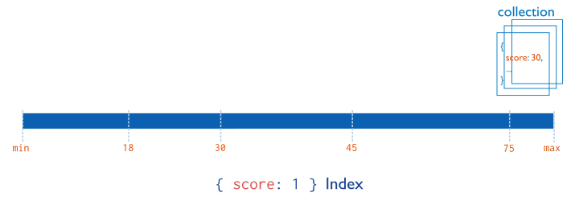

# MongoDB

MongoDB一种数据库，而且是非关系型数据库。

偶数版本是稳定版, 奇数版本是开发版. 

优点
1、可以快速开发web型应用，因为灵活，不用像关系型数据库一样需要建表.
2、MongoDB存储的是文档（document），文档内存储的是类似json(`bson, binary json`)的结构. 

[bson]: https://docs.mongodb.com/manual/reference/bson-types/


**MongoDB主要有如下特点：**

（1）高性能：
MongoDB提供高性能的数据持久性。特别是,
对嵌入式数据模型的支持减少了数据库系统上的I/O活动。
索引支持更快的查询，并且可以包含来自嵌入式文档和数组的键。（文本索引解决搜索的需求、TTL索引解决历史数据自动过期的需求、地理位置索引可用于构建各种O2O应用）
mmapv1、wiredtiger、mongorocks（rocksdb）、in-memory等多引擎支持满足各种场景需求。
Gridfs解决文件存储的需求。
（2）高可用性：
MongoDB的复制工具称为副本集（replica set），它可提供自动故障转移和数据冗余。
（3）高扩展性：
MongoDB提供了水平可扩展性作为其核心功能的一部分。
分片将数据分布在一组集群的机器上。（海量数据存储，服务能力水平扩展）
从3.4开始，MongoDB支持基于片键创建数据区域。在一个平衡的集群中，MongoDB将一个区域所覆盖的读写只定向到该区域内的那些片。
（4）丰富的查询支持：
MongoDB支持丰富的查询语言，支持读和写操作(CRUD)，比如数据聚合、文本搜索和地理空间查询等。
（5）其他特点：如无模式（动态模式）、灵活的文档模型、


**技术优势:**

MongoDB基于灵活的Json文档模型, 非常适合mingjie


# 三大基本概念

- 数据库 database
  - 用来存储集合
- 集合(数组) collection
  - 类似与SQL中的数据表，本质上是一个**数组**，里面包含看多个文档对象，[{},{},{}]
- 文档对象 document
  - 类似与SQL中的记录，一个文档**对象**{}就是一条记录
  - 文档是MongoDB数据库中最小的单位，我们要操作的目标就是文档
  

>  一个数据库由多个集合构成，一个集合包含多个文档对象。


 **在MongoDB中不需要自己创建数据库和集合，便可以直接创建文档，其实就是在创建文档的同时，会将数据库和集合创建了。**


**ObjectId**

[官方手册]: https://docs.mongodb.com/manual/reference/bson-types/#objectid

ObjectId 或 _id 是每个 MongoDB 文档中都存在的字段。

文档的`_id` 字段创建后是不可变的。


**ObjectId的结构**

这些是 _id 的一些主要特征的摘要：

- _id 是集合中文档的主键，用于区分文档（记录）。
- _id自动编入索引。指定 { _id: } 的查找将 _id 索引作为其指南。
- 默认情况下，_id 字段的类型为 ObjectID，是 MongoDB 的 BSON 类型之一。如果需要可以将 _id 覆盖为 ObjectID 以外的其他内容。

ObjectID 长度为 12 字节，由几个 2-4 字节的链组成。每个链代表并指定文档身份的具体内容。以下的值构成了完整的 12 字节组合：

- 一个 4 字节的时间戳，表示自 Unix 纪元以来的秒数
- 一个 3 字节的机器标识符 +  2 字节的进程 ID
- 一个 3 字节的递增计数器，初始值是随机值


# Mongo shell命令

[官方手册]: https://docs.mongodb.com/manual/reference/method


## 基本使用：

```shell
# 查看所有的数据库
> show dbs 
> show databases

# 切换到指定的数据库
> use <database>

# 查看当前操作的数据库
> db

# 查看当前数据库中所有的集合
> show collections
```


##　CRUD操作


### 插入

格式: 

- `db.<collection>.insertOne({})`
- `db.<collection>.insertMany([])`
- `db.<collection>.insert()` , 旧insert命令, 可以接受json文档与数组. 不建议继续使用

```bash
> db.users.insert({name: "hyc", gender: 1, addr: "深圳南山"})
WriteResult({ "nInserted" : 1 })

> db
test

> db.users.insertOne({"name": "彪哥", "gender": 1, "addr": "深圳宝安"})
{
	"acknowledged" : true,
	"insertedId" : ObjectId("620e14167f354dd239033448")
}

> db.users.find()
{ "_id" : ObjectId("620e13c87f354dd239033447"), "name" : "hyc", "gender" : 1, "addr" : "深圳南山" }
{ "_id" : ObjectId("620e14167f354dd239033448"), "name" : "彪哥", "gender" : 1, "addr" : "深圳宝安" }
```

没有指定主键`_id`, 则mongo自动创建. 主键值的生成由时间戳+机器码决定.  


### 查询

#### 1. 格式

```shell
# 格式
db.<collection>.find(<condition>, <projection>)
db.<collection>.findOne(<condition>, <projection>)
```

- condition的格式是: {<field1>: <value>, <field2>: <value>}

- projection投影, 控制输出文档的字段是否显示

  - 没有传投影配置, 则全部字段返回

  - 投影格式`{<field>: 1/0, <field>: 0, ...}`, 1:显示, 0: 不显示.  `_id`默认显示, 因此不需要的话得手动`_id: 0`

  - [官方手册]: https://docs.mongodb.com/manual/reference/method/db.collection.find/#std-label-find-projection

- `db.<collection>.count()`或`db.<collection>.length()` 统计文档个数

- 要通过主键_id查询.  需要 `{"_id" : ObjectId("620e13c87f354dd239033447")}`

#### 2. 支持直接通过内嵌文档的属性值进行查询

```json
# hobby就属于内嵌文档
{
	name:'liu',
	hobby:{
		movies:['movie1','movie2'],
		cities:['zhuhai','chengdu']
	}
}

db.users.find({hobby.movies:'movie1'}) //错误
db.users.find({"hobby.movies":'movie1'}) //此时查询的属性名必须加上引号
```


#### 3. 查询返回的文档对象可操作

```shell
# 获取结果集数量
db.users.find({}).count()
db.users.find().length()

# 查询文档对象的具体属性值
db.users.findOne(users).<field>
```


#### 4. 查询操作符的使用

[官方手册]: https://docs.mongodb.com/manual/reference/operator/query/

```shell
$in
db.users.find({name: {$in: ["hyc", "hyc2"]}})

# 比较操作符
$gt 大于
$gte 大于等于
$lt 小于
$lte 小于等于
$ne 不等于
$eq 等于的另一种写法

db.users.find({num:{$gt: 200}}) #大于200
db.users.find({num:{$gt: 200, $lt: 300}}) #大于200小于300

$or 或者
# department=tech and (sal > 300 or sal < 200)
db.users.find(
    {
     department: "tech",
     $or:[
         {sal:{$gt:300}},
         {sal:{$lt:200}}
     ]
    }
) 
```


#### 5.分页查询skip, limit

格式: `db.users.find().skip(<pageIndex-1> * <pageSize>).limit(<pageSize>)`

```shell
db.users.find().limit(10) #前10条数据
db.users.find().skip(50).limit(10) #跳过前50条数据，即查询的是第61-70条数据，即第6页的数据
```


#### 6.排序sort

```
# 1表示升序排列，-1表示降序排列
db.users.find().sort({sal:1}) 
db.users.find().sort({sal:1,empno:-1}) #先按照sal升序排列，如果遇到相同的sal，则按empno降序排列
```

> 注意：skip,limit,sort可以以任意的顺序调用，最终的结果都是先调sort，再调skip，最后调limit


##### 7.设置查询结果的投影，即只过滤出自己想要的字段

```shell
# 在匹配到的文档中只显示ename字段
db.emp.find({<condition>}, {ename:1, _id:0}) 
```


### 更新

[官方手册]: https://docs.mongodb.com/manual/reference/method/db.collection.update/


#### update(), 旧命令, 不建议继续使用

```shell
# 格式: 
db.<collection>.update(
	<condiction>, 
	<newDocument>,
	{
     upsert: <boolean>,
     multi: <boolean>,
     writeConcern: <document>,
     collation: <document>,
     arrayFilters: [ <filterdocument1>, ... ],
     hint:  <document|string>, // Added in MongoDB 4.2
     let: <document> // Added in MongoDB 5.0
   }
)
```


#### 修改操作符

旧`update()`命令默认只update一个文档, 并且是整个文档替换为<newDocument>. 如果仅仅要修改文档, 需要使用**修改操作符**.

**字段操作符**

| Name                                                         | Description                                                  |
| :----------------------------------------------------------- | :----------------------------------------------------------- |
| [`$currentDate`](https://docs.mongodb.com/manual/reference/operator/update/currentDate/#mongodb-update-up.-currentDate) | Sets the value of a field to current date, either as a Date or a Timestamp. |
| [`$inc`](https://docs.mongodb.com/manual/reference/operator/update/inc/#mongodb-update-up.-inc) | Increments the value of the field by the specified amount.   |
| [`$min`](https://docs.mongodb.com/manual/reference/operator/update/min/#mongodb-update-up.-min) | Only updates the field if the specified value is less than the existing field value. |
| [`$max`](https://docs.mongodb.com/manual/reference/operator/update/max/#mongodb-update-up.-max) | Only updates the field if the specified value is greater than the existing field value. |
| [`$mul`](https://docs.mongodb.com/manual/reference/operator/update/mul/#mongodb-update-up.-mul) | Multiplies the value of the field by the specified amount.   |
| [`$rename`](https://docs.mongodb.com/manual/reference/operator/update/rename/#mongodb-update-up.-rename) | Renames a field.                                             |
| [`$set`](https://docs.mongodb.com/manual/reference/operator/update/set/#mongodb-update-up.-set) | Sets the value of a field in a document.                     |
| [`$setOnInsert`](https://docs.mongodb.com/manual/reference/operator/update/setOnInsert/#mongodb-update-up.-setOnInsert) | Sets the value of a field if an update results in an insert of a document. Has no effect on update operations that modify existing documents. |
| [`$unset`](https://docs.mongodb.com/manual/reference/operator/update/unset/#mongodb-update-up.-unset) | Removes the specified field from a document.                 |

```shell
db.users.update(
	# 查询条件
	{_id:222},
	{
		#修改对应的属性
		$set:{name:'kang2', age:21}
		#删除对应的属性
		$unset:{
			gender:1 //这里的1可以随便改为其他的值，无影响
		}
	}
)

# 给工资低于1000的员工增加400的工资
db.emp.updateMany(
	{sal: {$lt:1000}},
	{
		$inc: {sal:400}
	}
)
```


**数组操作符**

| Name                                                         | Description                                                  |
| :----------------------------------------------------------- | :----------------------------------------------------------- |
| [`$`](https://docs.mongodb.com/manual/reference/operator/update/positional/#mongodb-update-up.-) | Acts as a placeholder to update the first element that matches the query condition. |
| [`$[\]`](https://docs.mongodb.com/manual/reference/operator/update/positional-all/#mongodb-update-up.---) | Acts as a placeholder to update all elements in an array for the documents that match the query condition. |
| [`$[\]`](https://docs.mongodb.com/manual/reference/operator/update/positional-filtered/#mongodb-update-up.---identifier--) | Acts as a placeholder to update all elements that match the `arrayFilters` condition for the documents that match the query condition. |
| [`$addToSet`](https://docs.mongodb.com/manual/reference/operator/update/addToSet/#mongodb-update-up.-addToSet) | Adds elements to an array only if they do not already exist in the set. |
| [`$pop`](https://docs.mongodb.com/manual/reference/operator/update/pop/#mongodb-update-up.-pop) | Removes the first or last item of an array.                  |
| [`$pull`](https://docs.mongodb.com/manual/reference/operator/update/pull/#mongodb-update-up.-pull) | Removes all array elements that match a specified query.     |
| [`$push`](https://docs.mongodb.com/manual/reference/operator/update/push/#mongodb-update-up.-push) | Adds an item to an array.                                    |
| [`$pullAll`](https://docs.mongodb.com/manual/reference/operator/update/pullAll/#mongodb-update-up.-pullAll) | Removes all matching values from an array.                   |

```shell
# 数组插入
db.users.update(
	{username:'liu'},
	{
		$push: {"hobby.movies":'movie4'}
	}
)

# 如果数据已经存在，则不会添加
db.users.update(
	{username:'liu'},
	{
		$addToSet:{"hobby.movies":'movie4'}
	}
)
```


完整操作符见官方文档.

[修改操作符]: https://docs.mongodb.com/manual/reference/operator/update/#std-label-update-operators


#### 新命令:  updateOne()

[官方手册]: https://docs.mongodb.com/manual/reference/method/db.collection.updateOne/

**updateOne()命令必须带操作符**

```shell
# 格式: 
db.collection.updateOne(
   <filter>,
   <update>,
   {
     upsert: <boolean>,
     writeConcern: <document>,
     collation: <document>,
     arrayFilters: [ <filterdocument1>, ... ],
     hint:  <document|string>        // Available starting in MongoDB 4.2.1
   }
)


db.users.updateOne(
   {name: "hyc"},
   { 
   	$set: {status: "D"}, 
   	$inc: {quantity: 2}
   }
)
```


#### 新命令:  updateMany()

[官方手册]: https://docs.mongodb.com/manual/reference/method/db.collection.updateMany/

**updateOne()命令必须带操作符**

```shell
# 格式: 
db.collection.updateMany(
   <filter>,
   <update>,
   {
     upsert: <boolean>,
     writeConcern: <document>,
     collation: <document>,
     arrayFilters: [ <filterdocument1>, ... ],
     hint:  <document|string>        // Available starting in MongoDB 4.2.1
   }
)

db.users.updateMany(
	{name:'liu'},
	{
		$set:{
			age:21,
			gender:222
		}
	}
)
```


#### 新命令:  replaceOne()

[官方手册]: https://docs.mongodb.com/manual/reference/method/db.collection.replaceOne/

格式:

```shell
db.collection.replaceOne(
   <filter>,
   <replacement>,
   {
     upsert: <boolean>,
     writeConcern: <document>,
     collation: <document>,
     hint: <document|string>                   // Available starting in 4.2.1
   }
)

db.users.replaceOne(
	{name: "lgh"},
	{name: "lgh2"}
)
```


### 删除

#### remove(), 旧命令, 不建议使用

```shell
# 格式: 
db.<collection>.remove(
   <query>,
   <justOne> # boolean, 只删除一个文档
)

# 报错, 缺少查询参数
db.users.remove()
# 数据全删, 低效率的一条条删除. 
# 要删全部数据, 可以使用删集合命令
db.users.remove({})


```


#### 新命令: deleteOne()

```shell
# 格式
db.collection.deleteOne(
   <filter>,
   {
      writeConcern: <document>,
      collation: <document>,
      hint: <document|string>        // Available starting in MongoDB 4.4
   }
)

db.users.remove({name:'liu'})
```


#### 新命令: deleteMany()

```shell
# 格式
db.collection.deleteMany(
   <filter>,
   {
      writeConcern: <document>,
      collation: <document>
   }
)
```


#### 其他

```shell
# 删除集合
db.collection.drop()

# 删除数据库
db.dropDatabase()

# 注意：删除某一个文档的属性，应该用update. remove以及delete系列删除的是整个文档
```


### 其他shell命令


由于是shell, 因此也支持简单的变量, 逻辑操作

```shell
# 添加两万次数据插入
for(var i=0;i<20000;i++){
	db.users.insert({username:'liu'+i}) 
}
db.users.find().count()//20000

# 优化：
var arr=[];
for(var i=0;i<20000;i++){
	arr.push({username:'liu'+i})
}
db.users.insert(arr) 

# 获取objectid
var id = ObjectId();
```


# 索引

## 索引概述

MongoDB可以使用索引中的排序返回排序结果。

MongoDB索引使用B树数据结构（确切的说是B-Tree，MySQL是B+Tree）.

[官网文档]: https://docs.mongodb.com/manual/indexes/


## 索引的类型

### 单字段索引

MongoDB支持在文档的单个字段上创建用户定义的升序/降序索引，称为单字段索引（Single Field Index）。 对于单个字段索引和排序操作，索引键的排序顺序（即升序或降序）并不重要，因为MongoDB可以在任何方向上遍历索引。



### 复合索引

MongoDB还支持多个字段的用户定义索引，即复合索引（Compound Index）。

复合索引中列出的字段顺序具有重要意义。例如，如果复合索引由 { userid: 1, score: -1 } 组成，则索引首先按userid正序排序，然后 在每个userid的值内，再在按score倒序排序。


### 其他索引

- 地理空间索引（Geospatial Index）
  为了支持对地理空间坐标数据的有效查询，MongoDB提供了两种特殊的索引：返回结果时使用平面几何的二维索引和返回结果时使用球面几何的二维球面索引。
- 文本索引（Text Indexes）
  MongoDB提供了一种文本索引类型，支持在集合中搜索字符串内容。这些文本索引不存储特定于语言的停止词（例如“the”、“a”、“or”），而将集合中的词作为词干，只存储根词。
- 哈希索引（Hashed Indexes）
  为了支持基于散列的分片，MongoDB提供了散列索引类型，它对字段值的散列进行索引。这些索引在其范围内的值分布更加随机，但只支持相等匹配，不支持基于范围的查询。

为了支持对地理空间坐标数据的有效查询，MongoDB提供了两种特殊的索引：返回结果时使用平面几何的二维索引和返回结果时使用球面几何的二维球面索引。


## 索引管理操作

### 查看索引

```shell
db.<collection>.getIndexes()

[
        {
                "v" : 2,        # mongodb引擎的版本号(不用管)
                "key" : {
                        "_id" : 1       # 默认主键
                },
                "name" : "_id_",         # 索引名称
                "ns" : "jeff.comment"    # 索引的位置
        }
]
```

### 创建索引

[官方手册]: https://docs.mongodb.com/manual/reference/method/db.collection.createIndex/#mongodb-method-db.collection.createIndex

`db.<collection>.createIndex(keys, options)`

**参数说明:** 

`keys`: {字段:1, 字段2: -1},     1/-1标识升序(`默认`)或降序. 

`options`：

| Parameter          | Type          | Description                                                  |
| ------------------ | ------------- | ------------------------------------------------------------ |
| background         | Boolean       | 建索引过程会阻塞其它数据库操作，background可指定以后台方式创建索引，即增加 "background" 可选参数。"background" 默认值为false。 |
| unique             | Boolean       | 建立的索引是否唯一。指定为true创建唯一索引。默认值为false.   |
| name               | string        | 索引的名称。如果未指定，MongoDB的通过连接索引的字段名和排序顺序生成一个索引名 称。 |
| dropDups           | Boolean       | 3.0+版本已废弃。在建立唯一索引时是否删除重复记录,指定 true 创建唯一索引。默认值为 false. |
| sparse             | Boolean       | 对文档中不存在的字段数据不启用索引；这个参数需要特别注意，如果设置为true的话，在索 引字段中不会查询出不包含对应字段的文档.。默认值为 false. |
| expireAfterSeconds | integer       | 指定一个以秒为单位的数值，完成 TTL设定，设定集合的生存时间。 |
| v                  | index version | 索引的版本号。默认的索引版本取决于mongod创建索引时运行的版本。 |
| weights            | document      | 索引权重值，数值在 1 到 99,999 之间，表示该索引相对于其他索引字段的得分权重。 |
| default_language   | string        | 对于文本索引，该参数决定了停用词及词干和词器的规则的列表。 默认为英语 |
| language_override  | string        | 对于文本索引，该参数指定了包含在文档中的字段名，语言覆盖默认的language，默认值为 language. |

### 删除索引

**指定索引删除**

```bash
db.<collection>.dropIndex(索引)

db.users.dropIndex({userid:1})  # 删除{userid:1}索引
```

**删除所有索引**

_id索引永远不会被删除

```shell
db.<collection>.dropIndexes()

db.users.dropIndexes()   # 删除comment集合的所有索引
```


## 索引的使用

### 执行计划explain()

分析查询性能 通常使用执行计划来查看查询的情况，如查询耗费的时间、是 否基于索引查询等。

```scss
db.<collection>.find(query,options).explain(options)
```


```shell
# age字段没索引
> db.users.find({age: {$gt: 1}}).explain()
{
	"queryPlanner" : {
		"plannerVersion" : 1,
		"namespace" : "test.users",
		"indexFilterSet" : false,
		"parsedQuery" : {
			"age" : {
				"$gt" : 1
			}
		},
		"queryHash" : "4BB283C4",
		"planCacheKey" : "4BB283C4",
		"winningPlan" : {
			"stage" : "COLLSCAN", # 全表扫描
			"filter" : {
				"age" : {
					"$gt" : 1
				}
			},
			"direction" : "forward"
		},
		"rejectedPlans" : [ ]
	},
	"serverInfo" : {
		"host" : "b79e4ed76a62",
		"port" : 27017,
		"version" : "4.4.11",
		"gitVersion" : "b7530cacde8432d2f22ed506f258ff9c3b45c5e9"
	},
	"ok" : 1
}

# name字段有索引
> db.users.find({name: 'hyc'}).explain()
{
	"queryPlanner" : {
		"plannerVersion" : 1,
		"namespace" : "test.users",
		"indexFilterSet" : false,
		"parsedQuery" : {
			"name" : {
				"$eq" : "hyc"
			}
		},
		"queryHash" : "01AEE5EC",
		"planCacheKey" : "4C5AEA2C",
		"winningPlan" : {
			"stage" : "FETCH", # 根据索引结果, 抓取
			"inputStage" : {
				"stage" : "IXSCAN", # 索引扫描
				"keyPattern" : {
					"name" : 1
				},
				"indexName" : "name_1",
				"isMultiKey" : false,
				"multiKeyPaths" : {
					"name" : [ ]
				},
				"isUnique" : false,
				"isSparse" : false,
				"isPartial" : false,
				"indexVersion" : 2,
				"direction" : "forward",
				"indexBounds" : {
					"name" : [
						"[\"hyc\", \"hyc\"]"
					]
				}
			}
		},
		"rejectedPlans" : [ ]
	},
	"serverInfo" : {
		"host" : "b79e4ed76a62",
		"port" : 27017,
		"version" : "4.4.11",
		"gitVersion" : "b7530cacde8432d2f22ed506f258ff9c3b45c5e9"
	},
	"ok" : 1
}
```


### 覆盖查询

查询条件和查询结果的投影, 刚好都是索引的字段, 那么Mongo直接从索引返回结果, 而不是去fetch文档数据. 效率极高.

```shell
> db.users.find({name: 'hyc'}, {name: 1, _id: 0}).explain()
{
	"queryPlanner" : {
		"plannerVersion" : 1,
		"namespace" : "test.users",
		"indexFilterSet" : false,
		"parsedQuery" : {
			"name" : {
				"$eq" : "hyc"
			}
		},
		"queryHash" : "3066FB64",
		"planCacheKey" : "A5386A93",
		"winningPlan" : {
			"stage" : "PROJECTION_COVERED", # 投影, 覆盖索引
			"transformBy" : {
				"name" : 1,
				"_id" : 0
			},
			"inputStage" : {
				"stage" : "IXSCAN", # 索引扫描
				"keyPattern" : {
					"name" : 1
				},
				"indexName" : "name_1",
				"isMultiKey" : false,
				"multiKeyPaths" : {
					"name" : [ ]
				},
				"isUnique" : false,
				"isSparse" : false,
				"isPartial" : false,
				"indexVersion" : 2,
				"direction" : "forward",
				"indexBounds" : {
					"name" : [
						"[\"hyc\", \"hyc\"]"
					]
				}
			}
		},
		"rejectedPlans" : [ ]
	},
	"serverInfo" : {
		"host" : "b79e4ed76a62",
		"port" : 27017,
		"version" : "4.4.11",
		"gitVersion" : "b7530cacde8432d2f22ed506f258ff9c3b45c5e9"
	},
	"ok" : 1
}
```


# 单节点 docker-compose

```yml
version: "3.8"

services:
  mongodb:
    image: mongo:4.4
    container_name: mongodb
    restart: always
    ports:
      - 27017:27017
    volumes:
      - /data/docker/mongodb/data:/data
      - /data/docker/mongodb/log:/var/log/mongodb/
      - /data/docker/mongodb:/etc/mongod
    environment:
      - MONGO_INITDB_ROOT_USERNAME=admin
      - MONGO_INITDB_ROOT_PASSWORD=123456
    command: mongod -f /etc/mongod/mongod.conf
  mongo-express:
    image: mongo-express
    container_name: mongo-express
    restart: always
    ports:
      - 8081:8081
    environment:
      - ME_CONFIG_MONGODB_ADMINUSERNAME=admin
      - ME_CONFIG_MONGODB_ADMINPASSWORD=123456
      - ME_CONFIG_MONGODB_SERVER=mongodb
volumes:
  data: {}

networks:
  default:
    name: mongodb_default
```


# 集群


## 副本集群


副本集的节点有两种类型, 三种角色.

两种类型：

- 主节点（Primary）类型：数据操作的主要连接点，可读写。
- 次要（辅助、从）节点（Secondaries）类型：数据冗余备份节点，可以读或选举。

三种角色：

- 主要成员（Primary）：主要接收所有写操作。就是主节点。

- 副本成员（Replicate）：从主节点通过复制操作以维护相同的数据集，即备份数据，不可写操作，但可以读操作（但需要配置）。是默认的一种从节点类型。

- 仲裁者（Arbiter）：不保留任何数据的副本，只具有投票选举作用。当然也可以将仲裁服务器维护为副本集的一部分，即副本成员同时也可以是仲裁者。也是一种从节点类型。


## 分片集群

分片群集包含以下组件：

- 分片（存储）：每个分片包含分片数据的子集。**每个分片都可以部署为副本集**。
- mongos（路由）：mongos充当查询路由器，在客户端应用程序和分片集群之间提供接口。
- config servers（“调度”的配置）：配置服务器存储群集的元数据和配置设置。从MongoDB 3.4开始，必须将配置服务器部署为副本集（CSRS）。


