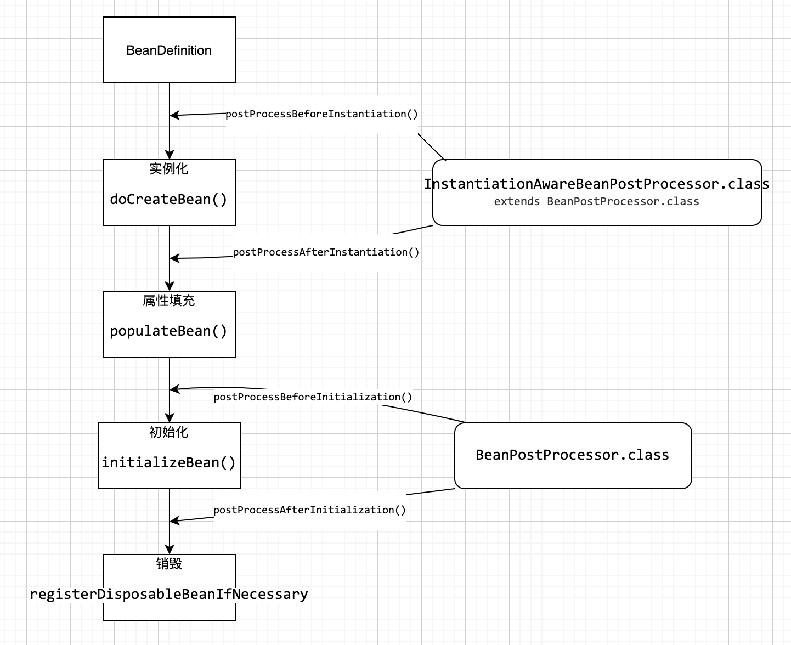

> Spring bean生命周期(基于Spring5.2.0)

# Spring Bean的生命周期只有四个阶段。

实现过程集中在`AbstractAutowireCapableBeanFactory.doCreateBean()`.

1. 实例化 Instantiation (`createBeanInstance()`)
2. 属性填充 Populate (`populateBean()`)
3. 初始化 Initialization(`initializeBean()`)
4. 销毁 Destruction (`registerDisposableBean()`)

围绕这四个阶段过程中, 穿插着一些扩展点




# 拓展点

## 所有bean的拓展

这两个接口是在切入到所有bean的生命周期, 因此功能很强大, AOP的实现与他们相关.

- InstantiationAwareBeanPostProcessor

- BeanPostProcessor

### InstantiationAwareBeanPostProcessor调用点

- postProcessBeforeInstantiation(实例化操作前的后置处理器)调用点

```java
@Override
protected Object createBean(String beanName, RootBeanDefinition mbd, @Nullable Object[] args)
  throws BeanCreationException {

  // 省略前面无关代码...

  try {
    // Give BeanPostProcessors a chance to return a proxy instead of the target bean instance.
    //★ 后处理器postProcessBeforeInstantiation调用点：创建实例之前的一个调用点。
    Object bean = resolveBeforeInstantiation(beanName, mbdToUse);
    //条件成立会形成一个短路操作，这里直接返回了.
    if (bean != null) {
      return bean;
    }
  }

  try {
    //核心方法：创建bean实例对象，并且生命周期的动作大部分都在这里
    Object beanInstance = doCreateBean(beanName, mbdToUse, args);
    if (logger.isTraceEnabled()) {
      logger.trace("Finished creating instance of bean '" + beanName + "'");
    }
    return beanInstance;
  }

  // 省略后面无关代码...	
}
```


- postProcessAfterInstantiation(实例化操作后的后置处理器)调用点

```java
protected void populateBean(String beanName, RootBeanDefinition mbd, @Nullable BeanWrapper bw) {
	
  // 省略前面无关代码...
  
  // Give any InstantiationAwareBeanPostProcessors the opportunity to modify the
  // state of the bean before properties are set. This can be used, for example,
  // to support styles of field injection.

  if (!mbd.isSynthetic() && hasInstantiationAwareBeanPostProcessors()) {
    for (InstantiationAwareBeanPostProcessor bp : getBeanPostProcessorCache().instantiationAware) {
      //★ 后处理器调用点：postProcessAfterInstantiation, 返回值将决定当前实例是否需要再进行 依赖注入处理。
      if (!bp.postProcessAfterInstantiation(bw.getWrappedInstance(), beanName)) {
        return;
      }
    }
  }
}
```


### BeanPostProcessor调用点

```java
protected Object initializeBean(String beanName, Object bean, @Nullable RootBeanDefinition mbd) {
	// 其他代码...
  
  // ★ xxxAware拓展点
  invokeAwareMethods(beanName, bean);

  Object wrappedBean = bean;
  if (mbd == null || !mbd.isSynthetic()) {
    //★ 后处理器调用点：postProcessBeforeInitialization, 初始化之前的后处理器调用点
    wrappedBean = applyBeanPostProcessorsBeforeInitialization(wrappedBean, beanName);
  }

  try {
    // 调用自定义init初始化方法
    invokeInitMethods(beanName, wrappedBean, mbd);
  }
  catch (Throwable ex) {
    throw new BeanCreationException(
      (mbd != null ? mbd.getResourceDescription() : null),
      beanName, "Invocation of init method failed", ex);
  }

  if (mbd == null || !mbd.isSynthetic()) {
    //★ 后处理器调用点：postProcessAfterInitialization, 初始化之后的后处理器的调用点
    //典型应用：Spring AOP的实现..
    wrappedBean = applyBeanPostProcessorsAfterInitialization(wrappedBean, beanName);
  }

  return wrappedBean;
}	
```


## 单个bean拓展点

单个bean的拓展接口功能丰富，常用于用户自定义扩展。

1. Aware类型的接口
   - BeanNameAware
   - BeanClassLoaderAware
   - BeanFactoryAware
   - EnvironmentAware
   - EmbeddedValueResolverAware
   - ApplicationContextAware

2. 生命周期接口
   - `InitializingBean`接口对应生命周期的初始化阶段，在上面源码的`invokeInitMethods(beanName, wrappedBean, mbd);`方法中调用。
   - `DisposableBean`接口对应生命周期的销毁阶段，以`ConfigurableApplicationContext#close()`方法作为入口，实现是通过循环取所有实现了DisposableBean接口的Bean然后调用其destroy()方法 。


### Aware接口与InitializingBean/init-method调用点

`Aware拓展接口`是在初始化之前执行的

```java
// 省略部分无关代码...
protected Object initializeBean(String beanName, Object bean, @Nullable RootBeanDefinition mbd) {
	// 其他代码...
  
  // ★ xxxAware拓展点
  invokeAwareMethods(beanName, bean);
  
  //★ 后处理器调用点：postProcessBeforeInitialization, 初始化之前的后处理器调用点
  applyBeanPostProcessorsBeforeInitialization(wrappedBean, beanName);
 
  // 调用自定义init初始化方法, 执行InitializingBean/init-method
  invokeInitMethods(beanName, wrappedBean, mbd);


  //★ 后处理器调用点：postProcessAfterInitialization, 初始化之后的后处理器的调用点
  applyBeanPostProcessorsAfterInitialization(wrappedBean, beanName);

  return wrappedBean;
}	
```


### DisposableBean调用点

```java
protected Object doCreateBean(String beanName, RootBeanDefinition mbd, @Nullable Object[] args)
throws BeanCreationException {
  // 省略无关代码...
  
  //★ 该方法创建出来真实的bean实例，并且将其包装到BeanWrapper实例中。
  createBeanInstance(beanName, mbd, args);
  
  // ★ 生成的匿名ObjectFactory对象存放到三级缓存中
  addSingletonFactory(beanName, () -> getEarlyBeanReference(beanName, mbd, bean));
  
  //★ 处理当前实例的依赖数据...依赖注入在这一步完成的。
  populateBean(beanName, mbd, instanceWrapper);

  //★ 生命周期中的初始化方法的调用。
  exposedObject = initializeBean(beanName, exposedObject, mbd);
  
  //★ 注册析构回调。当容器销毁时，会给当前bean的析构方法进行回调。
  // 把bean保存到Map<String, Object> disposableBeans = new LinkedHashMap<>();中
  registerDisposableBeanIfNecessary(beanName, bean, mbd);
  
}
```


