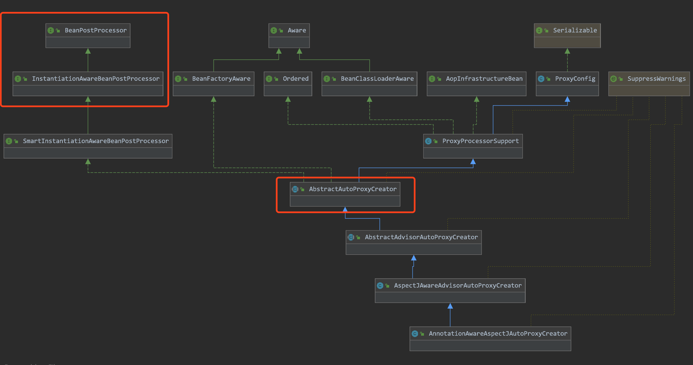

# 代理类的生成原理

Spring中, 使用`Advisor`来封装AOP联盟约定的`Advice`对象

```java
import org.aopalliance.aop.Advice;

public interface Advisor {

   Advice EMPTY_ADVICE = new Advice() {};

   Advice getAdvice();
  
   boolean isPerInstance();
}
```


# exposeProxy

`JdkDynamicProxy.invoke()`


# 动态代理触发原理


`<aop:aspectj-autoproxy />`

在容器启动阶段, 由`AspectJAutoProxyBeanDefinitionParser`实现,  往beanFactory注入一个class是`AnnotationAwareAspectJAutoProxyCreator`的BeanDefinition. 





如上图, `AnnotationAwareAspectJAutoProxyCreator`实现了`BeanPostProcessor`接口.  其父类`AbstractAutoProxyCreator`实现了这两个后处理器接口 


动态代理是在初始化完成之后执行的

```java
	/**
	 * Create a proxy with the configured interceptors if the bean is
	 * identified as one to proxy by the subclass.
	 * @see #getAdvicesAndAdvisorsForBean
	 */
	@Override
	public Object postProcessAfterInitialization(@Nullable Object bean, String beanName) {
		if (bean != null) {
			Object cacheKey = getCacheKey(bean.getClass(), beanName);
			if (this.earlyProxyReferences.remove(cacheKey) != bean) {
				return wrapIfNecessary(bean, beanName, cacheKey);
			}
		}
		return bean;
	}
```


# 三级缓存的意义

其实要处理循环依赖, 两级缓存就够了. 而第三级缓存的目的, 是处理AOP代理的循环依赖. 