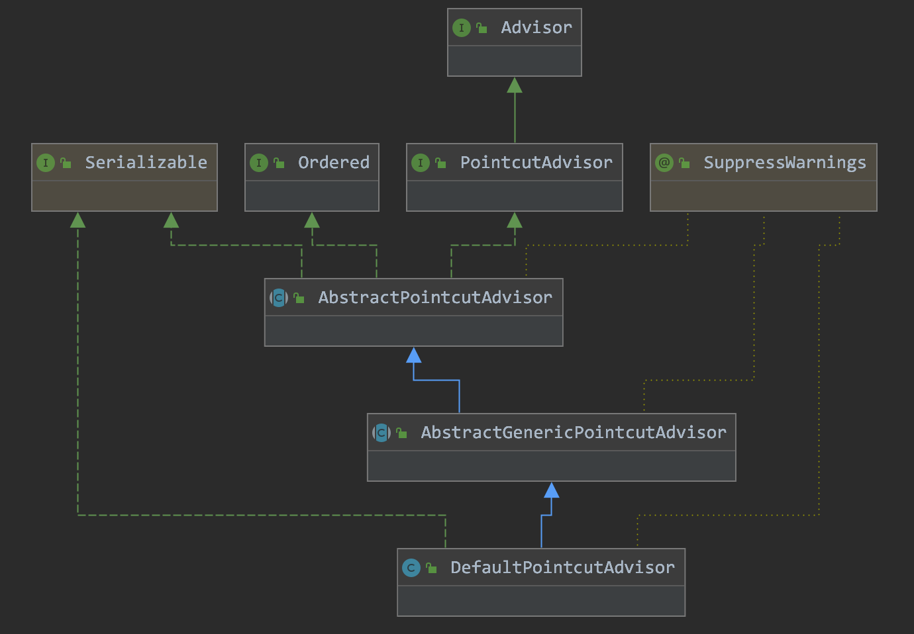

Spring中, 使用`Advisor`来封装AOP联盟约定的`Advice`对象

```java
import org.aopalliance.aop.Advice;

public interface Advisor {

   Advice EMPTY_ADVICE = new Advice() {};

   Advice getAdvice();
  
   boolean isPerInstance();
}
```


