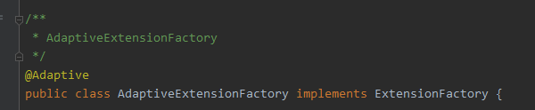

# 一. Java SPI

[SPI]: https://www.jianshu.com/p/3a3edbcd8f24

SPI ，全称为 Service Provider Interface，是一种**服务发现机制**。它通过在ClassPath路径下的`META-INF/services`文件夹查找文件，自动加载文件里所定义的类。


## 使用

定义接口

```java
package com.bearo.java_spi.api;

public interface CarInterface {

    public void getColor();
}
```


两个实现类

```java
public class BlackCar implements CarInterface {

    public void getColor() {
        System.out.println("black");
    }
}

public class RedCar implements CarInterface {

    public void getColor() {
        System.out.println("red");
    }
}
```

最后在ClassPath下的`META-INF/services`目录添加一个文件。

文件名字是接口的全限定类名，内容是实现类的全限定类名


```
# 内容
com.bearo.java_spi.impl.RedCar
com.bearo.java_spi.impl.BlackCar
```


测试

```java
public class CarDemo {
    public static void main(String[] args) {
        ServiceLoader<CarInterface> serviceLoader = ServiceLoader.load(CarInterface.class);
        Iterator<CarInterface> iterator = serviceLoader.iterator();
        while (iterator.hasNext()) {
            CarInterface carInterface = iterator.next();
            carInterface.getColor();
        }
    }
}
```


## 源码分析

我们看到一个位于`sun.misc包`，一个位于`java.util包`，sun包下的源码看不到。我们就以ServiceLoader.load为例，通过源码看看它里面到底怎么做的。

### 1、ServiceLoader

首先，我们先来了解下ServiceLoader，看看它的类结构。

```java
public final class ServiceLoader<S> implements Iterable<S>
    //配置文件的路径
    private static final String PREFIX = "META-INF/services/";
    //加载的服务类或接口
    private final Class<S> service;
    //已加载的服务类集合
    private LinkedHashMap<String,S> providers = new LinkedHashMap<>();
    //类加载器
    private final ClassLoader loader;
    //内部类，真正加载服务类
    private LazyIterator lookupIterator;
}
```

### 2、Load

load方法创建了一些属性，重要的是实例化了内部类，LazyIterator。最后返回ServiceLoader的实例。

```java
public final class ServiceLoader<S> implements Iterable<S>
    private ServiceLoader(Class<S> svc, ClassLoader cl) {
        //要加载的接口
        service = Objects.requireNonNull(svc, "Service interface cannot be null");
        //类加载器
        loader = (cl == null) ? ClassLoader.getSystemClassLoader() : cl;
        //访问控制器
        acc = (System.getSecurityManager() != null) ? AccessController.getContext() : null;
        //先清空
        providers.clear();
        //实例化内部类 
        LazyIterator lookupIterator = new LazyIterator(service, loader);
    }
}
```

### 3、查找实现类

查找实现类和创建实现类的过程，都在LazyIterator完成。当我们调用iterator.hasNext和iterator.next方法的时候，实际上调用的都是LazyIterator的相应方法。

```java
public Iterator<S> iterator() {
    return new Iterator<S>() {
        public boolean hasNext() {
            return lookupIterator.hasNext();
        }
        public S next() {
            return lookupIterator.next();
        }
        .......
    };
}
```

所以，我们重点关注lookupIterator.hasNext()方法，它最终会调用到hasNextService。

```java
private class LazyIterator implements Iterator<S>{
    Class<S> service;
    ClassLoader loader;
    Enumeration<URL> configs = null;
    Iterator<String> pending = null;
    String nextName = null; 
    private boolean hasNextService() {
        //第二次调用的时候，已经解析完成了，直接返回
        if (nextName != null) {
            return true;
        }
        if (configs == null) {
            //META-INF/services/ 加上接口的全限定类名，就是文件服务类的文件
            //META-INF/services/com.viewscenes.netsupervisor.spi.SPIService
            String fullName = PREFIX + service.getName();
            //将文件路径转成URL对象
            configs = loader.getResources(fullName);
        }
        while ((pending == null) || !pending.hasNext()) {
            //解析URL文件对象，读取内容，最后返回
            pending = parse(service, configs.nextElement());
        }
        //拿到第一个实现类的类名
        nextName = pending.next();
        return true;
    }
}
```

### 4、创建实例

当然，调用next方法的时候，实际调用到的是，lookupIterator.nextService。它通过反射的方式，创建实现类的实例并返回。

```java
private class LazyIterator implements Iterator<S>{
    private S nextService() {
        //全限定类名
        String cn = nextName;
        nextName = null;
        //创建类的Class对象
        Class<?> c = Class.forName(cn, false, loader);
        //通过newInstance实例化
        S p = service.cast(c.newInstance());
        //放入集合，返回实例
        providers.put(cn, p);
        return p; 
    }
}
```


## Java SPI的缺点

- 全加载, 若某个实现类没使用到, 则白加载了, 浪费资源
- 没有别名, 要获取指定实现类不方便


# 二. Dubbo(2.7.0) SPI

Dubbo SPI比Java SPI的优势:

- 别名, 缓存. 避免多次扫目录, 加载, 初始化.
- 增加了对扩展点 IoC 和 AOP 的支持，一个扩展点可以直接 setter 注入其它扩展点。
  - AOP功能是通过`带入参是接口的构造函数`的Wrapper类来实现.wrapper类并不作为拓展点的真正实现.
  - Ioc功能,  setXXX()方法注入动态代理类, 动态代理类从URL中获取实现类去执行被代理的方法. 


## 源码解析

```java
// 获取指定拓展接口的加载器
ExtensionLoader<Car> extensionLoader = ExtensionLoader.getExtensionLoader(Car.class);
// 加载器加载指定拓展实现类
Car benz = extensionLoader.getExtension("benz");
```

dubbo几乎所有的拓展功能, 都是离不开这两行代码. 


> 核心类: `ExtentionLoader.java`

**先看`ExtensionLoader`的属性**

```java
// 三个拓展点路径, META-INF/services/是JDK SPI默认路径
private static final String SERVICES_DIRECTORY = "META-INF/services/";
private static final String DUBBO_DIRECTORY = "META-INF/dubbo/";
private static final String DUBBO_INTERNAL_DIRECTORY = DUBBO_DIRECTORY + "internal/";

private static final Pattern NAME_SEPARATOR = Pattern.compile("\\s*[,]+\\s*");

// 缓存ExtensionLoader，每个接口对应一个ExtensionLoader
private static final ConcurrentMap<Class<?>, ExtensionLoader<?>> EXTENSION_LOADERS = new ConcurrentHashMap<Class<?>, ExtensionLoader<?>>();
// 实现类对应的实例
private static final ConcurrentMap<Class<?>, Object> EXTENSION_INSTANCES = new ConcurrentHashMap<Class<?>, Object>();

// ==============================
// 拓展点加载器所属的接口类
private final Class<?> type;
// 创建接口实现类的工厂实例
private final ExtensionFactory objectFactory;
// 缓存实现类-别名的映射
private final ConcurrentMap<Class<?>, String> cachedNames = new ConcurrentHashMap<Class<?>, String>();
// 缓存别名-实现类的映射
private final Holder<Map<String, Class<?>>> cachedClasses = new Holder<Map<String, Class<?>>>();
// 缓存别名-@Activate的实现类
private final Map<String, Object> cachedActivates = new ConcurrentHashMap<String, Object>();
// 缓存实现类实例， 别名-持有实例的holder
private final ConcurrentMap<String, Holder<Object>> cachedInstances = new ConcurrentHashMap<String, Holder<Object>>();

// 缓存自适应实例
private final Holder<Object> cachedAdaptiveInstance = new Holder<Object>();
// 缓存@Adaptive的实现类, 只能有一个@Adaptive的实现类的实例
private volatile Class<?> cachedAdaptiveClass = null;
// 拓展点的默认实例别名
private String cachedDefaultName;
// 自适应相关异常
private volatile Throwable createAdaptiveInstanceError;

// 缓存wrapper类
private Set<Class<?>> cachedWrapperClasses;
```


### 1. 获取指定拓展接口的拓展点加载器

`ExtensionLoader<Car> extensionLoader = ExtensionLoader.getExtensionLoader(Car.class);`

```java
public static <T> ExtensionLoader<T> getExtensionLoader(Class<T> type) {
    // 省略非核心代码... 

    ExtensionLoader<T> loader = (ExtensionLoader<T>) EXTENSION_LOADERS.get(type);
    if (loader == null) {
        // 一个ExtensionLoader实例维护一个接口的所有spi实现信息, 包括实现类, wrapper类等等
        // new ExtensionLoader<T>(type) 创建拓展点加载器
        EXTENSION_LOADERS.putIfAbsent(type, new ExtensionLoader<T>(type) 创建拓展点加载器);
        loader = (ExtensionLoader<T>) EXTENSION_LOADERS.get(type);
    }
    return loader;
}
```


通过以下代码看得出来,  `ExtensionFactory.class`的拓展点实现类最先创建. 

`ExtensionFactory.class`是所有拓展点的工厂类接口,  所有的拓展点都是通过`ExtensionFactory.class`的实现类来创建的. 	

```java
private ExtensionLoader(Class<?> type) {
    this.type = type;
 	// 通过ExtensionFactory的接口的拓展点加载器,  获取@Adaptive, 自适应实现类
    // ExtensionFactory的自适应拓展点实现类是AdaptiveExtensionFactory
    objectFactory = (type == ExtensionFactory.class ? null : ExtensionLoader.getExtensionLoader(ExtensionFactory.class).getAdaptiveExtension());
}
```


`META-INF/dubbo/internal/org.apache.dubbo.common.extension.ExtensionFactory`配置两个实现类, 而`AdaptiveExtensionFactory`注解了`Adaptive`. 因此所有拓展点实现类都是由`AdaptiveExtensionFactory`工厂创建

```properties
adaptive=org.apache.dubbo.common.extension.factory.AdaptiveExtensionFactory
spi=org.apache.dubbo.common.extension.factory.SpiExtensionFactory
```




```java
// 获取自适应拓展点实例
public T getAdaptiveExtension() {
    // 一个接口只能有一个Adaptive实现
    Object instance = cachedAdaptiveInstance.get();
    if (instance == null) {
        if (createAdaptiveInstanceError == null) {
            synchronized (cachedAdaptiveInstance) {
                instance = cachedAdaptiveInstance.get();
                if (instance == null) {
                    try {
                        // 创建
                        instance = createAdaptiveExtension();
                        // 缓存自适应实例到holder中
                        cachedAdaptiveInstance.set(instance);
                    } catch (Throwable t) {
                        createAdaptiveInstanceError = t;
                        throw new IllegalStateException("fail to create adaptive instance: " + t.toString(), t);
                    }
                }
            }
        } else {
            throw new IllegalStateException("fail to create adaptive instance: " + createAdaptiveInstanceError.toString(), createAdaptiveInstanceError);
        }
    }

    return (T) instance;
}
```


```java
// 创建自适应实例
private T createAdaptiveExtension() {
    try {
        // 获取@Adaptive的实现类, 并同构构造方法创建实例
        // injectExtension(instant) 把创建的实例去执行 依赖注入
        return injectExtension( (T) getAdaptiveExtensionClass().newInstance() );
    } catch (Exception e) {
        throw new IllegalStateException("Can not create adaptive extension " + type + ", cause: " + e.getMessage(), e);
    }
}
```


#### 1.1 获取Adaptive类

```java
// 获取Adaptive类
private Class<?> getAdaptiveExtensionClass() {
    // ★ 这一行巨重要, 里面的功能主要是从所有SPI路径的文件里获取所有type接口的所有实现类并缓存, 相当于做了初始化事情
    getExtensionClasses();
	// 如果一个接口有@Adaptive的实现类就直接用，如果没有就默认实现一个
    // cachedAdaptiveClass的赋值是在初始化(new ExtensionLoader<T>(type) -> getExtensionClasses())的时候做的
    if (cachedAdaptiveClass != null) {
        return cachedAdaptiveClass;
    }
    // 没有@Adaptive的类, 则使用javassist创建一个type接口的动态代理类,
    // 有@Adaptive的方法才会代理，没有注解的方法\使用代理类调用时, 抛nsupportOperation
    return cachedAdaptiveClass = createAdaptiveExtensionClass();
}

// 生成动态代理类
private Class<?> createAdaptiveExtensionClass() {
    // 拼装动态代理类code
    String code = createAdaptiveExtensionClassCode();
    ClassLoader classLoader = findClassLoader();
    org.apache.dubbo.common.compiler.Compiler compiler = ExtensionLoader.getExtensionLoader(org.apache.dubbo.common.compiler.Compiler.class).getAdaptiveExtension();
    return compiler.compile(code, classLoader);
}

/**
 * ★hyc 动态代理类代码拼装
 *   - 接口有@Adaptive的方法才会代理.
 *      - 方法参数要求: 一个参数是URL, 或者其中一个参数有返回值是URL的方法. 否则抛异常
 *          - 从URL参数中, 按照以下两个规则解析出的key对应的value值, 获取别名是value值的实例, 来执行当前代理方法
 *              - 如果@Adaptive有配置value, 则以value值为key(支持多个value, 按照顺序优先级获取), 从参数URL获取对应的value值找到对应别名的实例
 *              - 如果@Adaptive没有配置value, 则拿接口名作为key从URL获取value作为别名. eg: 接口Car.java, 那么key就是car, 接口CarInterface.java, 那么key是接口car.interface.
 *          String extName = url.getParameter("car.interface");
 *      - 方法参数有Invocation对象的其他操作
 *
 *   - 没有注解的方法使用代理类调用时, 抛UnsupportOperation异常
 */
private String createAdaptiveExtensionClassCode() {
    // 拼接自适应动态代理类的string代码.. 非常长
}
```


以下是生成的动态代理类反编译来的.  关注框出来的几行代码就懂了.

```java
package com.bearo.dubbo_spi.api;
import org.apache.dubbo.common.extension.ExtensionLoader;
public class Car$Adaptive implements Car {
    public void getColorForUrl(org.apache.dubbo.common.URL arg0) {
        if (arg0 == null) throw new IllegalArgumentException("url == null");
        org.apache.dubbo.common.URL url = arg0;
        // ==============================================
        String extName = url.getParameter("car");
        if (extName == null)
            throw new IllegalStateException("Fail to get extension(com.bearo.dubbo_spi.api.Car) name from url(" + url.toString() + ") use keys([car])");
        Car extension = (Car) ExtensionLoader.getExtensionLoader(Car.class).getExtension(extName);
        extension.getColorForUrl(arg0);
        // ==============================================
    }

    public void getColor() {
        throw new UnsupportedOperationException("method public abstract void com.bearo.dubbo_spi.api.Car.getColor() of interface com.bearo.dubbo_spi.api.Car is not adaptive method!");
    }
}
```


#### 1.2 非常重要的getExtensionClasses()

```java
// 从所有文件里获取所有type接口的所有实现类并缓存
private Map<String, Class<?>> getExtensionClasses() {
    Map<String, Class<?>> classes = cachedClasses.get();
    if (classes == null) {
        synchronized (cachedClasses) {
            classes = cachedClasses.get();
            if (classes == null) {
                // 没缓存, 则加载并解析
                classes = loadExtensionClasses();
                cachedClasses.set(classes);
            }
        }
    }
    return classes;
}

// synchronized in getExtensionClasses
// ★ 从所有文件里获取所有type接口的所有实现类并缓存, 可以说是整个ExtensionLoader<type>实例要使用之前的准备工作.
private Map<String, Class<?>> loadExtensionClasses() {
    // 要求拓展点接口都要@SPI. 
    final SPI defaultAnnotation = type.getAnnotation(SPI.class);
    // SPI后面的值就是默认的实现的类，只能指定一个实现类
    if (defaultAnnotation != null) {
        String value = defaultAnnotation.value();
        if ((value = value.trim()).length() > 0) {
            String[] names = NAME_SEPARATOR.split(value);
            // 默认拓展实例只能指定一个
            if (names.length > 1) {
                throw new IllegalStateException("more than 1 default extension name on extension " + type.getName()
                        + ": " + Arrays.toString(names));
            }
            if (names.length == 1) {
                // 把默认实例的别名缓存起来
                cachedDefaultName = names[0];
            }
        }
    }

    // 会从多个地方寻找接口的所有实现类，这就是扩展的实现
    // 主要会从三个地方找，1. dubbo内部提供的
    //      META-INF/dubbo/
    //      META-INF/dubbo/internal/
    //      META-INF/services/
    // 别名 -> 实现类Class
    Map<String, Class<?>> extensionClasses = new HashMap<String, Class<?>>();

    /*
     * 做四个相当于初始化的工作
     * 1. 缓存@注解Adaptive的自适应实现类, 并且只能有一个实现类@Adaptive
     * 2. 用于AOP的Wrapper类缓存到ConcurrentHashSet中
     * 3. 缓存@Active的类到cachedActivates中
     * 4. 缓存其他的实现类以<别名->Class>到map中
     */
    loadDirectory(extensionClasses, DUBBO_INTERNAL_DIRECTORY, type.getName());
    loadDirectory(extensionClasses, DUBBO_INTERNAL_DIRECTORY, type.getName().replace("org.apache", "com.alibaba"));
    loadDirectory(extensionClasses, DUBBO_DIRECTORY, type.getName());
    loadDirectory(extensionClasses, DUBBO_DIRECTORY, type.getName().replace("org.apache", "com.alibaba"));
    loadDirectory(extensionClasses, SERVICES_DIRECTORY, type.getName());
    loadDirectory(extensionClasses, SERVICES_DIRECTORY, type.getName().replace("org.apache", "com.alibaba"));
    return extensionClasses;
}
```


### 2. 加载器加载指定拓展实现类

`Car benz = extensionLoader.getExtension("benz");`

```java
/**
 * Find the extension with the given name. If the specified name is not found, then {@link IllegalStateException}
 * will be thrown.
 * 每个接口对应一个ExtensionLoader，这个方法是根据名字找具体的实现类
 */
@SuppressWarnings("unchecked")
public T getExtension(String name) {
    if (StringUtils.isEmpty(name)) {
        throw new IllegalArgumentException("Extension name == null");
    }
    if ("true".equals(name)) {
        return getDefaultExtension();
    }
    Holder<Object> holder = cachedInstances.get(name);
    if (holder == null) {
        cachedInstances.putIfAbsent(name, new Holder<Object>());
        holder = cachedInstances.get(name);
    }
    Object instance = holder.get();
    if (instance == null) {
        synchronized (holder) {
            instance = holder.get();
            if (instance == null) {
                // 根据配置的实现类的别名, 获取实例
                instance = createExtension(name);
                holder.set(instance);
            }
        }
    }
    return (T) instance;
}
```


#### 2.1 创建拓展实例, 这段代码通过构造方法创建实例,  并执行以来注入, 最后AOP. 

```java
private T createExtension(String name) {
    // 从所有文件里获取所有type接口的所有实现类并缓存
    // 然后取出对应实现类
    Class<?> clazz = getExtensionClasses().get(name); // 取出对应的实现类
    if (clazz == null) {
        throw findException(name);
    }
    try {
        // 生成实例并缓存
        T instance = (T) EXTENSION_INSTANCES.get(clazz);
        if (instance == null) {
            // 通过构造方法创建实例, 并缓存
            EXTENSION_INSTANCES.putIfAbsent(clazz, clazz.newInstance());
            instance = (T) EXTENSION_INSTANCES.get(clazz);
        }

        // ★hyc Ioc依赖注入, 只对setXXX的方法进行注入
        injectExtension(instance);

        Set<Class<?>> wrapperClasses = cachedWrapperClasses;
        if (CollectionUtils.isNotEmpty(wrapperClasses)) {
            for (Class<?> wrapperClass : wrapperClasses) {
                /*
                  ★hyc 这里是aop的实现
                  把instant实例作为wrapper类的带参构造方法的参数, 创建wrapper实例,
                  wrapper实例执行一次依赖注入后, 把wrapper实例覆盖回给instant
                 */
                instance = injectExtension((T) wrapperClass.getConstructor(type).newInstance(instance));
            }
        }
        return instance;
    } catch (Throwable t) {
        throw new IllegalStateException("Extension instance(name: " + name + ", class: " +
                                        type + ")  could not be instantiated: " + t.getMessage(), t);
    }
}
```


#### 2.2 依赖注入实现

```java
/**
 * <<依赖注入>>
 *
 * 对实例的public setXXX(1个参数)的方法执行注入
 * 被注入的实例, 是自适应实例.
 *   - 有实例@Adaptive这说明是自适应实例, 用于所有set方法的注入
 *   - 没有自适应实例, 则使用javassist创建一个type接口的动态代理类,
 *        - 接口有@Adaptive的方法才会代理. 方法参数要求: 一个参数是URL, 或者其中一个参数有返回值是URL的方法. 否则抛异常
 *        - 没有注解的方法使用代理类调用时, 抛UnsupportOperation异常
 *
 *   - 如果type接口也没有方法@Adaptive, 则抛IllegalStateException异常
 */
private T injectExtension(T instance) {
    try {
        if (objectFactory != null) {
            for (Method method : instance.getClass().getMethods()) {
                // set开头的方法 && 有一个入参 && public的
                if (method.getName().startsWith("set")
                        && method.getParameterTypes().length == 1
                        && Modifier.isPublic(method.getModifiers())) {
                    /**
                     * Check {@link DisableInject} to see if we need auto injection for this property
                     */
                    if (method.getAnnotation(DisableInject.class) != null) {
                        continue;
                    }
                    Class<?> pt = method.getParameterTypes()[0];
                    if (ReflectUtils.isPrimitives(pt)) {
                        continue;
                    }
                    try {
                        String property = method.getName().length() > 3 ? method.getName().substring(3, 4).toLowerCase() + method.getName().substring(4) : "";
                        // 如果在spring容器中已经存在了一个对象就会直接去容器中的对象
                        // 如果没有，则会使用SpiExtensionFactory来获取对象，这个时候，property没有使用到，会直接根据pt来生成Adaptive类并且构造实例，也就是dubbo的代理对象
                        Object object = objectFactory.getExtension(pt, property);
                        if (object != null) {
                            method.invoke(instance, object); // set方法
                        }
                    } catch (Exception e) {
                        logger.error("fail to inject via method " + method.getName()
                                + " of interface " + type.getName() + ": " + e.getMessage(), e);
                    }
                }
            }
        }
    } catch (Exception e) {
        logger.error(e.getMessage(), e);
    }
    return instance;
}
```


#### 2.3 AOP实现

如果实现类有有入参为type类的带构造方法, 则这个实现类会作为AOP类使用. 

关注`createExtension(String name)`代码中这几行.

```java
Set<Class<?>> wrapperClasses = cachedWrapperClasses;
if (CollectionUtils.isNotEmpty(wrapperClasses)) {
    for (Class<?> wrapperClass : wrapperClasses) {
        /*
         ★hyc 这里是aop的实现
         把instant实例作为wrapper类的带参构造方法的参数, 创建wrapper实例,
         wrapper实例执行一次依赖注入后, 把wrapper实例覆盖回给instant
        */
        instance = injectExtension((T) wrapperClass.getConstructor(type).newInstance(instance));
    }
}
```


## 整体过程图


