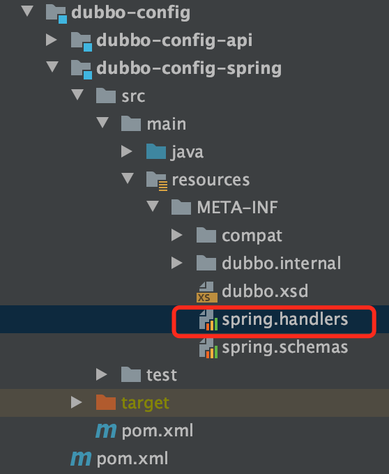
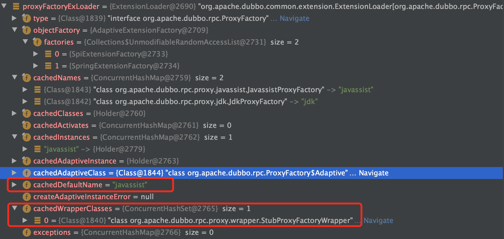
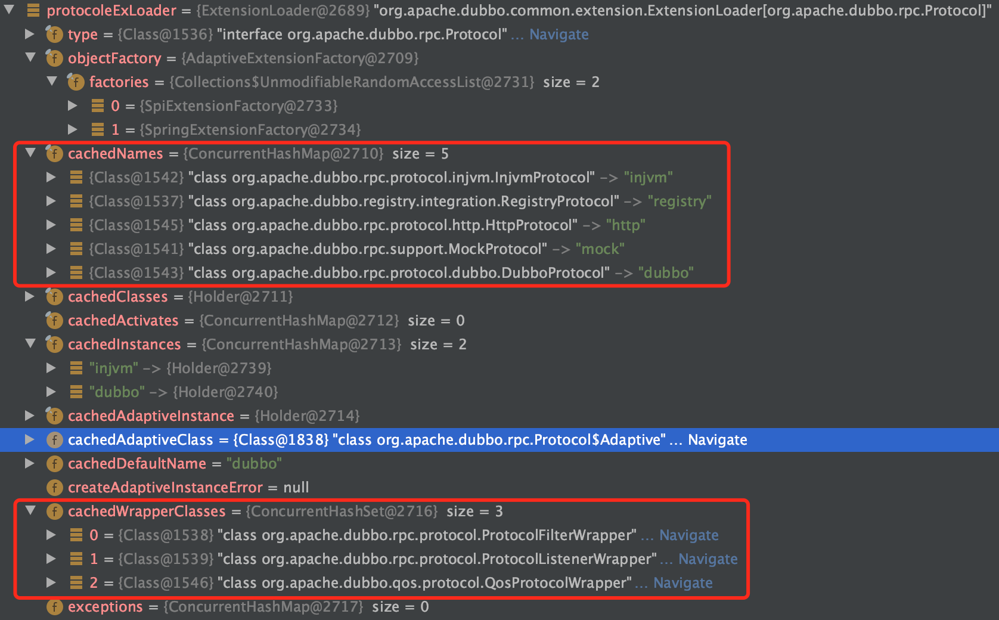
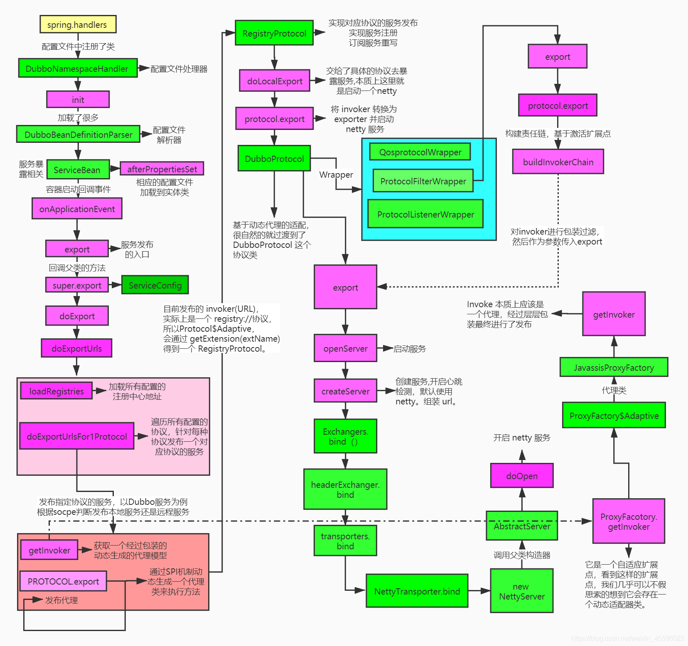

>  以与Spring整个为例子, 跟读源码


# 1. 整合spring的入口`DubboNamespaceHandler`




# 2. 发布前的准备

服务发布入口是`ServiceBean.class`的以下代码.

```java
@Override
public void onApplicationEvent(ContextRefreshedEvent event) {
    if (!isExported() && !isUnexported()) {
        if (logger.isInfoEnabled()) {
            logger.info("The service ready on spring started. service: " + getInterface());
        }
        // ★ 入口方法
        export();
    }
}

public synchronized void export() {
  // 加载并更新所有必须的配置信息(application, protocol等)到当前ServiceBean对象中
  // 为什么要更新配置? 因为有些配置是可以存在多个地方(例如timeout),  有优先级区分
  checkAndUpdateSubConfigs();

  // 省略非核心代码...

  if (delay != null && delay > 0) {
    // 延迟发布
    delayExportExecutor.schedule(this::doExport, delay, TimeUnit.MILLISECONDS);
  } else {
    // ★ 准备工作已经完成, 发布
    doExport();
  }
}

    protected synchronized void doExport() {
        // 省略非核心代码...
      
        //provider抽象对象 服务名= group/servicename:version
        ProviderModel providerModel = new ProviderModel(getUniqueServiceName(), ref, interfaceClass);
        //应用的抽象对象 ApplicationModel当前这个应用有哪些服务提供，消费了哪些服务
        ApplicationModel.initProviderModel(getUniqueServiceName(), providerModel);
        // ★ 发布url
        doExportUrls();
    }
```


# 3. doExportUrls()

```java
private void doExportUrls() {
  // 获取把注册信息处理为url, 支持多注册中心
  List<URL> registryURLs = loadRegistries(true);
  // 支持多协议(dubbo, http等)发布
  for (ProtocolConfig protocolConfig : protocols) {
    doExportUrlsFor1Protocol(protocolConfig, registryURLs);
  }
}
```


# 4. doExportUrlsFor1Protocol()

```java
private void doExportUrlsFor1Protocol(ProtocolConfig protocolConfig, List<URL> registryURLs) {
  String name = protocolConfig.getName();
  if (StringUtils.isEmpty(name)) {
    // 默认dubbo协议
    name = Constants.DUBBO;
  }

  Map<String, String> map = new HashMap<String, String>();
  map.put(Constants.SIDE_KEY, Constants.PROVIDER_SIDE);
  appendRuntimeParameters(map);
  // 不同层级的配置覆盖...
  // 配置优先级 低 -> 高:
  // application < module -> provider < protocal < this当前实例
  appendParameters(map, application);
  appendParameters(map, module);
  appendParameters(map, provider, Constants.DEFAULT_KEY);
  appendParameters(map, protocolConfig);
  appendParameters(map, this);
  
  // 把发布接口的method以保存到map, 后面拼接url用到
  if (CollectionUtils.isNotEmpty(methods)){...}
  
  // 省略一大串配置属性的逻辑....
  
  // 代表一个服务
  URL url = new URL(name, host, port, (StringUtils.isEmpty(contextPath) ? "" : contextPath + "/") + path, map);
  
  // 省略非核心逻辑...
  
  // 加来调试用的
  // 动态代理工厂拓展加载器
  ExtensionLoader<ProxyFactory> proxyFactoryExLoader = ExtensionLoader.getExtensionLoader(ProxyFactory.class);
  // protocol拓展加载器
  ExtensionLoader<Protocol> protocoleExLoader = ExtensionLoader.getExtensionLoader(Protocol.class);


  // ★ 远程暴露, 默认javassist代理
  // proxyFactory = ExtensionLoader.getExtensionLoader(ProxyFactory.class).getAdaptiveExtension();
  Invoker<?> invoker = proxyFactory.getInvoker(ref, (Class) interfaceClass, registryURL.addParameterAndEncoded(Constants.EXPORT_KEY, url.toFullString()));
  DelegateProviderMetaDataInvoker wrapperInvoker = new DelegateProviderMetaDataInvoker(invoker, this);
  // Dubbo是协议，注册是协议，配置覆盖也是协议
  // protocolc = ExtensionLoader.getExtensionLoader(Protocol.class).getAdaptiveExtension();
	// 入口，服务注册以及服务暴露
  Exporter<?> exporter = protocol.export(wrapperInvoker); 
  exporters.add(exporter);
  
```

从下图红框能看得的, dubbo框架默认初始化的proxyFactory加载器与protocol加载器的内部信息. 

- proxyFactory默认使用javassistProxyFactory动态库, 有StubProxyFactoryWrapper包装
- protocol默认使用dubboProtocol, 有三个Wrapper. 






# 5. protocol.export(wrapperInvoker);  服务发布与注册

## 5.1 服务发布
protocol实例实际上还套了三层wrapper

- ProtocolFilterWrapper

```java
@Override
public <T> Exporter<T> export(Invoker<T> invoker) throws RpcException {
  if (Constants.REGISTRY_PROTOCOL.equals(invoker.getUrl().getProtocol())) {
    return protocol.export(invoker);
  }
  // registryProtocol.doLocalExport(), 再次调用protocol.exoprt(), 参数是以包装了providerUrl作为url的新invoker作为,
  // providerUrl里面protocol是dubbo, 因此会走这个分支

  // buildInvokerChain()走filter过滤链
  return protocol.export(buildInvokerChain(invoker, Constants.SERVICE_FILTER_KEY, Constants.PROVIDER));
}

// filterWrapper内部还有过滤器逻辑, 可以自己以SPI用法实现Filter接口, 加入自定义filter
private static <T> Invoker<T> buildInvokerChain(final Invoker<T> invoker, String key, String group) {
  Invoker<T> last = invoker;
  List<Filter> filters = ExtensionLoader.getExtensionLoader(Filter.class).getActivateExtension(invoker.getUrl(), key, group);
  if (!filters.isEmpty()) {
    for (int i = filters.size() - 1; i >= 0; i--) {
      final Filter filter = filters.get(i);
      final Invoker<T> next = last;
      // 这里面是filter套娃, 类似wrapper行为, 预先套了一层一层,
      // 最后在执行invoke时候会一层层filter.invoke()调用下去.
      last = new Invoker<T>() {

        @Override
        public Class<T> getInterface() {
          return invoker.getInterface();
        }

        @Override
        public URL getUrl() {
          return invoker.getUrl();
        }

        @Override
        public boolean isAvailable() {
          return invoker.isAvailable();
        }

        @Override
        public Result invoke(Invocation invocation) throws RpcException {
          Result result = filter.invoke(next, invocation);
          if (result instanceof AsyncRpcResult) {
            AsyncRpcResult asyncResult = (AsyncRpcResult) result;
            asyncResult.thenApplyWithContext(r -> filter.onResponse(r, invoker, invocation));
            return asyncResult;
          } else {
            return filter.onResponse(result, invoker, invocation);
          }
        }

        @Override
        public void destroy() {
          invoker.destroy();
        }

        @Override
        public String toString() {
          return invoker.toString();
        }
      };
    }
  }
  return last;
}
```

- ProtocolListenerWrapper

```java
@Override
public <T> Exporter<T> export(Invoker<T> invoker) throws RpcException {
    if (Constants.REGISTRY_PROTOCOL.equals(invoker.getUrl().getProtocol())) {
        return protocol.export(invoker);
    }
    // registryProtocol.doLocalExport(), 再次调用protocol.exoprt(), 参数是以包装了providerUrl作为url的新invoker作为,
    // providerUrl里面protocol是dubbo, 因此会走这个分支
    return new ListenerExporterWrapper<T>(protocol.export(invoker),
            Collections.unmodifiableList(ExtensionLoader.getExtensionLoader(ExporterListener.class)
                    .getActivateExtension(invoker.getUrl(), Constants.EXPORTER_LISTENER_KEY)));
}
```

- QosProtocolWrapper

```java
@Override
public <T> Exporter<T> export(Invoker<T> invoker) throws RpcException {
    if (Constants.REGISTRY_PROTOCOL.equals(invoker.getUrl().getProtocol())) {
        startQosServer(invoker.getUrl());
        return protocol.export(invoker);
    }
    return protocol.export(invoker);
}
```


三个wrapper的export()都有共用代码, 这时候url是`registry://ip:port/xxx.xxService?.....`, 即protocol是registry, 因此`protocol.export(invoker);`最终会去到RegistryProtocol实例去export().

```
  if (Constants.REGISTRY_PROTOCOL.equals(invoker.getUrl().getProtocol())) {
    return protocol.export(invoker);
  }
```

### 5.1.1 RegistryProtocol.export()

```java
@Override
public <T> Exporter<T> export(final Invoker<T> originInvoker) throws RpcException {
    // registryUrl 从registry://127.0.0.1:2181/org.apache.dubbo.registry.RegistryService?..&registry=zookeeper&...
    // 修改为zookeeper://127.0.0.1:2181/org.apache.dubbo.registry.RegistryService?.., 并删除registry参数
    URL registryUrl = getRegistryUrl(originInvoker);

    // 从registryUrl中取出export值并转为url, 即 dubbo://ip:port/xxxx.xxxService?.....
    URL providerUrl = getProviderUrl(originInvoker);
		
    final URL overrideSubscribeUrl = getSubscribedOverrideUrl(providerUrl);
    final OverrideListener overrideSubscribeListener = new OverrideListener(overrideSubscribeUrl, originInvoker);
    overrideListeners.put(overrideSubscribeUrl, overrideSubscribeListener);

    providerUrl = overrideUrlWithConfig(providerUrl, overrideSubscribeListener);
    //★ 发布invoker
    final ExporterChangeableWrapper<T> exporter = doLocalExport(originInvoker, providerUrl); // 服务暴露

    // url to registry
    final Registry registry = getRegistry(originInvoker);
    final URL registeredProviderUrl = getRegisteredProviderUrl(providerUrl, registryUrl);
    ProviderInvokerWrapper<T> providerInvokerWrapper = ProviderConsumerRegTable.registerProvider(originInvoker,
            registryUrl, registeredProviderUrl);
    //to judge if we need to delay publish
    boolean register = registeredProviderUrl.getParameter("register", true);
    if (register) {
        register(registryUrl, registeredProviderUrl); // 服务注册
        providerInvokerWrapper.setReg(true);
    }

    // Deprecated! Subscribe to override rules in 2.6.x or before.
    // 监听的是该服务configurators下路径的变化
    registry.subscribe(overrideSubscribeUrl, overrideSubscribeListener);

    // export保存注册地址, 监听地址
    exporter.setRegisterUrl(registeredProviderUrl);
    exporter.setSubscribeUrl(overrideSubscribeUrl);
    //Ensure that a new exporter instance is returned every time export
    return new DestroyableExporter<>(exporter);
}
```

先发布服务, 然后再把服务信息注册上注册中心(默认zk). 


### 5.1.2  invoker服务发布. doLocalExport(originInvoker, providerUrl)

```java
private <T> ExporterChangeableWrapper<T> doLocalExport(final Invoker<T> originInvoker, URL providerUrl) {
    String key = getCacheKey(originInvoker);
    ExporterChangeableWrapper<T> exporter = (ExporterChangeableWrapper<T>) bounds.get(key);
    if (exporter == null) {
        synchronized (bounds) {
            exporter = (ExporterChangeableWrapper<T>) bounds.get(key);
            if (exporter == null) {
                // 创建代理invoker,   url使用provider url, 也就是dubbo://xxx的那个
                final Invoker<?> invokerDelegete = new InvokerDelegate<T>(originInvoker, providerUrl);
                // ★ 这里又再protocol.export()一次, 封装为ExporterChangeableWrapper对象
                // 能预测到, 这个exporter里面肯定是经过一层层protocolWrapper后, 以dubboProtocol把服务发布出去.
                exporter = new ExporterChangeableWrapper<T>((Exporter<T>) protocol.export(invokerDelegete), originInvoker);
                bounds.put(key, exporter);
            }
        }
    }
    return exporter;
}
```

这里面执行了`protocol.export(invokerDelegete)`, `invokerDelegete`的url这时候是`dubbo://xxxx`, 因此

又经过之前三个protocolWrapper之后, 最终由`dubboProtocol`来执行.  为什么是dubboProtocol? 因为Protocol接口的export方法@Adaptive注解, 没有指定value, 因此默认从入参invoker的url属性中获取key是`protocol`对应的值作为别名, 根据别名找到对应的实现类.  上诉代码的url里面protocol是dubbo, 因此最终是dubboProtocol来执行. 

```java
@SPI("dubbo")
public interface Protocol {
	  @Adaptive
    <T> Exporter<T> export(Invoker<T> invoker) throws RpcException;
}
```


### 5.1.3 dubboProtocol.export

```java
@Override
public <T> Exporter<T> export(Invoker<T> invoker) throws RpcException {
    URL url = invoker.getUrl();

    // export service.
    String key = serviceKey(url);
    DubboExporter<T> exporter = new DubboExporter<T>(invoker, key, exporterMap);
    exporterMap.put(key, exporter);

    //export an stub service for dispatching event
    // 是否支持存根
    Boolean isStubSupportEvent = url.getParameter(Constants.STUB_EVENT_KEY, Constants.DEFAULT_STUB_EVENT);
    Boolean isCallbackservice = url.getParameter(Constants.IS_CALLBACK_SERVICE, false);
    if (isStubSupportEvent && !isCallbackservice) {
        String stubServiceMethods = url.getParameter(Constants.STUB_EVENT_METHODS_KEY);
        if (stubServiceMethods == null || stubServiceMethods.length() == 0) {
            if (logger.isWarnEnabled()) {
                logger.warn(new IllegalStateException("consumer [" + url.getParameter(Constants.INTERFACE_KEY) +
                        "], has set stubproxy support event ,but no stub methods founded."));
            }
        } else {
            stubServiceMethodsMap.put(url.getServiceKey(), stubServiceMethods);
        }
    }

    // 开启服务器
    openServer(url);
    // 优化序列化
    optimizeSerialization(url);
    return exporter;
}
```


### 5.1.4 开启服务器openServer(url), createServer(url)

```java
private void openServer(URL url) {
    // find server.
    // 服务发布端的服务器地址,
    String key = url.getAddress();
    //client can export a service which's only for server to invoke
    boolean isServer = url.getParameter(Constants.IS_SERVER_KEY, true);
    if (isServer) {
        ExchangeServer server = serverMap.get(key);
        if (server == null) {
            synchronized (this) {
                server = serverMap.get(key);
                if (server == null) {
                    // ★ 创建server
                    serverMap.put(key, createServer(url));
                }
            }
        } else {
            // server supports reset, use together with override
            server.reset(url);
        }
    }
}

// 创建Server 对象
private ExchangeServer createServer(URL url) {
    // send readonly event when server closes, it's enabled by default
    url = url.addParameterIfAbsent(Constants.CHANNEL_READONLYEVENT_SENT_KEY, Boolean.TRUE.toString());
    // enable heartbeat by default
    url = url.addParameterIfAbsent(Constants.HEARTBEAT_KEY, String.valueOf(Constants.DEFAULT_HEARTBEAT));
    // 没有配置server, 默认netty, DEFAULT_REMOTING_SERVER = "netty";
    String str = url.getParameter(Constants.SERVER_KEY, Constants.DEFAULT_REMOTING_SERVER);
    // 检查Transporter.class有没有对应的server实现类
    if (str != null && str.length() > 0 && !ExtensionLoader.getExtensionLoader(Transporter.class).hasExtension(str)) {
        throw new RpcException("Unsupported server type: " + str + ", url: " + url);
    }

    url = url.addParameter(Constants.CODEC_KEY, DubboCodec.NAME);
    ExchangeServer server;
    try {
        // Exchange信息交换层, 对protocol层只提供了bind, connect方法, 隐藏了底下transport层的交互.
        // ★ 这里面获取transport层, 去bind端口
        server = Exchangers.bind(url, requestHandler);
    } catch (RemotingException e) {
        throw new RpcException("Fail to start server(url: " + url + ") " + e.getMessage(), e);
    }
    str = url.getParameter(Constants.CLIENT_KEY);
    if (str != null && str.length() > 0) {
        Set<String> supportedTypes = ExtensionLoader.getExtensionLoader(Transporter.class).getSupportedExtensions();
        if (!supportedTypes.contains(str)) {
            throw new RpcException("Unsupported client type: " + str);
        }
    }
    return server;
}
```


### 5.1.5 Transports.bind(). 

`Exchangers.bind() `往下跟几层, 会来到`Transports.bind()`

```java
public static Server bind(URL url, ChannelHandler... handlers) throws RemotingException {
    if (url == null) {
        throw new IllegalArgumentException("url == null");
    }
    if (handlers == null || handlers.length == 0) {
        throw new IllegalArgumentException("handlers == null");
    }
    ChannelHandler handler;
    if (handlers.length == 1) {
        handler = handlers[0];
    } else {
        handler = new ChannelHandlerDispatcher(handlers);
    }
    // 获取transport实现, 默认nettynetty, 即netty4)
    // ExtensionLoader.getExtensionLoader(Transporter.class).getAdaptiveExtension();
    return getTransporter().bind(url, handler);
}
```

这里会使用netty4包里面的NettyTransport的原因接口注解上面**默认netty**, 而**netty4包的NettyTransporter别名是netty与netty4, netty3包的NettyTransporter别名是netty3.** 

```java
@SPI("netty")
public interface Transporter {

    /**
     * Bind a server.
     *
     * @param url     server url
     * @param handler
     * @return server
     * @throws RemotingException
     * @see org.apache.dubbo.remoting.Transporters#bind(URL, ChannelHandler...)
     */
  		// {server, transporter}
    @Adaptive({Constants.SERVER_KEY, Constants.TRANSPORTER_KEY})
    Server bind(URL url, ChannelHandler handler) throws RemotingException;
}
```


### 5.1.6 NettyTransporter

```java
public class NettyTransporter implements Transporter {

    public static final String NAME = "netty";

    @Override
    public Server bind(URL url, ChannelHandler listener) throws RemotingException {
      // 继续往下跟就是netty开启服务器端的常规语法了... 
      return new NettyServer(url, listener);
    }

    @Override
    public Client connect(URL url, ChannelHandler listener) throws RemotingException {
        return new NettyClient(url, listener);
    }

}
```


## 5.2 服务注册

`RegistryProtocol.export()`在`doLocalExport()`发布完后, 执行注册逻辑. 

```java
//★ 发布invoker
final ExporterChangeableWrapper<T> exporter = doLocalExport(originInvoker, providerUrl); // 服务暴露

// url to registry
final Registry registry = getRegistry(originInvoker);
final URL registeredProviderUrl = getRegisteredProviderUrl(providerUrl, registryUrl);
ProviderInvokerWrapper<T> providerInvokerWrapper = ProviderConsumerRegTable.registerProvider(originInvoker,
        registryUrl, registeredProviderUrl);
//to judge if we need to delay publish
boolean register = registeredProviderUrl.getParameter("register", true);
if (register) {
    // ★ 服务注册
    register(registryUrl, registeredProviderUrl);
    providerInvokerWrapper.setReg(true);
}

// Deprecated! Subscribe to override rules in 2.6.x or before.
// 监听的是该服务configurators下路径的变化
registry.subscribe(overrideSubscribeUrl, overrideSubscribeListener);

// export保存注册地址, 监听地址
exporter.setRegisterUrl(registeredProviderUrl);
exporter.setSubscribeUrl(overrideSubscribeUrl);
```


# 6. 流程图



