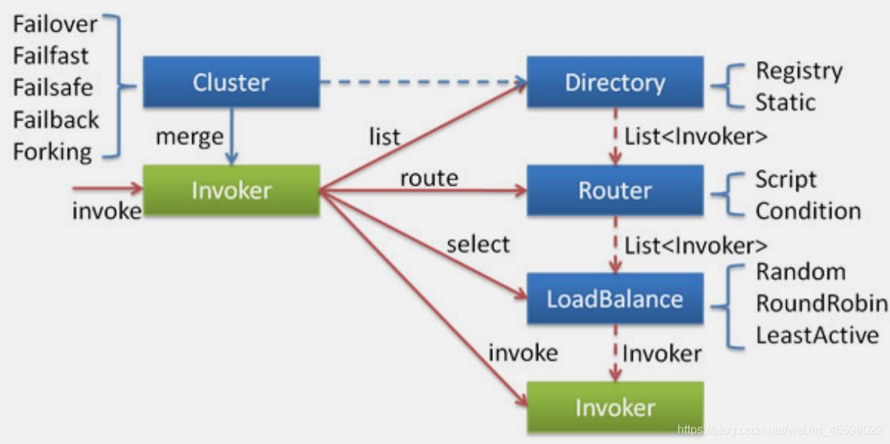
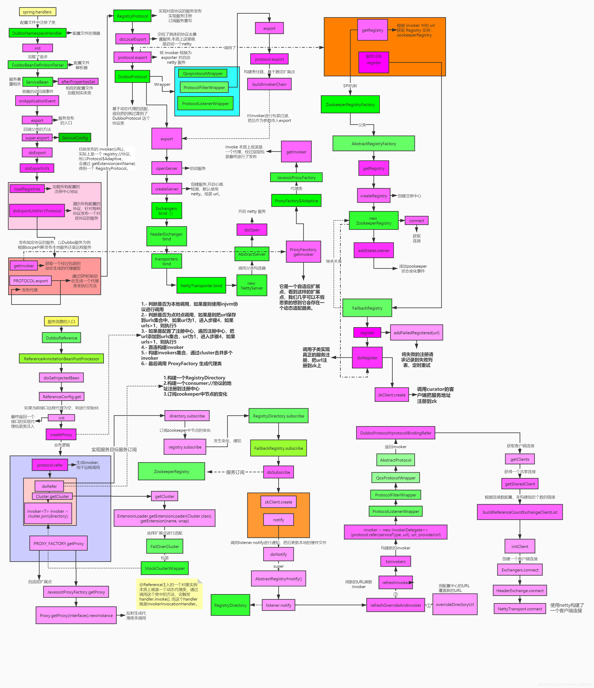

# 1. 服务引用入口是`ReferenceBean.class`的以下代码.

```java
@Override
public Object getObject() {
    // ★ 服务引用 入口
    return get();
}

public synchronized T get() {
    checkAndUpdateSubConfigs();

    if (destroyed) {
        throw new IllegalStateException("The invoker of ReferenceConfig(" + url + ") has already destroyed!");
    }
    if (ref == null) {
        // ★
        init();
    }
    return ref;
}

private void init() {
    if (initialized) {
        return;
    }
    initialized = true;
    // 省略一堆与服务暴露类似的配置操作.

    // ★ 入口
    // 创建代理
    ref = createProxy(map);

    ConsumerModel consumerModel = new ConsumerModel(getUniqueServiceName(), interfaceClass, ref, interfaceClass.getMethods(), attributes);
    ApplicationModel.initConsumerModel(getUniqueServiceName(), consumerModel);
}
```


# 2. 创建代理 ReferenceBean.createProxy

```java
private T createProxy(Map<String, String> map) {
    		// 省略一坨非核心代码....

        if (urls.size() == 1) {
            // 单注册中心
            invoker = refprotocol.refer(interfaceClass, urls.get(0));
        } else {
            List<Invoker<?>> invokers = new ArrayList<Invoker<?>>();
            URL registryURL = null;
            for (URL url : urls) {
                invokers.add(refprotocol.refer(interfaceClass, url));
                if (Constants.REGISTRY_PROTOCOL.equals(url.getProtocol())) {
                    registryURL = url; // use last registry url
                }
            }

            // 多注册中心的invoker全都cluster.join为一个invoker, 默认是failoverCluster
            if (registryURL != null) { // registry url is available
                // use RegistryAwareCluster only when register's cluster is available
                URL u = registryURL.addParameter(Constants.CLUSTER_KEY, RegistryAwareCluster.NAME);
                // The invoker wrap relation would be: RegistryAwareClusterInvoker(StaticDirectory) -> FailoverClusterInvoker(RegistryDirectory, will execute route) -> Invoker
                invoker = cluster.join(new StaticDirectory(u, invokers));
            } else { // not a registry url, must be direct invoke.
                invoker = cluster.join(new StaticDirectory(invokers));
            }
        }

  	// 省略一坨非核心代码....
		
    // create service proxy, 创建一个持有invoker的动态代理对象
    // ★
    return (T) proxyFactory.getProxy(invoker);
}
```

这里我们关注单注册中心的分支就行. `invoker = refprotocol.refer(interfaceClass, urls.get(0));`

`refprotocol.refer()`, 熟悉的方式. 这里其实是需要走三层wrapper:   ProtocolFilterWrapper(ProtocolListenerWrapper(QosProtocolWrapper(RegistryProtocol.refer())))


## 2.1  RegistryProtocol.doRefer()

```java
private <T> Invoker<T> doRefer(Cluster cluster, Registry registry, Class<T> type, URL url) {
		// cluster: Cluster$Adaptive@xxx 自适应类
  
    RegistryDirectory<T> directory = new RegistryDirectory<T>(type, url);
    directory.setRegistry(registry);
    directory.setProtocol(protocol);
    // all attributes of REFER_KEY
    Map<String, String> parameters = new HashMap<String, String>(directory.getUrl().getParameters());
    URL subscribeUrl = new URL(CONSUMER_PROTOCOL, parameters.remove(REGISTER_IP_KEY), 0, type.getName(), parameters);
    if (!ANY_VALUE.equals(url.getServiceInterface()) && url.getParameter(REGISTER_KEY, true)) {
        registry.register(getRegisteredConsumerUrl(subscribeUrl, url));
    }
    // ★ 2.7版本 绑定各个监听器，包括动态配置中心，条件路由，标签路由，黑白名单路由
    directory.buildRouterChain(subscribeUrl);
    // ★ 订阅三个节点, 订阅时候会触发notify, 最终初始化rpc客户端
    // dubbo/xxx.xxxService/providers
    // dubbo/xxx.xxxService/configurators
    // dubbo/xxx.xxxService/routers
    directory.subscribe(subscribeUrl.addParameter(CATEGORY_KEY,
            PROVIDERS_CATEGORY + "," + CONFIGURATORS_CATEGORY + "," + ROUTERS_CATEGORY));
		// ★ 聚合invoker
    Invoker invoker = cluster.join(directory);
    ProviderConsumerRegTable.registerConsumer(invoker, url, subscribeUrl, directory);
    return invoker;
}
```

这里的`Invoker invoker = cluster.join(directory);`实际上是执行  `MockClusterWrapper(FailOverCluster.join())`.  

返回的invoker，是`new MockClusterInvoker(directory, new FailoverClusterInvoker(directory))`

 

代码继续走, 会走到`ReferenceBean.createProxy()`最后一行: `proxyFactory.getProxy(invoker)`.

proxyFactory是自适应拓展点,  因此执行 `StubProxyFactoryWrapper(JavassistProxyFactory.getProxy())`. 


## 2.2 JavassistProxyFactory.getProxy()

```java
public class JavassistProxyFactory extends AbstractProxyFactory {

    @Override
    @SuppressWarnings("unchecked")
    public <T> T getProxy(Invoker<T> invoker, Class<?>[] interfaces) {
        return (T) Proxy.getProxy(interfaces).newInstance(new InvokerInvocationHandler(invoker));
    }
	
    // 省略其他... 
}
```

通过这个方法生成了一个动态代理类，并且对invoker再做了一层处理，InvokerInvocationHandler。意味着后续发起服务调用的时候，会由**`InvokerInvocationHandler.invoke()`**来进行处理。


# 3. rpc客户端连接

## 3.1 从注册中心订阅节点

```java
// ★ 订阅三个节点, 订阅时候会触发notify, 最终初始化rpc客户端
// dubbo/xxx.xxxService/providers
// dubbo/xxx.xxxService/configurators
// dubbo/xxx.xxxService/routers
directory.subscribe(subscribeUrl.addParameter(CATEGORY_KEY,
        PROVIDERS_CATEGORY + "," + CONFIGURATORS_CATEGORY + "," + ROUTERS_CATEGORY));
```

默认zk注册中心, 走`ZookeeperRegistry.doSubscribe()`. 


## 3.2 ZookeeperRegistry.doSubscribe()

```
@Override
public void doSubscribe(final URL url, final NotifyListener listener) {
    try {
        
            // 把现有的动态配置触发一下
            notify(url, listener, urls);
        
    } catch (Throwable e) {
        throw new RpcException("Failed to subscribe " + url + " to zookeeper " + getUrl() + ", cause: " + e.getMessage(), e);
    }
}
```

会走到抽象父类`AbstractRegistry.notify()`

## 3.3 AbstractRegistry.notify()

```java
protected void notify(URL url, NotifyListener listener, List<URL> urls) {
    // 省略
    for (Map.Entry<String, List<URL>> entry : result.entrySet()) {
        String category = entry.getKey();
        List<URL> categoryList = entry.getValue();
        categoryNotified.put(category, categoryList);
        // 注册中心的数据, 写到缓存本地
        saveProperties(url);
        // 触发一次notify, 刷新invoker等配置
        listener.notify(categoryList);
    }
}
```


## 3.4 RegistyDirectory.notify()

```java
@Override
public synchronized void notify(List<URL> urls) {
    List<URL> categoryUrls = urls.stream()
            .filter(this::isValidCategory)
            .filter(this::isNotCompatibleFor26x)
            .collect(Collectors.toList());

    /**
     * TODO Try to refactor the processing of these three type of urls using Collectors.groupBy()?
     */
  // 更新动态配置
    this.configurators = Configurator.toConfigurators(classifyUrls(categoryUrls, UrlUtils::isConfigurator))
            .orElse(configurators);
		// 更新routers配置
    toRouters(classifyUrls(categoryUrls, UrlUtils::isRoute)).ifPresent(this::addRouters);

    // ★ providers
    refreshOverrideAndInvoker(classifyUrls(categoryUrls, UrlUtils::isProvider));
}

private void refreshOverrideAndInvoker(List<URL> urls) {
    // mock zookeeper://xxx?mock=return null
    // ★ 刷新invoker配置
    overrideDirectoryUrl();
    // 订阅节点内容有变动, 则refresh invoker
    refreshInvoker(urls);
}
```


## 3.5 RegistyDirectory.refreshInvoker()

```java
private void refreshInvoker(List<URL> invokerUrls) {
        // ★ 只关注这行关键代码
        Map<String, Invoker<T>> newUrlInvokerMap = toInvokers(invokerUrls);// Translate url list to Invoker map
    }

private Map<String, Invoker<T>> toInvokers(List<URL> urls) {
   // url是dubbo://的url, 创建DuddoProtocol的rpc代理, 创建逻辑就是netty那一套了...
   invoker = new InvokerDelegate<T>(protocol.refer(serviceType, url), url, providerUrl);
   
}
```


# 4. 服务引用发生调用

invoker创建完了后, 由JavassistProxyFactory创建的动态代理持有, 把动态代理返回给spring容器.  

当发生调用的时候, 执行的是`InvokerInvocationHandler.invoke()`

```java
public class JavassistProxyFactory extends AbstractProxyFactory {

    @Override
    @SuppressWarnings("unchecked")
    public <T> T getProxy(Invoker<T> invoker, Class<?>[] interfaces) {
        return (T) Proxy.getProxy(interfaces).newInstance(new InvokerInvocationHandler(invoker));
    }
}
```


## 4.1 InvokerInvocationHandler.invoke()

```java
@Override
public Object invoke(Object proxy, Method method, Object[] args) throws Throwable {
    String methodName = method.getName();
    Class<?>[] parameterTypes = method.getParameterTypes();
    if (method.getDeclaringClass() == Object.class) {
        return method.invoke(invoker, args);
    }
    if ("toString".equals(methodName) && parameterTypes.length == 0) {
        return invoker.toString();
    }
    if ("hashCode".equals(methodName) && parameterTypes.length == 0) {
        return invoker.hashCode();
    }
    if ("equals".equals(methodName) && parameterTypes.length == 1) {
        return invoker.equals(args[0]);
    }
    // createInvocation(method, args) 很明显, 封装调用的方法与参数为通用RpcInvocation传输对象
    // recreate() 把返回的通用对象解析为具体的对象
    return invoker.invoke(createInvocation(method, args)).recreate();
}

private RpcInvocation createInvocation(Method method, Object[] args) {
    RpcInvocation invocation = new RpcInvocation(method, args);
    if (RpcUtils.hasFutureReturnType(method)) {
        invocation.setAttachment(Constants.FUTURE_RETURNTYPE_KEY, "true");
        invocation.setAttachment(Constants.ASYNC_KEY, "true");
    }
    return invocation;
}
```

这里invoker.invoke(), 实际上是MockClusterInvoker(FailOverCluster.invoke())


## 4.2 MockClusterInvoker.invoke()

```java
public Result invoke(Invocation invocation) throws RpcException {
    Result result = null;

    String value = directory.getUrl().getMethodParameter(invocation.getMethodName(), Constants.MOCK_KEY, Boolean.FALSE.toString()).trim();
    if (value.length() == 0 || value.equalsIgnoreCase("false")) {
        //no mock 
        //没有配置mock参数, 走这里
        result = this.invoker.invoke(invocation);
    } else if (value.startsWith("force")) {
        if (logger.isWarnEnabled()) {
            logger.warn("force-mock: " + invocation.getMethodName() + " force-mock enabled , url : " + directory.getUrl());
        }
        //force:direct mock
        result = doMockInvoke(invocation, null);
    } else {
        //fail-mock
        try {
            result = this.invoker.invoke(invocation);
        } catch (RpcException e) {
            if (e.isBiz()) {
                throw e;
            }
            
            if (logger.isWarnEnabled()) {
                logger.warn("fail-mock: " + invocation.getMethodName() + " fail-mock enabled , url : " + directory.getUrl(), e);
            }
            // 抛异常
            result = doMockInvoke(invocation, e);
        }
    }
    return result;
}
```


## 4.3 FailOverCluster(AbstractClusterInvoker).invoke()

```java
public Result invoke(final Invocation invocation) throws RpcException {
    checkWhetherDestroyed();

    // binding attachments into invocation.
    // 把上下文的attachments, add给invocation
    Map<String, String> contextAttachments = RpcContext.getContext().getAttachments();
    if (contextAttachments != null && contextAttachments.size() != 0) {
        ((RpcInvocation) invocation).addAttachments(contextAttachments);
    }

    // 列出所有invoker
    List<Invoker<T>> invokers = list(invocation);
    // ★ 负债均衡, 默认random
    LoadBalance loadbalance = initLoadBalance(invokers, invocation);
    RpcUtils.attachInvocationIdIfAsync(getUrl(), invocation);
    // ★ 调用, 默认FailoverClusterInvoker.invoke()
    return doInvoke(invocation, invokers, loadbalance);
}
```

FailoverClusterInvoker.invoke() -> 根据loadbalance, 选出一个invoker后. 执行DubboInvoker.invoke()

```java
// doInvoke()关键代码...
// 通过负载均衡loadbalance, 选出一个invoker
Invoker<T> invoker = select(loadbalance, invocation, copyInvokers, invoked);
invoked.add(invoker);
RpcContext.getContext().setInvokers((List) invoked);
// 调用
Result result = invoker.invoke(invocation);
return result;
```


# 5. 负载均衡

## 5.1 AbstractClusterInvoker.select(), doSelect()

```java
protected Invoker<T> select(LoadBalance loadbalance, Invocation invocation,
        List<Invoker<T>> invokers, List<Invoker<T>> selected) throws RpcException {
    
    // 调用 doSelect 方法进行负载均衡，该方法为抽象方法，由子类实现
    Invoker<T> invoker = doSelect(loadbalance, invocation, invokers, selected);
 
}

private Invoker<T> doSelect(LoadBalance loadbalance, Invocation invocation,
                            List<Invoker<T>> invokers, List<Invoker<T>> selected) throws RpcException {

    if (CollectionUtils.isEmpty(invokers)) {
      return null;
    }
    // 只有一个, 直接返回, 不需要走负载均衡逻辑
    if (invokers.size() == 1) {
       return invokers.get(0);
    }
    // 默认RandomLoadBalance
    Invoker<T> invoker = loadbalance.select(invokers, getUrl(), invocation);
}
```


## 5.2 AbstractLoadBalance.select()

```java
@Override
public <T> Invoker<T> select(List<Invoker<T>> invokers, URL url, Invocation invocation) {
    if (CollectionUtils.isEmpty(invokers)) {
        return null;
    }
    if (invokers.size() == 1) {
        return invokers.get(0);
    }
    // 子类自己实现select逻辑
    return doSelect(invokers, url, invocation);
}

protected abstract <T> Invoker<T> doSelect(List<Invoker<T>> invokers, URL url, Invocation invocation);
```


## 5.3 RandomLoadBalance.select()

```java
public class RandomLoadBalance extends AbstractLoadBalance {

    public static final String NAME = "random";

    @Override
    protected <T> Invoker<T> doSelect(List<Invoker<T>> invokers, URL url, Invocation invocation) {
        // Number of invokers
        int length = invokers.size();
        // Every invoker has the same weight?
        boolean sameWeight = true;
        // the weight of every invokers
        int[] weights = new int[length];
        // the first invoker's weight
        int firstWeight = getWeight(invokers.get(0), invocation);
        weights[0] = firstWeight;
        // The sum of weights
        int totalWeight = firstWeight;
        for (int i = 1; i < length; i++) {
            int weight = getWeight(invokers.get(i), invocation);
            // save for later use
            weights[i] = weight;
            // Sum
            totalWeight += weight;
            if (sameWeight && weight != firstWeight) {
                sameWeight = false;
            }
        }
        if (totalWeight > 0 && !sameWeight) {
            // If (not every invoker has the same weight & at least one invoker's weight>0), select randomly based on totalWeight.
            int offset = ThreadLocalRandom.current().nextInt(totalWeight);
            // Return a invoker based on the random value.
            for (int i = 0; i < length; i++) {
                offset -= weights[i];
                if (offset < 0) {
                    return invokers.get(i);
                }
            }
        }
        // If all invokers have the same weight value or totalWeight=0, return evenly.
        return invokers.get(ThreadLocalRandom.current().nextInt(length));
    }

}
```


## 5.4 类使用关系图




# 6. rpc调用

负载均衡选出invoker后,  最终由AbstrackInvoker.invoke() -> DubboInvoker.doInvoke()


## 6.1 DubboInvoker.doInvoke()

```java
protected Result doInvoke(final Invocation invocation) throws Throwable {
    RpcInvocation inv = (RpcInvocation) invocation;
    final String methodName = RpcUtils.getMethodName(invocation);
    inv.setAttachment(Constants.PATH_KEY, getUrl().getPath());
    inv.setAttachment(Constants.VERSION_KEY, version);

    // exchaner层, rpc客户端与
    ExchangeClient currentClient;
    if (clients.length == 1) {
        currentClient = clients[0];
    } else {
        currentClient = clients[index.getAndIncrement() % clients.length];
    }
    try {
        boolean isAsync = RpcUtils.isAsync(getUrl(), invocation);
        boolean isAsyncFuture = RpcUtils.isReturnTypeFuture(inv);
        boolean isOneway = RpcUtils.isOneway(getUrl(), invocation);
        int timeout = getUrl().getMethodParameter(methodName, Constants.TIMEOUT_KEY, Constants.DEFAULT_TIMEOUT);
        if (isOneway) {
            boolean isSent = getUrl().getMethodParameter(methodName, Constants.SENT_KEY, false);
            // 异步无响应请求
            currentClient.send(inv, isSent);
            RpcContext.getContext().setFuture(null);
            return new RpcResult();
        } else if (isAsync) {
            // 异步等待响应请求
            ResponseFuture future = currentClient.request(inv, timeout);
            // For compatibility
            FutureAdapter<Object> futureAdapter = new FutureAdapter<>(future);
            RpcContext.getContext().setFuture(futureAdapter);

            Result result;
            if (isAsyncFuture) {
                // register resultCallback, sometimes we need the async result being processed by the filter chain.
                result = new AsyncRpcResult(futureAdapter, futureAdapter.getResultFuture(), false);
            } else {
                result = new SimpleAsyncRpcResult(futureAdapter, futureAdapter.getResultFuture(), false);
            }
            return result;
        } else {
            // 同步请求
            RpcContext.getContext().setFuture(null);
          	 // 发送请求, responseFuture.get同步阻塞等待返回
            return (Result) currentClient.request(inv, timeout).get();
        }
}
```

currentClient.request实际是一个`ReferenceCountExchangeClient(HeaderExchangeClient())`。

所以它的调用链路是：

`ReferenceCountExchangeClient->HeaderExchangeClient->HeaderExchangeChannel.request()`

最终，把构建好的 `RpcInvocation`，组装到一个`Request`对象中进行传递


## 6.2 HeaderExchangeChannel.request()

```java
@Override
public ResponseFuture request(Object request, int timeout) throws RemotingException {
    if (closed) {
        throw new RemotingException(this.getLocalAddress(), null, "Failed to send request " + request + ", cause: The channel " + this + " is closed!");
    }
    // create request.
    Request req = new Request();
    req.setVersion(Version.getProtocolVersion());
    req.setTwoWay(true);
    req.setData(request);
    DefaultFuture future = DefaultFuture.newFuture(channel, req, timeout);
    try {
        // send
        channel.send(req);
    } catch (RemotingException e) {
        future.cancel();
        throw e;
    }
    return future;
}
```


# 7. 总结

