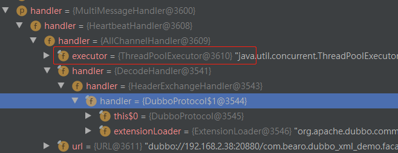

# 1. server端以dubbo协议的暴露服务,  关于netty的 child handler说明.


server暴露服务, DubboProtocol.createServer()创建服务器. 

```java
ExchangeServer server;
try {
    // Exchange信息交换层, 对protocol层只提供了bind, connect方法, 隐藏了底下transport层的交互.
    // ★ 这里面获取transport层, 去bind端口
    server = Exchangers.bind(url, requestHandler);
} catch (RemotingException e) {
    throw new RpcException("Fail to start server(url: " + url + ") " + e.getMessage(), e);
}
```

这里的`requestHandler`, 是DubboProtocol.requestHandler, 是个`ExchangeHandlerAdapter`.  因此服务被调用的时候, 最终会走到`received()`, 进入`reply()`方法.

```java
private ExchangeHandler requestHandler = new ExchangeHandlerAdapter() {

    @Override
    public CompletableFuture<Object> reply(ExchangeChannel channel, Object message) throws RemotingException {
        if (message instanceof Invocation) {
            Invocation inv = (Invocation) message;
            // ★
            Invoker<?> invoker = getInvoker(channel, inv);
        }
        // ...... 
    }

    @Override
    public void received(Channel channel, Object message) throws RemotingException {
        if (message instanceof Invocation) {
            // 服务调用会走到这里
            reply((ExchangeChannel) channel, message);
        } else {
            super.received(channel, message);
        }
    }

    @Override
    public void connected(Channel channel) throws RemotingException {}

    @Override
    public void disconnected(Channel channel) throws RemotingException {}

    private void invoke(Channel channel, String methodKey) {}

    private Invocation createInvocation(Channel channel, URL url, String methodKey) {}
};
```

但`requestHandler`在add给复制给netty pipeline之前, 会被包了很多层handler:    ` DecodeHandler(HeaderExchangeHandler(requestHandler))`, 然后又被`ChannelHandlers.wrap()`一下, 再包了几个handler:   `MultiMessageHandler(HeartbeatHandler(AllChannelHandler(`DecodeHandler(HeaderExchangeHandler(requestHandler))`)))`.

```java
public class ChannelHandlers {
    // ...
    
    public static ChannelHandler wrap(ChannelHandler handler, URL url) {
        return ChannelHandlers.getInstance().wrapInternal(handler, url);
    }
    
    protected ChannelHandler wrapInternal(ChannelHandler handler, URL url) {
        return new MultiMessageHandler(new HeartbeatHandler(ExtensionLoader.getExtensionLoader(Dispatcher.class)
                .getAdaptiveExtension().dispatch(handler, url)));
    }
    
    // ...
}
```

值得一提的是,  `AllChannelHandler`还持有一个线程池. 



最终再包一层NettyServerHandler. 

```java
public class NettyServer extends AbstractServer implements Server {
    @Override
    protected void doOpen() throws Throwable {
        bootstrap = new ServerBootstrap();

        bossGroup = new NioEventLoopGroup(1, new DefaultThreadFactory("NettyServerBoss", true));
        workerGroup = new NioEventLoopGroup(getUrl().getPositiveParameter(Constants.IO_THREADS_KEY, Constants.DEFAULT_IO_THREADS),
                new DefaultThreadFactory("NettyServerWorker", true));
		// handlers再包一层NettyServerHandler
        final NettyServerHandler nettyServerHandler = new NettyServerHandler(getUrl(), this);
        channels = nettyServerHandler.getChannels();

        bootstrap.group(bossGroup, workerGroup)
                .channel(NioServerSocketChannel.class)
                .childOption(ChannelOption.TCP_NODELAY, Boolean.TRUE)
                .childOption(ChannelOption.SO_REUSEADDR, Boolean.TRUE)
                .childOption(ChannelOption.ALLOCATOR, PooledByteBufAllocator.DEFAULT)
                .childHandler(new ChannelInitializer<NioSocketChannel>() {
                    @Override
                    protected void initChannel(NioSocketChannel ch) throws Exception {
                        NettyCodecAdapter adapter = new NettyCodecAdapter(getCodec(), getUrl(), NettyServer.this);
                        ch.pipeline()//.addLast("logging",new LoggingHandler(LogLevel.INFO))//for debug
                                .addLast("decoder", adapter.getDecoder())
                                .addLast("encoder", adapter.getEncoder())
                               //
                                .addLast("handler", nettyServerHandler);
                    }
                });
        // bind
        ChannelFuture channelFuture = bootstrap.bind(getBindAddress());
        channelFuture.syncUninterruptibly();
        channel = channelFuture.channel();

    }
}
```

 因此接受消息的时候, 消息整个链路会经过这些handler, 

`NettyServerHandler -> MultiMessageHandler -> HeartbeatHandler -> AllChannelHandler(`持有线程池`) -> DecodeHandler -> HeaderExchangeHandler -> DubboProtocol.requestHandler`

而最终处理消息的是**DubboProtocol.requestHandler**. 


# 2. 服务端接受调用


## 2.1 NettyServerHandler.channelRead()

server端暴露的服务被调用,  客户端那边channel.send(req)数据, server端 解码后, 回调给NettyServerHandler.channelRead() 

```java
public class NettyServerHandler extends ChannelDuplexHandler {
    @Override
    public void channelRead(ChannelHandlerContext ctx, Object msg) throws Exception {
        NettyChannel channel = NettyChannel.getOrAddChannel(ctx.channel(), url, handler);
        try {
            // 开始在handler链上传递...
            handler.received(channel, msg);
        } finally {
            NettyChannel.removeChannelIfDisconnected(ctx.channel());
        }
    }
}
```

`NettyServerHandler -> MultiMessageHandler -> HeartbeatHandler -> AllChannelHandler`,  

## 2.2 AllChannelHandler.received()

上面有提到, `AllChannelHandler`持有线程池, 

```java
@Override
public void received(Channel channel, Object message) throws RemotingException {
    ExecutorService cexecutor = getExecutorService();
    try {
        // 把请求丢给线程池处理
        cexecutor.execute(new ChannelEventRunnable(channel, handler, ChannelState.RECEIVED, message));
    } catch (Throwable t) {
        //TODO A temporary solution to the problem that the exception information can not be sent to the opposite end after the thread pool is full. Need a refactoring
        //fix The thread pool is full, refuses to call, does not return, and causes the consumer to wait for time out
       if(message instanceof Request && t instanceof RejectedExecutionException){
          Request request = (Request)message;
          if(request.isTwoWay()){
             String msg = "Server side(" + url.getIp() + "," + url.getPort() + ") threadpool is exhausted ,detail msg:" + t.getMessage();
             Response response = new Response(request.getId(), request.getVersion());
             response.setStatus(Response.SERVER_THREADPOOL_EXHAUSTED_ERROR);
             response.setErrorMessage(msg);
             channel.send(response);
             return;
          }
       }
        throw new ExecutionException(message, channel, getClass() + " error when process received event .", t);
    }
}
```


## 2.3  线程池处理请求 ChannelEventRunnable.run()

根据事件, 执行不同的处理回调逻辑, 这次的handler.received()执行流程 `DecodeHandler -> HeaderExchangeHandler -> DubboProtocol.requestHandler`

```java
public void run() {
    if (state == ChannelState.RECEIVED) {
        try {
            // RECEIVED事件, 处理服务请求
            handler.received(channel, message);
        } catch (Exception e) {
            logger.warn("ChannelEventRunnable handle " + state + " operation error, channel is " + channel
                    + ", message is " + message, e);
        }
    } else {
        switch (state) {
        case CONNECTED:
            try {
                handler.connected(channel);
            } catch (Exception e) {
                logger.warn("ChannelEventRunnable handle " + state + " operation error, channel is " + channel, e);
            }
            break;
        case DISCONNECTED:
            try {
                handler.disconnected(channel);
            } catch (Exception e) {
                logger.warn("ChannelEventRunnable handle " + state + " operation error, channel is " + channel, e);
            }
            break;
        case SENT:
            try {
                handler.sent(channel, message);
            } catch (Exception e) {
                logger.warn("ChannelEventRunnable handle " + state + " operation error, channel is " + channel
                        + ", message is " + message, e);
            }
            break;
        case CAUGHT:
            try {
                handler.caught(channel, exception);
            } catch (Exception e) {
                logger.warn("ChannelEventRunnable handle " + state + " operation error, channel is " + channel
                        + ", message is: " + message + ", exception is " + exception, e);
            }
            break;
        default:
            logger.warn("unknown state: " + state + ", message is " + message);
        }
    }

}
```


## 2.4 DubboProtocol.requestHandler

消息从recevied() -> reply(), 

```java
private ExchangeHandler requestHandler = new ExchangeHandlerAdapter() {

    @Override
    public CompletableFuture<Object> reply(ExchangeChannel channel, Object message) throws RemotingException {
        if (message instanceof Invocation) {
            Invocation inv = (Invocation) message;
            // ★
            Invoker<?> invoker = getInvoker(channel, inv);
            
            // ...

            // 调用
            Result result = invoker.invoke(inv);
            
        }
        // ...... 
    }

    @Override
    public void received(Channel channel, Object message) throws RemotingException {
        if (message instanceof Invocation) {
            // 服务调用会走到这里
            reply((ExchangeChannel) channel, message);
        } else {
            super.received(channel, message);
        }
    }

    @Override
    public void connected(Channel channel) throws RemotingException {}

    @Override
    public void disconnected(Channel channel) throws RemotingException {}

    private void invoke(Channel channel, String methodKey) {}

    private Invocation createInvocation(Channel channel, URL url, String methodKey) {}
};
```


## 2.5 DubboProtocol.getInvoker()

```java
Invoker<?> getInvoker(Channel channel, Invocation inv) throws RemotingException {
    boolean isCallBackServiceInvoke = false;
    boolean isStubServiceInvoke = false;
    int port = channel.getLocalAddress().getPort();
    String path = inv.getAttachments().get(Constants.PATH_KEY);
    // if it's callback service on client side
    isStubServiceInvoke = Boolean.TRUE.toString().equals(inv.getAttachments().get(Constants.STUB_EVENT_KEY));
    if (isStubServiceInvoke) {
        port = channel.getRemoteAddress().getPort();
    }
    //callback
    isCallBackServiceInvoke = isClientSide(channel) && !isStubServiceInvoke;
    if (isCallBackServiceInvoke) {
        path = inv.getAttachments().get(Constants.PATH_KEY) + "." + inv.getAttachments().get(Constants.CALLBACK_SERVICE_KEY);
        inv.getAttachments().put(IS_CALLBACK_SERVICE_INVOKE, Boolean.TRUE.toString());
    }
    // service:port
    String serviceKey = serviceKey(port, path, inv.getAttachments().get(Constants.VERSION_KEY), inv.getAttachments().get(Constants.GROUP_KEY));
    // ★ 获取被暴露服务的export
    DubboExporter<?> exporter = (DubboExporter<?>) exporterMap.get(serviceKey);

    if (exporter == null) {
        throw new RemotingException(channel, "Not found exported service: " + serviceKey + " in " + exporterMap.keySet() + ", may be version or group mismatch " + ", channel: consumer: " + channel.getRemoteAddress() + " --> provider: " + channel.getLocalAddress() + ", message:" + inv);
    }

    return exporter.getInvoker();
}
```

exporterMap 维护了 `service:port -> DubboExporter`实例的映射.  看得出一个服务都有一个`DubboExporter`. 

这个exporter, 是DubboProtocol暴露服务时候export()方法里面创建的

```java
@Override
public <T> Exporter<T> export(Invoker<T> invoker) throws RpcException {
	URL url = invoker.getUrl();

    // export service.
    String key = serviceKey(url);
    DubboExporter<T> exporter = new DubboExporter<T>(invoker, key, exporterMap);
    exporterMap.put(key, exporter);   
}
```


## 2.6  invoker.invoke(inv)

那么从DubboExporter拿到了invoker.  这个invoker又是设啥.  

可以追溯到服务发布的源头,  最初的invoker是有JavassistProxyFactory创建的动态代理类, 持有本地的bean, 就是那个`ref`.  

然后再对invoker层层包装. `ProtocolFilterWrapper(InvokerDelegate(DelegateProviderMetaDataInvoker(AbstractProxyInvoker)))`

```java
// ★ 远程暴露, 默认javassist创建代理
Invoker<?> invoker = proxyFactory.getInvoker(ref, (Class) interfaceClass, registryURL.addParameterAndEncoded(Constants.EXPORT_KEY, url.toFullString()));
DelegateProviderMetaDataInvoker wrapperInvoker = new DelegateProviderMetaDataInvoker(invoker, this);
// Dubbo是协议，注册是协议，配置覆盖也是协议
Exporter<?> exporter = protocol.export(wrapperInvoker); // 入口，服务注册以及服务暴露
```

## 2.7 JavassistProxyFactory.getInvoker()  -> AbstractProxyInvoker.invoke()

```java
public class JavassistProxyFactory extends AbstractProxyFactory {

    @Override
    @SuppressWarnings("unchecked")
    public <T> T getProxy(Invoker<T> invoker, Class<?>[] interfaces) {
        return (T) Proxy.getProxy(interfaces).newInstance(new InvokerInvocationHandler(invoker));
    }

    @Override
    public <T> Invoker<T> getInvoker(T proxy, Class<T> type, URL url) {
        // TODO Wrapper cannot handle this scenario correctly: the classname contains '$'
        final Wrapper wrapper = Wrapper.getWrapper(proxy.getClass().getName().indexOf('$') < 0 ? proxy.getClass() : type);
		
        return new AbstractProxyInvoker<T>(proxy, type, url) {
            @Override
            protected Object doInvoke(T proxy, String methodName,
                                      Class<?>[] parameterTypes,
                                      Object[] arguments) throws Throwable {
                return wrapper.invokeMethod(proxy, methodName, parameterTypes, arguments);
            }
        };
    }
}

public abstract class AbstractProxyInvoker<T> implements Invoker<T> {
    @Override
    public Result invoke(Invocation invocation) throws RpcException {
        RpcContext rpcContext = RpcContext.getContext();
        try {
            // ★ 最终, 由这里执行
            Object obj = doInvoke(proxy, invocation.getMethodName(), invocation.getParameterTypes(), invocation.getArguments());
            if (RpcUtils.isReturnTypeFuture(invocation)) {
                return new AsyncRpcResult((CompletableFuture<Object>) obj);
            } else if (rpcContext.isAsyncStarted()) { // ignore obj in case of RpcContext.startAsync()? always rely on user to write back.
                return new AsyncRpcResult(rpcContext.getAsyncContext().getInternalFuture());
            } else {
                return new RpcResult(obj);
            }
        } catch (InvocationTargetException e) {
            // TODO async throw exception before async thread write back, should stop asyncContext
            if (rpcContext.isAsyncStarted() && !rpcContext.stopAsync()) {
                logger.error("Provider async started, but got an exception from the original method, cannot write the exception back to consumer because an async result may have returned the new thread.", e);
            }
            return new RpcResult(e.getTargetException());
        } catch (Throwable e) {
            throw new RpcException("Failed to invoke remote proxy method " + invocation.getMethodName() + " to " + getUrl() + ", cause: " + e.getMessage(), e);
        }
    }
}
```

最终调用`            Object obj = doInvoke(proxy, invocation.getMethodName(), invocation.getParameterTypes(), invocation.getArguments());`

方法进行处理.  服务端的处理过程就分析完毕。