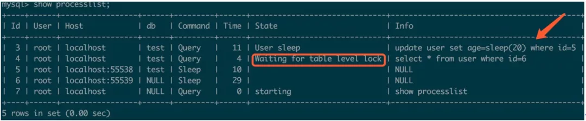
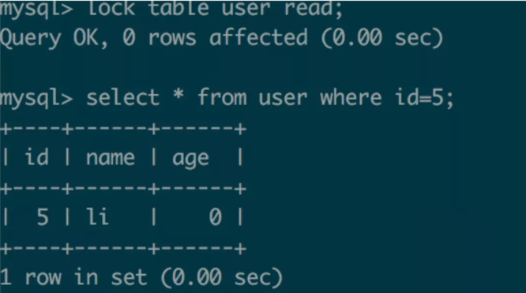
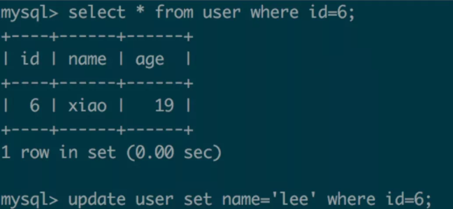
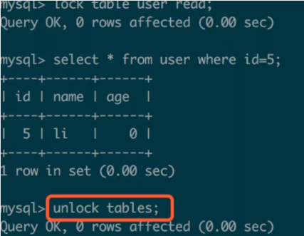

#[参考](https://mp.weixin.qq.com/s/tQwasQGqqG85eLx4Cl4L9A)

# MyISAM引擎与表锁
> * MyISAM存储引擎执行操作时会产生表锁，操作完成再自动解锁。
> * 如果操作是写操作，则表锁类型为写锁，如果操作是读操作则表锁类型为读锁。
> * 表锁是写锁，则会导致其他用户操作串行，如果是读锁则其他用户的读操作可以并行, 但写操作依旧是串行.

当前MySQL进程状态：

###测试: 

显式开启/关闭表锁，使用lock table user read/write; unlock tables;
session1:

session2：

可以看到会话1启用表锁（读锁）执行读操作，这时会话2可以并行执行读操作，但写操作被阻塞。接着看：

session1:

session2:

当session1执行解锁后，seesion2则立刻开始执行写操作，即读-写串行。

### 建议: 
1）尽量不用MyISAM存储引擎，在MySQL8.0版本中已经去掉了所有的MyISAM存储引擎的表，推荐使用InnoDB存储引擎。
2）如果一定要用MyISAM存储引擎，减少写操作的时间；