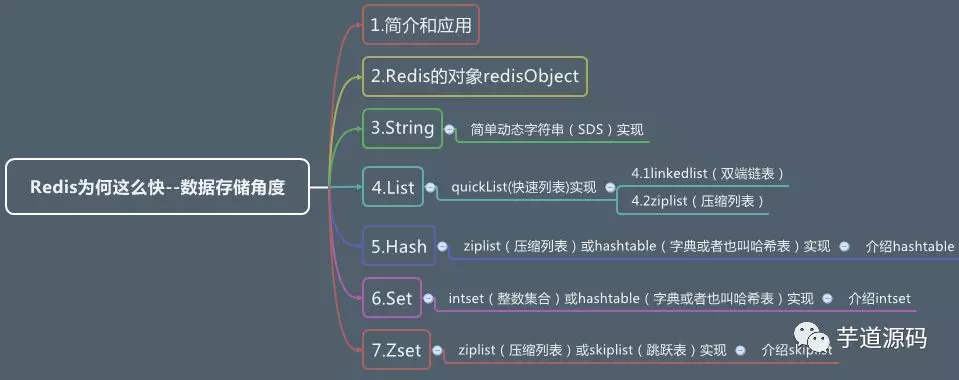
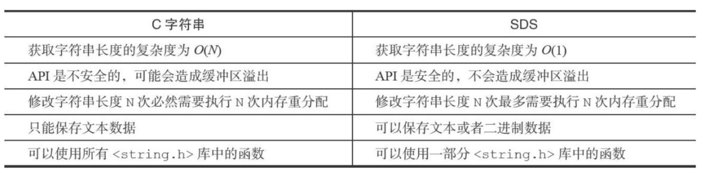
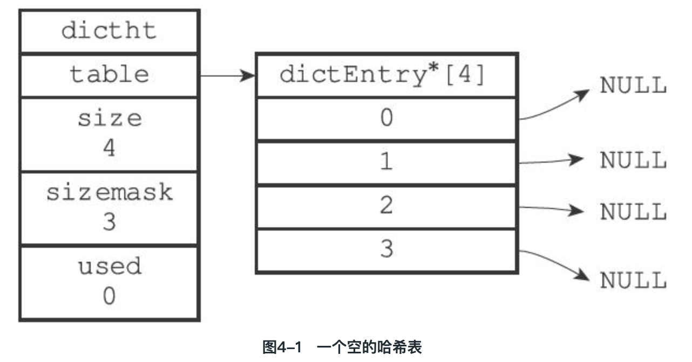
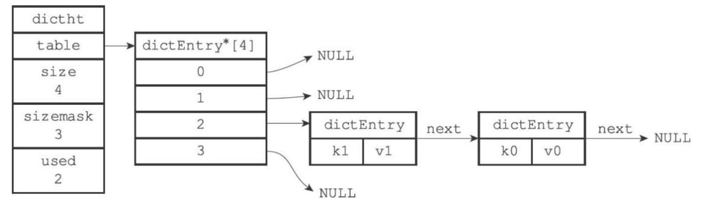
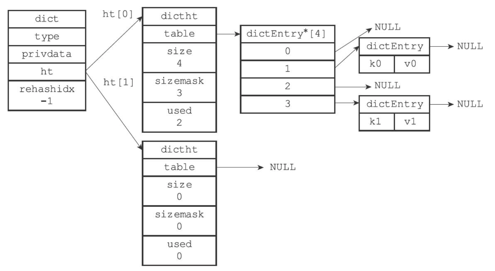
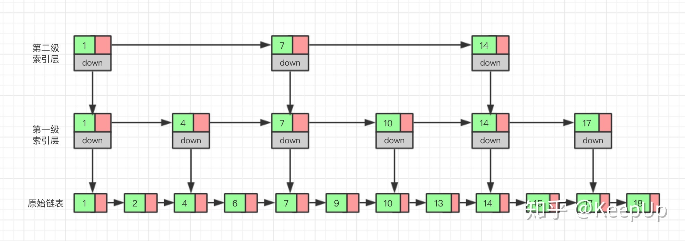
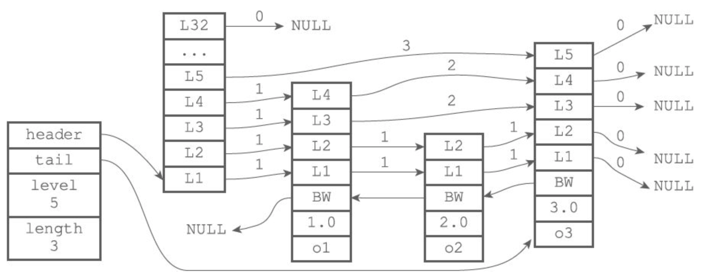

# 1. 简答动态字符串 SDS(Simple Dynamic String)

## 1.1 sds数据结构

```c
// sds.h/sdshdr
struct sdshdr {
    // 记录buf数组中已使用字节的数量
    // 等于SDS所保存字符串的长度
    int len;
    // 记录buf数组中未使用字节的数量
    int free;
    // 字节数组，用于保存字符串
    char buf[];
};
```


## 1.2 len属性

获取一个SDS长度的复杂度仅为O(1)

## 1.3 free属性

要修改sds时候, 先检测free是否足够, 不够则拓展空间, 再执行修改. 从而杜绝缓冲区溢出.

## 1.4 空间预分配和惰性空间释放两种优化策略

- 空间预分配

**SDS的字符串增长操作：**当对一个SDS进行修改，并且需要对SDS进行空间扩展的时候，程序不仅会为SDS分配修改所必须要的空间，还会为SDS分配额外的未使用空间**。**

**拓展规则:**

​	1) 如果修改后，SDS的长度（即len的值）将**小于1MB**，那么分配len大小的未使用空间(这时候len=free)。eg： 如果修改后SDS的len将变成13Bbyte，那么程序也会分配13字节的未使用空间，SDS的buf数组的实际长度将变成13+13+1=27字节（额外的一字节用于保存'\0'结束符）。

​	2) 如果修改后，SDS的长度（即len的值）将**大于1MB**，那么会分配1MB的未使用空间。二eg: 如果修改后，SDS的len将变成30MB，那么程序会分配1MB的未使用空间，SDS的buf数组的实际长度将为30MB+1MB+1byte


- 惰性空间

**惰性空间释放用于优化SDS的字符串缩短操作**：当需要缩短SDS保存的字符串时，程序并不立即使用回收缩短后多出来的字节，而是使用free属性将这些字节的数量记录起来，并为将来可能有的增长操作使用。


## 1.5 二进制安全

SDS保存一系列二进制数据. 


## 1.6 C字符串和SDS之间的区别




# 2. 双向链表


redis中链表的实现: 列表, 发布与订阅, 慢查询, 监视器等

## 2.1 数据结构

**链表节点**

```c
// adlist.h/listNode
typedef struct listNode {
    // 前置节点
    struct listNode * prev;
    // 后置节点
    struct listNode * next;
    // 节点的值
    void * value;
} listNode;
```

**链表**

```c
typedef struct list {
    // 表头节点
    listNode * head;
    // 表尾节点
    listNode * tail;
    // 链表所包含的节点数量
    unsigned long len;
    // 节点值复制函数
    void *(*dup)(void *ptr);
    // 节点值释放函数
    void (*free)(void *ptr);
    // 节点值对比函数
    int (*match)(void *ptr,void *key);
} list;
```

## 2.2 特性

- **双端**：链表节点带有prev和next指针，获取某个节点的前置节点和后置节点的复杂度都是O(1)。

- **无环**：表头节点的prev指针和表尾节点的next指针都指向NULL，对链表的访问以NULL为终点。

- 带表头指针和表尾指针：通过list结构的head指针和tail指针，程序获取链表的表头节点和表尾节点的复杂度为O(1)。

- 带链表长度计数器：程序使用list结构的len属性来对list持有的链表节点进行计数，程序获取链表中节点数量的复杂度为O(1)。

- 多态：链表节点使用void*指针来保存节点值，并且可以通过list结构的dup、free、match三个属性为节点值设置类型特定函数，所以链表可以用于保存各种不同类型的值。


# 3. 字典

字典，又称为符号表（symbol table）、关联数组（associative array）或映射（map），是一种用于保存键值对（key-value pair）的抽象数据结构。

字典的实现: redis数据库, hash键. 

eg: `SET msg "hello world"`就是把键值对保存到以字典实现的redis数据库中. 


## 3.1 数据结构

### 哈希表

```c
// dict.h/dictht
typedef struct dictht {
    // 哈希表数组
    dictEntry **table;
    // 哈希表大小
    unsigned long size;
    //哈希表大小掩码，用于计算索引值, 总是等于size-1
    unsigned long sizemask;
    // 该哈希表已有节点的数量
    unsigned long used;
} dictht;
```



### 哈希表节点

```c
// dict.h/dictEntry
typedef struct dictEntry {
    // 键
    void *key;
    // 值, 可以是下面其中之一
    union{
      	// 一个指针
        void *val;
      	// uint64_t整数
        uint64_tu64;
      	// int64_t整数
        int64_ts64;
    } v;
    // 指向下个哈希表节点，形成链表, 用于处理hash冲突
    struct dictEntry *next;
} dictEntry;
```




### 字典

```c
// dict.h/dict
typedef struct dict {
  	// type属性和privdata属性是针对不同类型的键值对，为创建多态字典而设置的
    // 类型特定函数, dictType结构保存了一簇用于操作特定类型键值对的函数，Redis会为用途不同的字典设置不同的类型特定函数
    dictType *type;
    // 私有数据, 保存了需要传给那些类型特定函数的可选参数
    void *privdata;
    // 哈希表, 字典只使用ht[0]哈希表，ht[1]哈希表只会在对ht[0]哈希表进行rehash时的过渡目的使用
    dictht ht[2];
    // rehash索引, 记录rehash目前的进度, 当rehash不在进行时，值为-1
    int rehashidx; /* rehashing not in progress if rehashidx == -1 */
} dict;

// dict.h/dictType
typedef struct dictType {
    // 计算哈希值的函数
    unsigned int (*hashFunction)(const void *key);
    // 复制键的函数
    void *(*keyDup)(void *privdata, const void *key);
    // 复制值的函数
    void *(*valDup)(void *privdata, const void *obj);
    // 对比键的函数
    int (*keyCompare)(void *privdata, const void *key1, const void *key2);
    // 销毁键的函数
    void (*keyDestructor)(void *privdata, void *key);
    // ---------------销毁值的函数
    void (*valDestructor)(void *privdata, void *obj);
} dictType;
```




## 3.2 哈希算法

Redis计算哈希值和索引值的方法如下：
```c
#使用字典设置的哈希函数，计算键key的哈希值
hash = dict->type->hashFunction(key);
#使用哈希表的sizemask属性和哈希值，计算出索引值
#根据情况不同，ht[x]可以是ht[0]或者ht[1]
index = hash & dict->ht[x].sizemask;
```

当字典被用作数据库的底层实现，或者哈希键的底层实现时，Redis使用`MurmurHash2`算法来计算键的哈希值。

此算法优点在于，即使输入的键是有规律的，算法仍能给出一个很好的随机分布性，并且算法的计算速度也非常快. 

> MurmurHash算法目前的最新版本为MurmurHash3，而Redis使用的是MurmurHash2，关于MurmurHash算法的更多信息可以参考该算法的主页：http://code.google.com/p/smhasher


## 3.3 哈希冲突

与Java的ConcurrentHashmap类似, 使用`链地址法（separate chaining）`来解决键冲突.  通过哈希节点`dictEntry`的next指针组成单向链表. 

因为`dictEntry`节点组成的链表没有指向链表表尾的指针，所以为了速度考虑，将**新节点添加到链表的表头位置**. 


## 3.4 rehash


### 负载因子 load_factor

Redis在使用使用过程中, 哈希表保存的键值对会逐渐地增多或者减少, 为了维持对哈希表的使用率, 定义**负载因子**. 

负载因子就是哈希表的**负载率/使用率** , 负载因子计算公式：

```
# 负载因子=哈希表已保存节点数量/哈希表大小
load_factor = ht[0].used / ht[0].size
```


**自动扩张哈希表条件**(满足其一即刻):

1）目前没有执行`BGSAVE`或者`BGREWRITEAOF`命令，并且哈希表的负载因子大于等于1。

2）目前正在执行`BGSAVE`或者`BGREWRITEAOF`命令，并且哈希表的负载因子大于等于5。

其中


**自动收缩哈希表条件: 当哈希表的负载因子小于0.1**。


### 渐进式rehash操作

Redis通过执行rehash操作来完成扩展和收缩哈希表，执行步骤如下：

1. 为字典的ht[1]哈希表分配空间，这个哈希表的空间大小取决于要执行的操作，以及ht[0]当前包含的键值对数量（也即是ht[0].used属性的值）:
   - 如果执行的是扩展操作，那么ht[1]的扩展大小为第一个大于等于ht[0].used*2的2 n （2的n次方幂）；
   - 如果执行的是收缩操作，那么ht[1]的收缩大小为第一个大于等于ht[0].used的2 n 。

2. 将保存在ht[0]中的所有键值对rehash到ht[1]上面：rehash指的是重新计算键的哈希值和索引值，然后将键值对放置到ht[1]哈希表的指定位置上。

3. 当ht[0]包含的所有键值对都迁移到了ht[1]之后（ht[0]变为空表），释放ht[0]，将ht[1]设置为ht[0]，并在ht[1]新创建一个空白哈希表，为下一次rehash做准备。


由于哈希表的数据有可能很庞大, 一次完成性迁移的风险很高, 因此**rehash过程是分多次、渐进式地完成的**. 

哈希表渐进式rehash的详细步骤：

1. 为ht[1]分配空间，让字典同时持有ht[0]和ht[1]两个哈希表。

2. 字典的rehashidx(`索引计数器变量`)设为0，表示rehash工作正式开始。

3. rehash进行期间执行添加、删除、查找或者更新操作时，程序除了执行指定的操作以外，还会顺带将ht[0]哈希表在rehashidx索引上的所有键值对rehash到ht[1]，当rehash工作完成之后，程序将rehashidx属性的值增一。
   - 添加操作, 一律会被保存到ht[1]里面，而ht[0]则不再进行任何添加操作
   - 删除（delete）、查找（find）、更新（update）等操作会在两个哈希表上进行

4. 随着字典操作的不断执行，最终在某个时间点上，ht[0]的所有键值对都会被rehash至ht[1]，这时程序将rehashidx属性的值设为-1，表示rehash操作已完成。

渐进式rehash的好处在于它采取分而治之的方式，将rehash键值对所需的计算工作均摊到对字典的每个添加、删除、查找和更新操作上，从而避免了集中式rehash而带来的庞大计算量。


# 4. 跳表(skip list)

- 跳跃表支持平均O（logN）、最坏O（N）复杂度的节点查找
- 跳跃表的效率可以和平衡树相媲美
- Redis只在两个地方用到了跳跃表，一个是实现有序集合键，另一个是在集群节点中用作内部数据结构


## 4.1 数据结构

```c
# redis.h/zskiplistNode
typedef struct zskiplistNode {
    // 层
    struct zskiplistLevel {
        // 前进指针, 用于访问位于表尾方向的其他节点
        struct zskiplistNode *forward;
        // 跨度, 记录前进指针所指向节点和当前节点的距离
        unsigned int span;
    } level[];
    // 后退指针, 指向前一个节点
    struct zskiplistNode *backward;
    // double类型分值
    double score;
    // 数据对象
    robj *obj;
} zskiplistNode;

# redis.h/zskiplist
typedef struct zskiplist {
    // 表头节点和表尾节点
    structz skiplistNode *header, *tail;
    // 表中节点的数量（表头节点不算）
    unsigned long length;
    // 表中层数最大的节点的层数（表头节点的层数不算）
    int level;
} zskiplist;
```


## 4.2 redis跳表与普通跳表差异

**普通跳表**




**redis跳表**




- redis跳表的level是数组, 而普通跳表是通过冗余节点来表示
- 也由于redis跳表node通过数组来表示level, 因此没有普通跳表node的down指针.
- redis跳表是双向链表, 因为有bw(backward)指针
- redis跳表node的层高都是1至32之间的随机数。


# 5. 整数集合

整数集合（intset）是集合键的底层实现之一，当一个集合只包含整数值元素，并且这个集合的元素数量不多时，Redis就会使用整数集合作为集合键的底层实现。

## 5.1 数据结构

```c
# intset.h/intset

typedef struct intset {
    // 编码方式
    uint32_t encoding;
    // 集合包含的元素数量
    uint32_t length;
    // 保存元素的数组, 小到大有序地排列，并且元素不重复
    int8_t contents[];
} intset;
```

- 虽然contents声明为int8_t类型的数组，但实际上contents数组的真正类型取决于encoding属性的值
  - encoding属性的值为`INTSET_ENC_INT16`，那么contents就是一个`int16_t`类型的数组
  - encoding属性的值为`INTSET_ENC_INT32`，那么contents就是一个`int32_t`类型的数组
  - encoding属性的值为`INTSET_ENC_INT64`，那么contents就是一个`int64_t`类型的数组

## 5.2 升级

当有新元素添加，并且新元素的类型比现有所有元素的类型都要长时，整数集合需要先进行升级（upgrade）.


类型长度的判断是根据数值来判断: 

- **int16_t**: [-32768，32767]
- **int32_t**: [-2147483648，2147483647]
- **int64_t**: [-9223372036854775808，9223372036854775807]


升级过程:

1. **拓展**: 根据新元素的类型，扩展整数集合底层contents数组的空间大小，并为新元素分配空间。

2. **转换**: 将contents数组现有元素都转换成与新元素相同的类型，并将类型转换后的元素根据原顺序从后往前重新放置到正确的索引位/空间上。

3. **添加**: 添加新元素到底层数组里面. 因为引发升级的新元素的长度总是比整数集合现有所有元素的长度都大，所以这个新元素的值(`有符号`)要么就大于所有现有元素，要么就小于所有现有元素。
   - 在新元素小于所有现有元素的情况下，新元素会被放置在底层数组的最开头（索引0）；
   - 在新元素大于所有现有元素的情况下，新元素会被放置在底层数组的最末尾（索引length-1）。


>  向整数集合添加新元素的时间复杂度为O（N）。


升级的好处: 

- 一个是提升整数集合的灵活性。
  - 整数集合可以通过自动升级底层数适应新元素，所以我们可以随意地将int16_t、int32_t或者int64_t类型的整数添加到集合中，而不必担心出现类型错误，这种做法非常灵活。
- 另一个是尽可能地节约内存。
  - 集合能同时保存三种不同类型的值，又确保升级操作/拓展空间只会在有需要的时候进行，这可以尽量节省内存。


**整数集合不支持降级操作，一旦对数组进行了升级，编码就会一直保持升级后的状态。**


# 6. 压缩表


# 7. 对象


bitmap

geohash

hyperloglog

