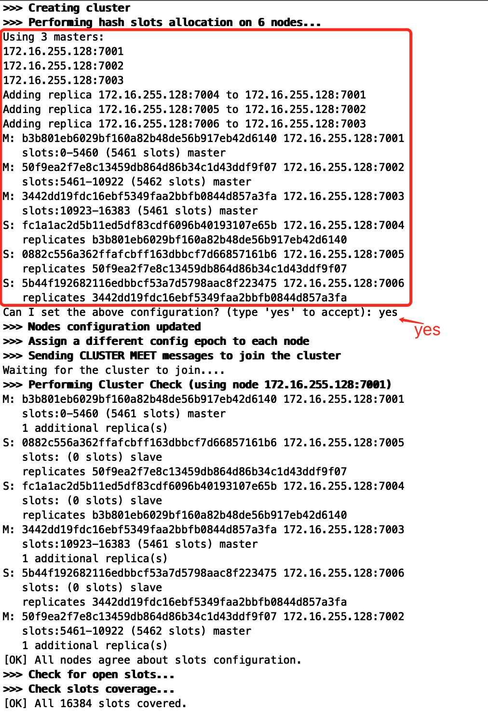

# 1. redis cluster集群

redis cluster是支持N个master，每个master有多个slave读写分离的架构, 同时具备master掉线, slave补上的搞可用性.

# 2. redis cluster集群 vs redis sentinal哨兵

**哨兵模式有个很大的缺陷:  单master节点.** 因此, 哨兵模式适合**数据量很少(单台机器内存能承受的容量)，主要是承载高并发高性能**的场景. 

而redis cluster是多master + 读写分离 + 高可用，主要是针对**海量数据**+高并发+高可用的场景. 约等于支持海量数据的哨兵模式. 


# 3. 数据分布算法

## 3.1 hash 


## 3.2 一致性hash 


## 3.3 redis cluster的hash


# 4. 集群架构部署

## 4.1 机器要求

redis cluster集群最低要求3个master，3个slave

- 至少3个master去组成一个高可用，健壮的分布式的集群，
- 每个master至少给一个slave，

正式环境下，建议在最少6台机器上去搭建.


## 4.2 配置

redis.conf增加配置

```shell
cluster-enabled yes # 开启集群模式

cluster-config-file <filename> # 这是指定一个文件，供cluster模式下的redis实例将集群状态保存在那里由redis自己维护

cluster-node-timeout <milliseconds> # 节点存活超时时长，超过一定时长，认为节点宕机，master宕机的话就会触发主备切换，slave宕机就不会提供服务
```


## 4.3 分别部署6台独立的redis实例

部署6台redis实例. 配置一支,  不区分master/slave.  分配流程由下一步执行.


## 4.4 ruby脚本执行

集群启动脚本由redis目录/src/redis-trib.rb执行, 要求ruby2.3.0+环境. 

```shell
wget https://cache.ruby-lang.org/pub/ruby/2.3/ruby-2.3.1.tar.gz
tar -zxvf ruby-2.3.1.tar.gz
./configure -prefix=/usr/local/ruby
make && make install
cd /usr/local/ruby
cp bin/ruby /usr/local/bin
cp bin/gem /usr/local/bin

wget http://rubygems.org/downloads/redis-3.3.0.gem
gem install -l ./redis-3.3.0.gem

# 最后复制redis-trib.rb
cp /usr/local/redis-3.2.8/src/redis-trib.rb /usr/local/bin
```

创建集群. 

6台机器(3个master+3个slave)，redis-trib.rb会尽量让master和slave不在一台机器上. 

```shell
redis-trib.rb create --replicas <replica-num> redis_ip1:port1 redis_ip2:port2 redis_ip3:port3 redis_ip4:port4 redis_ip5:port5 redis_ip6:port6

# --replicas <replica-num> 指定每个master有几个slave, 3+3模式则replica-num=1
# 后面把6台redis实例以ip:port的格式, 以空格隔开.
```

完后会显示一下信息, 是脚本自动选配的3+3配置, 寻求同意. 需要输入yes. 




# 5. 集群架构的问题

redis cluster默认是不支持slave node读或者写的, slave node的用途是做数据的热备，还有master故障时的主备切换, 以实现高可用.

要读slave, 需要手动连上slave node，执行`readonly`，这个时候才能在slave node进行get指令读取数据.

另外目前`Jedis`对cluster的读写分离支持不太好(自己修改源码),  默认的话就是读和写都到master上去执行.

但是, 换个角度来说, **redis cluster被设计的时候可能就没有所谓的读写分离的概念了. 本身master就是可以任意扩展的. 如果要支撑更大的读吞吐量，或者写吞吐量，或者数据量，都可以直接对master进行横向扩展就可以了.**


# 6. redis cluster管理工具redis-trib.rb指令

`redis-trib.rb help`有说明


# 7. `cluster`指令

redis-cli登录时候, 加上-c参数(cluster模式), 会自动执行重定向操作, 否则若根据key计算出的slot不是当前连接的master, 会返回一个MOVE指令.

```shell
[root@localhost local]# redis-cli -h 172.16.255.128 -p 7001
172.16.255.128:7001> get key1
(error) MOVED 9189 172.16.255.128:7002
172.16.255.128:7001> exit
# 加-c参数
[root@localhost local]# redis-cli -c -h 172.16.255.128 -p 7001
172.16.255.128:7001> get key1
-> Redirected to slot [9189] located at 172.16.255.128:7002
(nil)
172.16.255.128:7002> 
```

- cluster info, 查看集群信息

```shell
cluster_state:ok
cluster_slots_assigned:16384
cluster_slots_ok:16384
cluster_slots_pfail:0
cluster_slots_fail:0
cluster_known_nodes:6
cluster_size:3
cluster_current_epoch:8
cluster_my_epoch:8
cluster_stats_messages_sent:392
cluster_stats_messages_received:392
```

- cluster nodes,  看集群节点信息

```shell
b3b801eb6029bf160a82b48de56b917eb42d6140 172.16.255.128:7001 master - 0 1621190220535 1 connected 0-5460
50f9ea2f7e8c13459db864d86b34c1d43ddf9f07 172.16.255.128:7002 myself,master - 0 0 2 connected 5461-10922
3442dd19fdc16ebf5349faa2bbfb0844d857a3fa 172.16.255.128:7003 master - 0 1621190222553 3 connected 10923-16383
fc1a1ac2d5b11ed5df83cdf6096b40193107e65b 172.16.255.128:7004 slave b3b801eb6029bf160a82b48de56b917eb42d6140 0 1621190223562 4 connected
5b44f192682116edbbcf53a7d5798aac8f223475 172.16.255.128:7006 slave 3442dd19fdc16ebf5349faa2bbfb0844d857a3fa 0 1621190221545 3 connected
0882c556a362ffafcbff163dbbcf7d66857161b6 172.16.255.128:7005 slave 50f9ea2f7e8c13459db864d86b34c1d43ddf9f07 0 1621190224064 2 connected
```

等等....