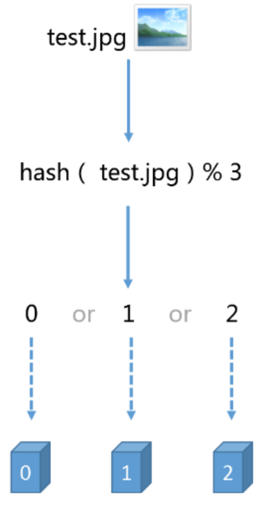
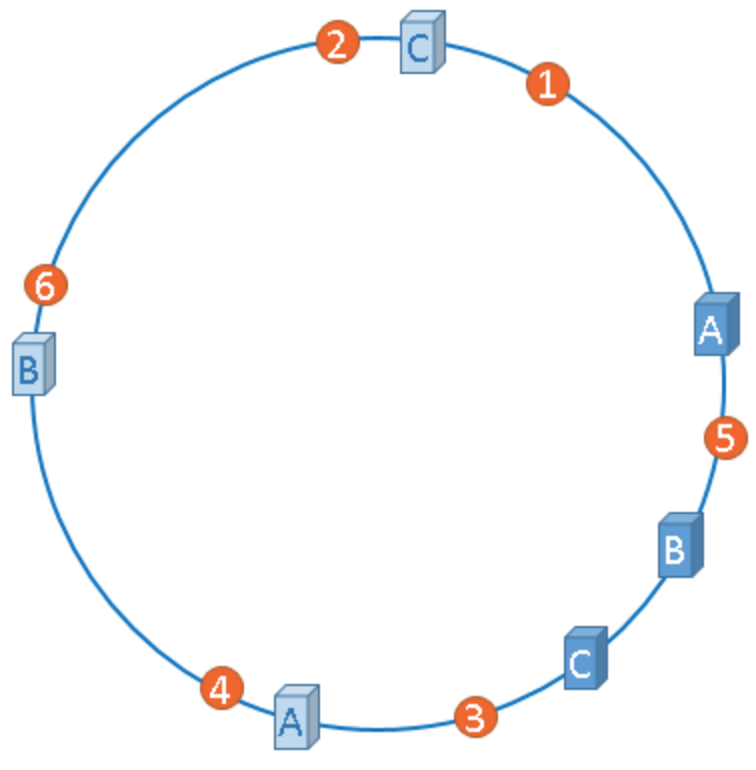
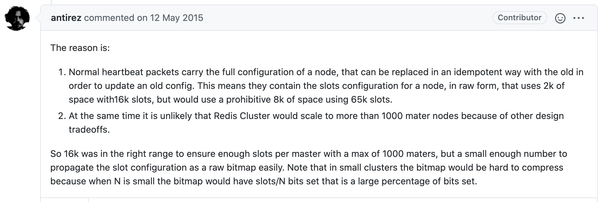

# 1. redis cluster集群

redis cluster是支持N个master，每个master有多个slave读写分离的架构, 同时具备master掉线, slave补上的搞可用性.

# 2. redis cluster集群 vs redis sentinal哨兵

**哨兵模式有个很大的缺陷:  单master节点.** 因此, 哨兵模式适合**数据量很少(单台机器内存能承受的容量)，主要是承载高并发高性能**的场景. 

而redis cluster是多master + 读写分离 + 高可用，主要是针对**海量数据**+高并发+高可用的场景. 约等于支持海量数据的哨兵模式. 


- cluster支持slave的自动迁移

比如现在是3 master+3 slave,  这时候新增2个slave, 就有部分master挂了两个slave. 这个叫slave冗余.

**多挂一些冗余slave冗余, 可以使得集群高可用性更强**.  当一个master的slave死了, 冗余的slave会自动迁移过去补充. 避免了slave死了, master也死了后没有备用slave顶上从而造成集群不高可用的场景. 


# 3. 数据分布算法

## 3.1 普通hash 



缺点: 当缓存服务器数量发生变化时，会引起缓存的雪崩，可能会引起整体系统压力过大而崩溃（大量缓存同一时间失效）。


## 3.2 一致性hash 

一致性hash算法（自动缓存迁移）, 配合虚拟节点, 能使缓存更加均匀的分布在各个服务器上. 

一致性哈希算法是对2^32取模. 由2的32次方个点组成的圆环称为hash环. 





## 3.3 redis cluster的hash

hash算法：`HASH_SLOT=CRC16(key) mod 16383`

对每个key值计算CRC16值，然后对16383取模，这样来获取key对应的hash slot。


redis cluster设定了16384(2^14)个hash slot，这16384个slot会均匀分配到各个master上面. 

增加一个master，就将其他master的hash slot移动分摊过去. 而减少一个master，就将它的hash slot移动到其他master. 


**设定16384个槽位的原因:**

作者在2015年5月在相关的 [issue#2576](https://github.com/antirez/redis/issues/2576) 上回答了



```
原因是：
1. 正常的心跳包会携带着节点的完整配置，通过使用与旧的配置信息幂等的配置来更新旧配置。 这意味着它们需要包含原始形式的节点的插槽配置信息，使用16384个slots的话将会占用2k的空间，但是如果使用65536个slots的话将会占用8k空间。
2. 同时，由于其他设计权衡，RedisCluster不太可能扩展到超过1000个Master节点。
```


# 4. redis cluster的核心原理

## 4.1 节点间的内部通信机制

集群维护元数据的方式有两种: **集中式**与**非集中式**

- 集中式: zookeeper这种, 把元数据都集中存储在一个地方.
  - 优点: 元数据的更新和读取，时效性高
  - 缺点: 所有的元数据的更新, 存储压力全部集中在一个地方
- 非集中式: 即去中心化, 节点各自维护元数据, 并且互相之间不断通信，保持整个集群所有节点的数据是完整的.
  - 优点: 更新, 存储压力分散
  - 缺点: 元数据更新有延时, 可能导致集群的一些操作会滞后


redis cluster节点间采取gossip协议进行通信, 内部通信端口是服务器对外端口+10000. 


### 4.1.1 gossip协议

**Gossip协议消息通常需要一段时间才能传播至整个集群**

> redis内部通信有5中消息: ping，pong，meet，fail,  publish


**其中ping，pong，meet是通过gossip协议来发送,  fail消息由于要求高时效性, 是直接发送而不是通过Gossip协议发送**

- meet: 某个节点发送meet给新加入的节点，让新节点加入集群中，然后新节点就会开始与其他节点进行通信. `redis-trib.rb add-node`内部就是发送了一个gossip meet消息，给新加入的节点，通知那个节点去加入我们的集群

- ping: 每个节点都会频繁给其他节点发送ping，其中包含自己的状态还有自己维护的集群元数据，互相通过ping交换元数据.  每个节点每秒都会频繁发送ping给其他的集群，ping，频繁的互相之间交换数据，互相进行元数据的更新

- pong: 返回ping和meet，包含自己的状态和其他信息，也可以用于信息广播和更新. 

- fail: 某个节点判断另一个节点fail之后，就发送fail给其他节点，通知其他节点.
- publish: 客户端向集群中的某个节点发送publish消息，接收到PUBLISH命令的节点不仅会向channel频道发送消息消息内容，它还会向集群广播一条PUBLISH消息，所有接收到这条PUBLISH消息的节点都会向channel频道发送消息内容.  即客户端通过向某一个节点发送publish消息, 将导致集群中的所有节点都向channel频道发送消息内容.  
  - **客户端不直接广播消息的原因: Redis集群的“各个节点通过发送和接收消息来进行通信”这一规则**.


## 4.2 面向集群的jedis cluster api内部实现原理

由于slot分布式的原因,  客户但查询key的时候可能会得到一个MOVE指令, 需要执行重定向操作. 而大量这种情况的发生, 会使得基于重定向的客户端会消耗大量网络IO, 因此jedis cluster本地维护一份hashslot -> node的缓存映射表. 映射表维护起来后, 大多情况下就不需要通过MOVE来重定向. 


1) 在JedisCluster初始化的时候，就会随机选择一个node，初始化hashslot -> node映射表，同时为每个节点创建一个JedisPool连接池. 

2) 每次基于JedisCluster执行操作，首先JedisCluster都会在本地计算key的hashslot，然后在本地映射表找到对应的节点. 如果那个node正好还是持有那个hashslot，那么就ok; 如果说进行了reshard这样的操作，可能hashslot已经不在那个node上了，就会返回moved. 

3) 如果JedisCluter API发现对应的节点返回`moved`，那么利用该节点的元数据，更新本地的hashslot -> node映射表缓存.

4) 如果hash到的slot正在迁移, 则会收到`ask`指令, jedisCluster就不会更新本地映射表缓存.

 4) 重复上面几个步骤直到找到对应的节点，重试超过5次就抛`JedisClusterMaxRedirectionException`.


## 4.3 高可用性与主备切换原理

redis cluster的高可用的原理几乎跟哨兵是类似的. 


# 5. 集群架构部署

## 5.1 机器要求

redis cluster集群最低要求3个master，3个slave

- 至少3个master去组成一个高可用，健壮的分布式的集群，
- 每个master至少给一个slave，

正式环境下，建议在最少6台机器上去搭建.


## 5.2 配置

redis.conf增加配置

```shell
cluster-enabled yes # 开启集群模式

cluster-config-file <filename> # 这是指定一个文件，供cluster模式下的redis实例将集群状态保存在那里由redis自己维护

cluster-node-timeout <milliseconds> # 节点存活超时时长，超过一定时长，认为节点宕机，master宕机的话就会触发主备切换，slave宕机就不会提供服务
```


## 5.3 分别部署6台独立的redis实例

部署6台redis实例. 配置一支,  不区分master/slave.  分配流程由下一步执行.


## 5.4 ruby脚本执行

集群启动脚本由redis目录/src/redis-trib.rb执行, 要求ruby2.3.0+环境. 

```shell
wget https://cache.ruby-lang.org/pub/ruby/2.3/ruby-2.3.1.tar.gz
tar -zxvf ruby-2.3.1.tar.gz
./configure -prefix=/usr/local/ruby
make && make install
cd /usr/local/ruby
cp bin/ruby /usr/local/bin
cp bin/gem /usr/local/bin

wget http://rubygems.org/downloads/redis-3.3.0.gem
gem install -l ./redis-3.3.0.gem

# 最后复制redis-trib.rb
cp /usr/local/redis-3.2.8/src/redis-trib.rb /usr/local/bin
```

创建集群. 

6台机器(3个master+3个slave)，redis-trib.rb会尽量让master和slave不在一台机器上. 

```shell
redis-trib.rb create --replicas <replica-num> redis_ip1:port1 redis_ip2:port2 redis_ip3:port3 redis_ip4:port4 redis_ip5:port5 redis_ip6:port6

# --replicas <replica-num> 指定每个master有几个slave, 3+3模式则replica-num=1
# 后面把6台redis实例以ip:port的格式, 以空格隔开.
```

完后会显示一下信息, 是脚本自动选配的3+3配置, 寻求同意. 需要输入yes. 


# 6. 集群架构的问题

redis cluster默认是不支持slave node读或者写的, slave node的用途是做数据的热备，还有master故障时的主备切换, 以实现高可用.

要读slave, 需要手动连上slave node，执行`readonly`，这个时候才能在slave node进行get指令读取数据.

另外目前`Jedis`对cluster的读写分离支持不太好(自己修改源码),  默认的话就是读和写都到master上去执行.

但是, 换个角度来说, **redis cluster被设计的时候可能就没有所谓的读写分离的概念了. 本身master就是可以任意扩展的. 如果要支撑更大的读吞吐量，或者写吞吐量，或者数据量，都可以直接对master进行横向扩展就可以了.**


# 7. redis cluster管理工具redis-trib.rb指令

redis-trib.rb还有新增节点, 删除节点等维护功能. 

看`redis-trib.rb help`, 有详细参数说明.


## 7.1 新增一台master

```shell
# 集群加入一个节点, 会自动分配为master
redis-trib.rb add-node <新master ip>:<port> <集群中随便一个节点ip>:<port>
# 需要reshare分配slot给新master, 之后根据执行输入要分配的slot数量以及slot来源
redis-trib.rb reshard <集群中随便一个节点ip>:<port>
```


## 7.2 新增一台slave

`redis-trib.rb add-node --slave --master-id <新slave所属master的id> <新slave ip>:<port> <集群中随便一个节点ip>:<port>`


## 7.3 reshard重新分配slot

- 在新增master后需要执行`reshard`给新mater分配slot.

- 再删除master之前, 也需要把slot迁移`reshard`到别的节点, 通过`check`检查确保没有slot后再`del-node`

`redis-trib.rb reshard <集群中随便一个节点ip>:<port>`

 需要计算好要迁移的slot, 防止总slot数量少于16384.


# 8. `cluster`指令

redis-cli登录时候, 加上-c参数(cluster模式), 会自动执行重定向操作, 否则若根据key计算出的slot不是当前连接的master, 会返回一个MOVE指令.

```shell
[root@localhost local]# redis-cli -h 172.17.255.128 -p 7001
172.17.255.128:7001> get key1
(error) MOVED 9189 172.17.255.128:7002
172.17.255.128:7001> exit
# 加-c参数
[root@localhost local]# redis-cli -c -h 172.17.255.128 -p 7001
172.17.255.128:7001> get key1
-> Redirected to slot [9189] located at 172.17.255.128:7002
(nil)
172.17.255.128:7002> 
```

- cluster info, 查看集群信息

```shell
cluster_state:ok
cluster_slots_assigned:16384
cluster_slots_ok:16384
cluster_slots_pfail:0
cluster_slots_fail:0
cluster_known_nodes:6
cluster_size:3
cluster_current_epoch:8
cluster_my_epoch:8
cluster_stats_messages_sent:392
cluster_stats_messages_received:392
```

- cluster nodes,  看集群节点信息

```shell
b3b801eb6029bf160a82b48de56b917eb42d6140 172.17.255.128:7001 master - 0 1621190220535 1 connected 0-5460
50f9ea2f7e8c13459db864d86b34c1d43ddf9f07 172.17.255.128:7002 myself,master - 0 0 2 connected 5461-10922
3442dd19fdc16ebf5349faa2bbfb0844d857a3fa 172.17.255.128:7003 master - 0 1621190222553 3 connected 10923-16383
fc1a1ac2d5b11ed5df83cdf6096b40193107e65b 172.17.255.128:7004 slave b3b801eb6029bf160a82b48de56b917eb42d6140 0 1621190223562 4 connected
5b44f192682116edbbcf53a7d5798aac8f223475 172.17.255.128:7006 slave 3442dd19fdc16ebf5349faa2bbfb0844d857a3fa 0 1621190221545 3 connected
0882c556a362ffafcbff163dbbcf7d66857161b6 172.17.255.128:7005 slave 50f9ea2f7e8c13459db864d86b34c1d43ddf9f07 0 1621190224064 2 connected
```

- cluster keyslot <key_name>, 查看<key_name>对应的slot是哪个

等等....