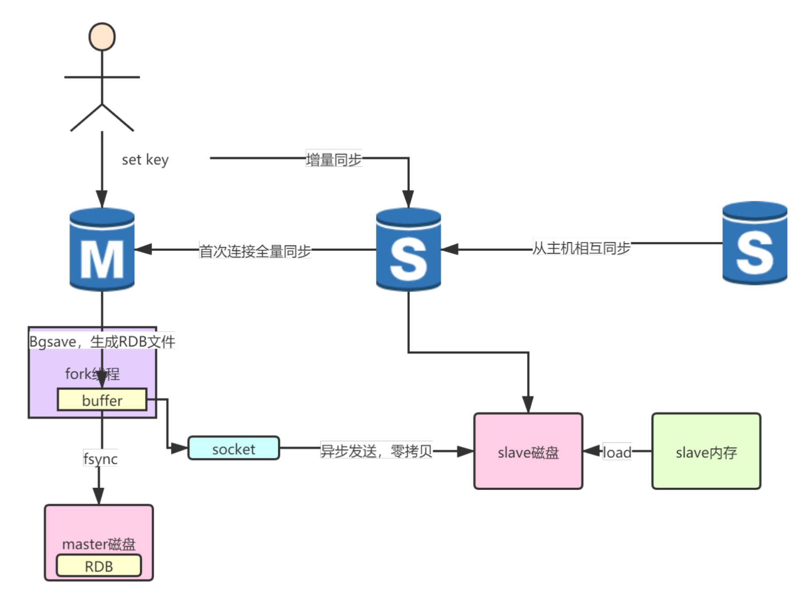
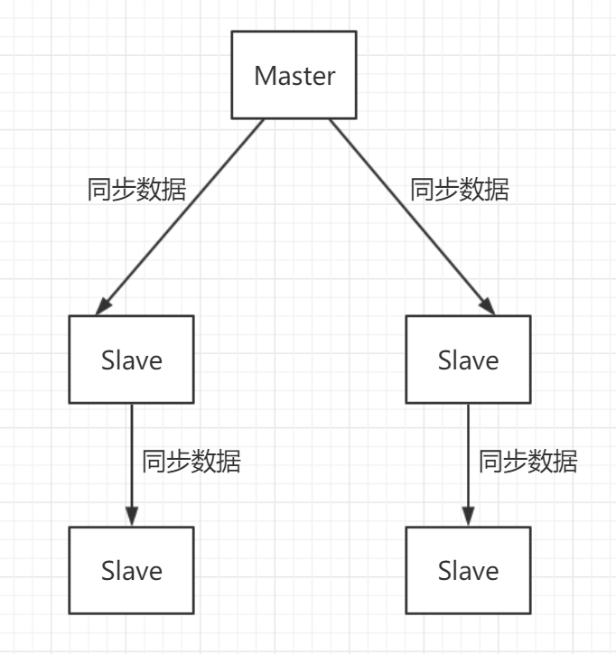

# 1. redis replication的完整流程

（1）slave node启动，仅仅保存master node的信息，包括master node的host和ip，但是复制流程没开始. 

（2）slave node内部有个定时任务，每秒检查是否有新的master node要连接和复制，如果发现，就跟master node建立socket网络连接

（3）slave node发送ping命令给master node

（4）口令认证，如果master设置了requirepass，那么salve node必须发送masterauth的口令过去进行认证

（5）master node第一次执行全量复制，将所有数据发给slave node

（6）master node后续持续将写命令，异步复制给slave node





# 2. redis replication的核心原理

​		当启动一个slave node的时候，它会发送一个PSYNC命令给master node

- 如果这是slave node重新连接master node，那么master node仅仅会复制给slave部分缺少的数据; 

- 如果是slave node第一次连接master node，那么会触发一次full resynchronization. 

​		开始full resynchronization的时候，master会启动一个后台线程，开始生成一份RDB快照文件，同时还会将从客户端收到的所有写命令缓存在内存中。

​		RDB文件生成完毕之后，master会将这个RDB发送给slave，slave会先写入本地磁盘，然后再从本地磁盘加载到内存中。然后master会将内存中缓存的写命令发送给slave，slave也会同步这些数据。

​		slave node如果跟master node发生断开重连。master如果发现有多个slave node都来重新连接，仅仅会启动一个rdb save操作，用一份数据服务所有slave node。


- master和slave都会维护一个offset 

​		master会在自身不断累加offset，slave也会在自身不断累加offset. slave每秒都会上报自己的offset给master，同时master也会保存每个slave的offset.

这个倒不是说特定就用在全量复制的，主要是master和slave都要知道各自的数据的offset，才能知道互相之间的数据不一致的情况

- backlog 

master node有一个backlog，默认是1MB大小. master node给slave node复制数据时，也会将数据在backlog中同步写一份. backlog主要是用来做全量复制中断候的增量复制的

- master run id

`info server`命令可以看到master run id. 

run id是40位字符组成,是一个随机的十六进制字符. 

根据host+ip定位master node，是不靠谱的，如果master node重启或者数据出现了变化，那么slave node应该根据不同的run id区分，run id不同就做全量复制

如果需要不更改run id重启redis，可以使用redis-cli debug reload命令

- psync

slave node使用psync从master node进行复制，`psync runid offset`.

master node会根据自身的情况返回响应信息，可能是FULLRESYNC runid offset触发全量复制，可能是CONTINUE触发增量复制.

- heartbeat

主从节点互相都会发送heartbeat信息. master默认每隔10秒发送一次heartbeat，salve node每隔1秒(`repl-ping-slave-period 10`)发送一个heartbeat. 

- 异步复制

master每次接收到写命令之后，现在内部写入数据，然后异步发送给slave node. 


# 4. 全量复制

（1）master执行bgsave，在本地生成一份rdb快照文件

（2）master node将rdb快照文件发送给salve node，如果rdb复制时间超过60秒（`repl-timeout`），那么slave node就会认为复制失败，可以适当调节大这个参数. 对于千兆网卡的机器，一般每秒传输100MB，6G文件，很可能超过60s

（4）master node在生成rdb时，会将所有新的写命令缓存在内存中，在salve node保存了rdb之后，再将新的写命令复制给salve node

（5）`client-output-buffer-limit slave 256MB 64MB 60`，如果在复制期间，内存缓冲区持续消耗超过64MB，或者一次性超过256MB，那么停止复制，复制失败. 

（6）slave node接收到rdb之后，清空自己的旧数据，然后重新加载rdb到自己的内存中，同时基于旧的数据版本对外提供服务

（7）如果slave node开启了AOF，那么会立即执行BGREWRITEAOF，重写AOF

（8）rdb生成、rdb通过网络拷贝、slave旧数据的清理、slave aof rewrite，过程很耗费时间. 

如果复制的数据量在4G~6G之间，那么很可能全量复制时间消耗到1分半到2分钟

 

# 5. 增量复制

（1）如果全量复制过程中，master-slave网络连接断掉，那么salve重新连接master时，会触发增量复制

（2）master直接从自己的backlog中获取部分丢失的数据，发送给slave node，默认backlog就是1MB

（3）msater就是根据slave发送的psync中的offset来从backlog中获取数据的


# 3. 主从架构的特性

- 主从复制的断点续传

从redis 2.8开始，就支持主从复制的断点续传，如果主从复制过程中，网络连接断掉了，那么可以接着上次复制的地方，继续复制下去，而不是从头开始复制一份. 

master node会在内存中常见一个`backlog`，master和slave都会保存一个`replica offset`还有一个`master id`，offset就是保存在backlog中的。如果master和slave网络连接断掉了，slave会让master从上次的replica offset开始继续复制. 

但是如果没有找到对应的offset，那么就是slave node就是新节点, 会执行一次full resynchronization.

 

- 无磁盘化复制

master在内存中直接创建rdb，然后发送给slave，会在自己本地落地磁盘了. 见配置 

```
repl-diskless-sync no  # 默认关闭不落盘同步, 即master的dump.rdb会先落盘.

repl-diskless-sync-delay 5，# 默认5s后再开始复制，因为好不容易生成一个rdb文件, 可能有更多slave重新连接过来, 用一份数据服务所有slave node. 传输开始的时候是不会接受新slave的请求.
```

 

- 过期key处理

slave不会过期key，如果master过期了一个key，或者通过LRU淘汰了一个key，那么会模拟一条del命令发送给slave。


# 6. 主从架构实现读写分离

通过主从架构来实现, 读写分离.   可以轻松支持超过10WQPS.  



主节点负责写操作, 从节点负责读操作. 

- 优点:  这种架构支持水平扩展.  适合读多写少的场景.  一台单机redis支持假设是5W QPS, 那么两个节点就能支持10W QPS.  需要跟多读QPS, 增加从redis即可.
- 缺点: 单master节点, master是瓶颈. 写QPS无法提升. 仅仅适合写少的场景. 


# 7. master持久化对于主从架构的安全保障的意义

采用了主从架构，那么建议必须开启master node的持久化！

不建议用slave node作为master node的数据热备，因为那样的话，如果你关掉master的持久化，可能在master宕机重启的时候数据是空的，master就会将空的数据集同步到slave上去，所有slave的数据全部清空. 


# 8. 主从架构搭建

1. `bind ${本机ip}`.  绑定了ip, 程序可以通过ip来访问.  默认`bind 127.0.01`, 只能通过127.0.0.1来访问. 局域网其他机器访问不到. 

2. 在slave node上配置：`slaveof ${master ip} ${master port}`，也可以客户端中执行`slaveof`命令.

3. 强制读写分离,  slave node只读，`slave-read-only yes`, 默认开启.  开启了只读的redis slave node，会拒绝所有的写操作，强制搭建成读写分离的架构. 

4. 集群安全认证. master上启用安全认证，`requirepass xxx`, slave配置连接master口令，`masterauth xxx`
5. 先启动master, 再启动slave. 
6. 命令`info replication`可以看到同步的相关信息


# 9. 基准的压测

redis自带基准测试命令

 `./redis-benchmark -h ${ip} -p ${port} -a ${密码} `, 执行完会出压测报告

```shell
 -c <clients>       Number of parallel connections (default 50)
 -n <requests>      Total number of requests (default 100000)
 -d <size>          Data size of SET/GET value in bytes (default 2)
```


> QPS杀手: 1.  复杂redis操作, 2. 大value