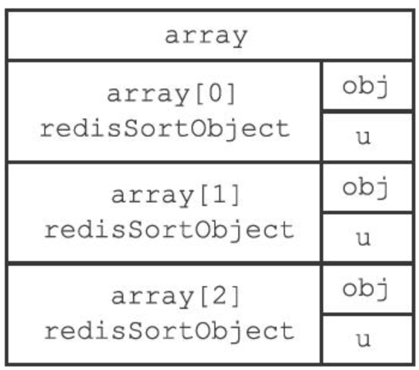

# 1. 事务

Redis通过`MULTI、EXEC、WATCH`等命令来实现事务（transaction）功能。

Redis事务提供了一种将多个命令请求打包，然后一次性、按顺序地执行多个命令的机制，并且在事务执行期间，服务器不会中断事务而改去执行其他客户端的命令请求，它会将事务中的所有命令都执行完毕，然后才去处理其他客户端的命令请求。

## 1.1 事务的过程

一个事务从开始到结束通常会经历以下三个阶段：

1）事务开始

-  `MULTI`命令的执行标志着事务的开始. 
- `MULTI`命令把客户端状态的flags属性设置为`REDIS_MULTI`来标识客户端从非事务状态**切换至事务状态**

2）命令入队, 

- 非事务状态下, 客户端的命令都会立刻执行
- 事务状态下, 除了`EXEC、DISCARD、WATCH、MULTI`外的其他命令, 都会放入事务命令队列, redis server返回`QUEUED`. 

3）事务执行/取消, 

- `EXEC`命令执行事务, 服务器会遍历事务队列并顺序执行所有命令, 将所有结果返回给客户端.

-  `DISCARD`命令取消事务. 所有事务队列的命令都无效. 


## 1.2 WATCH命令

`WATCH`命令是一个**乐观锁**（optimistic locking），在`MULTI`命令之前执行`WATCH`命令监视任意数量的键，并在`EXEC`命令执行时，检查被监视的键是否至少有一个已经被修改过了，如果是的话，服务器将拒绝执行事务，并向客户端返回`nil`表示**代表事务执行失败**。


### 1.2.1 用法:

```shell
# 先监听键
redis> WATCH "key1" "key2" "key3"
OK
# 开启事务, 
# 事务开启后, 别的redis客户端修改了其中一个key
redis> MULTI  
OK
# 指令入队
redis> SET "name" "peter"
QUEUED
# 执行事务
redis> EXEC
# 被监听的key中至少一个被修改了, redis拒绝执行事务, 并返回nil
(nil)
```


### 1.2.2 实现

每个Redis数据库都保存着一个`watched_keys`字典

```c
typedef struct redisDb {
  // ...
  // 正在被WATCH命令监视的键, 字典节点的key是被监听的key值, value是监听此key的客户端链表.
  dict *watched_keys;
  // ...
} redisDb;
```


server对被监听的key执行了修改指令后, 调用`multi.c/touchWatchKey`函数对watched_keys字典进行检查，

1. 查看是否有客户端正在监视刚刚被修改的键，有则客户端的`REDIS_DIRTY_CAS`标识打开，表示该客户端的事务安全性已经被破坏。
2. 客户端向服务器发送exec命令时, 服务器会检测客户端的`REDIS_DIRTY_CAS`表示, 被打开了则拒绝执行事务. 


# 2.  LUA脚本

**通过在服务器中嵌入Lua环境，Redis客户端可以使用Lua脚本，直接在服务器端原子地执行多个Redis命令。**


# 3. 排序

Redis的`SORT`命令可以对**列表键、集合键或者有序集合键**的值进行排序, 并返回排序结果。


SORT命令的最简用法格式:

`SORT <KEY> `

SROT命令的完整格式

```shell
SORT <KEY> [BY pattern] [LIMIT offset count] [GET pattern [GET pattern ...]] [ASC|DESC] [ALPHA] [STORE destination]
```

SORT <KEY>后面的选项都是可选的. 


## 3.1 SORT命令的实现 

```c
// redis.h/redisSortObject
typedef struct _redisSortObject {
    // 被排序键的值
    robj *obj;
    // 权重
    union {
        // 排序数字值时使用
        double score;
        // 排序带有BY选项的字符串值时使用
        robj *cmpobj;
    } u;
} redisSortObject;
```


eg: 假设要对numbers排序

```shell
redis> RPUSH numbers 3 1 2
(integer) 3
redis> SORT numbers
1) "1"
2) "2"
3) "3"
```

服务器执行`SORT numbers`命令的详细步骤如下：

1）创建一个和numbers列表长度相同的`redisSortObject`数组



2）遍历数组，将各个数组项的obj指针分别指向numbers列表的各个项，构成obj指针和列表项之间的一对一关系。


3）遍历数组，将各个obj指针所指向的**列表项转换成一个double类型的浮点数**，并将这个浮点数保存在相应数组项的u.score属性里面。


4）根据数组项u.score属性的值，对数组进行数字值排序，排序后的数组项按u.score属性的值从小到大排列。


5）遍历`redisSortObject`数组，从**索引0**开始将各个项的`obj`属性所指向的列表项作为排序结果返回给客户端. 


## 3.2 选项


### 3.2.1 ALPHA选项

SORT命令会把被排序的列表/集合的元素转成double类型再进行排序, 处理不了元素是字符串的列表/集合.

而使用ALPHA选项，SORT命令可以对包含**字符串值的键**进行排序


### 3.2.2 ASC|DESC 选项

默认情况下, 是用升序排序

`SORT <KEY>`  等效  `SORT <KEY> ASC`

而选项`DESC`是降序排序

`SORT <key> DESC`


### 3.2.3 BY pattern 选项

在默认情况下，`SORT`命令使用被排序键包含的元素作为排序的权重. 

而BY选项, 可以指定某些字符串键，或者某个哈希键所包含的某些域（field）来作为元素的权重，对一个键进行排序。

例如: 

```shell
redis> SADD fruits "apple" "banana" "cherry"
(integer) 3
# 设置多个键值对
redis> MSET apple-price 8 cherry-price 7
OK
# BY选线可以对fruits的元素, 以"*-price"格式匹配到的键的值作为权重排序, 若匹配不到则权重是0
# "apple"元素匹配"apple-price"键, 值8作为排序权重
# "cherry"元素匹配"cherry-price"键, 值7作为排序权重
# "banana"元素匹配"banana-price"键, 匹配不到, 则权重是0
redis> SORT fruits BY *-price
1) "banana"
2) "cherry"
3) "apple"
redis> SORT fruits BY *-price DESC
1) "apple"
2) "cherry"
3) "banana"
```


### 3.2.4 BY + ALPHA选项

BY选项默认假设权重键保存的值为数字值，如果权重键保存的是字符串值的话，那么就需要在使用BY选项的同时，配合使用ALPHA选项。


### 3.2.5 LIMIT选项

LIMIT选项，让SORT命令只返回其中一部分已排序的元素。

LIMIT选项的格式为LIMIT<offset><count>：

- offset参数表示要跳过的已排序元素数量。

- count参数表示跳过给定数量的已排序元素之后，要返回的已排序元素数量。


### 3.2.6 GET选项

使用GET选项，我们可以让SORT命令在对键进行排序之后，根据被排序的元素，以及**GET选项所指定的模式，查找并返回某些键的值**。

```shell
redis> SADD students "peter" "jack" "tom"
(integer) 3
# 设置peter、jack、tom的全名
redis> SET peter-name "Peter White"
OK
redis> SET jack-name "Jack Snow"
OK
redis> SET tom-name "Tom Smith"
OK
# SORT命令首先对students集合进行排序，得到排序结果
# 1) "jack"
# 2) "peter"
# 3) "tom"
# 然后根据这些结果，获取并返回键jack-name、peter-name和tom-name的值
redis> SORT students ALPHA GET *-name
1) "Jack Snow"
2) "Peter White"
3) "Tom Smith"
```

**可以说, `GET`选项是`BY`选项的反方向.** 


### 3.2.7 STORE选项

STORE选项，我们可以将排序结果**保存在指定的键里面**，并在有需要时重用这个排序结果：

```shell
redis> SADD students "peter" "jack" "tom"
(integer) 3
# 把排序后的元素保存到sorted_students
#   1. 若sorted_students存在则删除, 否则创建
#   2. 相当于执行命令RPUSH sorted_students"jack"、"peter"、"tom"
redis> SORT students ALPHA STORE sorted_students
(integer) 3
redis> LRANGE sorted_students 0 -1
1) "jack"
2) "peter"
3) "tom"
```


### 3.2.8 多个选项的执行顺序

SROT命令的完整格式

```shell
SORT <KEY> [BY pattern] [LIMIT offset count] [GET pattern [GET pattern ...]] [ASC|DESC] [ALPHA] [STORE destination]
```

当多个选线存在时候,  `SORT`命令根据选项的功能,  按照以下顺序执行, 最后给客户端返回结果: 

1）**排序**功能：在这一步，命令会使用ALPHA、ASC或DESC、BY这几个选项, 这里称为`排序区`。

2）**限制排序结果集的长度**功能：LIMIT选项, 这里称为`LIMIT区`。

3）**获取外部键**功能：GET选项, 这里称为`GET区`。

4）**保存排序结果集**功能：STORE选项, 这里称为`STORE区`。


这四个选项区的顺序, 不影响输出.  即 排序区放后面,  store区在前面, 并不影响输出结果. 

但是,  `GET区`内存存在多个GET选项, 那么GET选项之间的顺序就会对结果有影响了.

```shell
# 多个GET选项的顺序, 会输出结果可能不一样.
SORT <key> STORE <store_key> GET <pattern-b> GET <pattern-a>
SORT <key> STORE <store_key> GET <pattern-b> GET <pattern-b>
```

 

# 4. 二进制位数据|位图

Redis提供了`SETBIT、GETBIT、BITCOUNT、BITOP`四个命令用于处理二进制位数组（bit array，又称“位数组”）。

```shell
# 指令
SETBIT <key> offset value  # value 0|1
GETBIT <key> offset
BITCOUNT <key>
# operation: and并, or或, xor异或, not取反
BITOP operation <destkey> <key> [<key> ...]
```


## 4.1 实现

Redis使用字符串SDS对象来表示位数组.

**offset的定位算法:** 

1）计算byte值 = offset÷8，byte值记录了offset指定的二进制位保存在位数组的第几个字节。

2）计算bit=（offset mod 8）+1，bit值记录了offset指定的二进制位是byte字节的第几个位。


**BITCOUNT算法**

BITCOUNT命令的实现用到了查表和variable-precisionSWAR两种算法


# 5. 慢查询

## 5.1 配置

**服务器配置有两个和慢查询日志相关的选项：**

```shell
# 选项指定执行时间超过多少微秒（1秒等于1 000 000微秒）的命令请求会被记录到日志上。
slowlog-log-slower-than 10000
# 最多保存多少条慢查询日志
slowlog-max-len 128
```

### 5.2 使用

```shell
# 查询最近N条慢查询
redis> slowlog get N
# 慢日志列表的当前长度
redis> slowlog len
# 清理
redis> slowlog reset
```


# 6. 监视器

执行`MONITOR`命令，客户端可以将自己变为一个监视器，实时地接收并打印出服务器当前处理的命令请求的相关信息：

```shell
redis> MONITOR
OK
1378822099.421623 [0 127.0.0.1:56604] "PING"
1378822105.089572 [0 127.0.0.1:56604] "SET" "msg" "hello world"
1378822109.036925 [0 127.0.0.1:56604] "SET" "number" "123"
1378822140.649496 [0 127.0.0.1:56604] "SADD" "fruits" "Apple" "Banana" "Cherry"
1378822154.117160 [0 127.0.0.1:56604] "EXPIRE" "msg" "10086"
1378822257.329412 [0 127.0.0.1:56604] "KEYS" "*"
1378822258.690131 [0 127.0.0.1:56604] "DBSIZE"
```


# 7. geohash

# 8. hyperloglog

