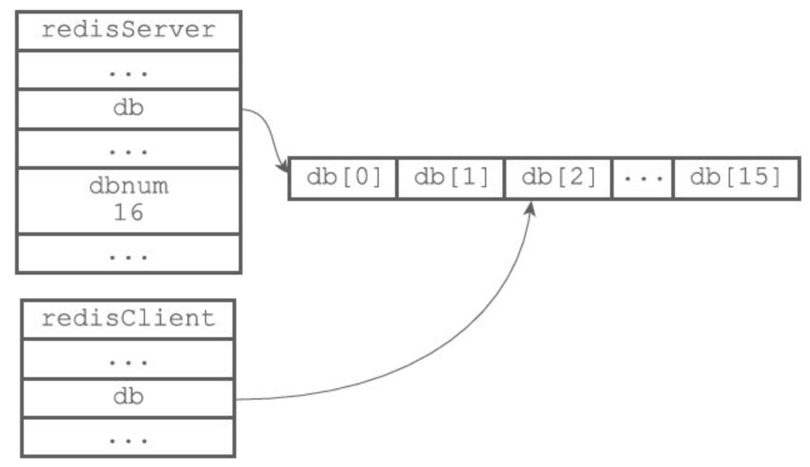
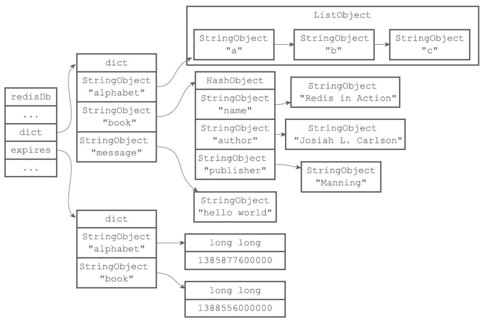

# 1. redis 服务器

```c
struct redisServer {
    // ...
    // 一个数组，保存着服务器中的所有数据库
    redisDb *db;
  	//服务器的数据库数量
    int dbnum;
    // ...
};

typedef struct redisClient {
// ...
// 记录客户端当前正在使用的数据库
redisDb *db;
// ...
} redisClient;
```




# 2. redis数据库

```c
typedef struct redisDb {
    // ...
    // 数据库键空间，保存着数据库中的所有键值对
    dict *dict;
    // 过期字典，保存着所有键的过期时间
    dict *expires;
    // ...
} redisDb;
```



# 3. 过期键

通过过期字典，程序可以用以下步骤检查一个给定键是否过期：

1）检查给定键是否存在于过期字典：如果存在，那么取得键的过期时间。

2）检查当前UNIX时间戳是否大于键的过期时间：如果是的话，那么键已经过期；否则的话，键未过期。


**三种删除策略**：

- 定时删除：在设置键的过期时间的同时，创建一个定时器（timer），让定时器在键的过期时间来临时，立即执行对键的删除操作。

- 惰性删除：放任键过期不管，但是每次从键空间中获取键时，都检查取得的键是否过期，如果过期的话，就删除该键；如果没有过期，就返回该键。

- 定期删除：每隔一段时间，程序就对数据库进行一次检查，删除里面的过期键。至于要删除多少过期键，以及要检查多少个数据库，则由算法决定。

