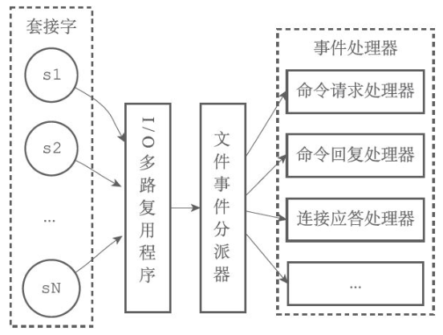
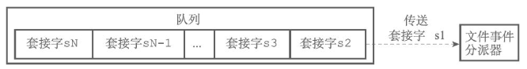
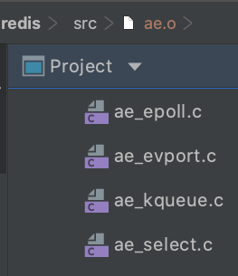
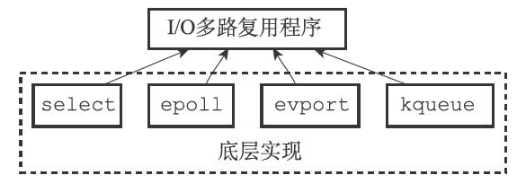
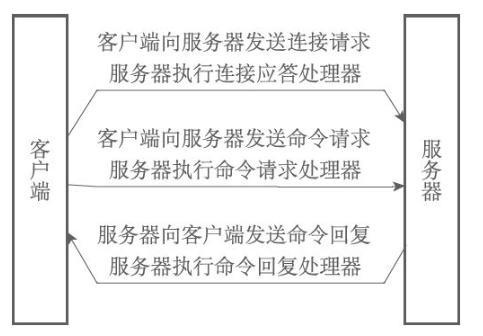

> 参考: <<redis设计与实现>>

Redis服务器是典型的一对多服务器程序, 通过使用由I/O多路复用技术实现的文件事件处理器，Redis服务器使用单线程单进程的方式来处理命令请求，并与多个客户端进行网络通信。

## 单线程模型为何效率高

- 纯内存操作
- 基于非阻塞的IO多路复用机制
- 避免了多线程的频繁上下文切换

# 文件事件处理器

Redis 基于 Reactor 模式开发了自己的网络事件处理器 - **文件事件处理器**（file event handler，后文简称为 `FEH`），而该处理器又是单线程的，所以redis设计为单线程模型。

- 采用**I/O多路复用**同时监听多个socket，根据socket当前执行的事件来为 socket 选择对应的事件处理器。
- 当被监听的socket准备好执行`连接应答（accept）`、`读取（read）`、`写入（write）`、`关闭（close）`等操作时，和操作对应的文件事件就会产生，这时FEH就会调用socket之前关联好的事件处理器来处理对应事件。

所以虽然FEH是单线程运行，但通过I/O多路复用监听多个socket，不仅实现高性能的网络通信模型，又能和 Redis 服务器中其它同样单线程运行的模块交互，保证了Redis内部单线程模型的简洁设计。

文件事件处理器的四个组成部分: **套接字(Socket)**、**I/O多路复用程序**、**文件事件分派器**（dispatcher），以及**事件处理器**。

## 套接字Socket与文件事件

文件事件是对Socket操作的抽象，每当一个Socket准备好执行`连接应答（accept）、写入、读取、关闭`等操作时，就会产生一个文件事件。因为一个服务器通常会连接多个Socket，所以多个文件事件有可能会并发地出现。

## I/O多路复用程序

I/O多路复用程序负责监听多个Socket，并向文件事件分派器传送那些产生了事件的Socket。

尽管多个文件事件可能会并发地出现，但I/O多路复用程序总是会**将所有产生事件的Socket都放到一个队列**里面，然后通过这个队列，以**有序（sequentially）、同步（synchronously）、每次一个Socket**的方式向文件事件分派器传送Socket。**当上一个Socket产生的事件被处理完毕之后（该Socket为事件所关联的事件处理器执行完毕），I/O多路复用程序才会继续向文件事件分派器传送下一个Socket**。即**事件处理是异步的, io是阻塞的**.

I/O多路复用程序的所有功能都是通过包装常见的select、epoll、evport和kqueue这些I/O多路复用函数库来实现的，每个I/O多路复用函数库在Redis源码中都对应一个单独的文件，比如ae_select.c、ae_epoll.c、ae_kqueue.c，诸如此类。

因为Redis为每个I/O多路复用函数库都实现了相同的API，所以I/O多路复用程序的底层实现是可以互换的。

>所有异步I / O子系统都有不同的内部结构，但是在当前特定情况下，这些具体的异步I / O库用于支持尽可能多的平台。那是:
>
>- evport = Solaris 10
>
>- epoll = Linux
>
>- kqueue = OS X，FreeBSD
>
>- select =  作为 POSIX 标准中的系统调用，在不同版本的操作系统上都会实现
>
>`Evport`，`Epoll`和`KQueue`具有 **O(1)**描述符选择算法复杂度，并且它们都使用内部内核空间内存结构。他们还可以提供**很多**(数十万个)文件描述符。
>
>`select`最多只能为**提供最多1024个**描述符，并且对描述符进行完全扫描(因此每次迭代所有描述符以选择一个可使用的描述符)，因此复杂度为 **O(n)**。

如果当前编译环境没有`evport, epoll, kqueue`函数，就会选择 `select` 作为备选方案. 由于其在使用时会扫描全部监听的描述符，所以其时间复杂度较差 O(n)O(n)，并且只能同时服务 1024 个文件描述符，所以一般并不会以 `select` 作为第一方案使用。 

## 文件事件分派器

文件事件分派器接收I/O多路复用程序传来的Socket，并根据Socket产生的事件的类型，调用相应的事件处理器。

## 文件事件的处理器

## 事件类型

I/O 多路复用程序可以监听多个socket的 `ae.h/AE_READABLE` 事件和 `ae.h/AE_WRITABLE` 事件， 这两类事件和Socket操作之间的对应关系如下：

- 当socket可读（比如客户端对Redis执行`write`/`close`操作），或有新的可应答的socket出现时（即客户端对Redis执行`connect`操作），socket就会产生一个`AE_READABLE`事件
- 当socket可写时（比如客户端对Redis执行read操作），socket会产生一个`AE_WRITABLE`事件。

I/O多路复用程序可以同时监听`AE_REABLE`和`AE_WRITABLE`两种事件，要是一个socket同时产生这两种事件，那么文件事件分派器优先处理`AE_REABLE`事件。即**一个socket又可读又可写时， Redis服务器先读后写socket**。

## 事件处理器

服务器会为执行不同任务的Socket关联不同的事件处理器，这些处理器是一个个函数，它们定义了某个事件发生时，服务器应该执行的动作。

- **应答处理器**: 为了对连接服务器的各个客户端进行应答，服务器要为监听Socket关联连接应答处理器。

- **命令请求处理器**: 为了接收客户端传来的命令请求，服务器要为客户端Socket关联命令请求处理器。

- **命令回复处理器**: 为了向客户端返回命令的执行结果，服务器要为客户端Socket关联命令回复处理器。

- **复制处理器**: 当主服务器和从服务器进行复制操作时，主从服务器都需要关联特别为复制功能编写的复制处理器。

**一次完整的客户端与服务器连接事件示例**

假设一个Redis服务器正在运作，那么这个服务器的监听Socket的AE_READABLE事件应该正处于监听状态之下，而该事件所对应的处理器为连接应答处理器。

如果这时有一个Redis客户端向服务器发起连接，那么监听Socket将产生AE_READABLE事件，触发连接应答处理器执行。处理器会对客户端的连接请求进行应答，然后创建客户端Socket，以及客户端状态，并将客户端Socket的AE_READABLE事件与命令请求处理器进行关联，使得客户端可以向主服务器发送命令请求。

之后，假设客户端向主服务器发送一个命令请求，那么客户端Socket将产生AE_READABLE事件，引发命令请求处理器执行，处理器读取客户端的命令内容，然后传给相关程序去执行。

执行命令将产生相应的命令回复，为了将这些命令回复传送回客户端，服务器会将客户端Socket的AE_WRITABLE事件与命令回复处理器进行关联。当客户端尝试读取命令回复的时候，客户端Socket将产生AE_WRITABLE事件，触发命令回复处理器执行，当命令回复处理器将命令回复全部写入到Socket之后，服务器就会解除客户端Socket的AE_WRITABLE事件与命令回复处理器之间的关联。

