# 图解Redission分布式可重入锁锁(Redlock)源码的八大机制


先思考下如下常见的面试题：

1.相同客户端线程是如何实现可重入加锁的？

2.其他线程加锁失败时，底层是如何实现阻塞的？

3.客户端宕机了，锁是如何释放的？

4.客户端如何主动释放持有的锁？

5.客户端尝试获取锁超时的机制在底层是如何实现的？

6.客户端锁超时自动释放机制在底层又是如何实现的？

Redis可重入锁源码的分享，将重点围绕以上6个核心问题一步步展开分析，大家可以心中带着这几个问题一步步看下去，最后形成的完整的流程图如下所示：

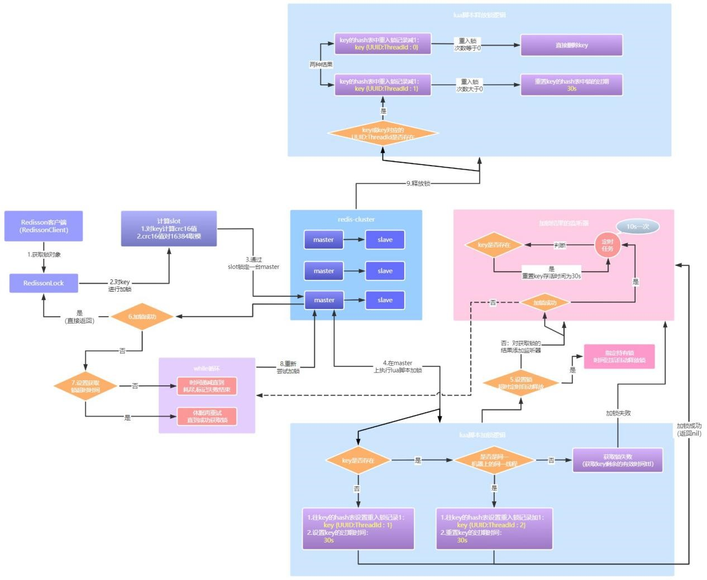

 

记得第一次加锁时，key是不存在的，所以那时我们才能成功将当前线程的信息、设置到key的hash数据结构中，表示当前线程已经加锁成功。

 

但是现在是相同线程再次过来对同一key加锁，那么key已经存在这个条件当然就不成立了，接下来就到下一个if分支。

 

## Redis可重入锁的核心流程----可重入锁的加锁机制---相同线程重复加锁-重入加锁

我们继续看下执行加锁的脚本：

 

下一个if分支逻辑为：

 `hexists anyLock UUID:ThreadId`

 也就是判断当前key是否被当前线程持有，因为是相同的线程再次对同一个key加锁，此时当然能够在key中的hash数据结构中找到记录，所以条件成立，执行如下指令：   

`hincrby KEYS[1] ARGV[2] 1` 即  `hincrby anyLock UUID:ThreadId 1`

 表示对anyLock这个key中的hash数据结构里面的UUID:ThreadId的value增加1

 从：

```
anyLock {
	UUID:ThreadId 1
}
```

 变为：

```
anyLock {
	UUID:ThreadId 2
}
```


然后再对key重置过期时间为30s

 

看到这里还记得我们上文留的一个悬念吗，也就是key的hash数据结构中，UUID:ThreadId对应的1到底是什么意思呢？其实就是线程对key加锁的次数；当一个线程第一次过来加锁，线程当然就只是加了一次锁而已，所以对应key中的UUID:ThreadId对应的value值当然就是1；那现在我们看到线程第二次过来对同一个key加锁，那当然就是对应2了，表示当前线程对这个key加了两次锁了，这就是重入加锁。


然后重入锁加成功之后，当然也是后台开启一个watchdog后台线程，每隔10s检查一下key，如果key存在就重置key的过期时间为30s。

这下我们又知道了，原来Redisson可重入加锁的语义，竟然是通过key中某个线程标识UUID:ThreadId对应的加锁次数来表示的。

 

此时整体流程进度如下图所示：

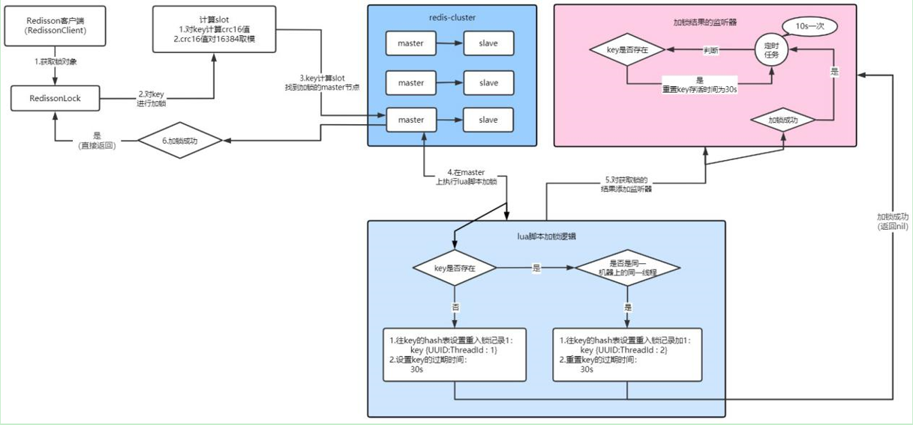


## 其他线程重复加锁阻塞

 其他线程过来加锁时，当然也是要执行这个加锁的脚本，如下图：

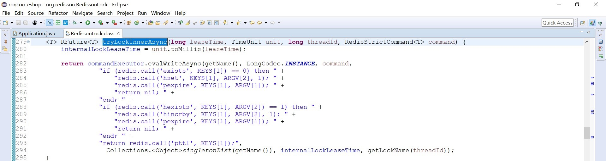

只不过其他线程过来对同一key重复加锁时：

首先第一个if条件，根据上文我们已经知道，当前key已经被第一个线程持有了，不成立；

第二个if条件，因为持有key的锁不是当前线程，所以也不成立，所以此时就只能来到最后的一步：

` pttl anyLock`

 表示返回当前key的剩余存活时间，因为不是返回nil，这下加锁当然就失败了。

 

此时我们就需要看一下加锁失败后，将会执行什么逻辑，如下图：

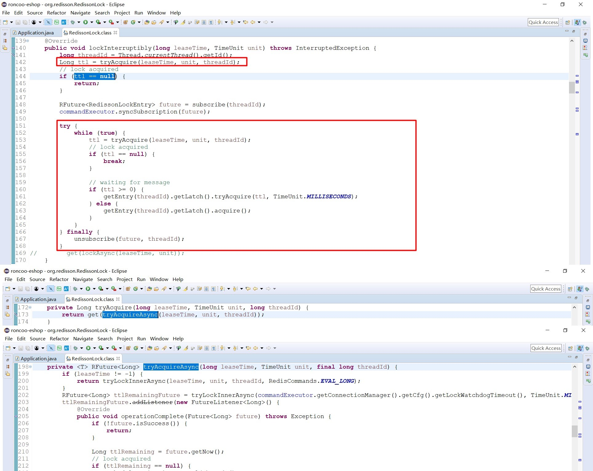

 

但是现在，其他客户端线程过来对同一key加锁，加锁失败了，此时监听器中判断条件：`if (!future.isSuccess())` 直接成立，当然就直接return返回了，但是这也导致不会开启watchdog定时任务了。

根据上图，我们同样回顾下之前：

不管是第一次加锁成功、同一线程重复过来重入加锁成功，lua脚本都会返回nil即返回空，下一步直接开启watchdog后台定时任务，每隔10s定时检查key并续期。

 

同时在上图的第一部分的方法lockInterruptibly中，如果发现ttl为空就直接返回了。

我们继续看下上图，这时它在方法lockInterruptibly中会进入一个while的死循环中，大概每次休息ttl的时间之后，ttl就是当前key还存活的时间，每次获取失败我就先等ttl时间，然后再去尝试一下加锁，期盼着有朝一日能获取到锁、好跳出这个while的死循环中。

 

大家看了吗，当一个线程对一个key加锁成功后，那么其他的线程也想要过来加锁时、就是这样一直被耗在while循环中的，这样不就实现阻塞了吗。


此时整体流程进度如下图所示：

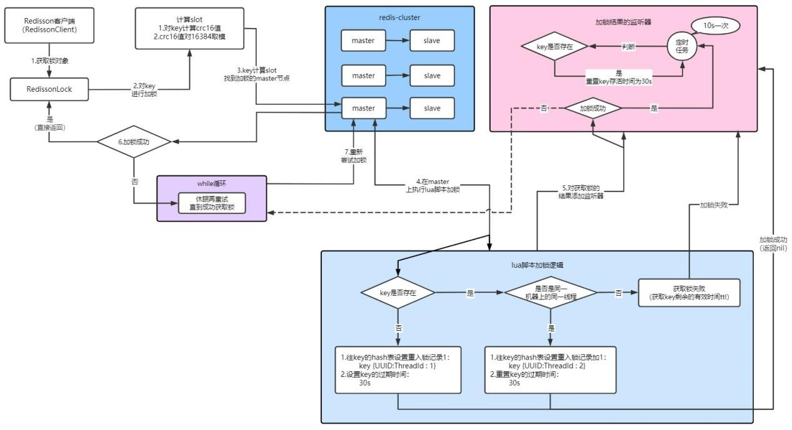

## 可重入锁释放锁的场景--客户端宕机导致锁释放

 这个比较好理解一点，如果Redisson客户端刚加锁成功，此时后台肯定就有一个后台watchdog的定时任务每隔10s检查key，key如果存在就为它自动续期30s，当watchdog定时任务存在的情况下，如果不是主动释放锁，那么key将会一直的被watchdog这个定时任务维持加锁。

 

如果客户端宕机了，此时watchdog定时任务当然也就是没了，既然没有了定时任务定时的为key续期，那么过完了30s之后，key自动就会被删除、key对应的锁也就释放了。


## 可重入锁释放锁的场景--客户端主动释放锁

当客户端主动释放锁时，就会调用unlock方法，如下图所示：

我们可以一路跟进去看下底层的调用逻辑：

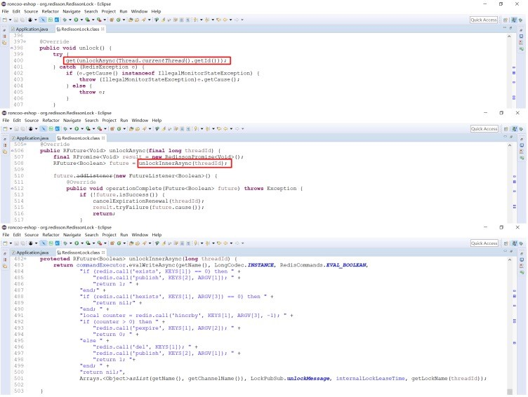

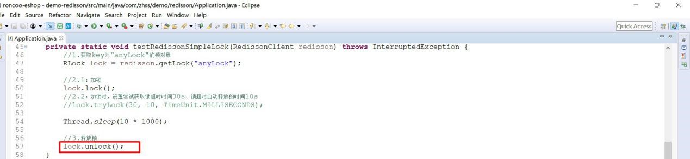

果不其然，和上锁逻辑一样，释放锁的逻辑也是通过lua脚本来完成的，通过方法后面的参数我们可以知道：

 ```
KEYS[1]=anyLock
ARGV[2]=30000
ARGV[3]=UUID:ThreadId
 ```

在详细分析过前面的上锁逻辑后，这段释放锁的lua脚本逻辑看起来应该就不会那么吃力了。

 

我们可以直接看下：

 

第一个if中，redis.call('exists',KEYS[1])==0 ，如果发现key不存在，发布订阅机制就会发布一些东西，这些和redis相关的订阅发布机制可暂时忽略；key此时当然是存在的，if分支跳过；

 

第二个if中，redis.call('hexists',KEYS[1],ARGV[3])==0 ,如果发现key对应hash数据结构中、当前线程不存在或没有当前线程的信息，直接就返回了；此时key对应的hash数据结构中当然有当前线程的信息啊，跳出if分支；

然后通过命令：

`hincrby KEYS[1] ARGV[3] -1，`即` hincrby anyLock UUID:ThreadId -1`

这里表示将线程UUID:ThreadId线程对key加锁的重入次数减1，即：

 ```
anyLock: {
	UUID:ThreadId 2
}
 ```

变为

```
anyLock: {
	UUID:ThreadId 1
}
```

此时，如果当前线程对这个key的重入锁次数counter还大于0，就表示当前线程对这个key不止加过一次锁，此时当然就不能删掉key啊，就执行`redis.call('pexpire',KEYS[1],ARGV[2])`， 重置下key的存活时间为30s；

 

如果当前线程对这个key的重入锁次数counter等于0了，表示当前线程只对这个key加过一次锁，现在刚好释放一次锁，线程对该key已经没有加锁记录了，当然就直接执行redis.call('del',KEYS[1])删除了；

这样也比较合理，因为如果说一个线程对一个key重入好几次锁，你只调用了一次unlock方法，就把别人key给删除了，那要重入锁又有什么意义呢。

  

从这里我们可以看到，释放锁和加锁其实是呼应的，你既然加锁是在key的hash数据结构中添加当前信息的记录，那释放锁当然也就是加锁的逆向操作了，包括锁重入次数的递增、key的删除等。

此时整体流程进度如下图所示：

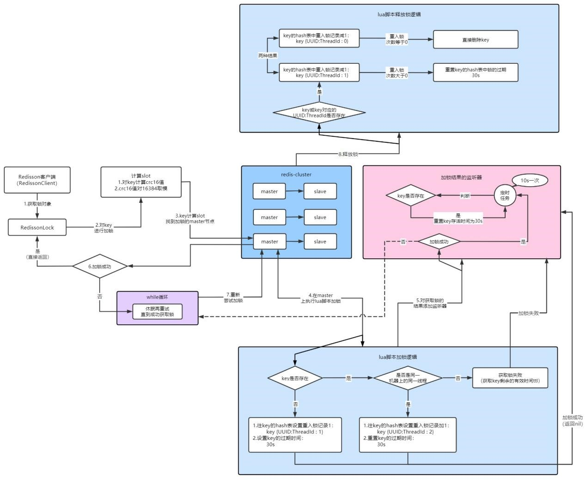


## 尝试获取锁超时

 我们可以看到前面的各种分析都是对：lock.lock() 的加锁方式进行分析的，在这种方式下如果获取锁失败，我们都是知道它会进入一个while的死循环中、间歇性的一直获取锁，相当于就阻塞住了。

 如果说你想要指定个时间，在这个时间内获取锁都失败的话就直接退出、保证不阻塞，此时可以通过如下方式加锁：

 `lock.tryLock(30, 10, TimeUnit.MILLISECONDS);`

这里第一个参数就是指定了30s之内要是获取不到锁就自动放弃了，不再陷入while循环中不断无休止的尝试了，我们看下底层是如何实现的：

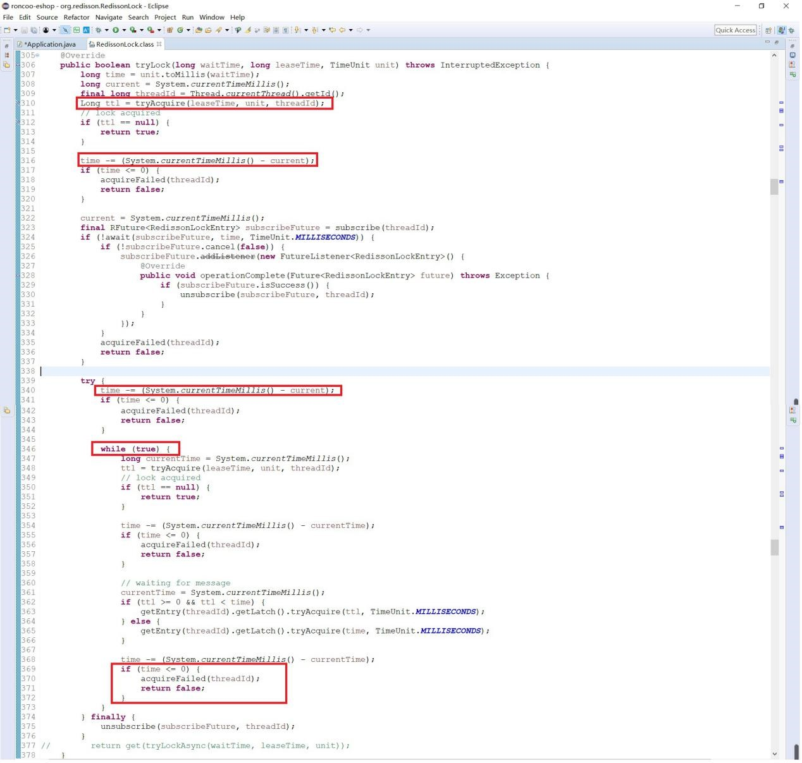

 

其实看到这里我们大概也就知道了，tryAcquire和我们之前执行的逻辑是一样的，执行加锁的入口：

如果ttl不为空就表示获取锁失败，此时像我们之前lock.lock()的方式，此时应该就是进入一个while死循环中一直阻塞住直到成功获取锁。

然而这里，我们已经指定了获取锁超时时间，此时我们可以看到时间指定超时时间waitTime赋值给了time，我们可以看到各种耗时操作都会导致time时间被扣减，redis底层订阅相关操作需要耗时、在while中重新尝试加锁时间也要被扣减，直到某一刻time已经小于等于0了，此时就会执行方法acquireFailed标记当前线程对key获取锁失败，然后直接return返回false，表示获取锁失败了。

所以说尝试获取锁超时的底层实现，只不过不会再给你一个while的死循环一直在那耗着，而是说在指定时间内，你一直去尝试获取，如果在指定时间内你还没加锁成功，就标记加锁失败并返回。

 

此时整体流程进度如下图所示：

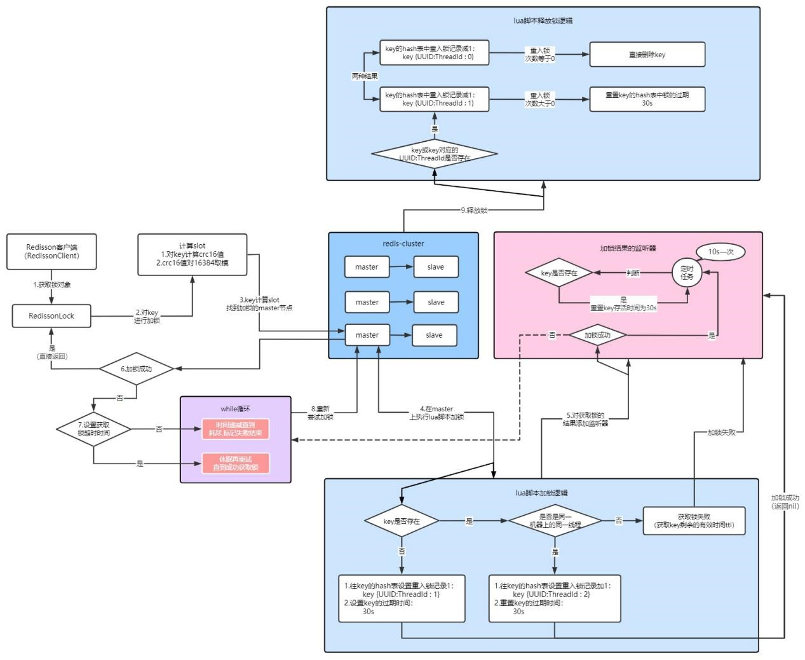

 

## 锁超时自动释放锁

 同样当我们在获取锁的时候，如果采用：lock.tryLock(30, 10, TimeUnit.MILLISECONDS) 方式获取锁时，第二个参数就表示本次就算获取所成功了，那么这把锁被线程最多只能被持有10s，10s之后这把锁将被释放，这块我们也看下源码是怎样实现的：

此时我们发现，当我们指定锁超时自动释放锁的时间后，参数leaseTime就为10，此时就会执行第一个逻辑分支，从上图代码我们可以看到，此时就算我们获取锁成功之后，也不会对获取锁的结果设置watchdog监听器了，也就不会维持加锁了。

这也就意味着当指定的时间过后，当前线程就会因为锁的过期时间到了而自动释放锁，锁超时自动释放说白了就是给你这个key的存活时间、设置为你自己指定的那个时间，而我在后台就不会给你添加一个watchdog机制来维持加锁了。

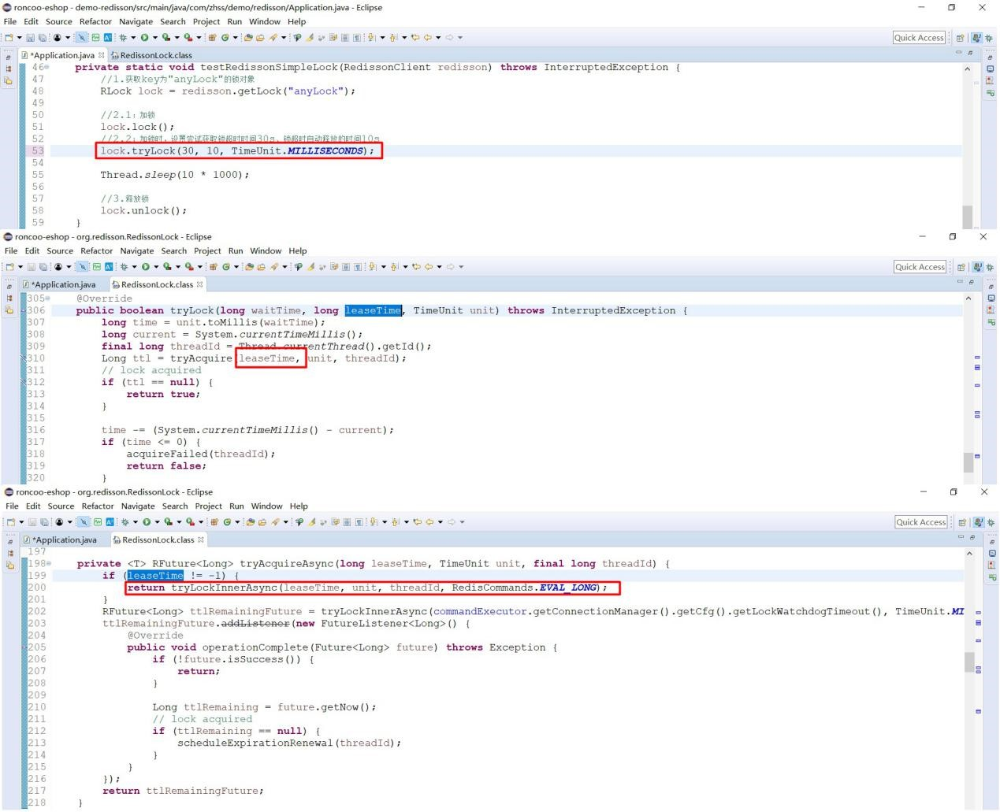

 

最终，完整的redis可重入锁执行的整体流程图如下图所示：

 

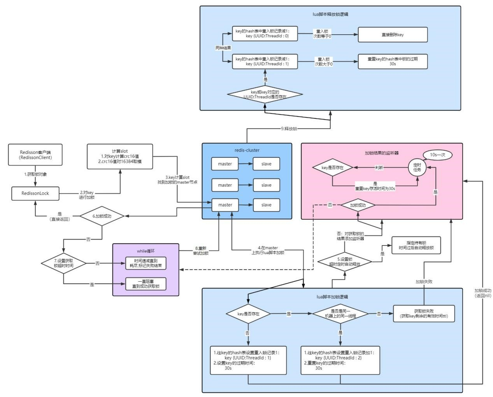

 

## 面试题剖析

 **1、相同客户端线程是如何实现可重入加锁的？**

第一次加锁时，会往key对应的hash数据结构中设置 UUID:ThreadId 1，表示当前线程对key加锁一次；

如果相同线程来再次对这个key加锁，只需要将UUID:ThreadId持有锁的次数加1即可，就为：UUID:ThreadId 2 了，Redisson底层就是通过这样的数据结构来表示重入加锁的语义的。

 

**2、其他线程加锁失败时，底层是如何实现阻塞的？**

 线程加锁失败了，如果没有设置获取锁超时时间，此时就会进入一个while的死循环中，一直尝试加锁，直到加锁成功才会返回。

 

**3、客户端宕机了，锁是如何释放的？**

客户端宕机了，相应的watchdog后台定时任务当然也就没了，此时就无法对key进行定时续期，那么当指定存活时间过后，key就会自动失效，锁当然也就自动释放了。


**4、客户端如何主动释放持有的锁？**

客户端主动释放锁，底层同样也是通过执行lua脚本的方式实现的，如果判断当前释放锁的key存在，并且在key的hash数据结构中、存在当前线程的加锁信息，那么此时就会扣减当前线程对这个key的重入锁次数。

扣减线程的重入锁次数之后，如果当前线程在这个key中的重入锁次数为0，此时就会直接释放锁，如果当前线程在这个key中的重入锁次数依然还大于0，此时就直接重置一下key的存活时间为30s。

 

**5、客户端尝试获取锁超时的机制在底层是如何实现的？**

如果在加锁时就指定了尝试获取锁超时的时间，如果获取锁失败，此时就不会无止境的在while死循环中一直获取锁，而是根据你指定的获取锁超时时间，在这段时间范围内，要是获取不到锁，就会标记为获取锁失败，然后直接返回false。

 

 

**6、客户端锁超时自动释放机制在底层又是如何实现的？**

如果在加锁时，指定了锁超时时间，那么就算你获取锁成功了，也不会开启watchdog的定时任务了，此时直接就将当前持有这把锁的过期时间、设置为你指定的超时时间，那么当你指定的时间到了之后，key失效被删除了，key对应的锁相应也就自动释放了。