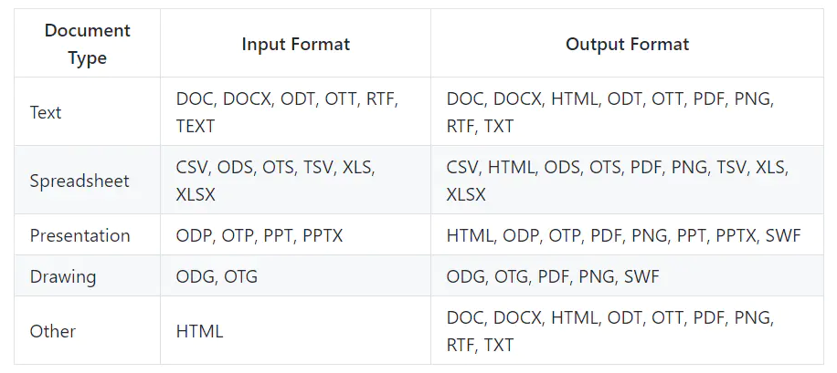

Jodconvert , 是一个java的文档转换器, 利用 openoffice 或 **libreOffice**(`阿里云用这个`) 来进行文档格式转换.

其支持的格式如下:




对于html格式的特殊注意:

- HTML可以用作输入格式，但您不应期望OOo像Chrome或IE那样正确地呈现复杂的网页。 仅适用于简单和“打印机友好”的网页。
- HTML可以用作输出格式，但是所有其他格式总是生成单个输出文件，HTML可以生成多个文件。 实际上，除了HTML文件之外，输入文档中包含的任何图像也将保存在同一目录中。 这需要您的代码格外小心，特别是在Web环境中。

## 应用场景

- 作为java类库使用
- 作为命令行工具使用
- 作为web应用使用

## 添加依赖

### Maven


```xml
<dependencies>
   <dependency>
      <groupId>org.jodconverter</groupId>
      <artifactId>jodconverter-local</artifactId>
      <version>4.1.1</version>
   </dependency>
</dependencies>
```

