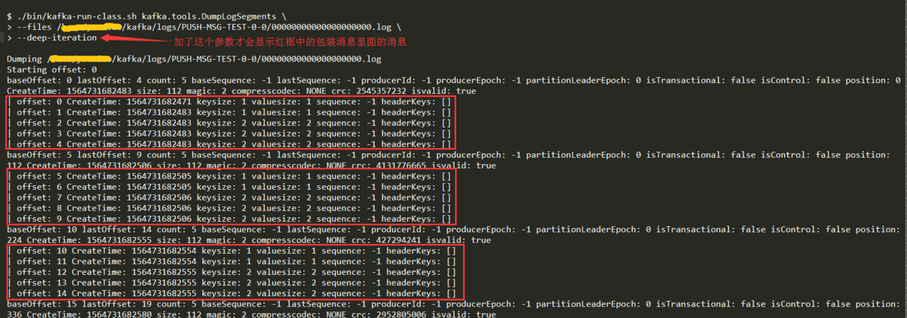

一. 复制

二. 处理生产者跟消费者的请求

三. 日志文件存储细节

# 成员关系 
---
1. Kafka通过在zk中维护成员信息, broker启动时候把自己的id(配置或自动生成)注册到/brokers/ids路径下. 当有成员加入或者退出集群, 所有成员都会得到通知.
2. 成员退出时, 虽然id节点会被删除, 但id仍然会保留在其他数据结构中, 例如副本列表, 分区信息等. 若新加入的成员使用退出成员的id, 那么将接手老成员的工作继续处理.


---
# 控制器
---
> Kafka 使用 Zookeeper 的临时节点来选举控制器， 并在节点加入集群或退出集群时通知控制器。控制器负责在节点加入或离开集群时进行分区首领选举。控制器使用 epoch 来避免“脑裂” (是指两个节点同时认为自己是当前的控制器)。
1. 充当控制器的broker将负责分区首领的选举. 
2. 集群中的broker将在争夺创建临时节点/controller, 并在data写上自己的id表示控制器身份, 因此第一个启动并且创建成功的broker将获得控制器角色. 没有获得控制器角色的其他broker通过watch对象监听/controller节点的变动, 若控制器角色broker退出则重新争夺控制器角色.

3. 当一个分区首领broker退出集群, 控制器会在分区副本列表中选取一个broker当首领, 并通知分区首领broker跟其他分区跟随者broker(信息包含谁是新首领以及谁是跟随者).


# 复制
--- 

1. 复制功能是Kafka架构的核心，在个别节点失效时仍能保证Kafka的可用性和持久性
2. Kafka使用主题来组织数据，每个主题被分为若干个分区，每个分区有多个副本（主题 -> 分区 -> 副本）
3. 每个Broker可以保存多个属于不同主题和不同分区的副本

## 副本
---
#### 首领副本(leader)
---
1. 每个分区都有一个首领副本, 为了保证一致性，所有生产者请求和消费者请求都会经过首领副本
2. 首领的另一个任务：弄清楚哪个跟随者的状态与自己的状态是一致的
3. 跟随者为了保持与首领的状态一致，在有新消息到达时尝试从首领那里复制消息，但也有可能同步失败
    * 例如网络拥塞导致变慢，Broker发生崩溃导致复制滞后，直到重启Broker后复制才会继续
#### 跟随者副本(follower)
---
1. 首领以外的副本都是跟随者副本。跟随者副本不处理来自客户端的请求，它们唯一的任务就是从首领那里复制消息，保持与首领一致的状态。
2. 追随者会按照有序的消息偏移量从首领读取消息(跟消费者一样的行为), leader就会知道follower的复制进度, 若follower可以持续得到最新的消息, 则会被标识为**同步的副本**. 若leade崩溃, 其中的一个**同步的副本**会被选为leader. 
3. 跟随者会被首领认为不同步的情况
跟随者在10S内没有请求任何消息（_可能死亡_）
虽然跟随者在请求消息，但在10S内没有请求到首领最新的数据（_滞后_）
4. ```replica.lag.time.max.ms```：正常的跟随者允许的不活跃时间，默认10S

#### 首选首领
---
1. 除了当前首领之外，每个分区都有一个首选首领 - 创建topic时选定的首领就是分区的首选首领
2. ``auto.leader.rebalance.enable``默认true, Kafka会检查首选首领是不是当前首领 ， 如果不是, 并且该副本是同步的, 那么就会触发首领选举, 让首选首领成为当前首领.
3. 由于一个kafka集群会处理N多个topic, 而每个topic又会有多个分区, 每个分区会有一个leader(分区leader), 因此需要把所有leader均衡地分配到各个broker中, 让集群中每个broker均摊数据处理负载. 分区leader由kafka集群的控制器broker来分配, 因此控制器broker知道各个broker的负载情况. 所以创建topic时候由控制器broker指定一个分区leader(首选leader), 每次rebalance时候都会尽量要求这个broker充当对应的分区leader.

#### 找到首选首领
---
1. 分区的副本清单里第一个副本一般就是首选首领。不管当前首领是哪一个副本，都不会改变这一事实.
2. 如果是手动进行副本分配，第一个指定的副本就是首选首领，要确保首选首领被传播到其他Broker. 避免让包含了首选首领的Broker负载过重，而其他Broker却无法为它们分担负载

# 处理请求

1. broker 的大部分工作是处理客户端、分区副本和控制器发送给分区首领的请求。
2. broker 按照请求到达的顺序来处理它们一一这种顺序保证让 Kafka具有了消息队列的特性，同时保证保存的消息也是有序的。
3. 请求消息都包含一个标准消息头(Kafka 文档里有详细说明):
* Request type (也就是 API key)
* Request version (broker 可以处理不同版本的客户端请求，井根据客户端版本作出 不同 的响应)
* Correlation ID- 一个具有唯一性的数字， 用于标识请求消息，同时也会出现在响应消 息和错误日志里(用于诊断问题)
* Client ID- 用于标识发送请求的客户端


4. 请求类型
 生产请求: 生产者发送的请求，它包含客户端要写入 broker的消息。 
获取请求: 在消费者和跟随者副本需要从 broker读取消息时发送的请求。
5. 生产请求和获取请求都必须发送给分区的首领副本, Kafka 客户端要自己负责把生产请求和获取请求发送到正确的 broker 上, 若其他broker收到请求, 会返回"非分区首领"的错误响应.
6. 客户端往任意broker发送**元数据请求**(包含客户端订阅的主题列表), broker返回的响应消息中含有主题所包含的分区、每个分区都有哪些副本，以及哪个是副本首领。客户端定时请求刷新元数据(刷新的时间间隔通过```metadata.max.age.ms```参数来配置). 若收到"非首领"错误, 则重新刷新元数据,然后再发请求.


## 生产请求
---
1. 在 Linux 系统上，消息会被写到文件系统缓存里，并不保证它们何时会被刷新到磁盘上。 Kafka不会一直等待数据被写到磁盘上一一它依赖复制功能来保证消息的持久性。
2. acks 被设为 all，那么请求会被保存在一个叫作**炼狱**的缓冲 区里, 直到首领发现所有跟随者副本都复制了消息，晌应才会被返回给客户端。


## 获取请求
---
1. 客户端发送请求，向broker请求主题分区里具有特定偏移量的消息，
2. 首领在收到请求时，它会先检查请求是否有效, broker 将按照客户端指定的数量上限从分区里读取消息，再把消 息返回给客户端。 
> Kafka使用***零复制技术**向客户端发送消息一一也就是说， Kafka直接把消息从文件(或者更确切地说是 Linux 文件系统缓存)里发送到网络通道，而不需要经过任何中间缓冲区。这项技术避免了字节复制，也不需要管 理内存缓冲区，从而获得更好的性能。
3.  客户端可以设置 broker 返回数据的上限和下限, 以及超时时间, broker满足其中一个就返回数据. 

4. 客户端只能读取已经被写入**所有**同步副本的悄息
5. broker间的消息复制存在一定延迟, 那么消息到达消费者的也存在滞后, 延迟时间可以通过参数```replica.lag.time.max.ms```来配置，它指定了副本在复制消息时可被允许的最大延迟时间。


## 其他请求
---
> 客户端跟服务端broker通信使用的是通用二进制协议, broker内部之间也使用同样的协议通信。
* kafka协议会随着版本迭代更新而拓展老的请求类型, 或者新增请求类型(客户端请求都会带客户端version)

# 物理存储
----
> Kafka 的基本存储单元是分区。分区无法在多个broker 间进行再细分，也无法在同一个broker 的多个磁盘上进行再细分。所以，分区的大小受到单个挂载点可用空间的限制(磁盘/RAID群).

## 分区分配
---
1. 在创建主题时， Kafka 首先会决定如何在broker 间分配分区。若主题分为10个分区, 复制系数```num.replica.fetchers```设为3, 那么就会有30个分区副本被均摊到所有broker. 
2. kafka按照broker编号(如果有设机架号```broker.rack```)顺序来分配分区以及分区副本.  
  * 假设有机器6台, broker0~5, 主题3个分区, 复制系数是3, 分区跟副本的大体分配逻辑:  
  2.1 没设置机架号, broker的轮训顺序(0->1->2->3->4->5), 假设首领分区0分配在broker3, 那么首领分区1会分配在broker4, 首领分区2会分配在broker5, 以此类推. 然后, 追随者副本也是一样, 因为首领分区0在broker3, 那么第一个分区副本会分配在broker4, 第二个会在broker5, y以此 类推.
 2.2 设置了机架号, 假设broker12同一机架, broker34同一机架, 那么轮训顺序是0->(12)->(34)->5
3. 为分区分配好broker后, 分区的存放目录规则: 计算每个目录里的分区数量，新的分区总是被添加到分区数量最小的那个目录中。

## 文件管理
---
1. Kafka 管理员为每个主题配置了数据保留期限，规定数据被删除之前可以保留多长时间，或者清理数据之前可以保留的数据量大小。
2. 把分区分成若干个片段。默认情况下，每个片段包含lGB 或一周的数据，以较小的数据量那个为准。
3. 在broker往分区写入数据时，如果达到片段上限，就关闭当前文件，并打开一个新文件。当前正在写入数据的片段叫作**活跃片段**。活动片段永远不会被删除。即时设置

## 文件格式
---
1. Kafka使用零复制技术传递消息，即生产者发过来的消息直接落盘，消费者请求的时候原样发送，避免对消息了重新解压跟再压缩，实现高效。
2. 如 果生产者发送的是压缩过的消息，那么同一个批次的消息会被压缩在一起，被当作“包
装消息”进行发送 。消息格式如下

3. Kafka 附带了一个叫DumpLogSegment的工具，可以用它查看片段的内容(包括日志文件xxxx.log, 索引文件xxx.index, 时间索引xxxx.timeindex)。它可以显示每个消息的偏移量、校验和、魔术数字节、消息大小和压缩算桂。运行该工具的方能如下：
  ```bin/kafka-run-class.sh kafka.tools.DumpLogSegments```
如果使用了--deep-iteration 参数，可以显示被压缩到包装消息里的消息。


## 索引
---
1. 消费者可以从Kafka 的任意可用偏移量位置开始读取消息。
2. Kafka为每个分区维护了一个**索引**, 映射了偏移量的**片段文件**以及**偏移量在文件里的位置**。
3. 索引也被分成片段，所以在删除消息时，也可以删除相应的索引。Kafka 不维护索引的校验和。如果索引出现损坏， Kafka 会通过重新读取消息并录制偏移量和位置来重新生成索引。如果有必要，管理员可以删除索引，这样做是绝对安全的， Kafka 会自动重新生成这些索引。
4. DumpLogSegments工具也能读索引文件, 如下图


## 清理
---
1. Kafka 会根据设置的时间保留数据，把超过时效的旧数据删除掉。
2. 数据清理策略: delete(删除), compact(压缩)
```
# 删除策略相关配置
log.cleanup.policy=delete启用删除策略
#直接删除，删除后的消息不可恢复。可配置以下两个策略：
# 清理超过指定时间清理： 
log.retention.hours=16
# 超过指定大小后，删除旧的消息：
log.retention.bytes=1073741824

# 压缩策略相关配置, 只保留每个key最后一个版本的数据(每个消息都有一个key)
log.cleanup.policy=compact
# 是否开启压缩(默认false)
log.cleaner.enable=true
# 对于压缩的日志保留的最长时间
log.cleaner.delete.retention.ms= 1 day
```
3. 为topic指定清理策略, 通过命令在创建topic添加参数 ```--config log.cleanup.policy=compact```设置, 好像无法在client设置, topic创建后无法修改清理策略.
```
> bin/kafka-topics.sh --bootstrap-server localhost:9092 \
  --create --topic my-topic --partitions 1 --replication-factor 1 \
  --config max.message.bytes=64000 \
  --config flush.messages=1
```

## 压缩策略(compact)的清理工作原理
---
1. 日志片段分为**干净部分**(清理过)和**污浊部分**(未清理). 在清理时, 通过维护一个map, map保留清理过的key-value(消息偏移量), 污浊部分的消息通过与map中的key进行比对, 来保留每个key最后一个版本的数据. 
2. 一个日志片段里面, 污浊片段经过清理变成干净片段后, 干净片段会比较短, 因为旧value在新value写入后会被删除.


## 被删除的事件
---
* 清理策略为compact时候, 支持删除key
* kafka只为每个key保留最新的value. 那么如果想要删除这个key, 可以发送null值. **清理线程**会进行常规的清理, 为key保留null的消息. 这个null消息被称为**墓碑消息**.  消费者识别到**墓碑消息**时做一些特定逻辑(例如数据库中删除相关数据). 经过特定时间后, **清理线程**会移除**墓碑消息**跟对应的key. 

## 何时会清理主题数据
---
1. 当前活跃片段不会被清理, 只有旧片段才会.
2. 在 0.10.0和更早的版本里，Kafka会在包含脏记录的主题数量达到 50%时进行清理, 目的是避免频繁的清理影响性能.

参见: 
[kafka官方文档-Log Compaction](https://kafka.apache.org/documentation/#compaction)
[清理策略](https://zhuanlan.zhihu.com/p/44520004)
