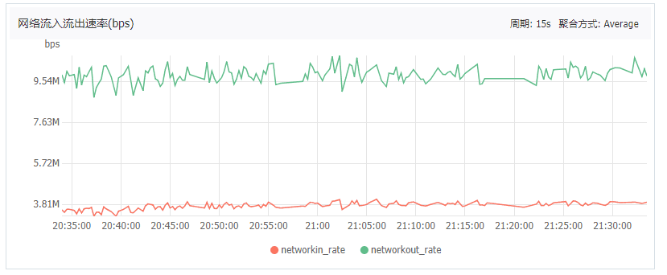
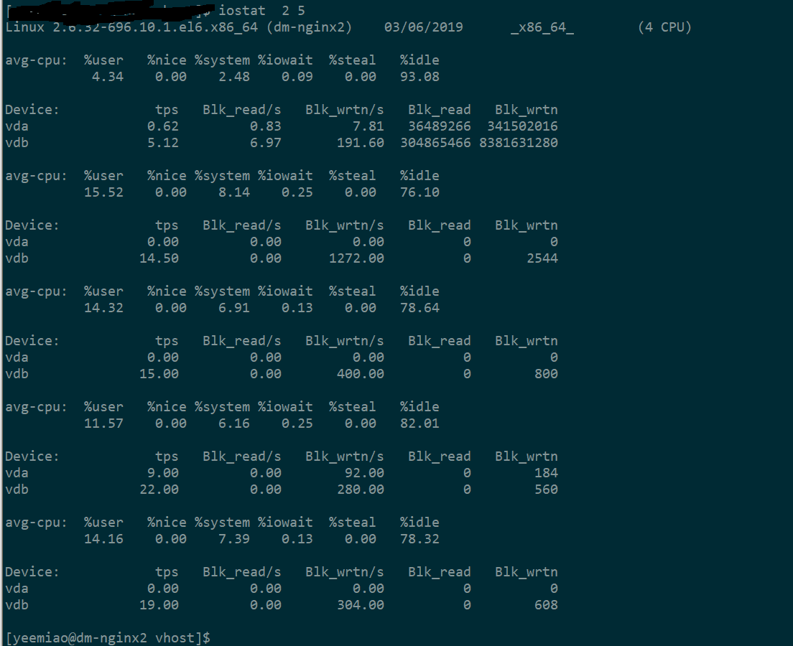
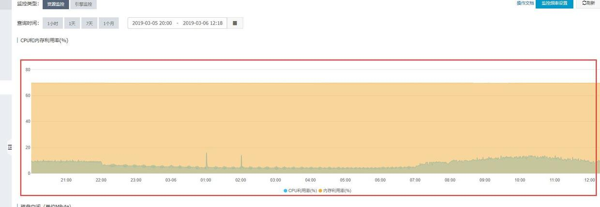
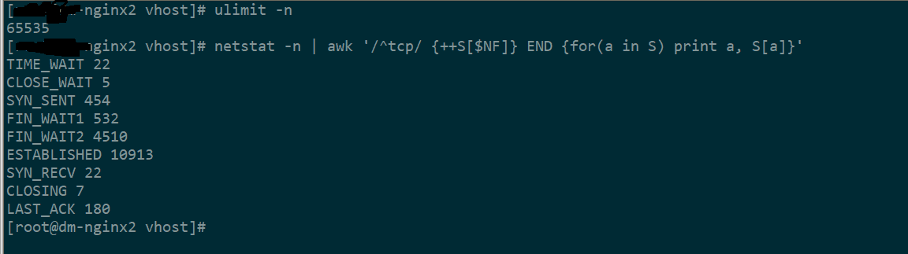

在最近两周, app在晚上8:45~11:00期间, 严重卡顿. 数据加载非常缓慢. 
### 排查与发现: 
1. 测试同学抓包查看请求响应, 发现有些请求响应还是正常毫秒数, 有些耗时n多秒, 甚至超时. 并且耗时超时请求并不是集中在某几个url.
2. pinpoint系统查看各个服务的响应情况, 发现有些服务响应比较慢, 有些服务响应是正常的. 其中响应慢的服务是用户服务, 很多业务对该服务都有依赖性, 调用量比较大, 处理方式是增加服务. 而app中加载慢的现象比就多体现在资讯文章服务. 因为在打开app的使用过程中, 多出地方都展示了文章, 该服务的调用次数是比较多的. 但从pinpoint系统看到文章服务响应是正常的. 这时候初步断定不是内部服务拖慢了响应, 那很可能是外部因素, 例如nginx, 域名解析, 带宽等. 域名解析使用的是阿里云的云解析, 一般不会有没问题. 初步推断是请求量增高超过nginx的请求量上限, 或者带宽不足. 
3. 带宽让运维同学在阿里云管理后台看了. 并没有频繁到达上限(购买的服务器带宽是12M), 应该不是带宽问题. 如下图


4. 服务器磁盘io如下图, 也非常低



5. 检查服务器状态, 内存占用70%(部署ng的服务器还部署了一些业务服务), cpu利用率15%~20%之间. 服务器压力其实不大. 


6. 检查ng负载. app请求通过域名解析分发给三台ng服务器(4核8G). zabbix监控显示, 晚上高峰时间段内, nginx活跃连接数从闲时7k每台攀升到11k. 判断可能是nginx处理能力不足. 

7. 服务器网络情况, 可以看到 established值跟zabbix监控中ng活跃数差不多一致, fin_wait2状态数过多. ``` 
FIN_WAIT2状态就是服务端在主动发起断开的连接请求时，发送FIN并收到客户端的ACK进入的等待客户端FIN的状态 ```. 验证了nginx处理能力不足. 



### 验证方法:
挑个工作日下午5点, 停掉一台ng, 观察到app很快就加载缓慢, 症状跟这几天的高峰期一样. 基本验证了nginx服务器处理性能问题. 

### 解决方案:
1. 优化nginx配置
2. 考虑再部署一个ngxin实例来分流
3. 顺便撸一波tomcat配置, 检查出确实也有少数服务的tomcat没有优化.
4. 负载比较高的服务, 多部署一台实例. 

### 其他:
补充网络协议知识
