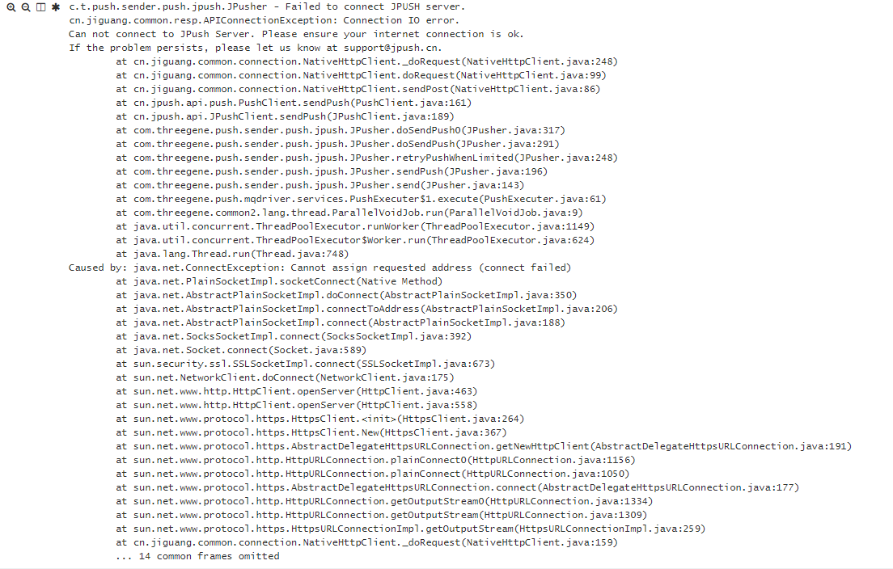
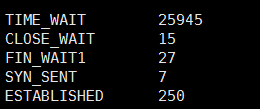
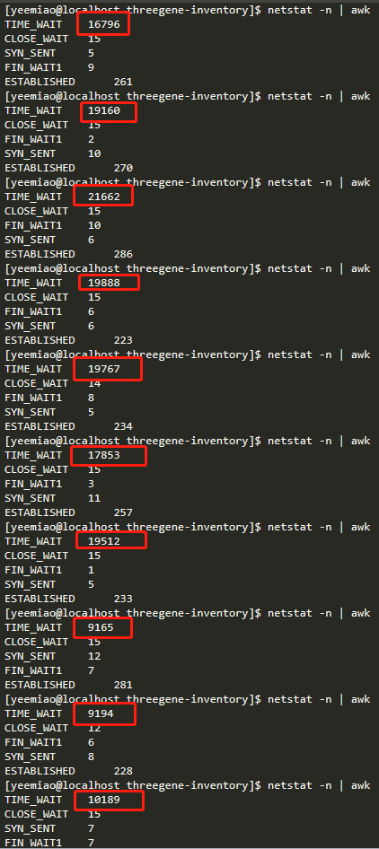

`java.net.ConnectException: Cannot assign requested address(connect failed)`报错

[参考]: https://www.jianshu.com/p/51a953b789a4

使用JDK或者apache http client实现, 在处理接近4w条数据的时候, 查看当前端口占用及分类

`shell$ netstat -n | awk '/^tcp/ {++state[$NF]} END {for(key in state) print key,"\t",state[key]}'`

更换了okhttp实现后,

