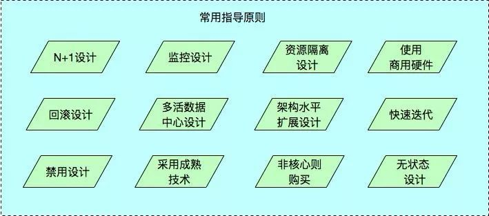

> 引用: https://cloud.tencent.com/developer/article/1518589

# 怎样才算是架构师？

架构师是一个既能掌控整体又能洞悉局部瓶颈并依据具体的业务场景给出解决方案的团队领导型人物。看似完美的“人格模型”背后，是艰辛的探索。

架构师不是一个人，他需要建立高效卓越的体系，带领团队去攻城略地，在规定的时间内完成项目。

# 架构师的分类

从业界来看对于架构师的理解可以大概区分为：

- 企业架构师：专注于企业总体 IT 架构的设计。
- IT 架构师-软件产品架构师：专注于软件产品的研发。
- IT 架构师-应用架构师：专注于结合企业需求，定制化 IT 解决方案；大部分需要交付的工作包括总体架构、应用架构、数据架构，甚至部署架构。
- IT 架构师-技术架构师：专注于基础设施，某种软硬件体系，甚至云平台，提交：产品建议、产品选型、部署架构、网络方案，甚至数据中心建设方案等。

# 架构师的职责

架构师需要能够识别定义并确认需求，能够进行系统分解形成整体架构，能够正确地技术选型，能够制定技术规格说明并有效推动实施落地。

按 TOGAF 的定义，架构师的职责是了解并关注实际上关系重大但未变得过载的一些关键细节和界面，架构师的角色有：理解并解析需求，创建有用的模型，确认、细化并扩展模型，管理架构。

从项目视图看:

对接管理部门：汇报技术方案，进度；技术沟通； 对接客户 PM，项目 PM：协助项目计划，人员管理等。负责所有技术交付物的指导； 对接业务部门和需求人员：了解和挖掘痛点，帮忙梳理高级业务需求，指导需求工艺； 对接开发：产品支持、技术指导、架构指导； 对接测试：配合测试计划和工艺制定。配合性能测试或者非功能性测试； 对接运维：产品支持，运维支持； 对接配置&环境：产品支持； .......

# 架构原则

设计原则就是架构设计的指导思想，它指导我们如何将数据和函数组织成类，如何将类链接起来成为组件和程序。反向来说，**架构的主要工作就是将软件拆解为组件**，设计原则指导我们如何拆解、拆解的粒度、组件间依赖的方向、组件解耦的方式等。

设计原则有很多，我们进行架构设计的主导原则是 OCP（开闭原则），在类和代码的层级上有：SRP（单一职责原则）、LSP（里氏替换原则）、ISP（接口隔离原则）、DIP（依赖反转原则）；在组件的层级上有：REP（复用、发布等同原则）、CCP（共同闭包原则）、CRP（共同复用原则），处理组件依赖问题的三原则：无依赖环原则、稳定依赖原则、稳定抽象原则。

## 设计原则

**1、OCP（开闭原则）：**设计良好的软件应该易于扩展，同时抗拒修改。这是我们进行架构设计的主导原则，其他的原则都为这条原则服务。

**2、SRP（单一职责原则）：**任何一个软件模块，都应该有且只有一个被修改的原因，“被修改的原因“指系统的用户或所有者，翻译一下就是，任何模块只对一个用户的价值负责，该原则指导我们如何拆分组件。

举个例子，CTO 和 COO 都要统计员工的工时，当前他们要求的统计方式可能是相同的，我们复用一套代码，这时 COO 说周末的工时统计要乘以二，按照这个需求修改完代码，CTO 可能就要过来骂街了。当然这是个非常浅显的例子，实际项目中也有很多代码服务于多个价值主体，这带来很大的探秘成本和修改风险，另外，当一份代码有多个所有者时，就会产生代码合并冲突的问题。

**3、LSP（里氏替换原则）：当**用同一接口的不同实现互相替换时，系统的行为应该保持不变。该原则指导的是接口与其实现方式。

你一定很疑惑，实现了同一个接口，他们的行为也肯定是一致的呀，还真不一定。假设认为矩形的系统行为是：面积=宽*高，让正方形实现矩形的接口，在调用 setW 和 setH 时，正方形做的其实是同一个事情，设置它的边长。这时下边的单元测试用矩形能通过，用正方形就不行，实现同样的接口，但是系统行为变了，这是违反 LSP 的经典案例。

**4、ISP（接口隔离原则）：**不依赖任何不需要的方法、类或组件。该原则指导我们的接口设计。当我们依赖一个接口但只用到了其中的部分方法时，其实我们已经依赖了不需要的方法或类，当这些方法或类有变更时，会引起我们类的重新编译，或者引起我们组件的重新部署，这些都是不必要的。所以我们最好定义个小接口，把用到的方法拆出来。

**5、DIP（依赖反转原则）：**指一种特定的解耦（传统的依赖关系创建在高层次上，而具体的策略设置则应用在低层次的模块上）形式，使得高层次的模块不依赖于低层次的模块的实现细节，依赖关系被颠倒（反转），从而使得低层次模块依赖于高层次模块的需求抽象。

跨越组建边界的依赖方向永远与控制流的方向相反。该原则指导我们设计组件间依赖的方向。

依赖反转原则是个可操作性非常强的原则，当你要修改组件间的依赖方向时，将需要进行组件间通信的类抽象为接口，接口放在边界的哪边，依赖就指向哪边。

**6、REP（复用、发布等同原则）：**软件复用的最小粒度应等同于其发布的最小粒度。直白地说，就是要复用一段代码就把它抽成组件，该原则指导我们组件拆分的粒度。

**7、CCP（共同闭包原则）：**为了相同目的而同时修改的类，应该放在同一个组件中。CCP 原则是 SRP 原则在组件层面的描述。该原则指导我们组件拆分的粒度。

对大部分应用程序而言，可维护性的重要性远远大于可复用性，由同一个原因引起的代码修改，最好在同一个组件中，如果分散在多个组件中，那么开发、提交、部署的成本都会上升。

**8、CRP（共同复用原则）：**不要强迫一个组件依赖它不需要的东西。CRP 原则是 ISP原则在组件层面的描述。该原则指导我们组件拆分的粒度。

相信你一定有这种经历，集成了组件 A，但组件 A 依赖了组件 B、C。即使组件 B、C 你完全用不到，也不得不集成进来。这是因为你只用到了组件 A 的部分能力，组件 A 中额外的能力带来了额外的依赖。如果遵循共同复用原则，你需要把 A 拆分，只保留你要用的部分。

REP、CCP、CRP 三个原则之间存在彼此竞争的关系，REP 和 CCP 是黏合性原则，它们会让组件变得更大，而 CRP 原则是排除性原则，它会让组件变小。遵守REP、CCP 而忽略 CRP，就会依赖了太多没有用到的组件和类，而这些组件或类的变动会导致你自己的组件进行太多不必要的发布；遵守 REP、CRP 而忽略 CCP，因为组件拆分的太细了，一个需求变更可能要改 n 个组件，带来的成本也是巨大的。

## 指导原则

除了上述设计原则，还有一些重要的指导原则如下：

**1、N+1设计：**系统中的每个组件都应做到没有单点故障；

**2、回滚设计：**确保系统可以向前兼容，在系统升级时应能有办法回滚版本；

**3、禁用设计：**应该提供控制具体功能是否可用的配置，在系统出现故障时能够快速下线功能；

**4、监控设计：**在设计阶段就要考虑监控的手段，便于有效的排查问题，比如引入traceId、业务身份 Id 便于排查监控问题；

**5、多活数据中心设计：**若系统需要极高的高可用，应考虑在多地实施数据中心进行多活，至少在一个机房断电的情况下系统依然可用；

**6、采用成熟的技术：**刚开发的或开源的技术往往存在很多隐藏的 bug，出了问题没有很好的商业支持可能会是一个灾难；

**7、资源隔离设计：**应避免单一业务占用全部资源；

**8、架构水平扩展设计：**系统只有做到能水平扩展，才能有效避免瓶颈问题；

**9、非核心则购买的原则：**非核心功能若需要占用大量的研发资源才能解决，则考虑购买成熟的产品；

**10、使用商用硬件：**商用硬件能有效降低硬件故障的机率；

**11、快速迭代：**系统应该快速开发小功能模块，尽快上线进行验证，早日发现问题大大降低系统交付的风险；

**12、无状态设计：**服务接口应该做成无状态的，当前接口的访问不依赖于接口上次访问的状态。

架构师知道了职责，具备很好的架构思维，掌握了通用的架构框架和方法论，使用架构原则进行架构设计，不同的业务和系统要求不一样，那么有没有针对不同场景的系统架构设计？下文就针对分布式架构演进、单元化架构、面向服务 SOA 架构、微服务架构、Serverless 架构进行介绍，以便于我们在实际运用中进行参考使用。

