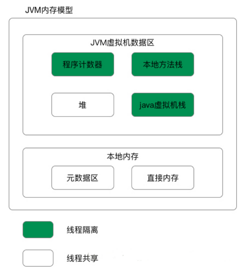
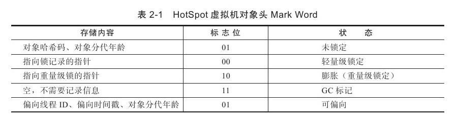
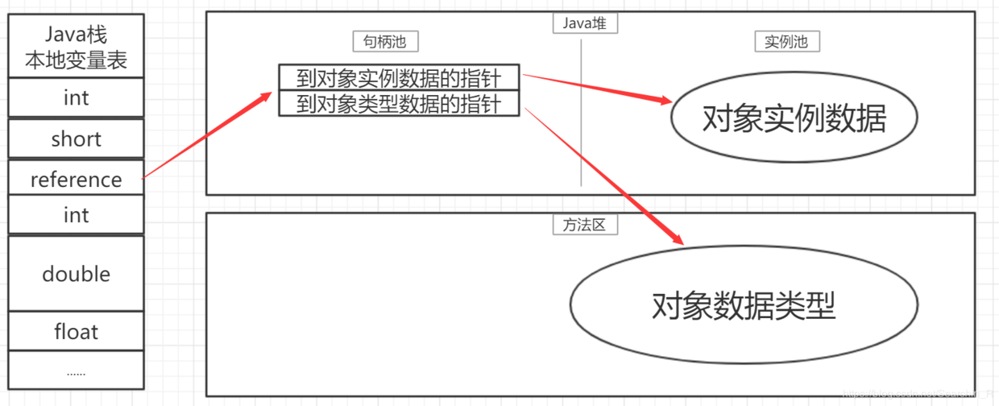
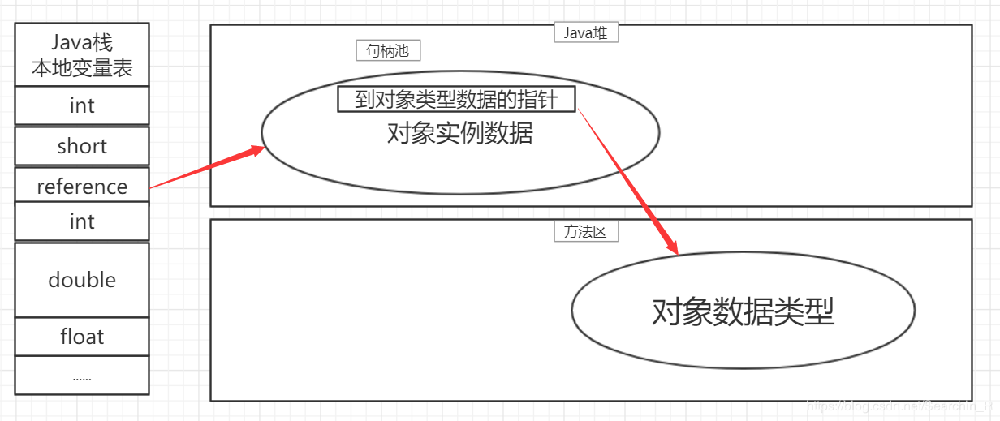

# 运行时数据区域
[内存模型脑图](http://naotu.baidu.com/file/b353909f25734fbb1c27bc90a2104ce0?token=6227939a8fb74098)

### metaSpace取代永久代的原因？

1. 官方文档：移除永久代是为融合HotSpot JVM与 JRockit VM而做出的努力，因为JRockit没有永久代，不需要配置永久代.

2. 由于 PermGen 内存经常会溢出(OOM)，因为PermSize的大小依赖于很多因素，比如JVM加载的class总数，常量池的大小，方法的大小等。因此 JVM 的开发者希望这一块内存可以更灵活地被管理，不要再经常出现这样的 OOM。

---

# Hotpot对象

### 对象内存分布
↓
[对象的内存分布脑图](http://naotu.baidu.com/file/d43348634640270b63c1ce4db6da6273?token=76520791ce1e9c6c)
[对象占内存大小](https://blog.csdn.net/qq_15037231/article/details/102605981)

- 对象头的Mark Word部分存储对象自身的运行时数据,  会根据对象当时的运行环境来变更这部分的存储内容. 

---

### 对象的访问
* 通过保存在虚拟机栈中的reference数据来操作堆上的对象实例
* reference只是一个对象的引用, 具体访问方式由虚拟机决定: 句柄访问, 直接指针访问

* 句柄访问, reference保存的是对象的句柄地址, **句柄地址包含对象实例数据与对象类型数据的地址**. 因此在对象被移动(GC时候会移动)时只改变句柄中的实例数据指针, reference本身不需要修改. **句柄访问方式就是间接指针方式**.
* (**SUN HotSpot使用**)直接指针访问, reference保存的就是对象的地址. 因此访问速度快(节省一次指针寻址的开销). 

---

### OutOfMemoryError 异常
#### Java堆溢出

* ``-Xmx, -Xms``设置堆的最大最小值,  两者设置一样可避免堆自动扩展
* ``-XX:+HeapDumpOnOutOfMemoryError`` 让虚拟机在内存溢出时dump出内存堆转储快照, Eclipse Memory Analyzer分析.
1)若是内存泄露, 查看泄露对象到GC Roots的引用链, 能比较准确定位出泄露代码的位置.
2)若是内存溢出, 检查``-Xmx, -Xms``是否还可以调大, 检查代码中是否存在某些对象的生命周期过长.

#### 虚拟机栈和本地方法栈溢出

> HotSpot虚拟机不区分虚拟机栈和本地方法栈, 因此设置``-Xoss``(本地方法栈)是无效的.
* ``-Xss``设置栈容量
* ``StackOverflowError``: 线程请求的栈深度超出虚拟机允许的最大深度.
* ``OutOfMemoryError``: 虚拟机在拓展栈时无法申请足够的内存空间.
* 一直创建线程导致内存溢出

#### 方法区和运行时常量池溢出

* JDK1.6以及之前, 运行时常量池分配在永久代, 可以用``-XX:PermSize, -XX:MAxPermSize``设置方法区大小.
* String.intern()
1)JDK1.6中, 该方法会吧**首次**遇到的字符串实例**复制**到永久代中, 并返回永久代中这个字符串实例的引用.
2)JDK1.7之后, 该方法不再复制实例, 而是在常量池中记录**首次**出现的**实例应用**, 并返回改应用.一些关键字(例如java)在启动JVM时候会放进字符串常量池了.
* 通过一直创建被持有的String.intern()能导致内存溢出

#### 直接内存溢出

* ``-XX:MAxDirectMemorySize``指定直接内存容量, 默认与``-Xmx``一样
* DirectByteBuffer分配内存时候, 抛出OOM异常时候, 并没有真正向操作系统申请分配内存, 而是通过计算得知内存无法分配, 再手动抛异常.
* 通过反射获取Unsafe实例, unsafe.allocateMemory()才是真正申请分配直接内存的方法
* 直接内存导致的内存溢出, heap dump文件不会看到明显异常. 若dump并且文件很小, 并且使用了nio, 有可能就是直接内存溢出.

---
