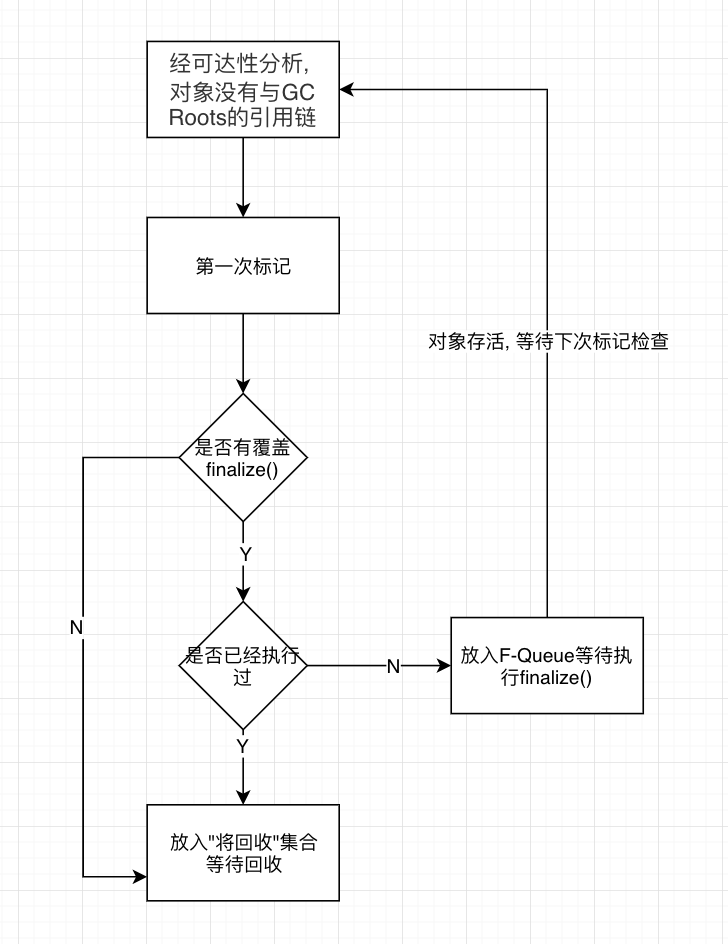
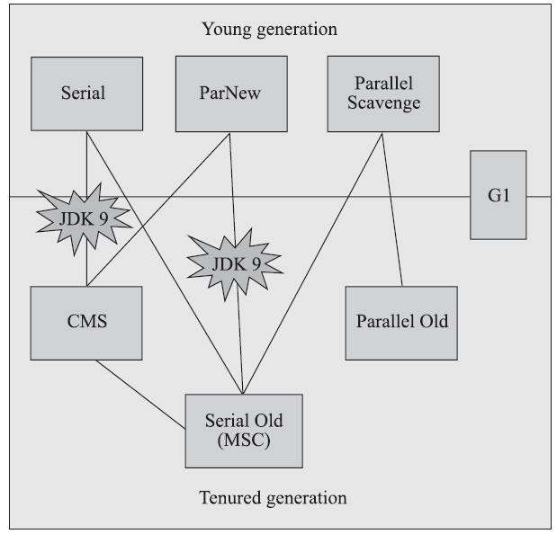
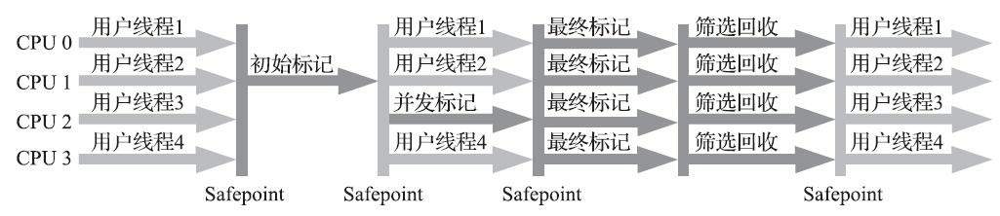

> * Java内存区域中, 程序计数器, 虚拟机栈, 本地方法栈是线程私有的, 随着线程结束这三个内存区被回收, 因此这三个区的内存分配回收具备确定性, 不需考虑回收问题.
> * 堆内存和方法区是线程共享, 只有在程序运行时候才知道创建哪些对象, 因此内存的分配和回收是动态的, 需要自动回收机制.

---

# 垃圾收集

[全过程脑图](https://www.processon.com/view/link/620659ef07912906b0d3c044)

---

# 对象引用的扩展
JDK1.2之后将引用进行扩展

* 强引用(Strong Reference)
  
    - Object obj = new Object()形式
    - 不会被垃圾回收器回收 
    
* 软引用(Soft Reference)
  
    - 在系统要发生内存溢出异常之前, 将被软引用关联的对象列进回收范围中进行第二次回收
    
    - 软引用回收时机: `clock-timestamp <= freespace * SoftRefLRUPolicyMSPerMB`
    
      `clock-timestamp`代表软引用对象有多久没有被访问, `freespace`代表JVM空闲内存空间,  `SoftRefLRUPolicyMSPerMB`代表每一MB空闲空间可以允许软引用对象存活多久

* 弱引用(Weak Reference)
  
    - 被弱引用关联的对象在垃圾回收器下一次工作时回收
* 虚引用/幽灵引用(Phantom Reference)
    - 一个对象被虚引用关联, 不影响对象的生存事件, 也无法通过虚引用来获得对象实例
    - 唯一作用是在对象被回收时候收到一个系统通知 

---
# 对象存活判定

> 正式宣布一个对象的死亡至少要经历两次标记过程



* 上图可以看出, 第一次标记, 并且没有覆盖finalize(), 对象会被回收, 不会再二次标记. 
* 第一次标记后, 若对象覆盖了finalize(), 并且里面代码重新建立GC Roots引用链, 那么第二次标记检查时, 发现有引用链, 则把对象移出被回收集合.

---

# 垃圾收集器

[垃圾收集器脑图](https://www.processon.com/view/link/620659cfe401fd5e53c07ae3)


- 各个经典垃圾收集器的应用范围




## ★Garbage First(G1)收集器

​        G1收集器在JDK 8 Update 40之后完善,  被Oracle官方称为“**全功能的垃圾收集器**”（Fully-Featured Garbage Collector）。

​        G1是一款主要面向**服务端应用**的垃圾收集器,  **JDK 9**发布之日，G1宣告取代Parallel Scavenge加Parallel Old组合，成为服务端模式下的**默认垃圾收集器**，而CMS则沦落至被声明为不推荐使用（Deprecate）的收集器. 

​        在G1之前的其他收集器，垃圾收集的目标范围要么是新生代，要么就是整个老年代，再要么就是整个Java堆。而G1可以面向堆内存的**任何部分**来**组成回收集（Collection Set，一般简称CSet）进行回收**，衡量标准不再是它属于哪个分代，而是**哪块内存中存放的垃圾数量最多，回收收益最大**，这就是G1收集器的**Mixed GC模式**。

​        G1不再坚持固定大小以及固定数量的分代区域划分，而是把连续的Java堆划分为多个**大小相等的独立区域**（Region），每一个Region都可以根据需要，扮演新生代的**Eden空间、Survivor空间**，或者**老年代空间**. 还有一类特殊的**Humongous区域**，专门用来**存储大对象**。G1认为只要大小超过了一个Region容量(`-XX:G1HeapRegionSize=1MB~32MB`)一半的对象即可判定为大对象. 

​        **Region作为单次回收的最小单元**，即每次收集到的内存空间都是Region大小的整数倍.  **G1收集器跟踪各个Region里面的垃圾堆积的“价值”大小，价值即回收所获得的空间大小以及回收所需时间的经验值，然后在后台维护一个优先级列表，每次根据用户设定允许的收集停顿时间（`-XX：MaxGCPauseMillis=200`），优先处理回收价值收益最大的那些Region**，这也就是“Garbage First”名字的由来。


- G1发生Full GC

​        如果我们把停顿时间调得非常低，譬如设置为二十毫秒，很可能出现的结果就是由于停顿目标时间太短，导致每次选出来的回收集只占堆内存很小的一部分，收集器收集的速度逐渐跟不上分配器分配的速度，导致垃圾慢慢堆积最终占满堆引发Full GC反而降低性能。


- **G1收集器的运作过程大致可划分为以下四个步骤**
  - 初始标记（Initial Marking）：仅仅只是标记一下GC Roots能直接关联到的对象，并且修改TAMS指针的值，让下一阶段用户线程并发运行时，能正确地在可用的Region中分配新对象。这个阶段需要停顿线程，但耗时很短，而且是借用进行Minor GC的时候同步完成的，所以G1收集器在这个阶段实际并没有额外的停顿。
   - 并发标记（Concurrent Marking）：从GC Root开始对堆中对象进行可达性分析，递归扫描整个堆
     里的对象图，找出要回收的对象，这阶段耗时较长，但可与用户程序并发执行。当对象图扫描完成以
     后，还要重新处理SATB记录下的在并发时有引用变动的对象。
   - 最终标记（Final Marking）：对用户线程做另一个短暂的暂停，用于处理并发阶段结束后仍遗留
     下来的最后那少量的SATB记录。
   - 筛选回收（Live Data Counting and Evacuation）：负责更新Region的统计数据，对各个Region的回
     收价值和成本进行排序，根据用户所期望的停顿时间来制定回收计划，可以自由选择任意多个Region
     构成回收集，然后把决定回收的那一部分Region的存活对象复制到空的Region中，再清理掉整个旧
     Region的全部空间。这里的操作涉及存活对象的移动，是必须暂停用户线程，由多条收集器线程并行
     完成的。




- 结论: 

> 在小内存应用上CMS的表现大概率仍然要会优于G1，而在大内存应用上G1则大多能发挥其优势，这个优劣势的Java堆容量平衡点通常在6GB至8GB之间.


## GC组合

GC组合|Minor GC|Major GC|说明
-|-|-|-
-XX:+UseSerialGC|Serial|Serial Old|Client模式下默认值, 年轻代, 老年代都是用串行收集器
-XX:+UseParNewGC|ParNew|Serial Old| 
-XX:+UseParallelGC|Parallel Scavange|Parallel Old| JDK1.9之前Server模式默认值 
-XX:+UseParallelOldGC||Parallel Old| 在JDK1.5之后已无用
-XX:+UseConcMarkSweepGC|ParNew(默认)|CMS，<br>备用Serial Old|ParNew(默认)/Serial Old+CMS收集器, 老年代使用CMS收集器, 当出现ConcurrentMode Fail或者Promotion Failed时，则使用Serial Old收集器
-XX:+UseConcMarkSweepGC<br>-XX:+UseSerialGC|Serial|同上|同上
-XX:+UseG1GC|G1| G1|年轻代, 老年代统一管理, JDK1.9之后Server模式默认值


## 垃圾收集器参数语法

* GC参数语法

```shell
-XX:+<option> 启用选项
-XX:-<option> 不启用选项
-XX:<option>=<number> 
-XX:<option>=<string>
```

参数|描述
-|-
-XX:SurvivorRatio|新生代中Eden区域与Survivor区域的容量比值，默认为8，代表Eden:Subrvivor = 8:1
-XX:PretenureSizeThreshold|直接晋升到老年代对象的大小，设置这个参数后，大于这个参数的对象将直接在老年代分配
-XX:MaxTenuringThreshold|晋升到老年代的对象年龄，每次Minor GC之后，年龄就加1，当超过这个参数的值时进入老年代
-XX:UseAdaptiveSizePolicy|动态调整java堆中各个区域的大小以及进入老年代的年龄
-XX:+HandlePromotionFailure|是否允许新生代收集担保，进行一次minor gc后, 另一块Survivor空间不足时，将直接会在老年代中保留
-XX:ParallelGCThreads|设置并行GC进行内存回收的线程数
-XX:+UseFastAccessorMethods|原始类型优化
-XX:+DisableExplicitGC|是否关闭手动System.gc
-XX:LargePageSizeInBytes|内存页的大小不可设置过大，会影响Perm的大小，-XX:LargePageSizeInBytes=128m
====PS收集器=====|
-XX:GCTimeRatio|GC时间占总时间的比列，默认值为99，即允许1%的GC时间，仅在使用Parallel Scavenge 收集器时有效
-XX:MaxGCPauseMillis|设置GC的最大停顿时间，在Parallel Scavenge 收集器下有效
====PS收集器=====|
-XX:CMSInitiatingOccupancyFraction|设置CMS收集器在老年代空间被使用多少后出发垃圾收集，默认值为68%，仅在CMS收集器时有效，-XX:CMSInitiatingOccupancyFraction=70
-XX:+UseCMSCompactAtFullCollection|由于CMS收集器会产生碎片，此参数设置在垃圾收集器后是否需要一次内存碎片整理过程，仅在CMS收集器时有效
-XX:+CMSFullGCBeforeCompaction|设置CMS收集器在进行若干次垃圾收集后再进行一次内存碎片整理过程，通常与UseCMSCompactAtFullCollection参数一起使用
-XX:+CMSParallelRemarkEnabled|降低标记停顿

## Parallel Scavenge收集器无法与CMS组合使用

> Parallel Scavenge没有使用原本HotSpot其它GC通用的那个GC框架，所以不能跟使用了那个框架的CMS搭配使用。

首先讲一下Hotspot，HotSpot VM里多个GC有部分共享的代码。有一个分代式GC框架，Serial/Serial Old/ParNew/CMS都在这个框架内；在该框架内的young collector和old collector可以任意搭配使用，所谓的“mix-and-match”。
而ParallelScavenge与G1则不在这个框架内，而是各自采用了自己特别的框架。这是因为新的GC实现时发现原本的分代式GC框架用起来不顺手。

ParallelScavenge（PS）的young collector就如其名字所示，是并行的拷贝式收集器。本来这个young collector就是“Parallel Scavenge”所指，但因为它不兼容原本的分代式GC框架，为了凸显出它是不同的，所以它的young collector带上了PS前缀，全名变成PS Scavenge。对应的，它的old collector的名字也带上了PS前缀，叫做PS MarkSweep。

这个PS MarkSweep默认的实现实际上是一层皮，它底下真正做mark-sweep-compact工作的代码是跟分代式GC框架里的serial old（这个collector名字叫做MarkSweepCompact）是共用同一份代码的。也就是说实际上PS MarkSweep与MarkSweepCompact在HotSpot VM里是同一个collector实现，包了两张不同的皮；这个collector是串行的。

[Parallel Scavenge无法和CMS共同使用-link](https://blog.csdn.net/twt936457991/article/details/89736582)

---

#GC日志
```
private static final int _1MB = 1024 * 1024;
    /**
     * VM参数：-XX:+PrintHeapAtGC -XX:+PrintGCDetails -Xms20M -Xmx20M -Xmn10M
     */
    public static void main(String[] args) {

        byte[] allocation1, allocation2, allocation3, allocation4;
        allocation1 = new byte[2 * _1MB];
        allocation2 = new byte[2 * _1MB];
        allocation3 = new byte[2 * _1MB];

        allocation4 = new byte[4 * _1MB];//出现一次Minor GC
    }

//Serial GC log
Heap
def new generation total 9216K,used 4326K[0x029d0000，0x033d0000，0x033d0000）
eden space 8192K，51%used[0x029d0000，0x02de4828，0x031d0000）
from space 1024K，14%used[0x032d0000，0x032f5370，0x033d0000）
to space 1024K，0%used[0x031d0000，0x031d0000，0x032d0000）
tenured generation total 10240K,used 6144K[0x033d0000，0x03dd0000，0x03dd0000）
the space 10240K，60%used[0x033d0000，0x039d0030，0x039d0200，0x03dd0000）
compacting perm gen total 12288K,used 2114K[0x03dd0000，0x049d0000，0x07dd0000）
the space 12288K，17%used[0x03dd0000，0x03fe0998，0x03fe0a00，0x049d0000）
No shared spaces configured.

//PS GC log
//-XX:+PrintHeapAtGC, 打印GC前后的堆内存使用情况
{Heap before GC invocations=1 (full 0):
 PSYoungGen      total 9216K, used 6982K [0x00000000ff600000, 0x0000000100000000, 0x0000000100000000)
  eden space 8192K, 85% used [0x00000000ff600000,0x00000000ffcd1b28,0x00000000ffe00000)
  from space 1024K, 0% used [0x00000000fff00000,0x00000000fff00000,0x0000000100000000)
  to   space 1024K, 0% used [0x00000000ffe00000,0x00000000ffe00000,0x00000000fff00000)
 ParOldGen       total 10240K, used 0K [0x00000000fec00000, 0x00000000ff600000, 0x00000000ff600000)
  object space 10240K, 0% used [0x00000000fec00000,0x00000000fec00000,0x00000000ff600000)
 Metaspace       used 3192K, capacity 4496K, committed 4864K, reserved 1056768K
  class space    used 345K, capacity 388K, committed 512K, reserved 1048576K
Heap after GC invocations=1 (full 0):
 PSYoungGen      total 9216K, used 1016K [0x00000000ff600000, 0x0000000100000000, 0x0000000100000000)
  eden space 8192K, 0% used [0x00000000ff600000,0x00000000ff600000,0x00000000ffe00000)
  from space 1024K, 99% used [0x00000000ffe00000,0x00000000ffefe010,0x00000000fff00000)
  to   space 1024K, 0% used [0x00000000fff00000,0x00000000fff00000,0x0000000100000000)
 ParOldGen       total 10240K, used 4280K [0x00000000fec00000, 0x00000000ff600000, 0x00000000ff600000)
  object space 10240K, 41% used [0x00000000fec00000,0x00000000ff02e250,0x00000000ff600000)
 Metaspace       used 3192K, capacity 4496K, committed 4864K, reserved 1056768K
  class space    used 345K, capacity 388K, committed 512K, reserved 1048576K
}
//-XX:+PrintGCDetails
[GC (Allocation Failure) [PSYoungGen: 6982K->1016K(9216K)] 6982K->5296K(19456K), 0.0031071 secs] [Times: user=0.06 sys=0.05, real=0.00 secs] 
Heap
 PSYoungGen      total 9216K, used 7482K [0x00000000ff600000, 0x0000000100000000, 0x0000000100000000)
  eden space 8192K, 78% used [0x00000000ff600000,0x00000000ffc508b0,0x00000000ffe00000)
  from space 1024K, 99% used [0x00000000ffe00000,0x00000000ffefe010,0x00000000fff00000)
  to   space 1024K, 0% used [0x00000000fff00000,0x00000000fff00000,0x0000000100000000)
 ParOldGen       total 10240K, used 4280K [0x00000000fec00000, 0x00000000ff600000, 0x00000000ff600000)
  object space 10240K, 41% used [0x00000000fec00000,0x00000000ff02e250,0x00000000ff600000)
 Metaspace       used 3230K, capacity 4496K, committed 4864K, reserved 1056768K
  class space    used 350K, capacity 388K, committed 512K, reserved 1048576K
```

其中
``
[GC (Allocation Failure) [PSYoungGen: 6983K->1000K(9216K)] 6983K->5240K(29696K), 0.0038662 secs] [Times: user=0.00 sys=0.00, real=0.00 secs]
``

* GC
没有Full修饰，表明这是一次Minor GC
* Allocation Failure:
本次引起GC的原因是因为在年轻代中没有足够的空间能够存储新的数据了。

* PSYoungGen: 
年轻代使用的GC收集器是Parallel Scavenge收集器

* [PSYoungGen: 6983K->1000K(9216K): ]
年轻代GC前使用容量->年轻代GC后使用容量(年轻代总容量)

* 6983K->5240K(29696K)
Java堆(young+old)GC前的大小->Java堆GC后的大小(堆区总大小)

* 0.0038662 secs
本次GC耗时

* [Times: user=0.04 sys=0.00, real=0.01 secs]：
分别表示用户态耗时，内核态耗时和总耗时

---

# 对象内存分配与回收5个策略

* 对象优先在Eden区分配
  若Eden空间不够, 会发起一次Minor GC. GC期间若发现有对象放不入S区, 那就通过**分配担保机制**提前去老年代.

* 大对象直接进入老年代
  1.大对象指大量连续内存空间的Java对象,  超过``-XX:PretenureSizeThreshold(默认0)``设置值的对象直接进入老年代, 防止新生代GC时发生大量内存复制.
  2.``-XX:PretenureSizeThreshold``参数只对``Serial``和``ParNew``两款收集器有效

* 长期存活的对象将进入老年代
  虚拟机给每个对象定义了一个对象年龄（Age）计数器, 经过一次Minor GC后仍然存活在年轻代, 那么age+1, 当超过15(默认), 下一次GC会进入老年代, ``-XX:MaxTenuringThreshold=n``设置

* 动态对象年龄判定

  ​        当前对象的Survivor区域里，一批对象（年龄可以不同）的总大小大于当前Survivor区域的内存大小的50%，那么此时大于等于这批对象的最大年龄的对象，就可以直接进入老年代。

  ​        例如: 当前S1区有年龄1+年龄2+年龄n的多个对象, 总大小 > 当前S1区的50%, 那么就会把S1区中年龄大于n的对象直接进入老年代.

* 空间分配担保``-XX:-HandlePromotionFailure``
  在发生Minor GC之前，虚拟机会检查老年代最大可用的**连续空间**是否大于新生代**所有**对象的总空间，
  - 如果大于 => 则此次Minor GC是安全的
  - 如果小于 => 则虚拟机会查看HandlePromotionFailure, 是否允许担保失败。
    - 如果``-XX:-HandlePromotionFailure``, 即开启, 允许失败，那么会继续检查老年代最大可用连续空间是否大于历次**晋升**到老年代的对象的平均大小，
      - 如果大于 => 则尝试进行一次Minor GC，但这次Minor GC依然是有风险的.
      - 如果小于 => 则改为进行一次Full GC。
    - 如果没开启, 则进行Full Gc

---

# 疑问

Q1: GC发生时候暂停所有线程, 但本身是暂停的线程是无法响应暂停的请求的, 那还会被唤醒吗? 唤醒后, 怎么保证GC过程中的对象关系链安全?
Q2: #GC日志一节中, -XX:+PrintGCDetails和-XX:+PrintHeapAtGC的日志有点对不上