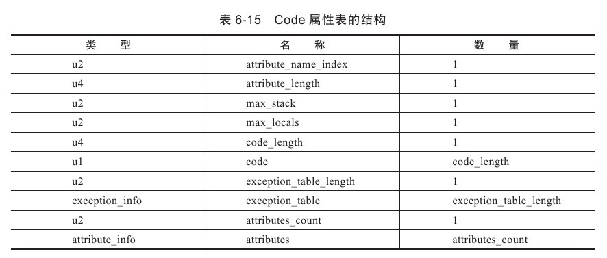
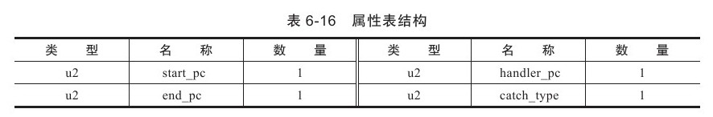
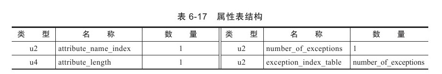
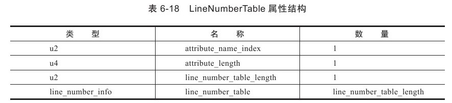
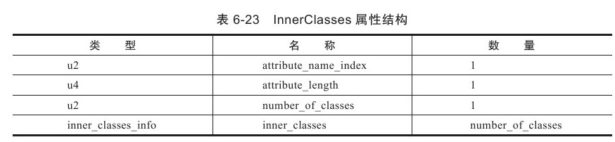
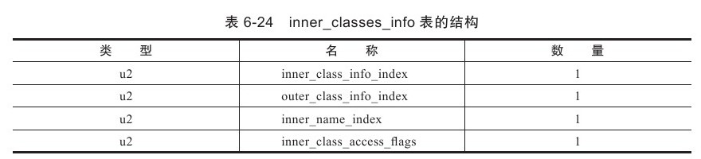
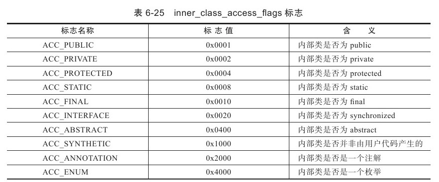
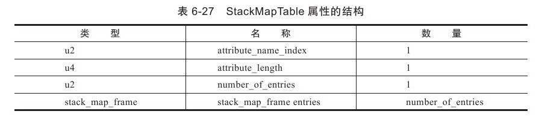
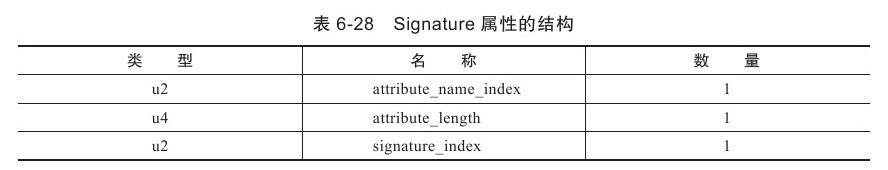
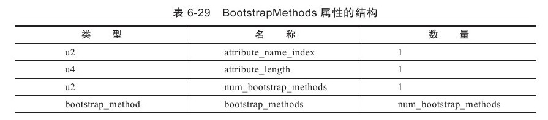

> 在Class文件、字段表、方法表都可以携带自己的属性表集合，以用于描述某些场景专有的信息

见<<深入理解Java虚拟机>> 6.3.7章节

#1.Code属性 (方法表-attribute表)
---

 `Code`属性, Java程序方法体中的代码经过Javac编译器处理后，最终变为字节码指令存储在Code属性内。Code属性出现在方法表的属性集合之中，**接口**或者**抽象类中的方法**不存在Code属性. 

  *  `attribute_name_index`: u2类型数据, 是一项指向CONSTANT_Utf8_info型常量的索引，常量值固定为`Code`
 *  `attribute_length`: u4类型数据, 指示了属性值的长度
 * `max_stack`: 操作数栈（Operand Stacks）深度的最大值。在方法执行的任意时刻，操作数栈都不会超过这个深度。虚拟机运行的时候需要根据这个值来分配栈帧（Stack Frame）中的操作栈深度。
* `max_locals`: **局部变量表**所需的存储空间。`max_locals`的单位是`Slot`, `Slot`是虚拟机为局部变量分配内存所使用的最小单位。**1个Slot=32字节**, 长度不超32字节的数据类型用1Slot存放, double和long(64位)则2个Slot. 当代码执行超出一个局部变量的作用域时，这个局部变量所占的Slot可以被其他局部变量所使用，Javac编译器会根据变量的作用域来分配Slot给各个变量使用，然后计算出max_locals的大小。
* `code_length`代表字节码长度，虽然是u4类型(最大值可以达到 $2^{32} -1$), 但虚拟机规范中限制了一个方法不允许超过65535条字节码指令，即它实际只使用了u2($2^{16} -1$)的长度. 超过这个限制，Javac编译器也会拒绝编译。
 * `code`:  用于存储字节码指令的一系列字节流(`code_length`个n1数据)。**每个字节码指令就是一个u1类型的单字节**. 一个u1数据类型的取值范围为0x00~0xFF，对应十进制的 0~255，也就是一共可以表达256条指令，目前，Java虚拟机规范已经定义了其中约200条编码值对应的指令含义.
* `exception_table`, 表示这个方法的显式异常处理表（下文简称异常表）集合，异常表对于Code属性来说并不是必须存在的. 有显式try-catch代码则会有这个异常处理表集合. 
    * 异常表4个字段含义: 如果当字节码在第`start_pc`行到第`end_pc`行之间（不含第end_pc行）出现了类型为catch_type或者其子类的异常（catch_type为指向一个CONSTANT_Class_info型常量的索引），则转到第handler_pc行继续处理。当catch_type的值为0时，代表任意异常情况都需要转向到handler_pc处进行处理。

#2.Exceptions属性(方法表-attribute表)
---
* 列举出方法中可能抛出的受查异常（Checked Excepitons），也就是方法描述时在throws关键字后面列举的异常。

#3.LineNumberTable属性(方法表-attribute表中Code属性的attribute表)
---
* 描述Java源码行号与字节码行号（字节码的偏移量）之间的对应关系, 表现在当抛出异常时，堆栈中将显示出错的行号.
* `line_number_table`是一个数量为`line_number_table_length`、类型为`line_number_info`的集合，`line_number_info`表包括了`start_pc`和`line_number`两个u2类型的数据项，**前者是字节码行号，后者是Java源码行号**。

#4.LocalVariableTable属性(方法表-attribute表)
---
* 描述栈帧中局部变量表中的变量与Java源码中定义的变量之间的关系, 不是运行是必须属性, 默认会生成到Class文件之中. 
* Javac中分别使用-g:none来关闭生成, 最大的影响就是当其他人引用这个方法时，所有的参数名称都将会丢失，IDE将会使用诸如arg0、arg1之类的占位符代替原有的参数名，这对程序运行没有影响，但是会对代码编写带来较大不便，而且在调试期间无法根据参数名称从上下文中获得参数值。

#5.SourceFile属性(类文件-attribute表)
---
* 记录生成这个Class文件的源码文件名称。这个属性也是可选的. 
* Javac中分别使用-g:none来关闭生成. 如果不生成这项属性，当抛出异常时，堆栈中将不会显示出错代码所属的文件名.

#6.ConstantValue属性(字段表-attribute表)
---
* 通知虚拟机自动为静态变量赋值。只有被static关键字修饰的变量（类变量）才可以使用这项属性。

#7.InnerClasses属性(类文件-attribute表)
---
* 记录内部类与宿主类之间的关联
* 如果一个类中定义了内部类，那编译器将会为它以及它所包含的内部类生成InnerClasses属性

* inner_class_access_flags是内部类的访问标志，类似于类的access_flags

#8.Deprecated及Synthetic属性(类, 方法表, 字段表的attribute表)
---
* 标志类型的布尔属性，只存在有和没有的区别，没有属性值的概念。
* `Deprecated`属性用于表示某个类、字段或者方法，已经被程序作者定为不再推荐使用，它可以通过在代码中使用@deprecated注释进行设置。
* `Synthetic`属性代表此字段或者方法并不是由Java源码直接产生的，而是由编译器自行添加的

#9.StackMapTable属性(方法表-attribute表中Code属性的attribute表)
---
* JDK 1.6增加, 是一个复杂的变长属性. 该属性会在虚拟机类加载的字节码验证阶段被新类型检查验证器（Type Checker）使用（见7.3.2节），目的在于代替以前比较消耗性能的基于数据流分析的类型推导验证器。
* StackMapTable属性中包含零至多个栈映射帧（Stack Map Frames），每个栈映射帧都显式或隐式地代表了一个字节码偏移量，用于表示该执行到该字节码时局部变量表和操作数栈的验证类型。类型检查验证器会通过检查目标方法的局部变量和操作数栈所需要的类型来确定一段字节码指令是否符合逻辑约束。

#10.Signature属性(类、属性表和方法表的attribute表)
---
* JDK 1.5新增, 一个可选的定长属性. Signature属性会为记录泛型签名信息. 现在Java的反射API能够获取泛型类型，最终的数据来源也就是这个属性

#11.BootstrapMethods属性(类文件-attribute表)
---
* JDK 1.7新增, 是一个复杂的变长属性, 这个属性用于保存invokedynamic指令引用的引导方法限定符。
* 如果某个类文件结构的常量池中曾经出现过CONSTANT_InvokeDynamic_info类型的常量，那么这个类文件的属性表中必须存在一个明确的BootstrapMethods属性，另外，即使CONSTANT_InvokeDynamic_info类型的常量在常量池中出现过多次，类文件的属性表中最多也只能有一个BootstrapMethods属性。
* BootstrapMethods属性与JSR-292中的InvokeDynamic指令和java.lang.Invoke包关系非常密切，要介绍这个属性的作用，必须先弄清楚InovkeDynamic指令的运作原理. 
* 目前的Javac暂时无法生成InvokeDynamic指令和BootstrapMethods属性，必须通过一些非常规的手段才能使用到它们.

