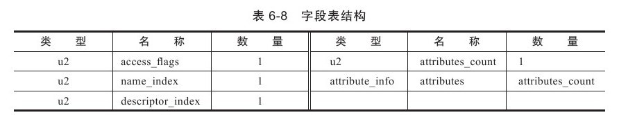
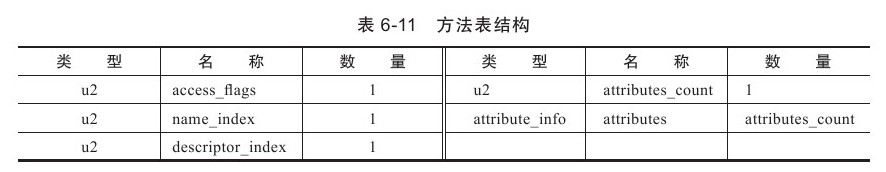

> 任一门功能性语言都可以被编译为被Java虚拟机所接受的有效的字节码Class文件.


# 6.3 Class类文件的结构

> * Java使用"Big-Endian"(大端)顺序来存储数据，最高位字节在地址最低位、最低位字节在地址最高位的. 即8个字节, 
> * x86等处理器使用"Little-Endian"(小端)顺序来存储数据.
> * 在网络上传输数据普遍采用的都是大端. 

> `jclasslib工具`或者idea的`jclasslib`插件可以看到Class文件的结构.

1. 任何一个Class文件都对应着唯一一个类或接口的定义信息
2. Class文件是一组以**8位字节**为基础单位的二进制流，各个数据项目**严格按照顺序**(*见下6.1图*)紧凑地排列在Class文件之中，中间**没有任何分隔符**.
3. Class文件格式采用一种类似于C语言结构体的伪结构来存储数据，这种伪结构中只有两种数据类型：**无符号数**和**表**.
    * 无符号数: **基本的数据类型**，以**u1、u2、u4、u8**来分别代表**1个字节、2个字节、4个字节和8个字节**的无符号数，无符号数可以用来描述**数字、索引引用、数量值**或者按照**UTF-8**编码构成**字符串值**。
    * 表: 由多个**无符号数**或者其他**表**作为数据项构成的**复合数据类型**，所有表都习惯性地以**"_info"**结尾。表用于描述有层次关系的**复合结构的数据**，**整个Class文件本质上就是一张表**.


## 6.3.1 魔数与Class文件的版本

1. 每个Class文件的**头4个字节**称为**魔数（Magic Number）**，它的唯一作用是**确定这个文件是否为一个能被虚拟机接受的Class文件**。虚拟机通过魔数来识别文件而不是后缀, 是为了安全 因为后缀能随意改变. Class文件魔数: `0xCAFEBABE`
2. 魔数后面的**4个字节**是Class文件的被编译**版本号**：第5和第6个字节是**次版本号**（Minor Version），第7和第8个字节是**主版本号**（Major Version）。JDK1.0版本号是从45开始的, JDK1.2从46开始, 以此类推. 高版本的JDK能向下兼容低版本的Class文件. 
``eg: JDK 1.1能支持版本号为45.0~45.65535的Class文件，JDK 1.2则能支持45.0~46.65535的Class文件。JDK1.7支持45.0~51.65535的Class文件``. 


### 以下章节都根据TestClass类来说明结构
---
```
package com.bearo.jvm.chap06;
public class TestClass {
    private int m;
    public int inc() {
        return m + 1;
    }
}
```


## 6.3.2 常量池


1. 主次版本号之后的是常量池入口, 是Class文件结构中与其他项目关联最多的数据类型，也是占用Class文件**空间最大**的数据项目之一，同时它还是在Class文件中**第一个出现**的**表类型**数据项目。
2. 常量池的入口需要放置一项u2类型的数据，代表常量池容量计数值（constant_pool_count）. 容量计数从1开始. `将第0项常量空出来的目的在于满足后面某些指向常量池的索引值的数据在特定情况下需要表达“不引用任何一个常量池项目”的含义，这种情况就可以把索引值置为0来表示`。
3. Class文件结构中只有常量池的容量计数是从1开始，对于其他集合类型，包括接口索引集合、字段表集合、方法表集合等的容量计数都与一般习惯相同，是从0开始的.
4. 常量池中主要存放两大类常量：字面量（Literal）和符号引用（Symbolic References）。
    * **字面量**: 如文本字符串、声明为final的常量值等
    * **符号引用**: 属于编译原理方面的概念，包括了三类常量：**类和接口的全限定名**（Fully Qualified Name）,  **字段的名称和描述符**（Descriptor）, **方法的名称和描述符**.
5. 常量池中每一项常量都是一个表，JDK1.7总共支持**14种表结构数据**.  表开始的**第一位**是一个**u1**类型的**标志位**，代表当前这个常量属于哪种常量类型.  14种常量类型各自均有自己的结构. 


6. jdk提供javap工具的-verbose参数可以输出class文件字节码内容
```
[root]$ javap -verbose TestClass.class 
Classfile /Users/bearomac/workspace_idea/studyDemo/target/classes/com/bearo/jvm/chap06/TestClass.class
  Last modified 2019-12-16; size 395 bytes
  MD5 checksum 48b537bf4bc2bb5058325b9977df0504
  Compiled from "TestClass.java"
public class com.bearo.jvm.chap06.TestClass
  minor version: 0
  major version: 52
  flags: ACC_PUBLIC, ACC_SUPER
Constant pool:
   #1 = Methodref          #4.#18         // java/lang/Object."<init>":()V
   #2 = Fieldref           #3.#19         // com/bearo/jvm/chap06/TestClass.m:I
   #3 = Class              #20            // com/bearo/jvm/chap06/TestClass
   #4 = Class              #21            // java/lang/Object
   #5 = Utf8               m
   #6 = Utf8               I
   #7 = Utf8               <init>
   #8 = Utf8               ()V
   #9 = Utf8               Code
  #10 = Utf8               LineNumberTable
  #11 = Utf8               LocalVariableTable
  #12 = Utf8               this
  #13 = Utf8               Lcom/bearo/jvm/chap06/TestClass;
  #14 = Utf8               inc
  #15 = Utf8               ()I
  #16 = Utf8               SourceFile
  #17 = Utf8               TestClass.java
  #18 = NameAndType        #7:#8          // "<init>":()V
  #19 = NameAndType        #5:#6          // m:I
  #20 = Utf8               com/bearo/jvm/chap06/TestClass
  #21 = Utf8               java/lang/Object
{
  public com.bearo.jvm.chap06.TestClass();
    descriptor: ()V
    flags: ACC_PUBLIC
    Code:
      stack=1, locals=1, args_size=1
         0: aload_0
         1: invokespecial #1                  // Method java/lang/Object."<init>":()V
         4: return
      LineNumberTable:
        line 3: 0
      LocalVariableTable:
        Start  Length  Slot  Name   Signature
            0       5     0  this   Lcom/bearo/jvm/chap06/TestClass;

  public int inc();
    descriptor: ()I
    flags: ACC_PUBLIC
    Code:
      stack=2, locals=1, args_size=1
         0: aload_0
         1: getfield      #2                  // Field m:I
         4: iconst_1
         5: iadd
         6: ireturn
      LineNumberTable:
        line 6: 0
      LocalVariableTable:
        Start  Length  Slot  Name   Signature
            0       7     0  this   Lcom/bearo/jvm/chap06/TestClass;
}
SourceFile: "TestClass.java"
```

## 6.3.3 访问标志


1. 常量池之后的**两个字节**代表访问**标志（access_flags）**，这个标志用于识别**一些类或者接口层次的访问信息**，包括：这个Class是类还是接口；是否定义为public类型；是否定义为abstract类型；如果是类的话，是否被声明为final等.
2. access_flags中一共有16个标志位可以使用，当前只定义了其中8个. 
3. 标志该类的**类型, 修饰**符等. 


## 6.3.4 类索引、父类索引与接口索引集合

1. 在access_flags之后是类索引, 父类索引, 接口数, 接口索引集合
    * **this_class(类索索引)**, **super_class(父类索引)**都是u2类型的数据, 用于确定类/父类的全限定名, 分别指向常量池中某个`CONSTANT_Class_info`, 再通过`CONSTANT_Class_info`类型的常量中的索引值可以找到定义在`CONSTANT_Utf8_info`类型的常量中的全限定名字符串. 
    * **interfaces_count(接口数量)**, 也是u2类型的数据,  接口计数器, 表示索引集合容量.
    * **interfaces(接口索引集合)**, 连续`interfaces_count`个u2类型数据,  指向常量池中某几个`CONSTANT_Class_info`. 


2. 除了java.lang.Object之外，所有的Java类都有父类，因此除了java.lang.Object外，所有Java类的父类索引都不为0.

## 6.3.5 字段表


1. 字段表（field_info）用于描述接口或者类中声明的变量, 不包括方法内部的变量. 
    * **fields_count**: u2类型数据, 表示字段表集合容量, 即字段个数.
    * **fields**: `field_info`字段表集合



2. `field_info`中的`access_flag`与类`access_flag`类似, 都是u2类型数据


3. 在`access_flag`之后是`name_index`和`descriptor_index`, 都是对常量池的引用
    * `name_index`: 字段的简单名称, 指没有类型和参数修饰的字段名称，eg: 字段m的简单名称"m". 而全限定名是包括包路径的全名: `com/bearo/jvm/chap06/TestClass;`(每个全限定名都带分号, 防混淆)
    * `descriptor_index`: 字段描述符的作用是用来描述字段的**数据类型**. 
      * 基本数据类型（byte、char、double、float、int、long、short、boolean）
      * 代表无返回值的void类型都用一个大写字符来表示
      * **对象类型**则用**字符`L`加对象的全限定名来表示**.
      * 数组类型，每一维度将使用一个前置的“[”字符来描述. 一个定义为`java.lang.String[][]`类型的二维数组，将被记录为：`[[Ljava/lang/String;`，一个整型数组`int[]`将被记录为`[I`


4. `attribute_info`. 属性表集合用于存储一些额外的信息，字段都可以在属性表中描述0~n项的额外信息。例如字段m，它的属性表计数器为0，也就是没有需要额外描述的信息. 但是，如果将字段m的声明改为"final static int m=123；"，那就可能会存在一项名称为ConstantValue的属性，其值指向常量123。

5. 字段表集合中不会列出从超类或者父接口中继承而来的字段，但有可能列出原本Java代码之中不存在的字段.

## 6.3.6 方法表集合


1. 方法表的结构如同字段表一样
    * **methods_count**: u2类型数据, 表示方法表集合容量, 即方法个数.
    * **methods**: `method_info`方法表集合


2. `access_flag`: `volatile`和`transient`不能修饰方法，所以方法表的访问标志中没有了`ACC_VOLATILE`标志和`ACC_TRANSIENT`标志。但synchronized、native、strictfp和abstract关键字可以修饰方法，所以增加了`ACC_SYNCHRONIZED`、`ACC_NATIVE`、`ACC_STRICTFP`和`ACC_ABSTRACT`标志


3. 在`access_flag`之后是`name_index`和`descriptor_index`, 都是对常量池的引用
    * `name_index`: 方法的简单名称, 指没有类型和参数修饰的字段名称, inc()方法的简单名称分别是"inc".
    * `descriptor_index`: 字段描述符的作用是用来描述方法的参数列表（包括数量、类型以及顺序）和返回值.
    * 描述符语法: **按照先参数列表，后返回值的顺序描述**，参数列表按照参数的严格顺序放在一组小括号“()”之内。如方法`void inc()`的描述符为`()V`，方法`java.lang.String toString()`的描述符为`()Ljava/lang/String;`，方法`int indexOf(char[]source,int sourceOffset,int sourceCount,char[]target,int targetOffset,int targetCount,int fromIndex)`的描述符为`([CII[CIII)I`. 


4. `attribute_info`,  方法里的**Java代码**，经过编译器编译成字节码指令后，存放在`attribute_info`方法属性表集合中一个名为`Code`的属性里面. 

5. 如果父类方法在子类中没有被重写（Override），方法表集合中就不会出现来自父类的方法信息。但同样的，有可能会出现由编译器自动添加的方法，最典型的便是类构造器`＜clinit＞`方法和实例构造器`＜init＞`.

6. **Java代码**要重载(Overload)一个方法，除了要与原方法具有相同的简单名称之外，还要求必须拥有一个与原方法不同的特征签名. 但在**Class文件**格式中，特征签名的范围更大一些，只要描述符不是完全一致的两个方法也可以共存。也就是说，如果两个方法有相同的名称和特征签名，但返回值不同，那么也是可以合法共存于同一个Class文件中的
    * **特征签名**: Java代码的方法特征签名只包括了方法名称、参数顺序及参数类型，而字节码的特征签名还包括方法返回值以及受查异常表.

##  6.3.7 属性表集合


> 在Class文件、字段表、方法表都可以携带自己的属性表集合，以用于描述某些场景专有的信息

1. 属性表集合不要求各个属性表具有严格顺序, 并且只要不与已有属性名重复，任何人实现的编译器都可以向属性表中写入自己定义的属性信息，Java虚拟机运行时会忽略掉它不认识的属性。
2. 为了能正确解析Class文件, 在最新的《Java虚拟机规范（Java SE 7）》版中，预定义属性已经增加到21项.


3. 每个属性，它的名称需要从常量池中引用一个CONSTANT_Utf8_info类型的常量来表示，而属性值的结构则是完全自定义的，只需要通过一个u4的长度属性去说明属性值所占用的位数即可。
    * `attribute_name_index`, 从常量池中引用一个CONSTANT_Utf8_info类型的常量
    * `attribute_length`, 属性值所占用的位数
    * `info`,   不同属性的其他特定字段值, `attribute_length`个u1类型数据

