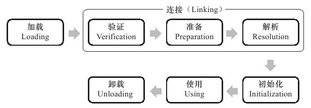
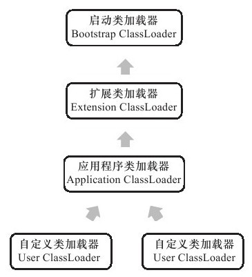
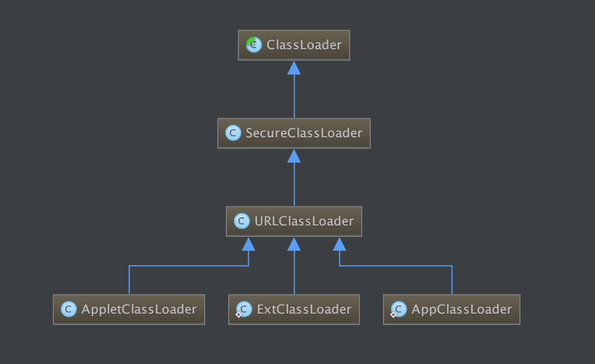
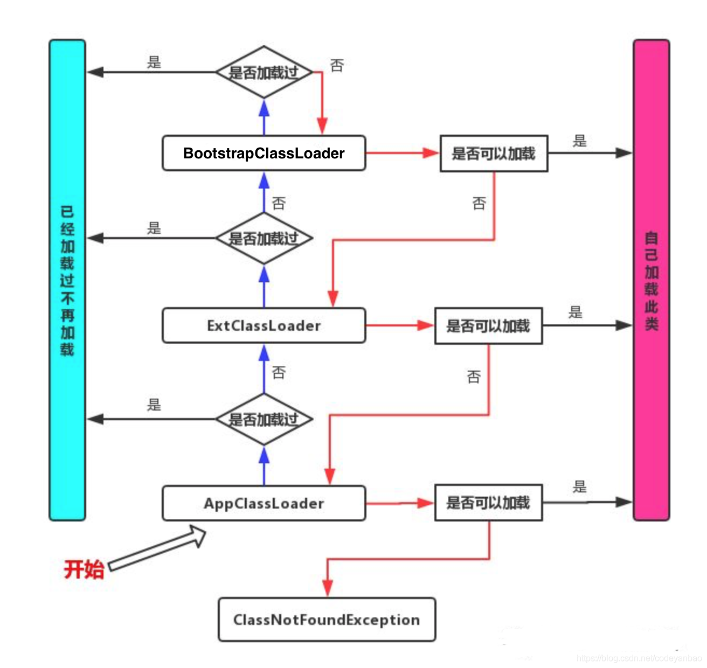

>虚拟机把描述类的数据从Class文件**加载到内存**，并对**数据进行校验**、**转换解析**和**初始化**，最终形成可以被虚拟机直接使用的Java类型，这就是虚拟机的类加载机制。

> 与那些在编译时需要进行连接工作的语言不同，在Java语言里面，**类型的加载、连接和初始化过程**都是在**程序运行期间**完成的，这种策略虽然会令类加载时稍微增加一些性能开销，但是会为Java应用程序提供高度的**灵活性**，Java里天生可以**动态扩展**的语言特性就是依赖**运行期动态加载和动态连接**这个特点实现的。

# 7.2　类加载过程

类从被加载到虚拟机内存中开始，到卸载出内存为止，它的整个生命周期包括：**加载（Loading）、验证（Verification）、准备（Preparation）、解析（Resolution）、初始化（Initialization）、使用（Using）和卸载（Unloading）**7个阶段。其中验证、准备、解析3个部分统称为连接（Linking）




## 7.2.1 加载

- 获取类的二进制字节流

  - zip包读取
  - 网络
  - 动态代理生成

- 将这个字节流所代表的静态存储结构转化为方法区的运行时数据结

- 在内存中生成一个代表这个类的java.lang.Class对象

  

## 7.2.2 验证

- 文件格式验证

- 元数据验证

- 字节码验证

- 符号应用验证

  

## 7.2.3 准备

为静态变量分配内存并赋初始化值

```
public static int value = 32;
```

初始化值指的是value的类型int的初始值: 0


## 7.2.4 解析

是Java虚拟机将常量池内的符号引用替换为直接引用的过程


## 7.2.5 初始化

到初始化阶段Java虚拟机才真正开始执行类中编写的Java程序代码.

初始化阶段就是执行类构造器`<clinit>()`方法的过程. `<clinit>()`并不是程序员在Java代码中直接编写的方法，它是Javac编译器的自动生成. 

给对象赋上代码初始值


# 7.3　类加载器

## 7.3.1 双亲委派模型(Parents Delegation Model)










## 7.3.2 双亲委派的作用

> 双亲委派：如果一个类加载器收到了加载某个类的请求,则该类加载器并不会去加载该类,而是把这个请求委派给父类加载器,每一个层次的类加载器都是如此,因此所有的类加载请求最终都会传送到顶端的启动类加载器;只有当父类加载器在其搜索范围内无法找到所需的类,并将该结果反馈给子类加载器,子类加载器会尝试去自己加载。

对于任意一个类，都需要由**加载它的类加载器**和这个**类本身**来一同确立其在Java虚拟机中的**唯一性**。 

因此, 双亲委派模式可以保证已加载类的唯一性, 避免类型转化失败, 从一定程度上防止了危险代码的植入. 