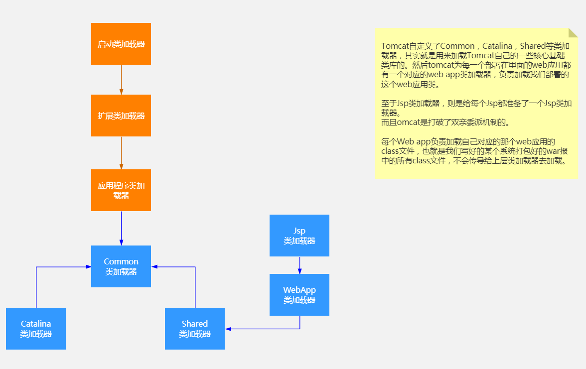
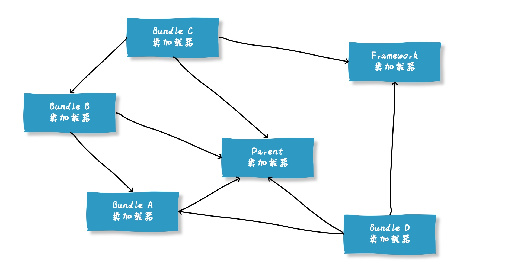

>虚拟机把描述类的数据从Class文件**加载到内存**，并对**数据进行校验**、**转换解析**和**初始化**，最终形成可以被虚拟机直接使用的Java类型，这就是虚拟机的类加载机制。

> 与那些在编译时需要进行连接工作的语言不同，在Java语言里面，**类型的加载、连接和初始化过程**都是在**程序运行期间**完成的，这种策略虽然会令类加载时稍微增加一些性能开销，但是会为Java应用程序提供高度的**灵活性**，Java里天生可以**动态扩展**的语言特性就是依赖**运行期动态加载和动态连接**这个特点实现的。

# 7.2　类加载过程

类从被加载到虚拟机内存中开始，到卸载出内存为止，它的整个生命周期包括：**加载（Loading）、验证（Verification）、准备（Preparation）、解析（Resolution）、初始化（Initialization）、使用（Using）和卸载（Unloading）**7个阶段。其中验证、准备、解析3个部分统称为连接（Linking）


## 7.2.1 加载

- 获取类的二进制字节流

  - zip包读取
  - 网络
  - 动态代理生成

- 将这个字节流所代表的静态存储结构转化为方法区的运行时数据结

- 在内存中生成一个代表这个类的java.lang.Class对象

  

## 7.2.2 验证

- 文件格式验证

- 元数据验证

- 字节码验证

- 符号应用验证

  

## 7.2.3 准备

- 为类分配空间
- 为类的静态变量分配内存并赋初始化值

```
public static int value = 32;
```

初始化值指的是value的类型int的初始值: 0


## 7.2.4 解析

是Java虚拟机将常量池内的符号引用替换为直接引用的过程


## 7.2.5 初始化

到初始化阶段Java虚拟机才真正开始执行类中编写的Java程序代码.

初始化阶段就是执行类构造器`<clinit>()`方法的过程. `<clinit>()`并不是程序员在Java代码中直接编写的方法，它是Javac编译器的自动生成. 

给对象赋上代码的初始值.


# 7.3　类加载器

## 7.3.1 双亲委派模型(Parents Delegation Model)


## 7.3.2 双亲委派的作用

> 双亲委派：如果一个类加载器收到了加载某个类的请求, 则该类加载器并不会去加载该类, 而是把这个请求委派给父类加载器, 每一个层次的类加载器都是如此,因此所有的类加载请求最终都会传送到顶端的启动类加载器; 只有当父类加载器在其搜索范围内无法找到所需的类,并将该结果反馈给子类加载器,子类加载器会尝试去自己加载。

对于任意一个类，都需要由**加载它的类加载器**和这个**类本身**来一同确立其在Java虚拟机中的**唯一性**。 

因此, 双亲委派模式可以保证已加载类的唯一性, 避免类型转化失败, 从一定程度上防止了危险代码的植入. 


## 7.3.3 Tomcat的类加载器





## 7.3.4 破坏双亲委派机制

双亲委派机制是在哪里实现的? 是在`ClassLoader`类的`loadClass()`方法实现的. 

`CLassLoader的loadClass()代码`

```java
protected Class<?> loadClass(String name, boolean resolve)
    throws ClassNotFoundException
{
    synchronized (getClassLoadingLock(name)) {
        // First, check if the class has already been loaded
        Class<?> c = findLoadedClass(name);
        if (c == null) {
            long t0 = System.nanoTime();
            try {
                if (parent != null) {
                    c = parent.loadClass(name, false);
                } else {
                    c = findBootstrapClassOrNull(name);
                }
            } catch (ClassNotFoundException e) {
                // ClassNotFoundException thrown if class not found
                // from the non-null parent class loader
            }

            if (c == null) {
                // If still not found, then invoke findClass in order
                // to find the class.
                long t1 = System.nanoTime();
                c = findClass(name);

                // this is the defining class loader; record the stats
                sun.misc.PerfCounter.getParentDelegationTime().addTime(t1 - t0);
                sun.misc.PerfCounter.getFindClassTime().addElapsedTimeFrom(t1);
                sun.misc.PerfCounter.getFindClasses().increment();
            }
        }
        if (resolve) {
            resolveClass(c);
        }
        return c;
    }
}
```


如果我们不想使用系统自带的双亲委派模式, 只要自定义类加载器，**重写**`loadClass()`方法即可.

```java
public class MyClassLoader extends ClassLoader {

    private String classPath = "D:/tmp/";

    public MyClassLoader(String classPath) {
        this.classPath = classPath;
    }

    public MyClassLoader() {
    }

    @Override
    protected Class<?> findClass(String name) {
        // 1、获取class文件二进制字节数组
        byte[] data = null;
        try(FileInputStream fis = new FileInputStream(classPath + "/" + name.replaceAll("\\.", "/") + ".class")){
            int len = fis.available();
            data = new byte[len];
            fis.read(data);
        } catch (FileNotFoundException e) {
            e.printStackTrace();
        } catch (IOException e) {
            e.printStackTrace();
        }
        // 2、字节码数组加载到 JVM 的方法区，
        // 并在 JVM 的堆区建立一个java.lang.Class对象的实例
        // 用来封装 Java 类相关的数据和方法
        return this.defineClass(name, data, 0, data.length);
    }

    @Override
    public Class<?> loadClass(String name, boolean resolve) throws ClassNotFoundException {
        synchronized (getClassLoadingLock(name)) {
            // 尝试加载，不存在直接去findClass ，不走委托父类
            Class<?> c = findLoadedClass(name);
            if (c == null) {
                // 程序的类, 自己加载
                if (name.startsWith("com.threegene")){
                    c = findClass(name);
                }else{
                    // 非程序的类交由父加载器去加载
                    c = this.getParent().loadClass(name);
                }
            }
            if (resolve) {
                resolveClass(c);
            }
            return c;
        }
    }

    public static void main(String[] args) throws Exception {

        // 初始化TestClassLoader，并将加载TestClassLoader类的类加载器
        // 设置为TestClassLoader的parent
        MyClassLoader myClassLoader = new MyClassLoader();
        System.out.println("TestClassLoader的父类加载器：" + myClassLoader.getParent());
        // 加载 Demo
        Class clazz = myClassLoader.loadClass("com.threegene.PayInfo");
        System.out.println("Demo的类加载器：" + clazz.getClassLoader());
    }
}
```


# 7.4 双亲委派的面试题

## 1、什么是双亲委派？

当一个类加载器收到了类加载的请求的时候，他不会直接去加载指定的类，而是把这个请求委托给自己的父加载器去加载。只有父加载器无法加载这个类的时候，才会由当前这个加载器来负责类的加载。

那么，什么情况下父加载器会无法加载某一个类呢？

其实，Java中提供的这四种类型的加载器，是有各自的职责的：

`Bootstrap ClassLoader` ，主要负责加载Java核心类库，`%JRE_HOME%\lib`下的rt.jar、resources.jar、charsets.jar和class等。
`Extention ClassLoader`，主要负责加载目录`%JRE_HOME%\lib\ext`目录下的jar包和class文件。
`Application ClassLoader` ，主要负责加载当前应用的classpath下的所有类
`User ClassLoader` ， 用户自定义的类加载器,可加载指定路径的class文件
那么也就是说，一个用户自定义的类，如`com.bearo.Test` 是无论如何也不会被`Bootstrap`和`Extention加载器`加载的。

## 2、为什么需要双亲委派，不委派有什么问题？

这种机制有几个好处。

首先，通过委派的方式，可以避免类的重复加载，当父加载器已经加载过某一个类时，子加载器就不会再重新加载这个类。

另外，通过双亲委派的方式，还保证了安全性。因为Bootstrap ClassLoader在加载的时候，只会加载JAVA_HOME中的jar包里面的类，如java.lang.Integer，那么这个类是不会被随意替换的，除非有人跑到你的机器上， 破坏你的JDK。

那么，就可以避免有人自定义一个有破坏功能的java.lang.Integer被加载。这样可以有效的防止核心Java API被篡改。


## 3、"父加载器"和"子加载器"之间的关系是继承的吗？

双亲委派模型中，类加载器之间的父子关系一般不会以继承（Inheritance）的关系来实现，而是都使用组合（Composition）关系来复用父加载器的代码的。

```java
// ClassLoader中父加载器的定义：
public abstract class ClassLoader {
    // The parent class loader for delegation
    private final ClassLoader parent;
}
```


## 4、双亲委派是怎么实现的？ 

主要就是以下几个步骤：

1、先检查类是否已经被加载过 

2、若没有加载则调用父加载器的loadClass()方法进行加载 

3、若父加载器为空则默认使用启动类加载器作为父加载器。 

4、如果父类加载失败，抛出ClassNotFoundException异常后，再调用自己的findClass()方法进行加载。

`CLassLoader的loadClass()代码`

```java
protected Class<?> loadClass(String name, boolean resolve)
    throws ClassNotFoundException
{
    synchronized (getClassLoadingLock(name)) {
        // First, check if the class has already been loaded
        Class<?> c = findLoadedClass(name);
        if (c == null) {
            long t0 = System.nanoTime();
            try {
                if (parent != null) {
                    c = parent.loadClass(name, false);
                } else {
                    c = findBootstrapClassOrNull(name);
                }
            } catch (ClassNotFoundException e) {
                // ClassNotFoundException thrown if class not found
                // from the non-null parent class loader
            }

            if (c == null) {
                // If still not found, then invoke findClass in order
                // to find the class.
                long t1 = System.nanoTime();
                c = findClass(name);

                // this is the defining class loader; record the stats
                sun.misc.PerfCounter.getParentDelegationTime().addTime(t1 - t0);
                sun.misc.PerfCounter.getFindClassTime().addElapsedTimeFrom(t1);
                sun.misc.PerfCounter.getFindClasses().increment();
            }
        }
        if (resolve) {
            resolveClass(c);
        }
        return c;
    }
}
```

## 5、我能不能主动破坏这种双亲委派机制？怎么破坏？

自定义一个类加载器，重写其中的loadClass方法，使其不进行双亲委派即可。


## 6、为什么重写loadClass方法可以破坏双亲委派，这个方法和findClass（）、defineClass（）区别是什么？

- loadClass()	就是主要进行类加载的方法，默认的双亲委派机制就实现在这个方法中。
  
- findClass()	根据名称或位置加载.class字节码
  
- defineClass()	把字节码转化为Class
  


这里面需要展开讲一下loadClass和findClass，我们前面说过，当我们想要自定义一个类加载器的时候，并且像破坏双亲委派原则时，我们会重写loadClass方法。

那么，如果我们想定义一个类加载器，但是不想破坏双亲委派模型的时候呢？

这时候，就可以继承ClassLoader，并且重写findClass方法。findClass()方法是JDK1.2之后的ClassLoader新添加的一个方法。

```java
/**
 * @since  1.2
 */
protected Class<?> findClass(String name) throws ClassNotFoundException {
    throw new ClassNotFoundException(name);
}
```

这个方法只抛出了一个异常，没有默认实现。

JDK1.2之后已不再提倡用户直接覆盖loadClass()方法，而是建议把自己的类加载逻辑实现到findClass()方法中。

因为在loadClass()方法的逻辑里，如果父类加载器加载失败，则会调用自己的findClass()方法来完成加载。

所以，如果你想定义一个自己的类加载器，并且要遵守双亲委派模型，那么可以继承ClassLoader，并且在findClass中实现你自己的加载逻辑即可。


## 7、说一说你知道的双亲委派被破坏的例子吧

**第一种被破坏的情况是在双亲委派出现之前。**

由于双亲委派模型是在JDK1.2之后才被引入的，而在这之前已经有用户自定义类加载器在用了。所以，这些是没有遵守双亲委派原则的。

**第二种，是JNDI、JDBC等需要加载SPI接口实现类的情况。**

**第三种是为了实现热插拔热部署工具。**

为了让代码动态生效而无需重启，实现方式时把模块连同类加载器一起换掉就实现了代码的热替换。

**第四种时tomcat等web容器的出现。**

**第五种时OSGI、Jigsaw等模块化技术的应用。**


## 8、为什么JNDI、JDBC等需要破坏双亲委派？

我们日常开发中，大多数时候会通过API的方式调用Java提供的那些基础类，这些基础类时被Bootstrap加载的。

但是，调用方式除了API之外，还有一种SPI的方式。

如典型的JDBC服务，我们通常通过以下方式创建数据库连接：

`Connection conn = DriverManager.getConnection("jdbc:mysql://localhost:3306/mysql", "root", "1234");`
在以上代码执行之前，`DriverManager`会先被类加载器加载，因为`java.sql.DriverManager`类是位于rt.jar下面的 ，所以他会被**根加载器**加载。

在类加载时，会执行该类的静态方法。其中有一段关键的代码是：

ServiceLoader<Driver> loadedDrivers = ServiceLoader.load(Driver.class);
这段代码，会尝试加载classpath下面的所有实现了Driver接口的实现类。

那么，问题就来了。

DriverManager是被根加载器加载的，那么在加载时遇到以上代码，会尝试加载所有Driver的实现类，但是这些实现类基本都是第三方提供的，根据双亲委派原则，第三方的类不能被根加载器加载。

那么，怎么解决这个问题呢？

于是，就在JDBC中通过引入`ThreadContextClassLoader`（线程上下文加载器，默认情况下是AppClassLoader）的方式破坏了双亲委派原则。

我们深入到ServiceLoader.load方法就可以看到：

```java
public static <S> ServiceLoader<S> load(Class<S> service) {
    // 获取当前线程的线程上下文类加载器 AppClassLoader，用于加载 classpath 中的具体实现类。
    ClassLoader cl = Thread.currentThread().getContextClassLoader();
    return ServiceLoader.load(service, cl);
}
```


## 9、为什么TOMCAT要破坏双亲委派？

Tomcat是web容器，那么一个web容器可能需要部署多个应用程序。

不同的应用程序可能会依赖同一个第三方类库的不同版本，但是不同版本的类库中某一个类的全路径名可能是一样的。

如多个应用都要依赖hollis.jar，但是A应用需要依赖1.0.0版本，但是B应用需要依赖1.0.1版本。这两个版本中都有一个类是com.bearo.Test.class。

如果采用默认的双亲委派类加载机制，那么是无法加载多个相同的类。

所以，Tomcat破坏双亲委派原则，提供隔离的机制，为每个web容器单独提供一个WebAppClassLoader加载器。

Tomcat的类加载机制：

**为了实现应用隔离性**，优先加载 Web 应用自己定义的类，所以没有遵照双亲委派的约定，每一个应用自己的类加载器——WebAppClassLoader负责加载本身的目录下的class文件，加载不到时再交给CommonClassLoader加载，这和双亲委派刚好相反。


## 10、谈谈你对模块化技术的理解吧！

在JDK 9中已经应用了模块化的技术。

其实早在JDK 9之前，OSGI这种框架已经是模块化的了，**而OSGI之所以能够实现模块热插拔和模块内部可见性的精准控制都归结于其特殊的类加载机制，加载器之间的关系不再是双亲委派模型的树状结构，而是发展成复杂的网状结构。**




在JDK中，双亲委派也不是绝对的了。

在JDK9之前，JVM的基础类以前都是在rt.jar这个包里，这个包也是JRE运行的基石。

这不仅是违反了单一职责原则，同样程序在编译的时候会将很多无用的类也一并打包，造成臃肿。

在JDK9中，整个JDK都基于模块化进行构建，以前的rt.jar, tool.jar被拆分成数十个模块，编译的时候只编译实际用到的模块，同时各个类加载器各司其职，只加载自己负责的模块。

```java
Class<?> c = findLoadedClass(cn);
if (c == null) {
    // 找到当前类属于哪个模块
    LoadedModule loadedModule = findLoadedModule(cn);
    if (loadedModule != null) {
        //获取当前模块的类加载器
        BuiltinClassLoader loader = loadedModule.loader();
        //进行类加载
        c = findClassInModuleOrNull(loadedModule, cn);
     } else {
          // 找不到模块信息才会进行双亲委派
            if (parent != null) {
              c = parent.loadClassOrNull(cn);
            }
      }
}
```

