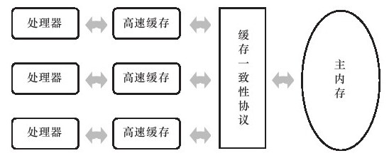
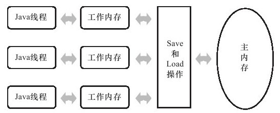
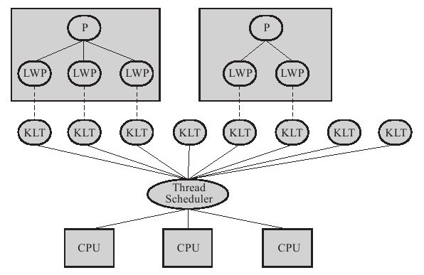
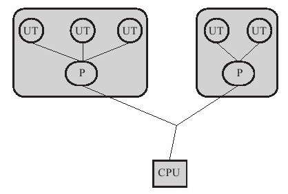
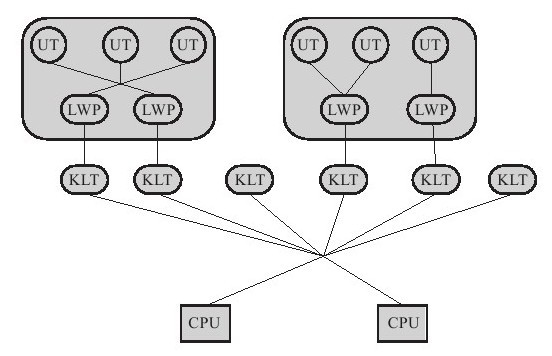

> 并发处理的广泛应用是使得Amdahl定律代替摩尔定律[[1]](https://www.neat-reader.cn/part0179.xhtml#ch1-back)成为计算机性能发展源动力的根本原因，也是人类“压榨”计算机运算能力的最有力武器。

# 1. 硬件的效率与一致性
由于计算机的存储设备与处理器的运算速度有几个数量级的差距，所以现代计算机系统都不得不加入一层读写速度尽可能接近处理器运算速度的**高速缓存**（Cache）来作为内存与处理器之间的缓冲：`将运算需要使用到的数据复制到缓存中，让运算能快速进行，当运算结束后再从缓存同步回内存之中`，这样处理器就无须等待缓慢的内存读写了。

基于高速缓存的存储交互很好地解决了处理器与内存的速度矛盾，但是也为计算机系统带来更高的复杂度，因为它引入了一个新的问题：**缓存一致性**（Cache Coherence）。

---

# 2. Java内存模型

### 2.1 主内存于工作内存

Java内存模型规定了所有的变量都存储在主内存（Main Memory）中。每条线程还有自己的工作内存，线程的工作内存中保存了被该线程使用到的变量的**主内存副本拷贝**，线程对变量的所有操作（读取、赋值等）都必须在工作内存中进行，而**不能直接读写主内存中的变量**。不同的线程之间也无法直接访问对方工作内存中的变量，**线程间变量值的传递均需要通过主内存来完成**。

### 2.2 内存间交互操作
主内存与工作内存之间具体的交互, Java内存模型中定义了以下8种操作来完成(*每一种操作都是原子的、不可再分的*)
> - lock（锁定）：作用于主内存的变量，它把一个变量标识为一条线程独占的状态。
> - unlock（解锁）：作用于主内存的变量，它把一个处于锁定状态的变量释放出来，释放后的变量才可以被其他线程锁定。
> - read（读取）：作用于主内存的变量，它把一个变量的值从主内存传输到线程的工作内存中，以便随后的load动作使用。
> - load（载入）：作用于工作内存的变量，它把read操作从主内存中得到的变量值放入工作内存的变量副本中。
> - use（使用）：作用于工作内存的变量，它**把工作内存中一个变量的值传递给执行引擎**，每当虚拟机遇到一个需要使用到变量的值的字节码指令时将会执行这个操作。
> - assign（赋值）：作用于工作内存的变量，它**把一个从执行引擎接收到的值赋给工作内存的变量**，每当虚拟机遇到一个给变量赋值的字节码指令时执行这个操作。
> - store（存储）：作用于工作内存的变量，它把工作内存中一个变量的值传送到主内存中，以便随后的write操作使用。
> - write（写入）：作用于主内存的变量，它把store操作从工作内存中得到的变量的值放入主内存的变量中。

- read和load操作, store和write操作必须按顺序执行，而不要求是连续执行.
- Java内存模型还规定了在执行上述8种基本操作时必须满足如下规则：
  1. 不允许read和load、store和write操作之一单独出现
  2. 不允许一个线程丢弃它的最近的assign操作，即变量在工作内存中改变了之后必须把该变化同步回主内存。
  3. 不允许一个线程无原因地（没有发生过任何assign操作）把数据从线程的工作内存同步回主内存中。
  4. 一个新的变量只能在主内存中“诞生”，不允许在工作内存中直接使用一个未被初始化（load或assign）的变量，换句话说，就是对一个变量实施use、store操作之前，必须先执行过了assign和load操作。
  5. 一个变量在同一个时刻只允许一条线程对其进行lock操作，但lock操作可以被**同一条线程重复执行多次**，多次执行lock后，只有**执行相同次数的unlock操作**，变量才会被解锁。
  6. 如果对一个变量执行lock操作，那将会清空工作内存中此变量的值，在执行引擎使用这个变量前，需要重新执行load或assign操作初始化变量的值。
  7. 如果一个变量事先没有被lock操作锁定，那就不允许对它执行unlock操作，也不允许去unlock一个被其他线程锁定住的变量。
  8. 对一个变量执行unlock操作之前，必须先把此变量同步回主内存中（执行store、write操作）。

### 2.3 volatile型变量的特殊规则
> 关键字volatile可以说是Java虚拟机提供的最轻量级的同步机制

> 可以确定一个原则：volatile变量读操作的性能消耗与普通变量几乎没有什么差别，但是写操作则可能会慢一些，因为它需要在本地代码中插入许多内存屏障指令来保证处理器不发生乱序执行.

volatile变量具备两种特性:  对所有线程可见, 禁止指令重排序优化
- **可见性**是指当一条线程修改了这个变量的值，新值对于其他线程来说是可以立即得知的. 
  - 普通变量的值在线程间传递均需要通过主内存来完成,  而volatile变量在每次使用之前都要先刷新，执行引擎看不到不一致的情况. 
  - 但**不表明volatile变量的运算在并发下是安全的**. 并发安全仍然需要保证**操作的原子性**.
- 禁止指令重新排序
  - 在汇编代码中, volatile变量赋值后, 会**多执行了一个"lock"操作**，这个操作相当于一个内存屏障（Memory Barrier或Memory Fence)，指重排序时不能把后面的指令重排序到lock内存屏障之前的位置. 
  - 从硬件架构上讲，指令重排序是指CPU采用了允许将多条指令不按程序规定的顺序分开发送给各相应电路单元处理。但并不是说指令任意重排，CPU需要能正确处理指令依赖情况以保障程序能得出正确的执行结果

### 2.4 对于long和double型变量的特殊规则

Java内存模型要求lock、unlock、read、load、assign、use、store、write这8个操作都具有原子性，但是对于64位的数据类型（long和double），在模型中特别定义了一条相对宽松的规定：允许虚拟机将没有被volatile修饰的64位数据的读写操作划分为两次32位的操作来进行，即允许虚拟机实现选择可以不保证64位数据类型的load、store、read和write这4个操作的原子性，这就是所谓的**long和double的非原子性协定**（Nonatomic Treatment ofdouble and long Variables）。

如果有多个线程共享一个并未声明为volatile的long或double类型的变量，并且同时对它们进行读取和修改操作，那么某些线程可能会读取到一个既非原值，也不是其他线程修改值的代表了“半个变量”的数值。

在实际开发中，目前各种平台下的**商用虚拟机几乎都选择把64位数据的读写操作作为原子操作**来对待.

### 2.5 原子性、可见性与有序性
> Java内存模型是围绕着在并发过程中如何处理**原子性、可见性**和**有序性**这3个特征来建立的

#### 原子性
如果需要一个更大范围的原子性保证，Java内存模型还提供了**lock和unlock**操作来满足这种需求，尽管虚拟机未把lock和unlock操作直接开放给用户使用，但是却提供了更高层次的**字节码指令monitorenter**和**monitorexit**来隐式地使用这两个操作，这两个字节码指令反映到Java代码中就是同步块 - **synchronized**关键字。

#### 可见性
是指当一个线程修改了共享变量的值，其他线程能够立即得知这个修改.

Java内存模型是通过在变量修改后将新值同步回主内存，在变量读取前从主内存刷新变量值这种依赖主内存作为传递媒介的方式来实现可见性的，无论是普通变量还是volatile变量都是如此，普通变量与volatile变量的区别是，**volatile的特殊规则保证了新值能立即同步到主内存，以及每次使用前立即从主内存刷新**。

Java还有两个关键字能实现可见性，即**synchronized和final**。
- synchronized的可见性是由“对一个变量执行unlock操作之前，必须先把此变量同步回主内存中（执行store、write操作）”这条规则获得的，
- final关键字的可见性是指：被final修饰的字段在构造器中一旦初始化完成，并且构造器没有把"this"的引用传递出去（this引用逃逸是一件很危险的事情，其他线程有可能通过这个引用访问到“初始化了一半”的对象），那在其他线程中就能看见final字段的值。

#### 有序性
Java程序中天然的有序性可以总结为一句话：如果在本线程内观察，所有的操作都是有序的；如果在一个线程中观察另一个线程，所有的操作都是无序的. 前半句是指“线程内表现为串行的语义”（Within-Thread As-If-Serial Semantics），后半句是指“指令重排序”现象和“工作内存与主内存同步延迟”现象。

Java语言提供了**volatile**和**synchronized**两个关键字来保证线程之间操作的有序性，
-  volatile关键字本身就包含了禁止指令重排序的语义，
- synchronized则是由“一个变量在同一个时刻只允许一条线程对其进行lock操作”这条规则获得的，这条规则决定了持有同一个锁的两个同步块只能串行地进入。

关键字|可见性|原子性|有序性
:-:|:-:|:-:|:-:
volatile | √ | |  √ |
synchronized | √  | √  |  √ |
final |  √ | | |

### 2.6 先行发生(happens-before)原则

Java语言中有一个“先行发生”（happens-before）的原则, 判断数据是否存在竞争、线程是否安全的主要依据. 

**先行发生原则**是Java内存模型中定义的两项操作之间的**偏序关系**，如果说操作A先行发生于操作B，其实就是说在发生操作B之前，操作A产生的影响能被操作B观察到. 

[偏序关系 -> [偏序link](https://www.jianshu.com/writer#/notebooks/35909201/notes/50059174/preview)]

Java内存模型有一些“天然的”先行发生规则: 
1. 程序次序规则（Program Order Rule）：在**一个线程内**，按照程序代码顺序，书写在前面的操作先行发生于书写在后面的操作。准确地说，应该是控制流顺序而不是程序代码顺序，因为要考虑分支、循环等结构。

2. 管程锁定规则（Monitor Lock Rule）：一个unlock操作先行发生于后面对同一个锁的lock操作。这里必须强调的是**同一个锁**，而“后面”是指时间上的先后顺序。

3. volatile变量规则（Volatile Variable Rule）：对一个volatile变量的写操作先行发生于后面对这个变量的读操作，这里的“后面”同样是指时间上的先后顺序。

4. 线程启动规则（Thread Start Rule）：Thread对象的**start()**方法先行发生于此线程的每一个动作。

5. 线程终止规则（Thread Termination Rule）：线程中的所有操作都先行发生于对此线程的终止检测，我们可以通过Thread.join()方法结束、Thread.isAlive()的返回值等手段检测到线程已经终止执行。

6. 线程中断规则（Thread Interruption Rule）：对线程interrupt()方法的调用先行发生于被中断线程的代码检测到中断事件的发生，可以通过Thread.interrupted()方法检测到是否有中断发生。

7. 对象终结规则（Finalizer Rule）：一个对象的初始化完成（构造函数执行结束）先行发生于它的finalize()方法的开始。

8. 传递性（Transitivity）：如果操作A先行发生于操作B，操作B先行发生于操作C，那就可以得出操作A先行发生于操作C的结论。**传递性是偏序关系的一个特征**.

如果两个操作之间的关系**不满足以上规则之一**，它们就没有顺序性保障，虚拟机可以对它们随意地进行**重排序**。

- 一个操作“**时间上的先发生**”不代表这个操作会是“**先行发生**”
- 一个操作“**先行发生**”也不代表是“**时间上的先发生**”,  因为存在虚拟机的“指令重排序”.  
> 时间先后顺序与先行发生原则之间基本没有太大的关系，我们**衡量并发安全问题**的时候一切必须**以先行发生原则为准**。

---

# 3. Java与线程
### 3.1 线程的实现

> 线程是CPU调度的基本单位, 比进程更轻量级的调度执行单位

实现线程主要有3种方式：**内核线程**实现、**用户线程**实现和**用户线程+轻量级*进程*混合**实现。

#### 内核线程实现

内核线程（Kernel-Level Thread,KLT）就是直接由操作**系统内核**（Kernel，下称内核）支持的线程，这种线程由内核来完成线程切换，内核通过操纵**调度器**（Scheduler）对线程进行调度，并负责将线程的任务映射到各个处理器上。每个内核线程可以视为内核的一个分身，这样操作系统就有能力同时处理多件事情，支持**多线程的内核**就叫做**多线程内核**（Multi-Threads Kernel）。

内核线程提供一种高级接口 - **轻量级进程`(这里用词是进程)`**（Light Weight Process,LWP），轻量级进程就是我们通常意义上所讲的线程，由于**每个轻量级进程都由一个内核线程支持**，因此只有先支持内核线程，才能有轻量级进程。这种**内核线程与轻量级进程之间1:1的关系称为一对一的线程模型**. 

由于内核线程的支持，**每个轻量级进程都成为一个独立的调度单元**. 轻量级进程具有它的局限性：首先，由于是基于内核线程实现的，所以各种线程操作，如创建、析构及同步，都需要进行系统调用。而系统调用的**代价**相对较高，**需要在用户态（User Mode）和内核态（Kernel Mode）中来回切换**。其次，每个轻量级进程都需要有一个内核线程的支持，因此轻量级进程要**消耗一定的内核资源**（如内核线程的栈空间），因此**一个系统支持轻量级进程的数量是有限**的。

#### 用户线程实现

从广义上来讲，一个线程只要不是内核线程，就可以认为是用户线程（User Thread,UT），因此，从这个定义上来讲，轻量级进程也属于用户线程，但轻量级进程的实现始终是建立在内核之上的，许多操作都要进行系统调用，效率会受到限制。

而狭义上的用户线程指的是完全建立在用户空间的线程库上，系统内核不能感知线程存在的实现。用户线程的建立、同步、销毁和调度完全在用户态中完成，不需要内核的帮助。如果程序实现得当，这种线程不需要切换到内核态，因此操作可以是非常快速且低消耗的，也可以支持规模更大的线程数量，部分高性能数据库中的多线程就是由用户线程实现的。这种**进程与用户线程之间1:N的关系称为一对多的线程模型**.

使用用户线程的优势在于不需要系统内核支援，劣势也在于没有系统内核的支援，所有的线程操作都需要用户程序自己处理. 由于操作系统只把处理器资源分配到进程, 用户线程的创建、切换和调度问题的处理异常困难, **Java、Ruby等语言都曾经使用过用户线程，最终又都放弃使用它**。

#### 用户线程+轻量级进程混合

既存在用户线程，也存在轻量级进程。用户线程还是完全建立在用户空间中，因此用户线程的创建、切换、析构等操作依然廉价，并且可以支持大规模的用户线程并发。而操作系统提供支持的轻量级进程则作为用户线程和内核线程之间的桥梁，这样可以使用内核提供的线程调度功能及处理器映射，并且用户线程的系统调用要通过轻量级线程来完成，大大降低了整个进程被完全阻塞的风险。在这种混合模式中，**用户线程与轻量级进程的数量比是不定的，即为N:M的关系，这种就是多对多的线程模型**。

#### Java线程的实现

Java线程在JDK 1.2之前，是基于用户线程实现的，而在JDK 1.2中，线程模型替换为基于操作系统原生线程模型来实现.  因此目前, 操作系统支持怎样的线程模型，在很大程度上决定了Java虚拟机的线程是怎样映射的，这点在不同的平台上没有办法达成一致，虚拟机规范中也并未限定Java线程需要使用哪种线程模型来实现。线程模型只对线程的并发规模和操作成本产生影响. 

> 对于Sun JDK来说，它的Windows版与Linux版都是使用一对一的线程模型实现的，一条Java线程就映射到一条轻量级进程之中，因为Windows和Linux系统提供的线程模型就是一对一的

