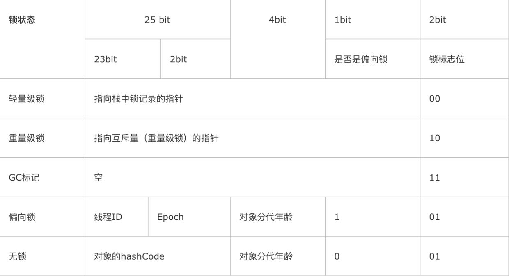

> **并发处理**的广泛应用是使得**Amdahl(阿姆达)定律**代替摩尔定律成为计算机性能发展源动力的根本原因，也是人类“压榨”计算机运算能力的最有力武器。

#  1. 线程安全

>《Java Concurrency In Practice》的作者Brian Goetz对“**线程安全**”有一个比较恰当的定义:
**当多个线程访问一个对象时，如果不用考虑这些线程在运行时环境下的调度和交替执行，也不需要进行额外的同步，或者在调用方进行任何其他的协调操作，调用这个对象的行为都可以获得正确的结果，那这个对象是线程安全的**.

定义要求线程安全的代码都必须具备一个特征：代码本身封装了所有必要的正确性保障手段（如互斥同步等），令调用者无须关心多线程的问题，更无须自己采取任何措施来保证多线程的正确调用。

### 1.1 Java语言中的线程安全

按照线程安全的“安全程度”由强至弱来排序，可以将Java语言中各种操作共享的数据分为以下5类：不可变、绝对线程安全、相对线程安全、线程兼容和线程对立。

##### 1.不可变
不可变（Immutable）的对象一定是线程安全的. 

只要一个不可变的对象被正确地构建出来（没有发生this引用逃逸的情况），那其外部的可见状态永远也不会改变，永远也不会看到它在多个线程之中处于不一致的状态。“不可变”带来的安全性是最简单和最纯粹的。

Java API中符合不可变要求的类型: 
- String
- 枚举类型
- Integer等基本数值包装类
- BigInteger, BigDecimal大数据类型

##### 2.绝对线程安全
一个类要达到“不管运行时环境如何，调用者都不需要任何额外的同步措施”的绝对安全通常需要付出很大的代价。在Java API中标注自己是线程安全的类，大多数都不是绝对的线程安全。

##### 3.相对线程安全
**相对的线程安全就是我们通常意义上所讲的线程安全**，它需要保证对这个对象**单独的操作**是线程安全的，我们在调用的时候不需要做额外的保障措施，但是对于一些特定顺序的连续调用，就可能需要在调用端使用额外的同步手段来保证调用的正确性。

在Java语言中，大部分的线程安全类都属于这种类型，例如Vector、HashTable、Collections的synchronizedCollection()方法包装的集合等。

##### 4.线程兼容(单线程内是安全的)
线程兼容是指对象本身并不是线程安全的，但是可以通过在调用端正确地使用同步手段来保证对象在并发环境中可以安全地使用，我们平常说一个类不是线程安全的，绝大多数时候指的是这一种情况。Java API中大部分的类都是属于线程兼容的，如与前面的Vector和HashTable相对应的集合类ArrayList和HashMap等。

##### 5.线程对立

线程对立是指无论调用端是否采取了同步措施，都无法在多线程环境中并发使用的代码。由于Java语言天生就具备多线程特性，线程对立这种排斥多线程的代码是很少出现的，而且通常都是有害的，应当尽量避免。

一个线程对立的例子是Thread类的suspend()和resume()方法，如果有两个线程同时持有一个线程对象，一个尝试去中断线程，另一个尝试去恢复线程，如果并发进行的话，无论调用时是否进行了同步，目标线程都是存在死锁风险的，如果suspend()中断的线程就是即将要执行resume()的那个线程，那就肯定要产生死锁了。也正是由于这个原因，suspend()和resume()方法已经被JDK声明废弃（@Deprecated）了。常见的线程对立的操作还有System.setIn()、Sytem.setOut()和System.runFinalizersOnExit()等。

### 1.2 线程安全的实现

#####1. 互斥同步(阻塞同步)
- ##### synchronized关键字
 > synchronized是原生语法层面的互斥锁, 属于一种悲观的并发策略.

编译之后，会在同步块的前后分别形成**monitorenter**和**monitorexit**这两个字节码指令，这两个字节码都需要一个reference类型的参数来指明要锁定和解锁的对象。如果Java程序中的synchronized明确指定了对象参数，那就是这个对象的reference；如果没有明确指定，那就根据synchronized修饰的是实例方法还是类方法，去取对应的对象实例或Class对象来作为锁对象。

虚拟机在执行monitorenter指令时，首先要尝试获取对象的锁。如果这个对象没被锁定，或者当前线程已经拥有了那个对象的锁，把锁的计数器加1，相应的，在执行monitorexit指令时会将锁计数器减1，当计数器为0时，锁就被释放。如果获取对象锁失败，那当前线程就要阻塞等待，直到对象锁被另外一个线程释放为止。

在虚拟机规范对monitorenter和monitorexit的行为描述中，有两点是需要特别注意的。**首先，synchronized同步块对同一条线程来说是可重入的**，不会出现自己把自己锁死的问题。其次，**同步块在已进入的线程执行完之前，会阻塞后面其他线程的进入**。第12章讲过，**Java的线程是映射到操作系统的原生线程**之上的，如果要阻塞或唤醒一个线程，都需要操作系统来帮忙完成，这就需要**从用户态转换到核心态**中，因此状态转换需要**耗费很多的处理器时间**。对于代码简单的同步块（如被synchronized修饰的getter()或setter()方法），状态转换消耗的时间有可能比用户代码执行的时间还要长。所以**synchronized**是Java语言中一个**重量级**（Heavyweight）的操作.

- ##### java.util.concurrent（下文称J.U.C）包中的重入锁（ReentrantLock）
> ReentrantLock 通过API层面的互斥锁（lock()和unlock()方法配合try/finally语句块来完成）

ReentrantLock增加了一些高级功能，主要有以下3项：等待可中断、可实现公平锁，以及锁可以绑定多个条件。

  - **等待可中断**是指当持有锁的线程长期不释放锁的时候，正在等待的线程可以选择放弃等待，改为处理其他事情，
  - **公平锁**是指多个线程在等待同一个锁时，必须按照申请锁的时间顺序来依次获得锁；而非公平锁则不保证这一点，在锁被释放时，任何一个等待锁的线程都有机会获得锁。synchronized中的锁是非公平的，ReentrantLock默认情况下也是非公平的。
  - **锁绑定多个条件**是指一个ReentrantLock对象可以同时绑定多个Condition对象，而在synchronized中，锁对象的wait()和notify()或notifyAll()方法可以实现一个隐含的条件，如果要和多于一个的条件关联的时候，就不得不额外地添加一个锁，而ReentrantLock则无须这样做，只需要多次调用newCondition()方法即可。

> synchronized在JDK1.5之前多线程环境下吞吐比ReentrantLock差很多, 在JDK1.6的优化后, 两者基本持平. 但虚拟机在未来的性能改进中肯定也会更加偏向于原生的synchronized，**所以提倡优先考虑synchronized**。

##### 2.非阻塞同步

是基于**冲突检测**的乐观并发策略, 即先进行操作，如果没有其他线程争用共享数据，那操作就成功了；如果共享数据有争用，产生了冲突，那就再采取其他的补偿措施（最常见的补偿措施就是不断地重试，直到成功为止），这种乐观的并发策略的许多实现都不需要把线程挂起.

因为需要操作和冲突检测这两个步骤具备原子性, 因此使用乐观并发策略需要“硬件指令集"支持. 类似的指令有如下, (后面两条是现代处理器新增的指令).
- 测试并设置（Test-and-Set）。
- 获取并增加（Fetch-and-Increment）。
- 交换（Swap）。
- 比较并交换（Compare-and-Swap，下文称CAS）。
- 加载链接/条件存储（Load-Linked/Store-Conditional，下文称LL/SC）。

**CAS指令**需要有3个操作数，分别是内存位置（在Java中可以简单理解为变量的内存地址，用V表示）、旧的预期值（用A表示）和新值（用B表示）。CAS指令执行时，当且仅当V符合旧预期值A时，处理器用新值B更新V的值，否则它就不执行更新，但是无论是否更新了V的值，都会返回V的旧值，上述的处理过程是一个原子操作。

在JDK 1.5之后，Java程序中才可以使用CAS操作，该操作由**sun.misc.Unsafe**类里面的compareAndSwapInt()和compareAndSwapLong()等几个方法包装提供.
Unsafe类不是提供给用户程序调用的类（`Unsafe.getUnsafe()`被`@CallerSensitive`注解了, 限制了只有启动类加载器（Bootstrap ClassLoader）加载的Class才能访问它）.

- **ABA问题**

CAS操作存在这样的一个逻辑漏洞：如果一个变量V初次读取的时候是A值，并且在准备赋值的时候检查到它仍然为A值，那我们就能说它的值没有被其他线程改变过了吗？如果在这段期间它的值曾经被改成了B，后来又被改回为A，那CAS操作就会误认为它从来没有被改变过。这个漏洞称为CAS操作的"ABA"问题。

解决方案:
1. J.U.C包为了解决这个问题，提供了一个带有标记的原子引用类`AtomicStampedReference`，它可以通过控**制变量值的版本**来保证CAS的正确性。不过目前来说这个类比较“鸡肋”，大部分情况下ABA问题不会影响程序并发的正确性，
2. 如果需要解决ABA问题，改用传统的**互斥同步**可能会比原子类更高效。

##### 3.无同步方案

如果一个方法本来就不涉及共享数据，那它自然就无须任何同步措施去保证正确性，因此会有一些代码天生就是线程安全的.

- 可重入代码（Reentrant Code）

这种代码也叫做纯代码（Pure Code），可以在代码执行的任何时刻中断它，转而去执行另外一段代码（包括递归调用它本身），而在控制权返回后，原来的程序不会出现任何错误。

判断代码是否具备可重入性：**如果一个方法，它的返回结果是可以预测的，只要输入了相同的数据，就都能返回相同的结果，那它就满足可重入性的要求，当然也就是线程安全的**。

- 线程本地存储（Thread Local Storage）

如果一段代码中所需要的数据必须与其他代码共享，那就看看这些共享数据的代码是否能保证在同一个线程中执行？如果能保证，我们就可以把共享数据的可见范围限制在同一个线程之内

---

#  2. 锁优化

> 高效并发是从JDK 1.5到JDK 1.6的一个重要改进，HotSpot虚拟机开发团队在这个版本上花费了大量的精力去实现各种锁优化技术，如适应性自旋（Adaptive Spinning）、锁消除（Lock Elimination）、锁粗化（Lock Coarsening）、轻量级锁（Lightweight Locking）和偏向锁（Biased Locking）等. 

### 2.1 自旋锁与自适应自旋

互斥同步对性能最大的影响是阻塞的实现，挂起线程和恢复线程的操作都需要转入内核态中完成，这些操作给系统的并发性能带来了很大的压力. 为了短暂的锁定时间而去去挂起和恢复线程并不值得。在不放弃处理器的执行时间，看看持有锁的线程是否很快就会释放锁。**为了让线程等待，我们只需让线程执行一个忙循环（自旋），这项技术就是所谓的自旋锁**。

自旋锁在JDK 1.6之后默认开启, 如果自旋超过了限定的次数仍然没有成功获得锁，就应当使用传统的方式去挂起线程了。自旋次数的默认值是**10**次，用户可以使用参数`-XX:PreBlockSpin`来更改。

在JDK 1.6中引入了**自适应的自旋锁**。**自适应意味着自旋的时间不再固定了，而是由前一次在同一个锁上的自旋时间及锁的拥有者的状态来决定**。如果在同一个锁对象上，自旋等待刚刚成功获得过锁，并且持有锁的线程正在运行中，那么虚拟机就会认为这次自旋也很有可能再次成功，进而它将允许自旋等待持续相对更长的时间，比如100个循环。另外，如果对于某个锁，自旋很少成功获得过，那在以后要获取这个锁时将可能省略掉自旋过程，以避免浪费处理器资源。有了自适应自旋，随着程序运行和性能监控信息的不断完善，虚拟机对程序锁的状况预测就会越来越准确，虚拟机就会变得越来越“聪明”了。

### 2.2 锁消除（Lock Elimination）
锁消除是指虚拟机即时编译器在运行时，对一些代码上要求同步，但是被检测到不可能存在共享数据竞争的锁进行消除。锁消除的主要判定依据来源于逃逸分析的数据支持（第11章已经讲解过逃逸分析技术），**如果判断在一段代码中，堆上的所有数据都不会逃逸出去从而被其他线程访问到，那就可以把它们当做栈上数据对待，认为它们是线程私有的，同步加锁自然就无须进行**。

### 2.3 锁粗化（Lock Coarsening）

原则上，我们在编写代码的时候，总是推荐将同步块的作用范围限制得尽量小——只在共享数据的实际作用域中才进行同步，这样是为了使得需要同步的操作数量尽可能变小，如果存在锁竞争，那等待锁的线程也能尽快拿到锁。

但是如果一系列的连续操作都对同一个对象反复加锁和解锁，甚至加锁操作是出现在循环体中的，那即使没有线程竞争，频繁地进行互斥同步操作也会导致不必要的性能损耗。**虚拟机探测到有这样一串零碎的操作都对同一个对象加锁，将会把加锁同步的范围扩展（粗化）到整个操作序列的外部**. 

### 2.4 轻量级锁（Lightweight Locking）和偏向锁（Biased Locking）

> “阻塞或唤醒一个Java线程需要操作系统切换CPU状态来完成，这种状态转换需要耗费处理器时间。如果同步代码块中的内容过于简单，状态转换消耗的时间有可能比用户代码执行的时间还要长”。这种方式就是synchronized最初实现互斥同步锁的方式，这就是JDK 6之前synchronized效率低的原因, 这种依赖于操作系统Mutex Lock所实现的锁我们称之为“重量级锁”，JDK 1.6中为了减少获得锁和释放锁带来的性能消耗，引入了“偏向锁”和“轻量级锁”。

**轻量级锁**是在无竞争的情况下使用CAS操作去减少传统的重量级锁使用操作系统互斥量产生的性能消耗。轻量级锁所适应的场景是`多个线程交替无竞争执行同步块`的情况，如果存在同一时间访问同一锁的情况，就会导致轻量级锁膨胀为重量级锁。`

**偏向锁**是在单线程无竞争的情况下把轻量级锁的获取及释放需要进行的CAS操作都消除掉，只进行置换ThreadID操作的时候依赖一次CAS操作**. 

轻量级锁是为了在线程交替执行同步块时提高性能，而偏向锁则是在只有一个线程执行同步块时进一步提高性能。

- 应用场景
偏向锁：只有一个线程进入临界区；
轻量级锁：多个线程交替进入临界区；
重量级锁：多个线程同时进入临界区。

锁的状态变更: **无锁 --> 偏向锁 --> 轻量级锁 --> 重量级锁**。锁状态只能升级不能降级。

轻量级锁跟偏向锁是借助对象实例的**对象头**中的**Mark Word**来实现的.

- 锁状态转变图

- 轻量级锁的CAS操作图

### 补充:
- 偏向锁的撤销
偏向锁持有Thread不会主动释放偏向锁, 只有遇到竞争Thread尝试竞争偏向锁时，发现Mark Word中的Thread Id并不是自己, 则向JVM提交一个时间停止的请求: 在safe point的时候，暂定持有者Thread, JVM线程伪造一个displaced mark word到持有锁Thread的栈上，object的mark work更新为轻量锁模式。然后再唤醒锁的持有者Thread。这样持有者Thread就会执行轻量锁的逻辑, 而竞争者Thread也会按照轻量锁的模式去竞争锁。

- 偏向锁在JDK 6及以后的JVM里是默认启用的。可以通过JVM参数关闭偏向锁：-XX:-UseBiasedLocking=false，关闭之后程序默认会进入轻量级锁状态。

参考:
-  [美团 - 不可不说的Java“锁”事](https://tech.meituan.com/2018/11/15/java-lock.html)
- [Java并发编程：Synchronized底层优化（偏向锁、轻量级锁）](https://www.cnblogs.com/paddix/p/5405678.html)
- [知乎 - Java偏向锁是如何撤销的？](https://www.zhihu.com/question/57774162/answer/154298044)

