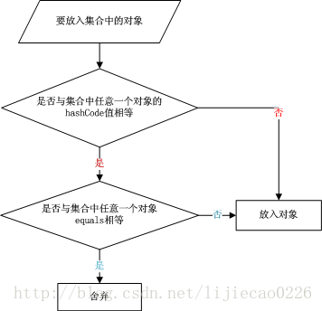

# hashCode与equals的作用与区别

首先说明一下JDK对equals(Object obj)和hashCode()这两个方法的定义和规范：在Java中任何一个对象都具备equals(Object obj)和hashCode()这两个方法，因为他们是在Object类中定义的。 

- equals(Object obj)方法用来判断两个对象是否“相同”，如果“相同”则返回true，否则返回false。 

- hashCode()方法返回一个int数，在Object类中的默认实现是“将该对象的内部地址转换成一个整数返回”。 

  

下面是官方文档给出的一些说明：

> hashCode 的常规协定是：
>
> 在 Java 应用程序执行期间，在同一对象上多次调用 hashCode 方法时，必须一致地返回相同的整数，前提是对象上 equals 比较中所用的信息没有被修改。从某一应用程序的一次执行到同一应用程序的另一次执行，该整数无需保持一致。   
>
> 如果根据 equals(Object) 方法，两个对象是相等的，那么在两个对象中的每个对象上调用 hashCode 方法都必须生成相同的整数结果。 
>
> 以下情况不是必需的：如果根据 equals(java.lang.Object) 方法，两个对象不相等，那么在两个对象中的任一对象上调用 hashCode 方法必定会生成不同的整数结果。但是，程序员应该知道，为不相等的对象生成不同整数结果可以提高哈希表的性能。   
>
> 实际上，由 Object 类定义的 hashCode 方法确实会针对不同的对象返回不同的整数。（这一般是通过将该对象的内部地址转换成一个整数来实现的，但是 JavaTM 编程语言不需要这种实现技巧。）   
>
> 当equals方法被重写时，通常有必要重写 hashCode 方法，以维护 hashCode 方法的常规协定，该协定声明相等对象必须具有相等的哈希码。


**归纳总结**：

1. ★ 若重写了equals(Object obj)方法，则有必要重写hashCode()方法。 
2. 若两个对象equals(Object obj)返回true，则hashCode（）有必要也返回相同的int数。
3. 若两个对象equals(Object obj)返回false，则hashCode（）不一定返回不同的int数。
4. 若两个对象hashCode（）返回相同int数，则equals（Object obj）不一定返回true。
5. 若两个对象hashCode（）返回不同int数，则equals（Object obj）一定返回false。
6. 同一对象在执行期间若已经存储在集合中，则不能修改影响hashCode值的相关信息，否则会导致内存泄露问题。

请注意最重要的第一点, **重写了equals就需要重写hashCode**呢？实际上这只是一条规范，如果不这样做程序也可以执行，只不过会隐藏bug。**一般一个类的对象如果会存储在HashTable，HashSet, HashMap等散列存储结构中，那么重写equals后最好也重写hashCode，否则会导致存储数据的不唯一性（存储了两个equals相等的数据）**。而如果确定不会存储在这些散列结构中，则可以不重写hashCode。




从上面的图中可以清晰地看到在存储一个对象时，先进行hashCode值的比较，然后进行equals的比较。

JDK中HashSet与HashMap的源码来看下一下具体hashCode和equals在代码中是如何使用的。

```java
/* HashSet */  
public boolean add(E e) {
	return map.put(e, PRESENT)==null;
}

/* HashMap */
public V put(K key, V value) {
  if (key == null)
    return putForNullKey(value);
  int hash = hash(key.hashCode());
  int i = indexFor(hash, table.length);
  for (Entry<K,V> e = table[i]; e != null; e = e.next) {
    Object k;
    if (e.hash == hash && ((k = e.key) == key || key.equals(k))) {
      V oldValue = e.value;
      e.value = value;
      e.recordAccess(this);
      return oldValue;
    }
  }

  modCount++;
  addEntry(hash, key, value, i);
  return null;
}
```


**三个测试的例子**

**测试一**：重写equals(Object obj)但不重写hashCode(), 导致数据不唯一性

```java
public class HashCodeTest {
	public static void main(String[] args) {
		Collection set = new HashSet();
		Point p1 = new Point(1, 1);
		Point p2 = new Point(1, 1);
 
		System.out.println(p1.equals(p2));
		set.add(p1);   //(1)
		set.add(p2);   //(2)
		set.add(p1);   //(3)
 
		Iterator iterator = set.iterator();
		while (iterator.hasNext()) {
			Object object = iterator.next();
			System.out.println(object);
		}
	}
}
 
class Point {
	private int x;
	private int y;
 
	public Point(int x, int y) {
		super();
		this.x = x;
		this.y = y;
	}
 
	@Override
	public boolean equals(Object obj) {
		if (this == obj)
			return true;
		if (obj == null)
			return false;
		if (getClass() != obj.getClass())
			return false;
		Point other = (Point) obj;
		if (x != other.x)
			return false;
		if (y != other.y)
			return false;
		return true;
	}
 
	@Override
	public String toString() {
		return "x:" + x + ",y:" + y;
	}
 
}
```


**输出:**

```
true
x:1,y:1
x:1,y:1
```


**原因分析：**

1. 当执行set.add(p1)时（1），集合为空，直接存入集合；
2. 当执行set.add(p2)时（2），首先判断该对象（p2）的hashCode值所在的存储区域是否有相同的hashCode，因为没有覆盖hashCode方法，所以jdk使用默认Object的hashCode方法，返回内存地址转换后的整数，因为不同对象的地址值不同，所以这里不存在与p2相同hashCode值的对象，因此jdk默认不同hashCode值，equals一定返回false，所以直接存入集合。
3. 当执行set.add(p1)时（3），时，因为p1已经存入集合，同一对象返回的hashCode值是一样的，继续判断equals是否返回true，因为是同一对象所以返回true。此时jdk认为该对象已经存在于集合中，所以舍弃。


**测试二：**覆盖hashCode方法，但不覆盖equals方法，仍然会导致数据的不唯一性

修改Point类, 只重写hashCode(), 不重写equals()

```java
class Point {
	private int x;
	private int y;
 
	public Point(int x, int y) {
		super();
		this.x = x;
		this.y = y;
	}
 
	@Override
	public int hashCode() {
		final int prime = 31;
		int result = 1;
		result = prime * result + x;
		result = prime * result + y;
		return result;
	}
 
	@Override
	public String toString() {
		return "x:" + x + ",y:" + y;
	}
 
}
```

**输出结果：**

```
false
x:1,y:1
x:1,y:1
```

**原因分析：

1. 当执行set.add(p1)时（1），集合为空，直接存入集合；

2. 当执行set.add(p2)时（2），首先判断该对象（p2）的hashCode值所在的存储区域是否有相同的hashCode，这里覆盖了hashCode方法，p1和p2的hashCode相等，所以继续判断equals是否相等，因为这里没有覆盖equals，默认使用'=='来判断，所以这里equals返回false，jdk认为是不同的对象，所以将p2存入集合。

3. 当执行set.add(p1)时（3），时，因为p1已经存入集合，同一对象返回的hashCode值是一样的，并且equals返回true。此时jdk认为该对象已经存在于集合中，所以舍弃。

   

**综合上述两个测试，要想保证元素的唯一性，必须同时覆盖hashCode和equals才行。**

（注意：在HashSet中插入同一个元素（hashCode和equals均相等）时，会被舍弃，而在HashMap中插入同一个Key（Value 不同）时，原来的元素会被覆盖。）


**测试三**：在内存泄露问题

```java
public class HashCodeTest {
	public static void main(String[] args) {
		Collection set = new HashSet();
		Point p1 = new Point(1, 1);
		Point p2 = new Point(1, 2);
 
		set.add(p1);
		set.add(p2);
		
    // 修改掉hashCode依赖的属性值
		p2.setX(10);
		p2.setY(10);
		
		set.remove(p2);
 
		Iterator iterator = set.iterator();
		while (iterator.hasNext()) {
			Object object = iterator.next();
			System.out.println(object);
		}
	}
}
 
class Point {
	private int x;
	private int y;
 
	public Point(int x, int y) {
		super();
		this.x = x;
		this.y = y;
	}
 
 
	public int getX() {
		return x;
	}
 
 
	public void setX(int x) {
		this.x = x;
	}
 
 
	public int getY() {
		return y;
	}
 
 
	public void setY(int y) {
		this.y = y;
	}
 
 
	@Override
	public int hashCode() {
		final int prime = 31;
		int result = 1;
		result = prime * result + x;
		result = prime * result + y;
		return result;
	}
 
 
	@Override
	public boolean equals(Object obj) {
		if (this == obj)
			return true;
		if (obj == null)
			return false;
		if (getClass() != obj.getClass())
			return false;
		Point other = (Point) obj;
		if (x != other.x)
			return false;
		if (y != other.y)
			return false;
		return true;
	}
 
 
	@Override
	public String toString() {
		return "x:" + x + ",y:" + y;
	}
 
}
```

**输出:**

```java
x:1,y:1
x:10,y:10
```

**原因分析：**

 假设p1的hashCode为1，p2的hashCode为2，在存储时p1被分配在1号桶中，p2被分配在2号筒中。这时修改了p2中与计算hashCode有关的信息（x和y）, 当调用remove(Object obj)时，首先会查找该hashCode值得对象是否在集合中。假设修改后的hashCode值为10（仍存在2号桶中）, 这时查找结果空，jdk认为该对象不在集合中，所以不会进行删除操作。然而用户以为该对象已经被删除，导致该对象长时间不能被释放，造成内存泄露。解决该问题的办法是**不要在执行期间修改与hashCode值有关的对象信息，如果非要修改，则必须先从集合中删除，更新信息后再加入集合中**。


