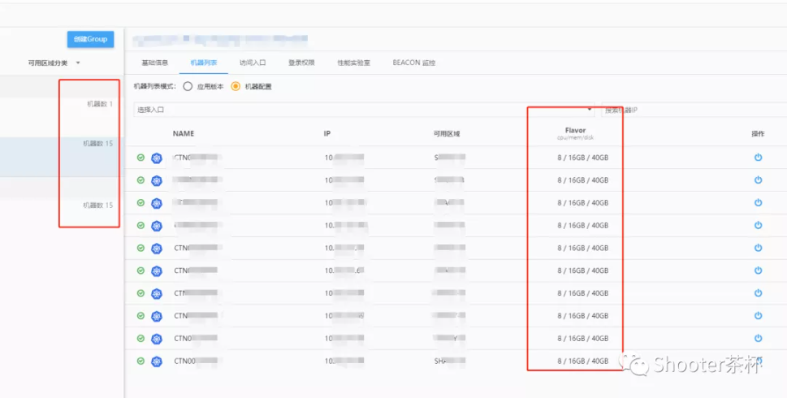
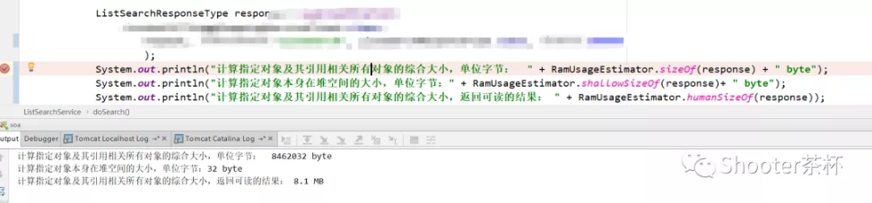

> 引用: https://mp.weixin.qq.com/s/Wga1ZwNgxBcLfTSqEB2GqQ


介绍一个亿级流量的机票查询业务系统 , 作为 JVM 实战系列的案列

## 1、系统背景

> 4亿在线用户的 OTA 旅游平台

## 2、核心业务流程

核心业务有酒店，机票等，这里拿机票的查询举例：

订机票除了商旅的用户，正常用户一般是在中午，或者下班后直到晚上这段时间才会去订机票。

高峰时间段是：11 - 14点， 17 - 23点， 一天24小时，差不多会有 11 - 12 属于高峰期。

## 3、每秒系统的流量压力

> 旅游旺季，国内机票每天大概会有 100w 单,这么多订单那流量会有多少呢？

用户来网站可能有以下情况增加查询次数：

1. **多查询几个地方**，看去哪个地方的机票稍微更便宜
2. **多查询几个时间点**，看哪天去机票便宜一点
3. 有的热门航线，每天航班不同，看哪个航班出发到达时间点合适
4. 纠结时，**价格和航班得反复切换比较**
5. 查到1 - 2个合适的天数，航班，时间点，记在脑海里

```
再去其他平台比对价格，比完价格后，如果当前平台便宜。可能又会查 2-3 次 再下单。
```

做系统设计的时候，**统计流量都必须往多了算**， 为了应付突发情况，**流量会突然一下变大**，一般`将算出来的值再乘以三倍`。

假设有`5个`好玩的地方都想去玩， 来自`5个`不同地点的查询

```
10个`合适的时间天数可选 来自`10个`不同时间点的查询 `5 * 10 = 50次
```

价格，出发时间性价比纠结时，假设有三趟航班可比较 不同出发维度比价 `50 + 3 = 53次`

和其他平台比完价后又回来确认出发时间再下单又会查`3次`

```
不同平台之间的比价 53 + 3 = 56次
```

单个用户理想情况下，经过 `56次`查询，可能会买走一单机票

这里数值多少不是关键为了方便计算，`56 按 60计算`

**峰值** ：**假设节假日期间流量增大三倍** `60 * 3 = 180次` 每天100w 订单，这个系统在极端情况下可能每天会有

```
100w * 180 = 1.8亿的查询
```

只算高峰期请求，**1.8 亿可能有 1.5 亿都在 12 个小时的高峰期内**

每小时的流量是：`1.8亿 / 12 = 1250w`

每分的流量是：`1250w / 60 = 20.8w`

每秒的流量是：`20.8w / 60 = 3472`

## 4、每秒内存的压力

> 机票业务属于**业务复杂**型

**举例** : 深圳 - 上海 这样的机票的搜索查询会查出很多趟深圳 - 上海的航班

不仅仅是航线信息， 还包括 **机型、机场、退改签，优惠政策，礼盒，保险产品等**

这个系统生产环境有 **两个集群** 用来做高可用,总共有 `32 台 8C 16G 的机器`



将 qps `3472` 除以 `32` 算出平均每台机器的qps：差不多是 `110`左右

通过第三方工具 `lucene` 提供的 `RamUsageEstimator` 这是一个专门用于计算堆内存占用大小的工具类

调用 SOA 服务去查询 深圳 - 上海 的返回报文 反序列化后在 `JVM` 占用 `8.1MB`



注意 这 `8 mb` 虽然是一个对象，但它并不是一个大对象

它内部的属性跟它是引用关系，意思就是：这 `8 mb` 在堆内存中大大小小可能会有很多个对象， 它的每个引用变量背后都是一个对象。`(这个一个套娃的关系 懂的伐)`

深圳 - 上海属于热门航线所以报文会比较大， 冷门航线比如 海拉尔 - 银川 这种 可能只有几条航线 报文可能只有几百 kb 但热门航线被请求的概率又要大一些，综合来看：我们把每次报文大小算作 5mb

```
qps110 * 5 mb = 550 mb
```

这意味着：新生代每秒钟将会有，`550mb` 的空间会被占用。

## 五、其他系统如何分析

**注意：这个系统跟其他系统不太一样**

1. `因为这个核心服务的核心接口就两个：列表查询、指定查询`

   但是其他系统 , 比如订单系统可能会有很多个接口 , 除了比较核心的订单查询接口 , 还有创单、下单、查库存等接口

   一般核心接口逻辑会要复杂一点 , 对象占用的大小要更大一点 , 我们用最占内存的那个接口来分析

   因为最差的情况就是所有的流量都打到核心接口

2. 指定查询其实相对于列表查询来说频率会低一些 , 这里仅拿列表查询的情况当做一个系统所有接口来作为参考

   因为这个接口的一次平均 `5mb` 其实也挺大了, 当然这里只是作为一个参考

### 分析思路

1. 根据 集群的 `qps` 除以机器数量 , 估算出每分钟每个接口的 `qps`

2. 计算出各个接口中所有对象实际占用的内存

3. `qps` 不是很高可以用每分钟的内存大小做参考即可

   并发量很高 就用每秒占用内存的大小来做参考

## 六、总结

这个亿级流量系统的大概情况 , 部分数据只是作为参考. 