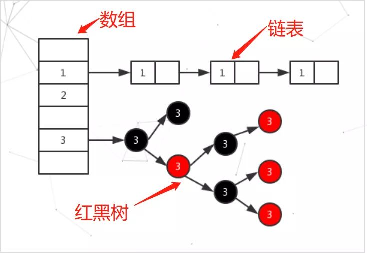

# 数据结构

HashMap的实现是Node{hash, key, value, next}结构的数组 + 链表 + 红黑树




putVal()发生hash碰撞时候, 会以链表形式追加, 若当前链表节点数超过8(`TREEIFY_THRESHOLD`), 并且整个HashMap的Node数达到64(`MIN_TREEIFY_CAPACITY`), 则当前追加的链表转为红黑树.


# 六个重要常量


```java
// 默认初始化容量 16
static final int DEFAULT_INITIAL_CAPACITY = 1 << 4;

//最大容量, map达到此数值后不会再扩容
static final int MAXIMUM_CAPACITY = 1 << 30;

//负载因子大小, 用于在初始化resize()时候计算阈值(DEFAULT_LOAD_FACTOR * DEFAULT_INITIAL_CAPACITY)
static final float DEFAULT_LOAD_FACTOR = 0.75f;

// 链表升级为红黑树的树化阈值
static final int TREEIFY_THRESHOLD = 8
  
// 红黑树降级为链表的阈值
static final int UNTREEIFY_THRESHOLD = 6;

// 树化的另一个参数，当哈希表中的所有元素个数超过64时，才会允许树化
static final int MIN_TREEIFY_CAPACITY = 64;
```


# 核心方法


## 保存方法 put() -> putVal()

```java
/**
 	* Implements Map.put and related methods.
  *
  * @param hash hash for key
  * @param key the key
  * @param value the value to put
  * @param onlyIfAbsent if true, don't change existing value
  * @param evict if false, the table is in creation mode.
  * @return previous value, or null if none
  */
final V putVal(int hash, K key, V value, boolean onlyIfAbsent,
               boolean evict) {
  //tab：引用当前hashMap的散列表
  //p：表示当前散列表的元素
  //n：表示散列表数组的长度
  //i：表示路由寻址 结果
  Node<K,V>[] tab; Node<K,V> p; int n, i;

  //延迟初始化逻辑，第一次调用putVal时会初始化hashMap对象中的最耗费内存的散列表
  if ((tab = table) == null || (n = tab.length) == 0)
    n = (tab = resize()).length;

  //最简单的一种情况：寻址找到的桶位 刚好是 null，这个时候，直接将当前k-v=>node 扔进去就可以了
  if ((p = tab[i = (n - 1) & hash]) == null)
    tab[i] = newNode(hash, key, value, null);

  else {
    //e：不为null的话，找到了一个与当前要插入的key-value一致的key的元素
    //k：表示临时的一个key
    Node<K,V> e; K k;

    //表示桶位中的该元素，与你当前插入的元素的key完全一致，表示后续需要进行替换操作
    if (p.hash == hash &&
        ((k = p.key) == key || (key != null && key.equals(k))))
      e = p;

    else if (p instanceof TreeNode)//红黑树节点
      e = ((TreeNode<K,V>)p).putTreeVal(this, tab, hash, key, value);
    else {
      //链表的情况，而且链表的头元素与我们要插入的key不一致。
      //binCount 对应bin桶中的链表长度
      for (int binCount = 0; ; ++binCount) {
        //条件成立的话，说明迭代到最后一个元素了，也没找到一个与你要插入的key一致的node
        //说明需要加入到当前链表的末尾
        if ((e = p.next) == null) {
          p.next = newNode(hash, key, value, null);
          //条件成立的话，说明当前链表的长度，达到树化标准了，需要进行树化
          if (binCount >= TREEIFY_THRESHOLD - 1) // -1 for 1st
            //树化操作
            treeifyBin(tab, hash);
          break;
        }
        //条件成立的话，说明找到了相同key的node元素，需要进行替换操作
        if (e.hash == hash &&
            ((k = e.key) == key || (key != null && key.equals(k))))
          break;
        p = e;
      }
    }

    //e不等于null，条件成立说明，找到了一个与你插入元素key完全一致的数据，需要进行替换
    if (e != null) { // existing mapping for key
      V oldValue = e.value;
      if (!onlyIfAbsent || oldValue == null)
        e.value = value;
      afterNodeAccess(e);
      return oldValue;
    }
  }

  //modCount：表示散列表结构被修改的次数，替换Node元素的value不计数
  ++modCount;
  //插入新元素，size自增，如果自增后的值大于扩容阈值，则触发扩容。
  if (++size > threshold)
    resize();
  afterNodeInsertion(evict);
  return null;
}
```


## 扩容方法 resize() 

```java
    /**
     * Initializes or doubles table size.  If null, allocates in
     * accord with initial capacity target held in field threshold.
     * Otherwise, because we are using power-of-two expansion, the
     * elements from each bin must either stay at same index, or move
     * with a power of two offset in the new table.
     *
     * 为什么需要扩容？
     * 为了解决哈希冲突导致的链化影响查询效率的问题，扩容会缓解该问题。
     *
     * @return the table
     */
    final Node<K,V>[] resize() {
        //oldTab：引用扩容前的哈希表
        Node<K,V>[] oldTab = table;
        //oldCap：表示扩容之前table数组的长度
        int oldCap = (oldTab == null) ? 0 : oldTab.length;
        //oldThr：表示扩容之前的扩容阈值，触发本次扩容的阈值
        int oldThr = threshold;
        //newCap：扩容之后table数组的大小
        //newThr：扩容之后，下次再次触发扩容的条件
        int newCap, newThr = 0;

        //oldCap > 0说明hashMap中的散列表已经初始化过了，进行正常扩容
        if (oldCap > 0) {
            //扩容之前的table数组大小已经达到 最大阈值后，则不扩容，且设置扩容阈值为 int 最大值127亿。
            if (oldCap >= MAXIMUM_CAPACITY) {
                threshold = Integer.MAX_VALUE;
                return oldTab;
            }

            // 数组大小未达到最大阈值,
            // 数组扩容(oldCap左移一位实现数值翻倍，并且赋值给newCap), newCap小于数组最大值限制 && 扩容之前的旧阈值 >= 16
            // 这种情况下，则 下一次扩容的阈值 等于当前阈值翻倍
            else if ((newCap = oldCap << 1) < MAXIMUM_CAPACITY &&
                    oldCap >= DEFAULT_INITIAL_CAPACITY)
                newThr = oldThr << 1; // double threshold
        }

        //oldCap == 0,说明hashMap中的散列表是null
        //1.new HashMap(initCap, loadFactor);
        //2.new HashMap(initCap);
        //3.new HashMap(map); 并且这个map有数据
        // 即除了无参构造方法(new HashMap())外其他三个构造方法都会设置threshold
        else if (oldThr > 0) // initial capacity was placed in threshold
            newCap = oldThr;

        //oldCap == 0，oldThr == 0
        //new HashMap();
        else {               // zero initial threshold signifies using defaults
            newCap = DEFAULT_INITIAL_CAPACITY;//16
            newThr = (int)(DEFAULT_LOAD_FACTOR * DEFAULT_INITIAL_CAPACITY);//12
        }

        //newThr为零时，通过newCap和loadFactor计算出一个newThr
        if (newThr == 0) {
            float ft = (float)newCap * loadFactor;
            newThr = (newCap < MAXIMUM_CAPACITY && ft < (float)MAXIMUM_CAPACITY ?
                    (int)ft : Integer.MAX_VALUE);
        }

        threshold = newThr;

        //创建出一个更长 更大的数组
        @SuppressWarnings({"rawtypes","unchecked"})
        Node<K,V>[] newTab = (Node<K,V>[])new Node[newCap];
        table = newTab;

        // hashMap本次扩容之前，table不为null,
        if (oldTab != null) {
            // 若旧数组非空, 则把旧数据挪到新数组中
            for (int j = 0; j < oldCap; ++j) {
                //当前node节点
                Node<K,V> e;
                //说明当前桶位中有数据，但是数据具体是单个数据/链表/红黑树, 并不知道
                if ((e = oldTab[j]) != null) {
                    //方便JVM GC时回收内存
                    oldTab[j] = null;

                    // 第一种情况：当前桶位只有一个元素，从未发生过碰撞，
                    // 这情况 直接计算出当前元素应存放在 新数组中的位置，然后扔进去就可以了
                    if (e.next == null)
                        newTab[e.hash & (newCap - 1)] = e;

                    //第二种情况：当前节点已经树化，红黑树。
                    else if (e instanceof TreeNode)
                        ((TreeNode<K,V>)e).split(this, newTab, j, oldCap);
                    else { // preserve order
                        //第三种情况：桶位已经形成链表

                        //低位链表：存放在扩容之后的数组的下标位置，与当前数组的下标位置一致。
                        Node<K,V> loHead = null, loTail = null;
                        //高位链表：存放在扩容之后的数组的下表位置为 当前数组下标位置 + 扩容之前数组的长度
                        Node<K,V> hiHead = null, hiTail = null;

                        Node<K,V> next;
                        do {
                            next = e.next;
                            // 假设节点在旧数组中, 被hash到15桶
                            // 如今从16个桶扩容到32个桶, 那么在原先15桶的链表中, 可能会有部分节点会被hash到新数组的31桶

                            // hash-> .... 1 1111
                            // hash-> .... 0 1111
                            // 假设oldCap是16, 即二进制10000,  hash值与了16后==0,
                            // 说明高位值是0, 重新hash后应该分配到低位链表中, 即分配到15桶的链表
                            if ((e.hash & oldCap) == 0) {
                                if (loTail == null)
                                    loHead = e;
                                else
                                    loTail.next = e;
                                loTail = e;
                            }
                            else {
                                if (hiTail == null)
                                    hiHead = e;
                                else
                                    hiTail.next = e;
                                hiTail = e;
                            }

                        } while ((e = next) != null);


                        // 低位链表有数据
                        if (loTail != null) {
                            loTail.next = null;
                            newTab[j] = loHead;
                        }
                        // 高位链表有数据
                        if (hiTail != null) {
                            hiTail.next = null;
                            newTab[j + oldCap] = hiHead;
                        }

                    }
                }
            }
        }
        return newTab;
    }
```


