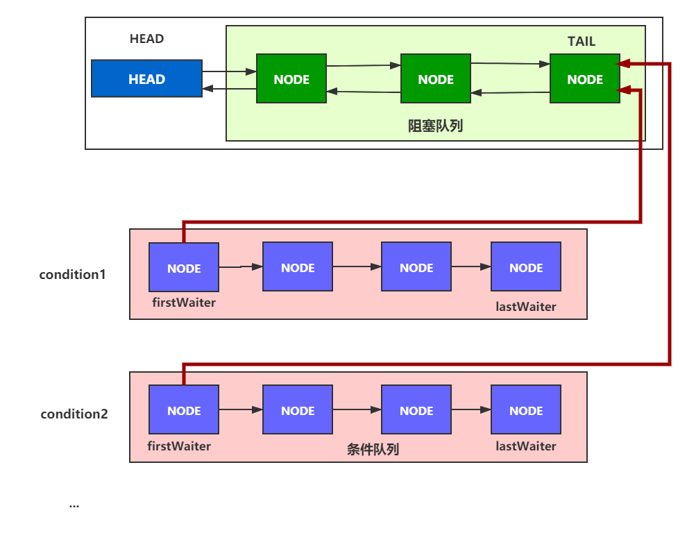

# 1. AQS原理图



# 2. 独占模式, 共享模式区别


- 共享模式在`releaseShared()`与`acquireShared()`实现中都会尝试调用`doReleaseShared()`, 唤醒阻塞队列的head的后继节点. 并且被唤醒的后继节点争抢到资源, 把自己设为新head后, 会尝试唤醒他的后继节点.  因此共享模式只要有节点被唤醒, 就会**相继**唤醒自己的后继节点.
- 独占模式`release()`时候每次只唤醒一个后继节点, 后继节点争抢到资源, 把自己设为新head. **没有唤醒后继节点**. 

```java
	// 独占模式 - 释放资源
	public final boolean release(int arg) {
        if (tryRelease(arg)) {
            Node h = head;
            if (h != null && h.waitStatus != 0)
                // 唤醒后继节点
                unparkSuccessor(h);
            return true;
        }
        return false;
    }
// ========================================================
	// 共享模式 - 获取资源
	public final void acquireShared(int arg) {
        if (tryAcquireShared(arg) < 0)
            // 实际获取资源
            doAcquireShared(arg);
    }
	// 共享模式 - 获取资源 - 阻塞获取资源
	private void doAcquireShared(int arg) {
        final Node node = addWaiter(Node.SHARED);
        boolean failed = true;
        try {
            boolean interrupted = false;
            for (;;) {
                final Node p = node.predecessor();
                if (p == head) {
                    int r = tryAcquireShared(arg);
                    if (r >= 0) {
                        // ★ 2. 更新Head, 并传播唤醒后继节点
                        setHeadAndPropagate(node, r);
                        p.next = null; // help GC
                        if (interrupted)
                            selfInterrupt();
                        failed = false;
                        return;
                    }
                }
                if (shouldParkAfterFailedAcquire(p, node) &&
					// ★ 1. 堵塞线程从这里被唤醒
                    parkAndCheckInterrupt())
                    interrupted = true;
            }
        } finally {
            if (failed)
                cancelAcquire(node);
        }
    }
	
	// 共享模式 - 获取资源 - 阻塞获取资源 - 更新head, 传播唤醒后继节点
    private void setHeadAndPropagate(Node node, int propagate) {
        Node h = head; // Record old head for check below
        setHead(node);
        if (propagate > 0 || h == null || h.waitStatus < 0 ||
            (h = head) == null || h.waitStatus < 0) {
            Node s = node.next;
            if (s == null || s.isShared())
                // ★唤醒后继节点
                doReleaseShared();
        }
    }

	// 共享模式 - 释放资源
	public final boolean releaseShared(int arg) {
        if (tryReleaseShared(arg)) {
            // ★唤醒后继节点
            doReleaseShared();
            return true;
        }
        return false;
    }

	// 共享模式, 唤醒后继节点
	private void doReleaseShared() {
        for (;;) {
            Node h = head;
            if (h != null && h != tail) {
                int ws = h.waitStatus;
                if (ws == Node.SIGNAL) {
                    if (!compareAndSetWaitStatus(h, Node.SIGNAL, 0))
                        continue;            // loop to recheck cases
                    // ★ 唤醒后继节点
                    unparkSuccessor(h);
                }
                else if (ws == 0 &&
                         // 设置为"传播"状态
                         !compareAndSetWaitStatus(h, 0, Node.PROPAGATE))
                    continue;                // loop on failed CAS
            }
            if (h == head)                   // loop if head changed
                break;
        }
    }
```


# 3. Node类的`Node.PROPAGATE`属性作用是啥?


整个AQS类中, `Node.PROPAGATE`只在`doReleaseShared()`共享模式的释放资源动作用到.  这个方法会for循环唤醒head的后继节点.  

1. 当最早的一个**A**进入方法体, 判断到`head.waitStatus`是`Node.SIGNAL`, 会cas修改为0, 然后唤醒后继节点. 后继节点线程**B**被唤醒后在acquireQueued()方法内进入下一次循环去争抢资源.

2. 线程**A**进入下一次循环时候,  如果此时其他线程还未替换新head, 那么当前head是旧head, 而旧head的waitStatus在已经被线程**A**在上个循环修改为0, 因此执行到`else if (ws == 0 &&!compareAndSetWaitStatus(h, 0, Node.PROPAGATE))`尝试修改为`Node.PROPAGATE`. 

     修改为"传播"状态的目的, 

   - 其一是标识此节点已经被处理过了, 正处在"传播"的逻辑链上, 如果有其他正在执行doReleaseShared的线程操作到此节点, 则直接过, 不浪费CPU资源.  
   - 其二是`PROPAGATE`状态存在的意义是它的符号和`SIGNAL`相同，都是负数，所以在`setHeadAndPropagate()`中都能被`< 0`检测到。因为线程**B**刚被唤醒，但还没设置新head前，当前head的status是0，所以把0变成PROPAGATE，好让被唤醒线程**B**可以检测到, 让线程B再去调用`doReleaseShared()`唤醒后继节点, 把唤醒任务**传播**下去!

   

```java
	/**
		会调用到doReleaseShared的路径:
    	1. latch.countDown() -> AQS.state == 0 -> doReleaseShared() 唤醒当前阻塞队列内的 head.next 对应的线程。
    	2. 被唤醒的线程 -> doAcquireSharedInterruptibly parkAndCheckInterrupt() 唤醒 -> 自己是hea的后继节点, 可以争抢资源 
    			-> setHeadAndPropagate() -> doReleaseShared()
    */
	private void doReleaseShared() {
        for (;;) {
            Node h = head;
            if (h != null && h != tail) {
                int ws = h.waitStatus;
                if (ws == Node.SIGNAL) {
                    if (!compareAndSetWaitStatus(h, Node.SIGNAL, 0))
                        continue;            // loop to recheck cases
                    // ★ 唤醒后继节点
                    unparkSuccessor(h);
                }
                else if (ws == 0 &&
                         // 设置为"传播"状态
                         !compareAndSetWaitStatus(h, 0, Node.PROPAGATE))
                    continue;                // loop on failed CAS
            }
            if (h == head)                   // loop if head changed
                break;
        }
    }


    private void doAcquireShared(int arg) {
        final Node node = addWaiter(Node.SHARED);
        boolean failed = true;
        try {
            boolean interrupted = false;
            for (;;) {
                final Node p = node.predecessor();
                if (p == head) {
                    int r = tryAcquireShared(arg);
                    if (r >= 0) {
                        setHeadAndPropagate(node, r);
                        p.next = null; // help GC
                        if (interrupted)
                            selfInterrupt();
                        failed = false;
                        return;
                    }
                }
                if (shouldParkAfterFailedAcquire(p, node) &&
                    // ★后继节点在次方法内被LockSupport.unpark()唤醒, 后进入下一次循环去争抢资源
                    parkAndCheckInterrupt())
                    interrupted = true;
            }
        } finally {
            if (failed)
                cancelAcquire(node);
        }
    }

    private void setHeadAndPropagate(Node node, int propagate) {
        Node h = head; // Record old head for check below
        setHead(node);
        // ★ waitStatus < 0, SIGNAL, PROPAGATE都会被处理到
        if (propagate > 0 || h == null || h.waitStatus < 0 ||
            (h = head) == null || h.waitStatus < 0) {
            Node s = node.next;
            if (s == null || s.isShared())
                doReleaseShared();
        }
    }
```

1. 


