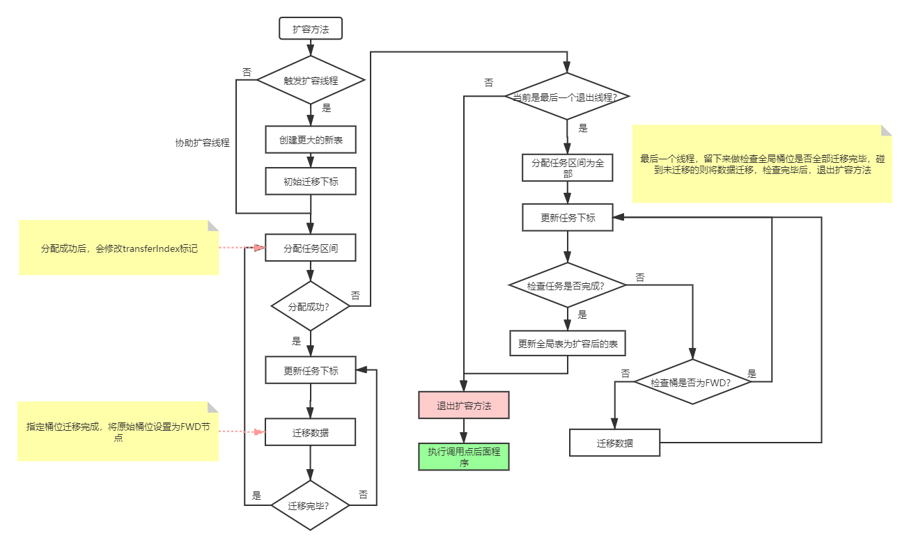

结构类似

1. Node[] tab的值, 除了null, `Node`, `TreeBin`, 还有`ForwardingNode`, `ReservationNode`
2. 使用分段锁,  对桶位的头结点上synchronize锁
3. 比对, 查找, update操作都是cas操作, update操作都是double check操作

# `ConcurrentHashMap`核心方法实现过程

## putVal()

使用分段锁, 对桶位的头结点上synchronize

## initTable() 

## addCount()

`addCount()`是在修改map之后调用的.  采用与`LongAdder.java`一样的数据结构来维护map的长度. 并且判断是否需要执行`transfer()`扩容操作. 

## transfer() 扩容

- 允许多个线程辅助扩容. 

- `tab[]`扩容是以分区思路执行, 分为以下2个步骤:  分配扩容分区, 执行扩容迁移

  -  分配扩容分区: 从最尾部开始, 每次个线程只处理16个桶的扩容工作.  协助扩容线程的扩容桶范围由全局属性`transferIndex`(扩容进度)与`MIN_TRANSFER_STRIDE`(步长)管理. 
  - 执行扩容迁移:  使用`ForwardingNode`辅助扩容.  已经完成迁移的桶位设置为`ForwardingNode`

  > `ForwardingNode上是个转发节点. 用于在迁移过程中转发map的存取操作. 

- 迁移
  - 链表迁移
    - 散列表空间翻了一倍,  原节点有可能哈希到两个桶位之一, 因此分出两个链表, 一个接收哈希到高位的节点, 一个接受低位的节点.
    - lastRun机制, 获取当前链表末尾连续高位不变的node, 可以减少node节点的创建
  - 树迁移
  - 

