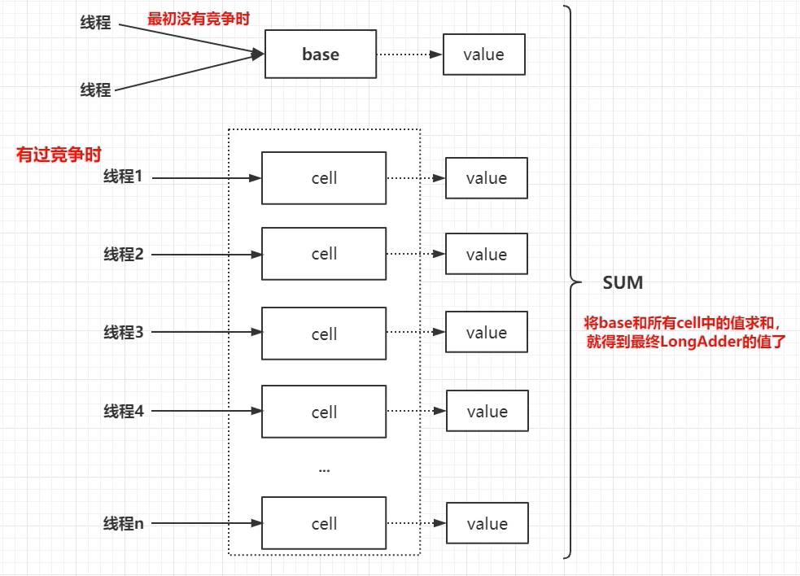
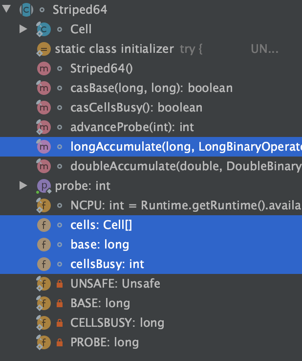

`LongAdder`继承了`Striped64`, 再父类的基础上提供了简单的add, sum等操作. 核心还是`Striped64`.

`Striped64`的数据结构如下图.  





大概实现流程是先case `base`, 失败则进入Cell[]进行分桶add. 最后值是base+Cell[]桶的每一个值.




核心代码:

```java
public class LongAdder extends Striped64 implements Serializable {
    /**
     * Adds the given value.
     *
     * @param x the value to add
     */
    public void add(long x) {
        //as 表示cells引用
        //b 表示获取的base值
        //v 表示 期望值
        //m 表示 cells 数组的长度
        //a 表示当前线程命中的cell单元格
        Cell[] as; long b, v; int m; Cell a;

        //条件一：true -> 表示cells已经初始化过了,当前线程应该将数据写入到对应的cell中
        //       false -> 表示cells未初始化，当前所有线程应该将数据写到base中

        //条件二：!true -> 表示当前线程cas替换数据成功，
        //       !false -> 表示发生竞争了，可能需要重试 或者 扩容
        if ((as = cells) != null || !casBase(b = base, b + x)) {
            //什么时候会进来？
            //条件一: true -> 表示cells已经初始化过了,当前线程应该将数据写入到对应的cell中
            //条件二: !false -> casBase()操作不成功, 表示发生竞争了，可能需要重试 或者 扩容


            //true  ->  未竞争  false -> 发生竞争
            boolean uncontended = true;

            //条件一(as == null || (m = as.length - 1) < 0)：
            //       true -> 说明 cells 未初始化，也就是多线程写base发生竞争了
            //       false -> 说明 cells 已经初始化了，当前线程应该是 找自己的cell 写值

            //条件二：getProbe() 获取当前线程的hash值   m表示cells长度-1 cells长度 一定是2的次方数   15= b1111
            //       true ->  说明当前线程对应下标的cell为空，需要创建 longAccumulate() 支持
            //       false ->  说明当前线程对应的cell 不为空，说明 下一步想要将x值 添加到cell中。

            //条件三：true -> 表示cas失败，意味着当前线程对应的cell 有竞争
            //       false -> 表示cas成功
            if (as == null || (m = as.length - 1) < 0 ||
                    // getProbe()有可能是0, 因为线程hash值有可能未被设置, 这时候还未发生竞争
                    (a = as[getProbe() & m]) == null ||
                    !(uncontended = a.cas(v = a.value, v + x)))
                //都有哪些情况会调用？
                //1.true -> 说明 cells 未初始化，也就是多线程写base发生竞争了[重试|初始化cells]
                //2.true ->  说明当前线程对应下标的cell为空，需要创建 longAccumulate() 支持
                //3.true -> 表示cas失败，意味着当前线程对应的cell 有竞争[重试|扩容]
                longAccumulate(x, null, uncontended);
        }
    }
}
```


```java
abstract class Striped64 extends Number {
    /** Number of CPUS, to place bound on table size */
    //表示当前计算机CPU数量，什么用？ 控制cells数组长度的一个关键条件
    static final int NCPU = Runtime.getRuntime().availableProcessors();

    /**
     * Table of cells. When non-null, size is a power of 2.
     */
    transient volatile Cell[] cells;

    /**
     * 没有发生过竞争时，数据会累加到 base上 | 当cells扩容时，需要将数据写到base中
     */
    transient volatile long base;

    /**
     * Spinlock (locked via CAS) used when resizing and/or creating Cells.
     * 初始化cells或者扩容cells都需要获取锁，0 表示无锁状态，1 表示其他线程已经持有锁了
     */
    transient volatile int cellsBusy;
  
  	    /**
     * CASes the base field.
     */
    final boolean casBase(long cmp, long val) {
        return UNSAFE.compareAndSwapLong(this, BASE, cmp, val);
    }

    /**
     * CASes the cellsBusy field from 0 to 1 to acquire lock.
     * 通过CAS方式获取锁
     */
    final boolean casCellsBusy() {
        return UNSAFE.compareAndSwapInt(this, CELLSBUSY, 0, 1);
    }
  
      /**
     * Returns the probe value for the current thread.
     * Duplicated from ThreadLocalRandom because of packaging restrictions.
     *
     * 获取当前线程的Hash值
     */
    static final int getProbe() {
        return UNSAFE.getInt(Thread.currentThread(), PROBE);
    }

    /**
     * Pseudo-randomly advances and records the given probe value for the
     * given thread.
     * Duplicated from ThreadLocalRandom because of packaging restrictions.
     *
     * 重置当前线程的Hash值
     */
    static final int advanceProbe(int probe) {
        probe ^= probe << 13;   // xorshift
        probe ^= probe >>> 17;
        probe ^= probe << 5;
        UNSAFE.putInt(Thread.currentThread(), PROBE, probe);
        return probe;
    }
  
    
  	//都有哪些情况会调用？
    //1.true->说明 cells 未初始化，也就是多线程写base发生竞争了[重试|初始化cells]
    //2.true-> 说明当前线程对应下标的cell为空，需要创建 longAccumulate 支持
    //3.true->表示cas失败，意味着当前线程对应的cell 有竞争[重试|扩容]

    // wasUncontended：只有cells初始化之后，并且当前线程 竞争修改失败，才会是false
    final void  longAccumulate(long x, LongBinaryOperator fn,
                              boolean wasUncontended) {
        //h 表示线程hash值
        int h;
        //条件成立：说明当前线程 还未分配hash值
        if ((h = getProbe()) == 0) {
            //给当前线程分配hash值
            ThreadLocalRandom.current(); // force initialization
            //取出当前线程的hash值 赋值给h
            h = getProbe();
            //为什么？ 因为默认情况下, 当前线程肯定是写入到了cells[0]位置(线程在0位置竞争)。 不把它当做一次真正的竞争
            wasUncontended = true;
        }

        //表示扩容意向 false 一定不会扩容，true 可能会扩容。
        boolean collide = false;                // True if last slot nonempty

        //自旋
        for (;;) {
            //as 表示cells引用
            //a 表示当前线程命中的cell
            //n 表示cells数组长度
            //v 表示 期望值
            Cell[] as; Cell a; int n; long v;

            //CASE1: 表示cells已经初始化了，当前线程应该将数据写入到对应的cell中
            if ((as = cells) != null && (n = as.length) > 0) {
                //2.true-> 说明当前线程对应下标的cell为空，需要创建 longAccumulate 支持
                //3.true->表示cas失败，意味着当前线程对应的cell 有竞争[重试|扩容]

                //CASE1.1:true->表示当前线程对应的下标位置的cell为null，需要创建new Cell
                if ((a = as[(n - 1) & h]) == null) {

                    //true->表示当前锁 未被占用  false->表示锁被占用
                    if (cellsBusy == 0) {       // Try to attach new Cell

                        //拿当前的x创建Cell
                        Cell r = new Cell(x);   // Optimistically create

                        //条件一：true->表示当前锁 未被占用  false->表示锁被占用
                        //条件二：true->表示当前线程获取锁成功  false->当前线程获取锁失败..
                        if (cellsBusy == 0 && casCellsBusy()) {
                            //是否创建成功 标记
                            boolean created = false;
                            try {               // Recheck under lock
                                //rs 表示当前cells 引用
                                //m 表示cells长度
                                //j 表示当前线程命中的下标
                                Cell[] rs; int m, j;

                                //条件一 条件二 恒成立
                                //rs[j = (m - 1) & h] == null 为了防止其它线程初始化过该位置，然后当前线程再次初始化该位置
                                // double check思维,  导致丢失数据
                                if ((rs = cells) != null &&
                                        (m = rs.length) > 0 &&
                                        rs[j = (m - 1) & h] == null) {
                                    rs[j] = r;
                                    created = true;
                                }
                            } finally {
                                cellsBusy = 0;
                            }
                            if (created)
                                break;
                            continue;           // Slot is now non-empty
                        }
                    }

                    //扩容意向 强制改为了false
                    collide = false;
                }
                // CASE1.2：
                // wasUncontended：只有cells初始化之后，并且当前线程 竞争修改失败，才会是false
                else if (!wasUncontended)       // CAS already known to fail
                    wasUncontended = true;      // Continue after rehash

                //CASE 1.3：当前线程rehash过hash值，然后新命中的cell不为空
                //true -> 写成功,退出循环
                //false -> 表示rehash之后命中的新的cell 也有竞争 重试1次 再重试1次
                else if (a.cas(v = a.value, ((fn == null) ? v + x :
                        fn.applyAsLong(v, x))))
                    break;

                //CASE 1.4:
                //条件一：n >= NCPU, true->扩容意向改为false，不需要扩容; false-> 说明cells数组还可以扩容
                //条件二：cells != as true->其它线程已经扩容过了，当前线程rehash之后重试即可
                else if (n >= NCPU || cells != as)
                    //扩容意向 改为false，表示不扩容了
                    collide = false;            // At max size or stale

                //CASE 1.5:
                //!collide = true 设置扩容意向 为true 但是不一定真的发生扩容
                else if (!collide)
                    collide = true;

                //CASE 1.6:真正扩容的逻辑
                //条件一：cellsBusy == 0 true->表示当前无锁状态，当前线程可以去竞争这把锁
                //条件二：casCellsBusy true->表示当前线程 获取锁 成功，可以执行扩容逻辑
                // false->表示当前时刻有其它线程在做扩容相关的操作。
                else if (cellsBusy == 0 && casCellsBusy()) {
                    try {
                        //cells == as, 依旧是double check
                        if (cells == as) {      // Expand table unless stale
                            Cell[] rs = new Cell[n << 1];
                            for (int i = 0; i < n; ++i)
                                rs[i] = as[i];
                            cells = rs;
                        }
                    } finally {
                        //释放锁
                        cellsBusy = 0;
                    }
                    collide = false;
                    continue;                   // Retry with expanded table
                }

                //重置当前线程Hash值, rehash操作
                h = advanceProbe(h);
            }
            //CASE2：前置条件cells还未初始化 as 为null
            //条件一：true cellsBusy == 0表示当前Striped64被其他线程上锁
            //条件二：cells == as？因为其它线程可能会在你给as赋值之后修改了 cells
            //条件三：true 表示获取锁成功 会把cellsBusy = 1,false 表示其它线程正在持有这把锁
            else if (cellsBusy == 0 && cells == as && casCellsBusy()) {
                boolean init = false;
                try {                           // Initialize table
                    //cells == as? 防止其它线程已经初始化了，当前线程再次初始化 导致丢失数据
                    // double check思维
                    if (cells == as) {
                        // 初始化长度2
                        Cell[] rs = new Cell[2];
                        rs[h & 1] = new Cell(x);
                        cells = rs;
                        init = true;
                    }
                } finally {
                    cellsBusy = 0;
                }
                if (init)
                    break;
            }
            //CASE3：
            //1.当前cellsBusy加锁状态，表示其它线程正在初始化cells，所以当前线程将值累加到base
            //2.cells被其它线程初始化后，当前线程需要将数据累加到base
            else if (casBase(v = base, ((fn == null) ? v + x :
                    fn.applyAsLong(v, x))))
                break;                          // Fall back on using base
        }
    }
	
}
```

