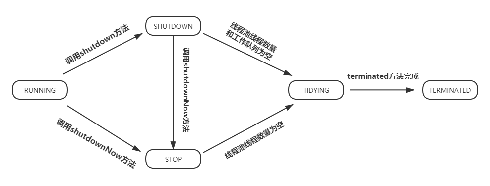
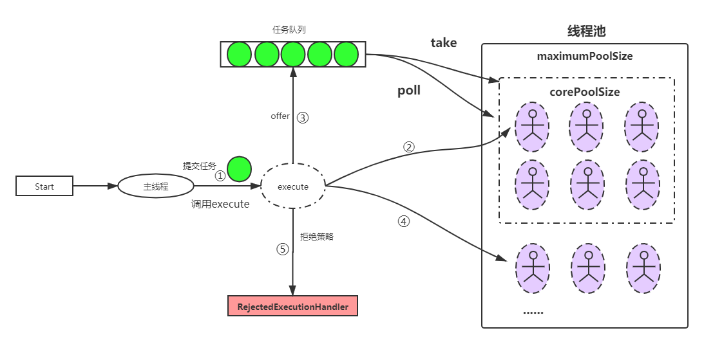
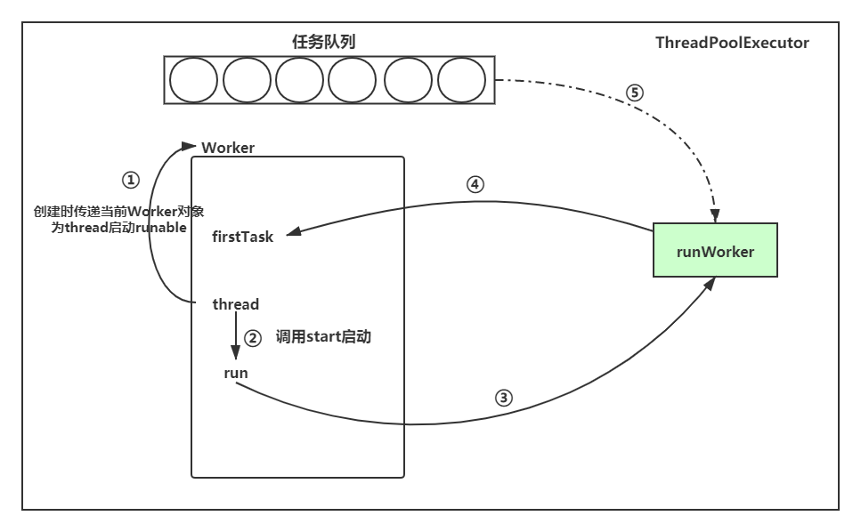

# 1. 线程池状态流转




#  2. 线程池原理图




# 3. Worker执行原理图




# 4. ★ 重要的`ctl`属性

`ctl`属性的高三位代表线程池当前运行状态`state`, 低`Integer.SIZE - 3`(29)位标识线程池Worker线程数量`workerCount`

因此衍生了一系列通过解析`clt`值获取`state`与`workerCount`, 或者`state`|`workerCount`得出`ctl`的方法. 

可谓**`ctl`在我手, 天下我有.**


```java
//高3位：表示当前线程池运行状态   除去高3位之后的低位：表示当前线程池中所拥有的线程数量
private final AtomicInteger ctl = new AtomicInteger(ctlOf(RUNNING, 0));
//表示在ctl中，低COUNT_BITS位 是用于存放当前worker线程数量的位。
private static final int COUNT_BITS = Integer.SIZE - 3;
//低COUNT_BITS位 所能表达的最大数值。 000 111111111... => 5亿多。
private static final int CAPACITY   = (1 << COUNT_BITS) - 1;

// runState is stored in the high-order bits
//111 000000000000000000  转换成整数，是一个负数
private static final int RUNNING    = -1 << COUNT_BITS;
//000 000000000000000000
private static final int SHUTDOWN   =  0 << COUNT_BITS;
//001 000000000000000000
private static final int STOP       =  1 << COUNT_BITS;
//010 000000000000000000
private static final int TIDYING    =  2 << COUNT_BITS;
//011 000000000000000000
private static final int TERMINATED =  3 << COUNT_BITS;

// Packing and unpacking ctl
// 从 ctl 计算出当前线程池运行状态
//~000 11111111111111111111 => 111 000000000000000000000
//c == ctl = 111 000000000000000000111
//111 000000000000000000111
//111 000000000000000000000
//111 000000000000000000000
private static int runStateOf(int c)     { return c & ~CAPACITY ; }

//获取当前线程池线程数量
//c == ctl = 111 000000000000000000111
//111 000000000000000000111
//000 111111111111111111111
//000 000000000000000000111 => 7
private static int workerCountOf(int c)  { return c & CAPACITY; }

//用在重置当前线程池ctl值时  会用到
//rs 表示线程池状态   wc 表示当前线程池中worker（线程）数量
//111 000000000000000000
//000 000000000000000111
//111 000000000000000111
private static int ctlOf(int rs, int wc) { return rs | wc; }

/*
     * Bit field accessors that don't require unpacking ctl.
     * These depend on the bit layout and on workerCount being never negative.
     */
//比较当前线程池ctl所表示的状态，是否小于某个状态s
//c = 111 000000000000000111 <  000 000000000000000000 == true
//所有情况下，RUNNING < SHUTDOWN < STOP < TIDYING < TERMINATED
private static boolean runStateLessThan(int c, int s) {
    return c < s;
}

//比较当前线程池ctl所表示的状态，是否大于等于某个状态s
private static boolean runStateAtLeast(int c, int s) {
    return c >= s;
}

//小于SHUTDOWN 的一定是RUNNING。 SHUTDOWN == 0
private static boolean isRunning(int c) {
    return c < SHUTDOWN;
}
```


# 5. `Worker`继承`AbstractQueuedSynchronizer`以实现独占锁的原因

shutdown线程池时会判断当前worker状态，根据独占锁是否空闲来判断当前worker是否正在工作。 runWorker()中获取到task后, 上锁成功后,  再处理task

```java
final void runWorker(Worker w) {
    Thread wt = Thread.currentThread();
    Runnable task = w.firstTask;
    w.firstTask = null;
    // ★ 清理锁状态,worker state == 0 和 exclusiveOwnerThread ==null
    w.unlock(); // allow interrupts
    
	while (task != null || (task = getTask()) != null) {
        //★ shutdown时会判断当前worker状态，根据独占锁是否空闲来判断当前worker是否正在工作。
        w.lock();
        
        if ((runStateAtLeast(ctl.get(), STOP) ||
                        (Thread.interrupted() &&
                                runStateAtLeast(ctl.get(), STOP))) &&
                        !wt.isInterrupted())
                    wt.interrupt();
        
        try{
            // ... 执行task
        }finally{
            task = null;
            w.completedTasks++;
            // ★ 释放锁
            w.unlock();
        }
    }    
}


```


