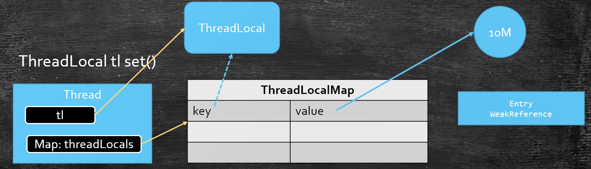
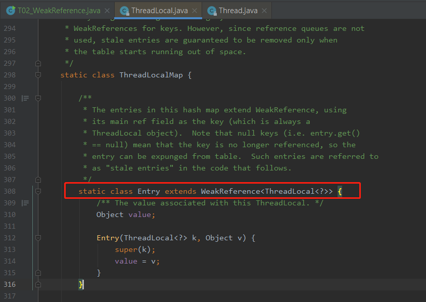

>  Java四种引用类型: 强软弱虚


JDK1.2 之前，一个对象只有“已被引用”和"未被引用"两种状态. 

JDK.1.2 之后，Java 对引用的概念进行了扩充，将引用分为4种,  引用强度依次减弱：

强引用（Strong Reference）、软引用（Soft Reference）、弱引用（Weak Reference）、虚引用（Phantom Reference）.


# 一. 四大引用类型, 引用队列


## 1. 强引用 (Strong Reference)

强引用是默认声明的引用类型

```java
Object obj = new Object(); //只要obj还指向Object对象，Object对象就不会被回收
obj = null;  //手动置null
```


只要强引用存在，垃圾回收器将永远不会回收被引用的对象，哪怕内存不足时，JVM也会直接抛出OutOfMemoryError，不会去回收。如果想中断强引用与对象之间的联系，可以显示的将强引用赋值为null，这样一来，JVM就可以适时的回收对象了


## 2. 软引用（Soft Reference）

一个被软引用关联的对象，如果堆内存的空间足够，软引用就能继续被使用，而不会被垃圾回收器回收，只有**在堆内存不足时，软引用才会被垃圾回收器回收**。

因此，软引用可以用于实现对内存敏感的**高速缓存**。

```java
/**
 * VM args：-Xmx20M -Xmn20M
 */
public class T01_SoftReference {

    public static void main(String[] args) {

        SoftReference<byte[]> r = new SoftReference<>(new byte[10*1024*1024]);

        System.out.println(r.get());
        System.gc();

        try {
            Thread.sleep(500);
        } catch (InterruptedException e) {
            e.printStackTrace();
        }

        System.out.println(r.get());

        //分配数组, 使得堆内存不足, 触发gc, 若还不足, 则回收软引用指向的对象
        byte[] m = new byte[15*1024*1024];
        System.out.println(r.get());
    }
}
```


## 3. 弱引用（Weak Reference）

无论内存是否足够，只要 JVM 开始进行垃圾回收，那些被弱引用关联的对象都会被回收。

在ThreadLocal中被使用. 

```java
/**
 * VM args：-Xmx20M -Xmn20M
 */
public class T02_WeakReference {
    public static void main(String[] args) {

        //我是占内存的
        byte[] b = new byte[1024*1024*9];

        WeakReference<RefObject> r = new WeakReference<>(new RefObject());
        System.out.println(r.get());
        b = null;

        System.gc();
        // 返回null
        System.out.println(r.get());

        // WeakReference在ThreadLocal中的应用
        ThreadLocal<RefObject> tl = new ThreadLocal<>();
        tl.set(new RefObject());
        tl.remove();
    }
}
```


## 4. 虚引用 (Phantom Reference)

一个关联虚引用的对象，和没有引用几乎是一样的，随时可能被垃圾回收器回收。当试图通过虚引用的get()方法取得强引用时，总是会失败。并且，**虚引用必须和引用队列一起使用，它的作用在于跟踪垃圾回收过程**。

虚引用在nio与netty(零拷贝的实现)中被大量使用于堆外内存的释放. 

```java
/**
 * VM args：-Xmx20M -Xmn20M
 */
public class T03_PhantomReference {

    private static final List<Object> LIST = new LinkedList<>();
    private static final ReferenceQueue<RefObject> QUEUE = new ReferenceQueue<>();

    public static void main(String[] args) {

        PhantomReference<RefObject> r = new PhantomReference<>(new RefObject(), QUEUE);

        new Thread(() -> {
            while(true){
                LIST.add(new byte[2*1024*1024]);

                try {
                    Thread.sleep(1000);
                } catch (InterruptedException e) {
                    e.printStackTrace();
                    Thread.currentThread().interrupt();
                }

                System.out.println(r.get());
            }
        }).start();

        new Thread(() -> {
            while(true){
                Reference<? extends RefObject> obj = QUEUE.poll();
                if(obj != null){
                    System.out.println("虚引用对象被回收==> " + obj);
                }
            }
        }).start();
    }

}
```


对虚引用的get()操作，总是返回null，因为sf.get()方法的实现如下：

```java
public T get() {
    return null;
}
```


## 5. 引用队列 (ReferenceQueue)

引用队列可以与**软引用、弱引用以及虚引用**一起配合使用，当垃圾回收器准备回收一个对象时，如果发现它还有引用，那么就会在回收对象之前，把这个引用加入到与之关联的引用队列中去。程序可以通过判断引用队列中是否已经加入了引用，来判断被引用的对象是否将要被垃圾回收，这样就可以在对象被回收之前采取一些必要的措施。

与软引用、弱引用不同，**虚引用必须和引用队列一起使用**。


## 6. Reference的四中状态

- Active: 激活。创建ref对象时就是激活状态

- Pedding: 等待入队。所对应的强引用被GC，就要入队，是GC线程做的

- Enqueued: 对象的内存已经回收, 被放入到ReferenceQueue中

- Inactive: 失效, 是终态. 没指定ReferenceQueue, 被回收是Inactive状态. 或者从ReferenceQueue中poll()出来后也变成Inactive状态.

```java
public abstract class Reference<T> {
		// 保存真实对象引用
    private T referent;         /* Treated specially by GC */

    // 指定引用队列（虚引用必须指定）, 可以用于判定引用对象是否被gc
    volatile ReferenceQueue<? super T> queue;

    // 用于组装城ReferenceQueue, 单向队列
    // ReferenceQueue内部持有head, head就是Reference对象.
    Reference next;

    // VM线程使用。来判定当前ref的真实对象是垃圾后，会将当前ref加入到pending队列，
    // 然后JM把discovered连接起来组成pending链表
    transient private Reference<T> discovered;  /* used by VM */

	  // pedding链表的头, pedding链表元素的追加操作是GC线程操作的
    // 所以说多个堆内对象的ref就可以组合到pending中。
    private static Reference<Object> pending = null;
  
	  static {
          // 省略无关代码... 
      	// ReferenceHandler 继承 Thread
        Thread handler = new ReferenceHandler(tg, "Reference Handler");
        /* If there were a special system-only priority greater than
         * MAX_PRIORITY, it would be used here
         */
        handler.setPriority(Thread.MAX_PRIORITY);
        handler.setDaemon(true);
        handler.start();
    }
}
```


## 7. ReferenceHandler线程的启动与工作过程


```java
/* High-priority thread to enqueue pending References */
private static class ReferenceHandler extends Thread {

    ReferenceHandler(ThreadGroup g, String name) {
        super(g, name);
    }

    public void run() {
        for (;;) {
            Reference<Object> r;
            // 为何需要同步
            // 1. GC线程会向pending队列追加ref
            // 2.  当前线程消费pending队列, 即下面代码
            synchronized (lock) {
                if (pending != null) {
                    // 从头开始消费, 头出队
                    r = pending;
                    // 把下一个设为头
                    pending = r.discovered;
                    // 旧的头, 断开与下一个的引用
                    r.discovered = null;
                } else {
                    try {
                        try {
                            // 释放锁, 阻塞当前线程,
                            // 直到JVM的gc线程向pending队列追加元素后, notify唤醒
                            lock.wait();
                        } catch (OutOfMemoryError x) { }
                    } catch (InterruptedException x) { }
                    continue;
                }
            }

            // Fast path for cleaners
            // Cleaner继承了PhantomReference, 是Cleaner类型, 则不执行入队ReferenceQueue操作
            // NIO的堆外内存buffer(DirectByteBuffer)在创建时候, 就把实例自己传给Cleaner
            // cleaner = Cleaner.create(this, new Deallocator(base, size, cap));
            // 借助Deallocator(执行unsafe.freeMemory())去调用native方法释放对外内存
            if (r instanceof Cleaner) {
                ((Cleaner)r).clean();
                continue;
            }

            // ReferenceQueue入队
            ReferenceQueue<Object> q = r.queue;
            if (q != ReferenceQueue.NULL) q.enqueue(r);
        }
    }
}
```


# 二. ThreadLocal


## 2.1 ThreadLocalMap的key-value节点Entry继承了弱引用是为了避免内存泄漏.

假设`ThreadLocal<Object> tl = new ThreadLocal<>()`,  在`tl.set(obj)`时候, Entry的key引用指向`对象tl`, 

- 如果`Entry`使用强引用, 那么即使`tl = null`,  但key的引用依旧指向`tl`,  `tl对象`依旧无法被回收, 造成内存泄漏.
- 而`Entry`继承弱引用, 可以避免内存泄漏. 







## 2.2 ThreadLocal的产生内存泄漏

还是存在内存泄漏的可能性.  

entry继承弱引用. 影响的是key, 即threadlocal对象. key就是threadlocal对象. ThreadLocal对象被回收了, 也就是key变成null, 将导致强引用的value无法被访问到, 依旧存在内存泄漏的风险. 因此在使用完ThreadLocal对象后, 需要手动remove();


```java
// WeakReference在ThreadLocal中的应用
ThreadLocal<RefObject> tl = new ThreadLocal<>();
tl.set(new RefObject());
// tl.get();

// 使用完后必须remove(), 防止内存泄漏
tl.remove();
```


## 2.3 ThreadLocal引用场景

用于统一线程内对象传递. 被spring 事务注解大量使用.

