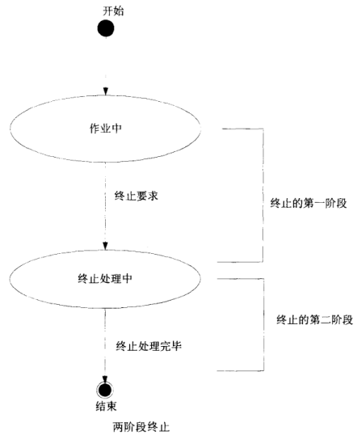

# Guarded Suspension(保护挂起)模式

Guarded Suspension模式又称为“保护性暂挂模式”, 当现在并不适合马上执行某个操作时，就要求想要执行该操作的线程等待. 

这种“等待-通知”机制是一种非常普遍的线程间协作的方式。我们在平时工作中经常看到有同学使用“轮询while(true)”的方式来等待某个状态，其实都可以用这个“等待-通知”机制来优化。


## 代码示例


```java
public class GuardedQueue {
    private final Queue<Integer> sourceList;

    public GuardedQueue() {
        this.sourceList = new LinkedBlockingQueue<>();
    }
    
    public synchronized Integer get() {
        while (sourceList.isEmpty()) {
            try {
                wait();    // <--- 如果队列为null，等待            
            } catch (InterruptedException e) {
                e.printStackTrace();
            }
        }
        return sourceList.peek();
    }
    
    public synchronized void put(Integer e) {
        sourceList.add(e);
        notifyAll();  //<--- 通知，继续执行    }
}
```


```java
public class App {
    public static void main(String[] args) {
        GuardedQueue guardedQueue = new GuardedQueue();
        ExecutorService executorService = Executors.newFixedThreadPool(3);
        executorService.execute(() -> {
                    guardedQueue.get();
                }
        );
        Thread.sleep(2000);
        executorService.execute(() -> {
                    guardedQueue.put(20);
                }
        );
        executorService.shutdown();
        executorService.awaitTermination(30, TimeUnit.SECONDS);
    }
}
```


## 模式讲解

*角色：*
Guarded Suspension Pattern 的角色如下：

- GuardedObject (被防卫的对象)参与者

GuardedObject 参与者是一个拥有被防卫的方法（guardedMethod）的类。当线程执行guardedMethod时，只要满足警戒条件，就能继续执行，否则线程会进入wait set区等待。警戒条件是否成立随着GuardedObject的状态而变化。
GuardedObject 参与者除了guardedMethod外，可能还有用来更改实例状态的的方法stateChangingMethod。

在Java语言中，是使用while语句和wait方法来实现guardedMethod的；使用notify/notifyAll方法实现stateChangingMethod。如案例中的RequestQueue 类。

*注意：Guarded Suspension Pattern 需要使用while，这样可以使从wait set被唤醒的线程在继续向下执行前检查Guard条件。如果改用if，当多个线程被唤醒时，由于wait是继续向下执行的，可能会出现问题。*


#　Two-phase Termination（两阶段终止）模式

我们将线程的正常处理状态称为“作业中”，当希望结束这个线程时，则送出“终止请求”。接着，这个线程并不会立刻结束，而是进入“终止处理中”状态，此时线程还是运行着的，可能处理一些释放资源等操作。直到终止处理完毕，才会真正结束。


Two-phase Termination主要考虑以下问题：

- 安全地结束（安全性）；
- 一定会进行终止处理（生命性）；
- 收到“终止请求”后，要尽快进行终止处理（响应性）；


**既要保证线程灵活的切换运行状态，又要保证线程优雅的处理完当前任务**，就是两阶段终止模式（Two-phase Termination）的核心思想。

综上所述两阶段终止模式的两个阶段总结起来分别为：

1. 发出信号，告知正在运行的线程将被终止。
2. 接收到此信号的线程，做完善后工作，停止运行。




## 代码示例

```java
// 计数线程类, 线程每隔500ms将计数器增加1，
public class CountupThread extends Thread {
    private long counter = 0;
    private volatile boolean shutdownRequested = false;

    public void shutdownRequest() {
        shutdownRequested = true;
        interrupt();
    }
    
    public boolean isShutdownRequested() {
        return shutdownRequested;
    }
    
    public final void run() {
        try {
            while (!shutdownRequested) {
                doWork();
            }
        } catch (InterruptedException e) {
        } finally {
            doShutdown();
        }
    }
    
    private void doWork() throws InterruptedException {
        counter++;
        System.out.println("doWork: counter = " + counter);
        Thread.sleep(500);
    }
    
    private void doShutdown() {
        System.out.println("doShutdown: counter = " + counter);
    }
}

// 在大约10s后结束计数线程
public class Main {
    public static void main(String[] args) {
        System.out.println("main: BEGIN");
        try {
            CountupThread t = new CountupThread();
            t.start();
            Thread.sleep(10000);
            System.out.println("main: shutdownRequest");
            t.shutdownRequest();
            System.out.println("main: join");
            t.join();
        } catch (InterruptedException e) {
            e.printStackTrace();
        }
        System.out.println("main: END");
    }
}
```


## 模式讲解

Two-phase Termination模式的角色如下：

- TerminationRequester参与者

TerminationRequester参与者用于调用终止请求。（案例中的Main类）

- Terminator参与者

Terminator参与者接受终止请求，进行实际的终止处理，提供shutdownRequest终止方法供外界调用。
Terminator参与者拥有一个标识（门闩）表示是否已经收到终止请求


# Promise模式

Promise模式是一种异步编程模式. 其核心的是, 执行任务A时, 其执行结果可通过一个promise对象来获取。因而并不需要同步等待任务A结束再去执行任务B。任务B可以与任务A同时执行，它需要任务A执行的结果时， 通过这个promise对象获取即可。


**FutureTask**就是Promise模式的典型应用.


Promise模式主要由4部分构成: 1：Promisor、 2：Executor、 3：Promise,  4：Result。

下面一幅图说明这个四个部分的构成关系,：

1. Executor需要在Promisor的create()方法中去执行。
2. create()的返回值就是Promise。
3. Result则是Promise中get()方法的返回值。


# Producer-Consumer(生产者-消费者)模式

生产者和消费者模式中有三个重要角色，生产者、任务队列、消费者。生产者提交任务到队列，消费者从队列中取出任务进行处理。


##　过饱和问题

发生过饱问题的场景

场景1：生产者速度过快，阻塞队列塞满了

场景2：阻塞队列设置太小，但是又不能设置成无界队列 防止内存溢出，然后导致过饱问题


根据实际情况选择应对方案:

1. 消费者加机器
2. 适当加大队列容量
3. 生产者限流


# Active Object(主动对象) 模式

该模式是一种异步编程模式，核心思想就是通过将**调用和执行过程分离**，实现异步编程模式。

这样做有两个优点，

- 第一提高了系统的并发能力和吞吐量；
- 第二降低了系统的耦合性，如果具体的执行逻辑要修改，不会影响到调用方，维护起来比较方便。


主动对象模型由六大组件组成：

- Proxy: 主要用于对外暴露异步方法。包含asyncService方法，这是主动对象模型执行的入口。
- Future: Proxy返回的Futrue对象, 可以获取执行结果
- MethodRequest: 封装了请求参数等上下文信息, 包含了一个核心方法call(). 
- Scheduler: 调度器, 操作缓冲区去执行任务
- ActivationQueue: 任务缓冲区, 缓存那些来不及处理的MethodRequest对象，等待工作线程有空闲时再从缓冲区中读取出任务来执行。
- Servant: 真实执行任务的类, 把执行结果放到Future中. 


# Thread-Specific Storage（ThreadLocal）模式

Thread-Specific Storage就是“线程独有的存储库”，该模式会对每个线程提供独有的内存空间。
`java.lang.ThreadLocal`类提供了该模式的实现，ThreadLocal的实例是一种集合（collection）架构，该实例管理了很多对象，可以想象成一个保管有大量保险箱的房间。


https://segmentfault.com/a/1190000015558915


# 主仆模式


# half-sync/half-async(半同步/半异步)模式

生产者/消费者模式是我们后端开发人员最为常见的半同步/半异步的设计模式的落地方案了.  

- 通过半同步/半异步模式的方式在生产者/消费者模式中的运用，从而让两个线程的执行效率不受彼此的影响，同时也是保证系统对外的吞吐量，让一个线程直接收用户的请求，一个负责执行耗时的用户请求逻辑。

除了在生产者/消费者模式中得以运用, GUI的开发领域也有应用. 

- 通过半同步/半异步模式的在GUI开发场景中的运用，保证耗时的网络交互操作的同时，不会影响到图形界面UI交互的流畅性。


