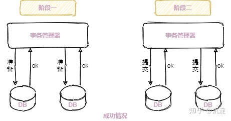
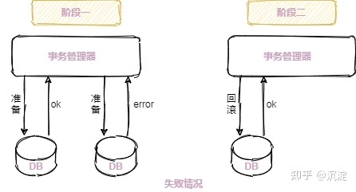
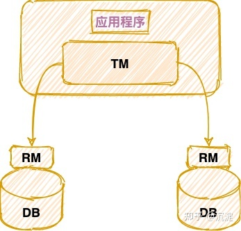
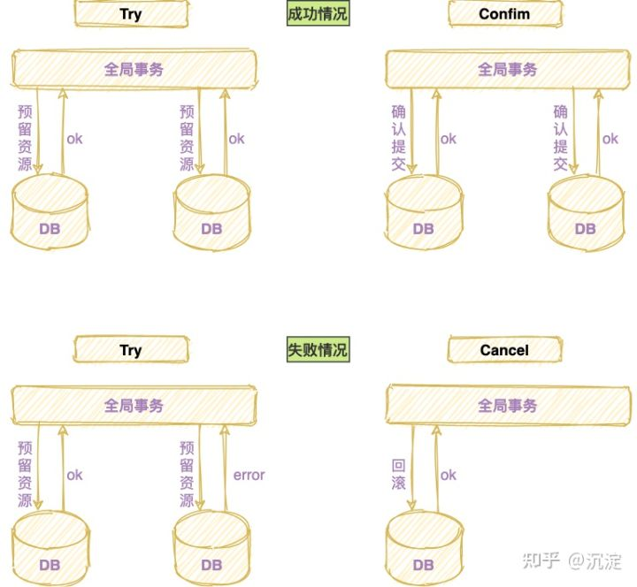

> 部分内容引用自: https://zhuanlan.zhihu.com/p/376378186


# 1. 分布式事务基础理论

`本地事务的四大特性：ACID`


- **原子性：A（Atomic）**，构成事务的所有操作，要么都执行完成，要么全部不执行，不可能出现部分成功部分失败的情况。
- **一致性：C（Consistency）**，在事务执行前后，数据库的一致性约束没有被破坏。比如：张三向李四转 100 元，转账前和转账后的数据是正确状态这叫一致性，如果出现张三转出 100 元，李四账户没有增加 100 元这就出现了数 据错误，就没有达到一致性。
- **隔离性：I（Isolation）**，数据库中的事务一般都是并发的，隔离性是指并发的两个事务的执行互不干扰，一个事务不能看到其他事务的运行过程的中间状态。通过配置事务隔离级别可以比避免脏读、重复读问题。
- **持久性：D（Durability）**，事务完成之后，该事务对数据的更改会持久到数据库，且不会被回滚。

数据库事务在实现时会将一次事务的所有操作全部纳入到一个不可分割的执行单元，该执行单元的所有操作要么都成功，要么都失败，只要其中任一操作执行失败，都将导致整个事务的回滚。


# 2. CAP与BASE理论

[CAP与BASE理论](CAP与BASE理论.md) 


# 3. 分布式事务的规范与协议

## 3.1 刚性事务(强一致性)

刚性事务：遵循ACID原则，强一致性。


### 3.1.1 XA分布式事务方案


#### 什么是2PC协议

2PC是数据一致性协议，与Paxos协议，Raft协议一样，都是在分布式系统下如何保证数据的一致性而衍生出的协议，不过2PC（两阶段提交协议）主要在分布式事务中使用。它将整个事务流程分为两个阶段，准备阶段（Prepare phase）、提交阶段（commit phase）。

- `准备阶段（Prepare phase）`
  - 事务管理器给每个参与者发送 Prepare 消息，每个数据库参与者在本地执行事务，并写本地的 Undo/Redo 日志，此时事务没有提交。（Undo 日志是记录修改前的数据，用于数据库回滚，Redo 日志是记录修改后的数据，用于提交事务后写入数据文件）

- `提交阶段（commit phase）`
  - 如果事务管理器收到了参与者的执行失败或者超时消息时，直接给每个参与者发送回滚（Rollback）消息；
  - 否则，发送提交（Commit）消息；参与者根据事务管理器的指令执行提交或者回滚操作，并释放事务处理过程中使用的锁资源。
  - 注意：**必须在最后阶段释放锁资源**。








#### 什么是XA规范

在XA规范之前，存在着一个DTP（Distributed Transaction Processing Reference Model）模型，该模型规范了分布式事务的模型设计。

**`DTP 模型定义如下角色：`**

- **AP**（Application Program）：即应用程序，可以理解为使用 DTP 分布式事务的程序。
- **RM**（Resource Manager）：即资源管理器，可以理解为事务的参与者，一般情况下是指一个数据库实例，通过资源管理器对该数据库进行控制，资源管理器控制着分支事务。
- **TM**（Transaction Manager）：事务管理器，负责协调和管理事务，事务管理器控制着全局事务，管理事务生命周期，并协调各个 RM。**全局事务**是指分布式事务处理环境中，需要操作多个数据库共同完成一个工作，这个工作即是一个全局事务。

**`DTP 模型定角色的交互方式：`**

1. TM 向 AP（应用程序） 提供应用程序编程接口，AP 通过 TM 提交及回滚事务。

2. TM 交由中间件通过 XA 接口来通知 RM 数据库事务的开始、结束以及提交、回滚等。





#### XA分布式事务方案介绍

2PC的传统方案是在数据库层面实现的，如 Oracle、MySQL(5.7+) 都支持 2PC 协议，为了统一标准减少行业内不必要的对接成本，需要制定标准化的处理模型及接口标准，国际开放标准组织 Open Group 定义了分布式事务处理模型**DTP。**

**DTP 模型定义TM和RM之间通讯的接口规范叫 XA，简单理解为数据库提供的 2PC 接口协议，基于数据库的 XA 协议来实现 2PC 又称为 XA 方案**。

整个 2PC 的事务流程涉及到三个角色 AP、RM、TM。AP 指的是使用 2PC 分布式事务的应用程序；RM 指的是资源管理器，它控制着分支事务；TM 指的是事务管理器，它控制着整个全局事务。

（1）在**准备阶段** RM 执行实际的业务操作，仅锁定资源但不提交事务 。

（2）在**提交阶段** TM 会接受 RM 在准备阶段的执行回复，只要有任一个RM执行失败，TM 会通知所有 RM 执行回滚操作，否则，TM 将会通知所有 RM 提交该事务。提交阶段结束资源锁释放。


#### 总结

基于 XA 协议实现的分布式事务两阶段提交（`2PC`），**对业务侵入很小**，它最大的优势就是**对使用透明**，用户可以像使用本地事务一样使用基于 XA 协议的分布式事务，**能够严格保障事务 ACID 特性**。

可 `2PC`的**缺点**也是显而易见，它是一个**强一致性**的同步阻塞协议，事务执行过程中需要将所需资源全部锁定，也就是俗称的 `刚性事务`。所以它比较适用于执行时间确定的短事务，（资源锁需要等到两个阶段结束才释放）整体性能较差。

一旦事务协调者宕机或者发生网络抖动，会让参与者一直处于锁定资源的状态或者只有一部分参与者提交成功，导致数据的不一致。因此，**在并发性能上的场景中，基于 XA 协议的分布式事务并不是最佳选择**。

另外, 需要本地数据库支持XA协议。


## 3.2 柔性事务(最终一致性)

柔性事务：遵循BASE理论，最终一致性；与刚性事务不同，柔性事务允许一定时间内，不同节点的数据不一致，但要求最终一致。


### 3.2.1 分布式事务解决方案TCC

TCC 是 Try、Confirm、Cancel 三个词语的缩写，TCC 要求每个分支事务实现三个操作：**预处理 Try**、**确认 Confirm、撤销 Cancel**。

Try 操作做业务检查及资源预留，Confirm 做业务确认操作，Cancel 实现一个与 Try 相反的操作即回滚操作。TM 首先发起所有的分支事务的 Try 操作，任何一个分支事务的Try操作执行失败，TM 将会发起所有分支事务的 Cancel 操作，若 Try 操作全部成功，TM 将会发起所有分支事务的 Confirm 操作。





如果拿 TCC 事务的处理流程与 2PC 两阶段提交做比较，**2PC 通常都是在跨库的 DB 层面，而 TCC 则在应用层面的处理**，需要通过业务逻辑来实现。

这种分布式事务的实现方式的优势在于，可以让应用自己定义数据操作的粒度，使得降低锁冲突、提高吞吐量成为可能。TCC 不存在资源阻塞的问题，因为每个方法都直接进行事务的提交，一旦出现异常通过则 `Cancel` 来进行回滚补偿，这也就是常说的`补偿性事务`。

而不足之处则在于对应用的**侵入性非常强，业务逻辑的每个分支都需要实现 Try、Confirm、Cancel 三个操作**。此外，其实现难度也比较大，需要按照网络状态、系统故障等不同的失败原因实现不同的回滚策略。


# 4.  分布式解决方案Seata

`Seata` 是由阿里中间件团队发起的开源项目 Fescar，后更名为 `Seata`，它是一个是开源的分布式事务框架。

`Seata` 也是从两阶段提交演变而来的一种分布式事务解决方案，提供了 **柔性事务**（AT、TCC、SAGA）事务模式 与**刚性事务** XA 事务模式，为用户打造一站式的分布式解决方案，详细可参考官方文档。

[ Seata官方文档 ]: https://seata.io/zh-cn/docs/overview/what-is-seata.html


`Seata中定义了三种角色：`

- Transaction Coordinator（TC）：**事务协调者**，TC是独立的中间件，需要**独立部署**运行，它维护全局事务的运行状态，接收 TM 指令发起全局事务的提交与回滚，负责与 RM 通信协调各各分支事务的提交或回滚。
- Transaction Manager（TM）： **事务管理者**，TM 需要嵌入应用程序中工作，它负责开启一个全局事务，并最终向 TC 发起全局提交或全局回滚的指令。
- Resource Manager（RM）：**资源管理者**，RM控制分支事务，负责分支注册、状态汇报，并接收事务协调器 TC 的指令，驱动分支（本地）事务的提交和回滚。


## 4.1 Seata的XA模式

[Seata XA 模式]: https://seata.io/zh-cn/docs/dev/mode/xa-mode.html


**前提**

- 支持XA 事务的数据库。
- Java 应用，通过 JDBC 访问数据库。


**整体机制**

在 Seata 定义的分布式事务框架内，利用事务资源（数据库、消息服务等）对 XA 协议的支持，以 XA 协议的机制来管理分支事务的一种 事务模式。

- 执行阶段：
  - 可回滚：业务 SQL 操作放在 XA 分支中进行，由资源对 XA 协议的支持来保证 *可回滚*
  - 持久化：XA 分支完成后，执行 XA prepare，同样，由资源对 XA 协议的支持来保证*持久化*（即，之后任何意外都不会造成无法回滚的情况）
- 完成阶段：
  - 分支提交：执行 XA 分支的 commit
  - 分支回滚：执行 XA 分支的 rollback


强烈建议看一下官方文档:  [Seata XA 模式](https://seata.io/zh-cn/docs/dev/mode/xa-mode.html)


## 4.2 Seata的AT模式( `Automatic (Branch) Transaction Mode`)

[ Seata AT模式 ]: https://seata.io/zh-cn/docs/dev/mode/at-mode.html


**前提**

- 基于支持本地 ACID 事务的关系型数据库。
- Java 应用，通过 JDBC 访问数据库。


**整体机制**

AT模式是两阶段提交(2PC)协议的演变：

- 一阶段：业务数据和回滚日志记录在同一个本地事务中提交，释放本地锁和连接资源。

- 二阶段：

- - 提交异步化，非常快速地完成。
  - 回滚通过一阶段的回滚日志进行反向补偿。

> **Seata AT模式实现分布式事务，设计了一个关键表** **`UNDO_LOG`** **（回滚日志记录表），我们在每个应用分布式事务的业务库中创建这张表，这个表的核心作用就是，将业务数据在更新前后的数据镜像组织成回滚日志，备份在** **`UNDO_LOG`** **表中，以便业务异常能随时回滚。**


`UNDO_LOG` 表结构(以 MySQL 为例)

不同数据库在类型上会略有差别。

```sql
-- 注意此处0.7.0+ 增加字段 context
CREATE TABLE `undo_log` (
  `id` bigint(20) NOT NULL AUTO_INCREMENT,
  `branch_id` bigint(20) NOT NULL,
  `xid` varchar(100) NOT NULL,
  `context` varchar(128) NOT NULL,
  `rollback_info` longblob NOT NULL,
  `log_status` int(11) NOT NULL,
  `log_created` datetime NOT NULL,
  `log_modified` datetime NOT NULL,
  PRIMARY KEY (`id`),
  UNIQUE KEY `ux_undo_log` (`xid`,`branch_id`)
) ENGINE=InnoDB AUTO_INCREMENT=1 DEFAULT CHARSET=utf8;
```


强烈建议看一下官方文档:  [Seata AT 模式](https://seata.io/zh-cn/docs/dev/mode/at-mode.html)


**Seata AT模型实现的2PC与传统2PC的差别：**

- 架构层次方面：传统 2PC 方案的 RM 实际上是在数据库层，RM 本质上就是数据库自身，通过 XA 协议实现，而 Seata 的 RM 是以 jar 包的形式作为中间件层部署在应用程序这一侧的。
- 两阶段提交方面：传统 2PC无论第二阶段的决议是 commit 还是 rollback ，事务性资源的锁都要保持到 Phase2 完成才释放。而 Seata 的做法是在 Phase1 就将本地事务提交，这样就可以省去 Phase2 持锁的时间，整体提高效率。
- 高可用方面：Seata将分布式事物中的协调者独立部署,可以实现高可用(可以部署多个seata服务)。
- 写隔离：因为整个过程 全局锁 在 全局事务1 结束前一直是被 全局事务1 持有的，所以不会发生 脏写 的问题。
- 读隔离：在数据库本地事务隔离级别 **读已提交（Read Committed）** 或以上的基础上，Seata（AT 模式）的默认全局隔离级别是 **读未提交（Read Uncommitted）** ，如果应用在特定场景下，必需要求全局的 **读已提交** ，目前 Seata 的方式是通过 SELECT FOR UPDATE 语句的代理。


## 4.3 Seata的TCC模式(`(Branch) Transaction Mode`)

整体是 **两阶段提交** 的模型。

全局事务是由若干分支事务组成的，分支事务要满足 **两阶段提交** 的模型要求，即需要每个分支事务都具备自己的：

- 一阶段 prepare 行为
- 二阶段 commit 或 rollback 行为


[Seata TCC模式]: https://seata.io/zh-cn/docs/dev/mode/tcc-mode.html


**AT 模式**基于 **支持本地 ACID 事务** 的 **关系型数据库**：

- 一阶段 prepare 行为：在本地事务中，一并提交业务数据更新和相应回滚日志记录。
- 二阶段 commit 行为：马上成功结束，**自动** 异步批量清理回滚日志。
- 二阶段 rollback 行为：通过回滚日志，**自动** 生成补偿操作，完成数据回滚。

**TCC 模式**不依赖于底层数据资源的事务支持：

- 一阶段 prepare 行为：调用 **自定义** 的 prepare 逻辑。
- 二阶段 commit 行为：调用 **自定义** 的 commit 逻辑。
- 二阶段 rollback 行为：调用 **自定义** 的 rollback 逻辑。

所谓 TCC 模式，是指支持把 **自定义** 的分支事务纳入到全局事务的管理中。


## 4.4 Seata的Saga模式

Saga模式是SEATA提供的**长事务解决方案**。在Saga模式中，业务流程中每个参与者都提交本地事务，当出现某一个参与者失败则补偿前面已经成功的参与者，一阶段正向服务和二阶段补偿服务都由业务开发实现。


[Seata Saga模式]: https://seata.io/zh-cn/docs/user/saga.html


# 总结

在条件允许的情况下，我们尽可能选择本地事务单数据源，因为它减少了网络交互带来的性能损耗，且避免了数据弱一致性带来的种种问题。若某系统频繁且不合理的使用分布式事务，应首先从整体设计角度观察服务的拆分是否合理，是否高内聚低耦合？是否粒度太小？

分布式事务一直是业界难题，因为网络的不确定性，而且我们习惯于拿分布式事务与单机事务 ACID 做对比。

无论是数据库层的 XA、还是应用层 TCC、可靠消息、最大努力通知等方案，都没有完美解决分布式事务问题，它们不过是各自在性能、一致性、可用性等方面做取舍，寻求某些场景偏好下的权衡。

不管我们选哪一种方案，在项目中应用都要谨慎再谨慎，除特定的数据强一致性场景外，能不用尽量就不要用，因为无论它们性能如何优越，一旦项目套上分布式事务，整体效率会几倍的下降，在高并发情况下弊端尤为明显。