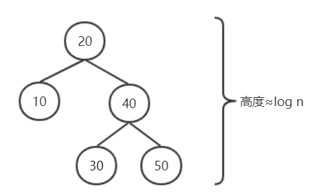

# 二叉搜索树

# 1. 定义

> 二叉搜索树（Binary Search Tree），（又：二叉查询树，二叉排序树）它或者是一棵空树，或者是具有下列性质的二叉树： 若它的左子树不空，则**左子树**上所有结点的值**均小于它的根结点的值**； 若它的右子树不空，则**右子树**上所有结点的值**均大于它的根结点的值**； 它的左、右子树也分别为二叉排序树。

通俗地讲，以当前节点为根，其左右子树的特点：**左小右大**。当前节点为50时，其左子树所有节点均小于50，右子树所有节点均大于50：

节点50的左右子树也同样符合这种特点，以左子树为例（以30为根的树）：

同样的，其他的子树、子树的子树等均符合该规律（类似递归）。

# 2. 查找

根据左小右大的特点，查找一个元素时，从根节点出发：
 （1）如果查找的元素比当前节点小，则到左子树找；
 （2）如果查找的元素比当前节点大，则到右子树找；
 （3）如果查找的元素等于当前节点，说明找到了；
 （4）如果直至叶子节点都找不到对应的，说明该元素不存在该树中。

# 3. 插入

插入元素时，主要是找到合适的位置进行插入（类似查找）：

1. 插入的树为空树（无节点），直接创建节点即可；
2. 插入的树非空树：
    2.1 如果插入的元素比当前节点小，则到左子树插入；如果左子树/节点为null，插入该处；
    2.2 如果插入的元素比当前节点大，则到右子树插入；如果右子树/节点为null，插入该处；
    2.3 如果插入的元素和当前节点相等，说明该元素已经存在了，直接返回。

# 4. 删除

## 4.1 前继节点和后继节点

二叉搜索树因为自身的特性（左小右大），中序遍历的结果必然是有序的。
 比如以下这棵树，其遍历的结果为：【20, 30, 35, 40, 45, 50, 55, 60, 65 70, 80】

在二叉搜索树中，前继节点表示比当前节点小的最大值，后继节点表示比当前节点大的最小值，看例子就很容易明白：比如上面【20, 30, 35, 40, **45**, **50**, **55**, 60, 65 70, 80】中，节点50的前继节点为45，后继节点为55。

在二叉搜索树中，寻找前后继节点很简单：
 （1）中序遍历中, 该节点的前一个节点, 也就是小于该节点最大节点, 即该节点左子树的最右子节点 ：

（2）中序遍历中, 该节点的后一个节点, 也就是大于该节点最小节点, 即该节点右子树的最左子节点：

## 4.2 根据子节点数量进行删除处理

删除前首先**要找到该节点**，如果找不到，直接结束即可。
 找到后，可以分为以下三种情景：

### 4.2.1 无子节点

无子节点，即叶子节点，直接删除即可；

### 4.2.2 只有一个子节点

只有一个子节点，用该子节点接到删除节点的父节点即可；

### 4.2.3 有两个子节点

有两个子节点，使用前或后继节点作为替换节点，对删除节点进行数据替换，然后转移至删除替换节点即可。而此时删除后继节点时，必然是情景1或2了；

关于情景3，无论使用前继节点还是后继节点，均可以达到同样的目的，选其一即可。

# 5. 二叉搜索树的问题

极端时，搜索的时间复杂度将会降低到 O(n)，比如以下这个例子：

而平衡二叉搜索树（AVL树、红黑树等）就是为了解决这个问题：平衡二叉树在进行插入、删除后，会进行自平衡，从而保证其查询的时间复杂度接近于O(log2n)。如红黑树连续插入10,20,30,40,50：

