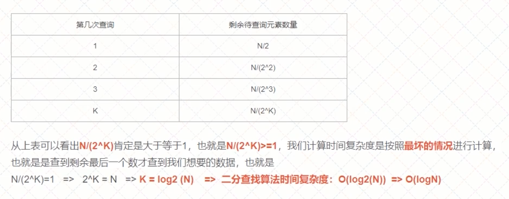
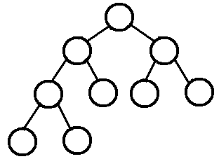
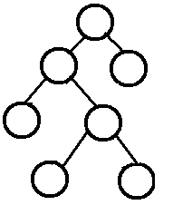
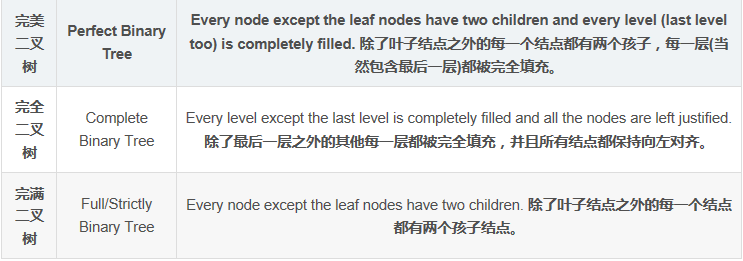
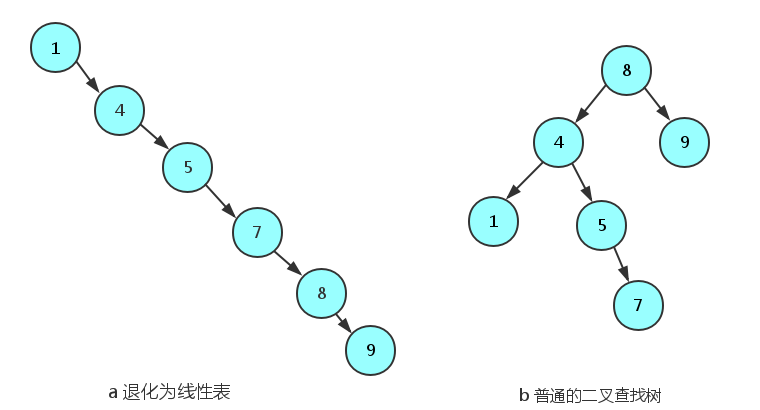
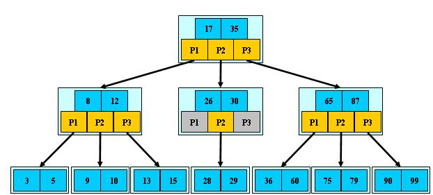

## 二分查找算法

二叉树是基于二分查找算法而实现的数据结构

二分查找算法的时间复杂度推算过程

## 二叉树

每个节点至多拥有两棵子树(即二叉树中不存在度大于2的节点)，并且，二叉树的子树有左右之分，其次序不能任意颠倒。

**二叉树的性质**

1. 若二叉树的层次从0开始，则在二叉树的第i层至多有`2^i`个节点(i>=0)
2. 高度为`k`的二叉树最多有`2^(k+1) - 1`个节点`(k>=-1)`(空树的高度为-1)
3. 对任何一棵二叉树，如果其叶子节点(度为0)数为`m`,  度为2的节点数为`n`,  则`m = n + 1`

**二叉树又分为：完美二叉树，完全二叉树，完满二叉树**

- **完美二叉树(满二叉树)**

- **完全二叉树**

- **完满二叉树**

**区别**

## 二叉树的遍历方法

前/中/后序遍历的命名, 是以根节点的位置来命名的.  

前序遍历是根节点放第一个位置访问, 

中序遍历是根节点放在中间位置访问, 

后序遍历是根节点放在第三位置访问

- 前序遍历(Preorder Traversal)：根 -> 前序遍历左子树 -> 前序遍历右子树
- 中序遍历(Inorder Traversal)：中序遍历左子树 -> 根节点 -> 中序遍历右子树,   或者先右->根->左, 因此中序遍历是有方向的, 其遍历结果最终分为升序与降序.   
- 后序遍历(Postorder Traversal)：后序遍历左子树 -> 后序遍历右子树 -> 根
- 层序遍历(Level Order Traversal): 从上往下, 从左往右一次访问每个节点, 

> 前中后序遍历是深度优先, 而层序遍历是广度优先.
>
> 前中后序算法适合链表, 适合递归. 而层序遍历适合数组实现, 不适合递归,

# 在Java中常见的树结构

## 1. 二叉查找树

二叉查找树也称为**有序**二叉查找树, 满足二叉查找树的一般性质, 是指一棵空树具有如下性质：

- 任意节点左子树不为空, 则左子树的值均小于根节点的值
- 任意节点右子树不为空, 则右子树的值均大于于根节点的值
- 任意节点的左右子树也分别是二叉查找树
- 没有键值相等的节点

**局限性及应用**
 **一个二叉查找树是由n个节点随机构成, 所以，对于某些情况, 二叉查找树会退化成一个有n个节点的线性链.如下图:**

## 2. AVL树

AVL树是一种自平衡的二叉查找树，和红黑树相比,  它是**严格的平衡二叉树**, 平衡条件必须满足(**所有节点的左右子树高度差不超过1**).不管我们是执行插入还是删除操作, 只要不满足上面的条件, 就要通过旋转来保持平衡(旋转的目的是为了降低树的高度，使其平衡), 而旋转是非常耗时的. 

##### 使用场景：

AVL树适合用于**插入删除少，查找多**的情况。

也在`Windows`进程地址空间管理中得到了使用。

 AVL树特点：

- AVL树是一棵二叉搜索树
- AVL树的左右子节点也是AVL树
- AVL树拥有二叉搜索树的所有基本特点
- 每个节点的左右子节点的高度之差的绝对值最多为1，即平衡因子为范围为`[-1, 1]`

## 3. ★ 红黑树

一种自平衡二叉查找树,  通过对任何一条从根到叶子的路径上各个节点着色的方式的限制, **红黑树确保从根到叶子节点的最长路径不会是最短路径的两倍**，用非严格的平衡来换取增删节点时候旋转次数的降低，任何不平衡都会在三次旋转之内解决

##### 使用场景：

红黑树多用于**搜索, 插入, 删除操作多**的情况下

**红黑树应用比较广泛**：
 1.广泛用在`C++`的`STL`中。`map`和`set`都是用红黑树实现的。
 2.著名的`linux`进程调度`Completely Fair Scheduler`, 用红黑树管理进程控制块。
 3.`epoll`在内核中的实现，用红黑树管理事件块
 4.`nginx`中，用红黑树管理`timer`等

**原因**：

**红黑树的查询性能略微逊色于`AVL`树**，因为比`AVL`树会稍微不平衡最多一层，也就是说红黑树的查询性能只比相同内容的`AVL`树最多多一次比较，但是，红黑树在插入和删除上完爆`AVL`树，`AVL`树每次插入删除会进行大量的平衡度计算，而红黑树为了维持红黑性质所做的红黑变换和旋转的开销，相较于`AVL`树为了维持平衡的开销要小得多

**性质**：

1. 节点是红色或黑色。
2. 根节点是黑色。
3. 每个叶子节点都是黑色的空节点（NIL节点）。
4. 每个红色节点的两个子节点都是黑色。(从每个叶子到根的所有路径上不能有两个连续的红色节点)
5. 从任一节点到其每个叶子的所有路径都包含相同数目的黑色节点。(因此红黑树的平衡被称为黑色完美平衡)

红黑树能自平衡, 靠的是三种操作: **变色, 左旋, 右旋**

- 变色: 节点颜色变为由红变黑, 或者由黑变红
- 左旋: (逆时针旋转)以某个节点作为旋转节点, 其右子节点R变为旋转节点的父节点, R的左子节点变为旋转节点的右子节点, 旋转节点的左子节点与R的右子节点不变.
- 右旋: (顺时针旋转)以某个节点作为旋转节点, 其左子节点L变为旋转节点的父节点, L的右子节点变为旋转节点的左子节点, 旋转节点的右子节点与L的左子节点不变.

## 4. B树

**B-树就是B树, -只是一个符号.
 B树(B-Tree)是一种自平衡的树, 它是一种多路搜索树（并不是二叉的），能够保证数据有序。同时它还保证了在查找、插入、删除等操作时性能都能保持在`O(logn)`，为大块数据的读写操作做了优化, 同时它也可以用来描述外部存储(支持对保存在磁盘或者网络上的符号表进行外部查找)**

**特点：
 1.定义任意非叶子节点最多只有`M`个儿子；且`M>2`
 2.根节点的儿子数为`[2,  M]`
 3.除根节点以外的非叶子节点的儿子数为`[M/2,  M]`
 4.每个节点存放至少`M/2-1`（取上整）和至多`M-1`个关键字；（至少2个关键字）
 5.非叶子节点的关键字个数=指向儿子的指针个数-1
 6.非叶子节点的关键字：`K[1],  K[2],  …,  K[M-1]；且K[i] < K[i+1]`
 7.非叶子节点的指针：`P[1],  P[2],  …,  P[M]`，其中`P[1]`指向关键字小于`K[1]`的子树，`P[M]`指向关键字大于`K[M-1]`的子树，其它`P[i]`指向关键字属于`(K[i-1],  K[i])`的子树
 8.所有叶子节点位于同一层**

### 如：（M=3）

#### 插入与平衡过程

**这个图用以表示往 4 阶 B 树中依次插入下面这组数据的过程：**
 `6 10 4 14 5 11 15 3 2 12 1 7 8 8 6 3 6 21 5 15 15 6 32 23 45 65 7 8 6 5 4`

**4 阶 B 树表示每个节点最多有 4 个子树、3 个关键字，最少有 2 个子树、一个关键字**

**添加/删除也是一样的，要考虑添加/删除孩子后，父节点是否还满足子树 `k` 介于 `M/2` 和 `M` 的条件，不满足就得从别的节点拆子树甚至修改相关子树结构来保持平衡。**

## 5. B+树

**B+树是B-树的变体，也是一种多路搜索树**
 B+的搜索与B-树也基本相同，区别是B+树只有达到叶子节点才命中（B-树可以在非叶子节点命中），其性能也等价于在关键字全集做一次二分查找；

**B+的特性：
 1.所有关键字都出现在叶子节点的链表中（稠密索引），且链表中的关键字恰好是有序的
 2.不可能在非叶子节点命中
 3.非叶子节点相当于是叶子节点的索引（稀疏索引），叶子节点相当于是存储（关键字）数据的数据层
 4.更适合文件索引系统**
 **原因： 增删文件（节点）时，效率更高，因为B+树的叶子节点包含所有关键字，并以有序的链表结构存储，这样可很好提高增删效率**
 如：（M=3）

##### 使用场景：

**文件系统和数据库系统中常用的B/B+ 树，他通过对每个节点存储个数的扩展，使得对连续的数据能够进行较快的定位和访问，能够有效减少查找时间，提高存储的空间局部性从而减少IO操作。他广泛用于文件系统及数据库中，如：
 Windows：HPFS 文件系统
 Mac：HFS，HFS+ 文件系统
 Linux：ResiserFS，XFS，Ext3FS，JFS 文件系统
 数据库：ORACLE，MYSQL，SQLSERVER 等中**

**B树：有序数组+平衡多叉树
 B+树：有序数组链表+平衡多叉树**

#### B+ 树的优点：

**1.层级更低，IO 次数更少
 2.每次都需要查询到叶子节点，查询性能稳定
 3.叶子节点形成有序链表，范围查询方便**
 B+数插入和平衡

**B+树还有一个最大的好处，方便扫库，B树必须用中序遍历的方法按序扫库，而B+树直接从叶子节点挨个扫一遍就完了，B+树支持range-query非常方便，而B树不支持。这是数据库选用B+树的最主要原因。**

**比如要查 5-10之间的，B+树一把到5这个标记，再一把到10，然后串起来就行了，B树就非常麻烦。B树的好处，就是成功查询特别有利，因为树的高度总体要比B+树矮。不成功的情况下，B树也比B+树稍稍占一点点便宜。**