# 1. 红黑树介绍

红黑树是一种自平衡二叉查找树,  通过对任何一条从根到叶子的路径上各个节点着色的方式的限制, **红黑树确保从根到叶子节点的最长路径不会是最短路径的两倍**，用非严格的平衡来换取增删节点时候旋转次数的降低，任何不平衡都会在**三次旋转之内解决**. 

**使用场景**：

红黑树多用于**搜索, 插入, 删除操作多**的情况下. 

**红黑树应用比较广泛**：
 1.广泛用在`C++`的`STL`中。`map`和`set`都是用红黑树实现的。
 2.著名的`linux`进程调度`Completely Fair Scheduler`, 用红黑树管理进程控制块。
 3.`epoll`在内核中的实现，用红黑树管理事件块
 4.`nginx`中，用红黑树管理`timer`等

**原因**：

**红黑树的查询性能略微逊色于`AVL`树**，因为比`AVL`树会稍微不平衡最多一层，也就是说红黑树的查询性能只比相同内容的`AVL`树最多多一次比较，但是，红黑树在插入和删除上完爆`AVL`树，`AVL`树每次插入删除会进行大量的平衡度计算，而红黑树为了维持红黑性质所做的红黑变换和旋转的开销，相较于`AVL`树为了维持平衡的开销要小得多

# 2. 性质

1. 节点是红色或黑色。
2. 根节点是黑色。
3. 每个叶子节点都是黑色的空节点（NIL节点）。
4. 每个红色节点的两个子节点都是黑色。(从每个叶子到根的所有路径上不能有两个连续的红色节点)
5. 从任一节点到其每个叶子的所有路径都包含相同数目的黑色节点。(因此红黑树的平衡被称为**黑色完美平衡**)

红黑树的高度指的是层数,  黑高度指的是黑色节点的数量.  

红黑树能自平衡, 靠的是三种操作: **变色, 左旋, 右旋**

# 3. 旋转

- 左旋: (逆时针旋转)以某个节点作为旋转节点, 其右子节点R变为旋转节点的父节点, R的左子节点变为旋转节点的右子节点, 旋转节点的左子节点与R的右子节点不变.
- 右旋: (顺时针旋转)以某个节点作为旋转节点, 其左子节点L变为旋转节点的父节点, L的右子节点变为旋转节点的左子节点, 旋转节点的右子节点与L的左子节点不变.

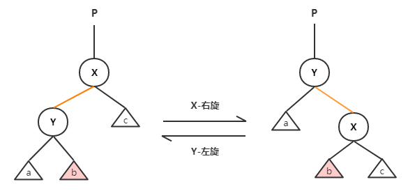

- 左旋动图

- 右旋动图

**旋转**操作影响的是左右子树的高度, 比如某棵树的左子树高度已经达到3，而右子树只有1，只需要以**根**为旋转节点右旋一下，左右子树高度都将调整为2。整棵树来看，高度就相当于降低了1（3 -> 2），这就是高度的“平衡”。

# 4. 插入

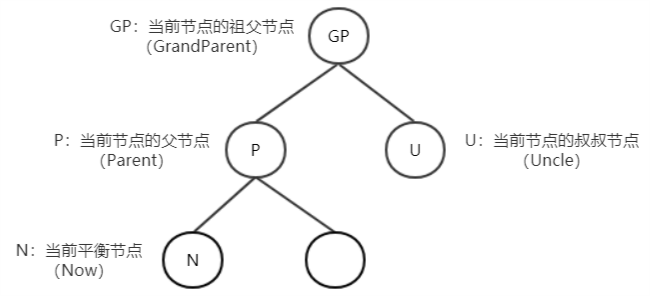

**新插入的节点均为红色节点**，因为红色不会影响路径上黑色节点的数量，保持性质4。

如果父节点为黑色，就直接结束了；如果父节点为红色，则需要另外处理了。

插入操作遇到的场景如下

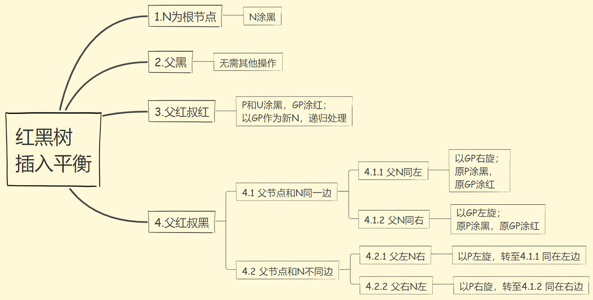

### 场景1,2很简单, 略过

### 情形3. 父红-叔红

父红-叔红时，将父/叔节(P/U)点涂黑，祖父节点(GP)涂红；而后以祖父节点(GP)作为新的平衡节点N，递归执行平衡操作。

> 即: 父叔双红, 父叔祖变色, 祖父递归

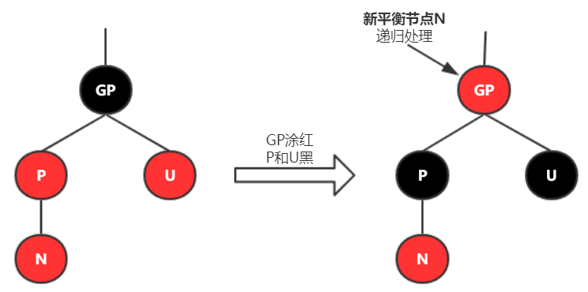

### 情形4. 父红-叔黑

#### 情形4.1 父节点和N同一边

- 情形4.1.1 父N同左(L)

“父N同左”指的是：**父节点为祖父节点的左(L)子，N为父节点的左(L)子**。此时以**祖父节点(GP)**为支点进行**右旋**；然后将P涂黑，将GP涂红。

> 即:  `LL双红`情况, **父祖变色, 以祖右旋**. 

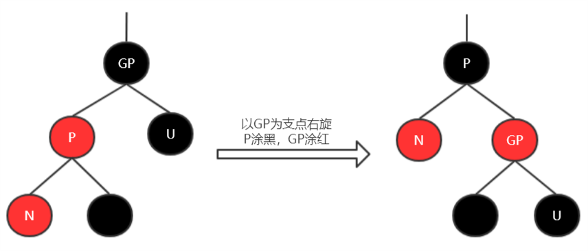

- 情形4.1.2 父N同右(R)

“父N同右”指的是：**父节点是祖父节点的右子，N为父节点的右子**。此时以**祖父节点(GP)**为支点进行**左旋**；将P涂黑，将GP涂红。

> 即:  `RR双红`情况,  **父祖变色, 以祖左旋**. 

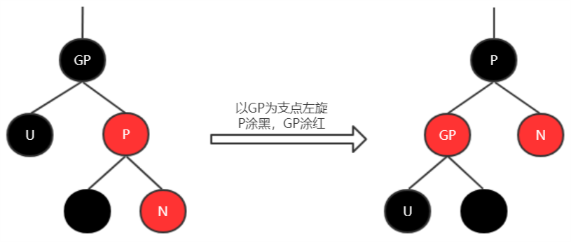

#### 情形4.2 父节点和N不在同一边

- 情形4.2.1 父左N右

“父左N右”指的是：**父节点是祖父节点的左子，N为父节点的右子**。
 此时，以**父节点(P)**进行**左旋**后，形成`LL双红`场景,  与 [情形4.1.1 父N同左]同理,  执行**父祖变色, 以祖右旋**。

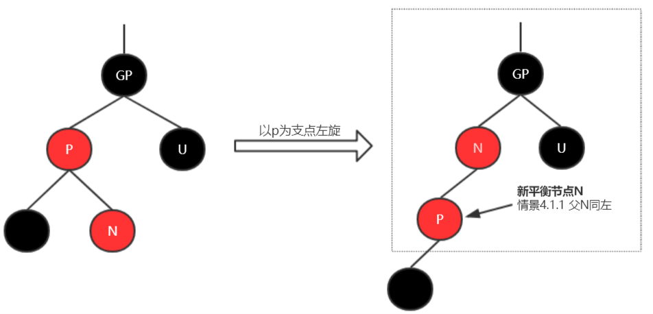

- 情形4.2.2 父右N左

“父右N左”指的是：**父节点是祖父节点的右子，N为父节点的左子**。
 此时，以**父节点(P)**进行**右旋**后，形成`RR双红`场景, 与[情形4.1.2 父N同右]同理, 执行**父祖变色, 以祖左旋**。

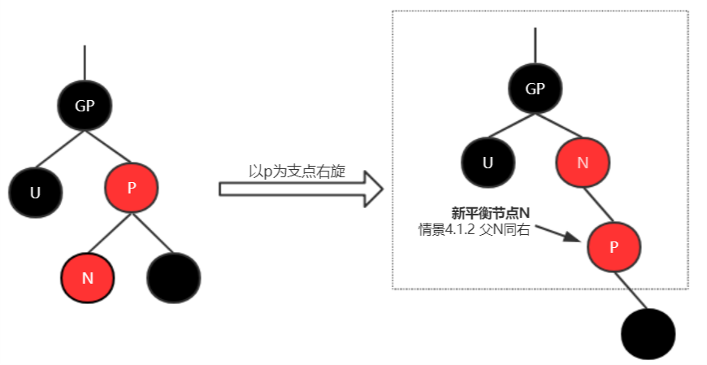

### **插入总结**

> 父黑直接挂
>
> 父叔双红, 父叔祖变色, 祖父递归 
>
> 父红叔黑, 不符合`LL双红`或者`RR双红`的场景,  想办法变为`LL双红`或者`RR双红`, 然后进行**父祖变色**, **以祖左/右旋**. 

# 5. 删除

删除动作只有三种情况, 但每种情况会有细分场景(**这里的子节点均指非NULL节点**）)

- 被删除的节点没有子节点
- 被删除的节点只有一个子节点
- 被删除的节点有两个子节点

下面一一分析

## 5.1 没有子节点

无子节点时，删除节点可能为红色或者黑色；

### 5.1.1 被删节点是红色

如果为红色，直接删除即可，不会影响黑色节点的数量；

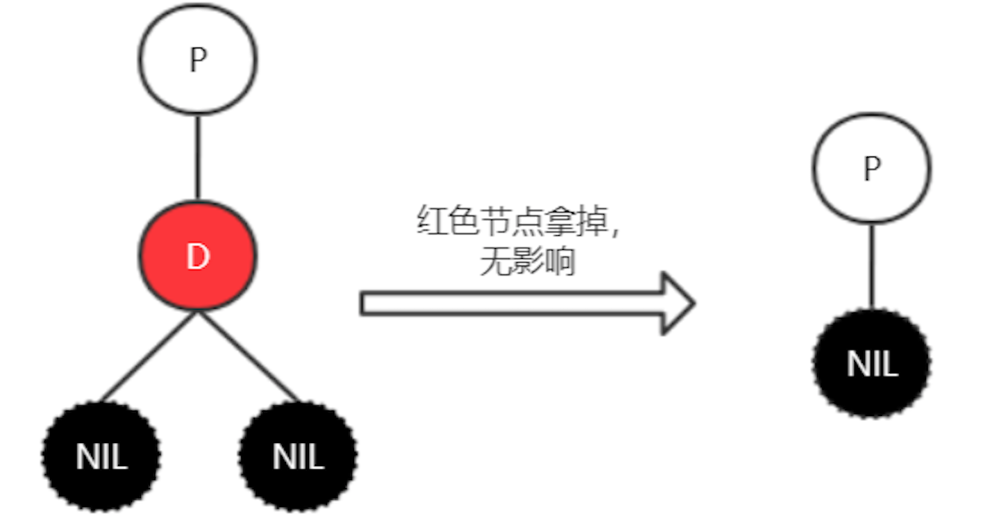

### 5.1.2 被删节点是黑色

如果为黑色，则需要进行**删除平衡**的操作了.

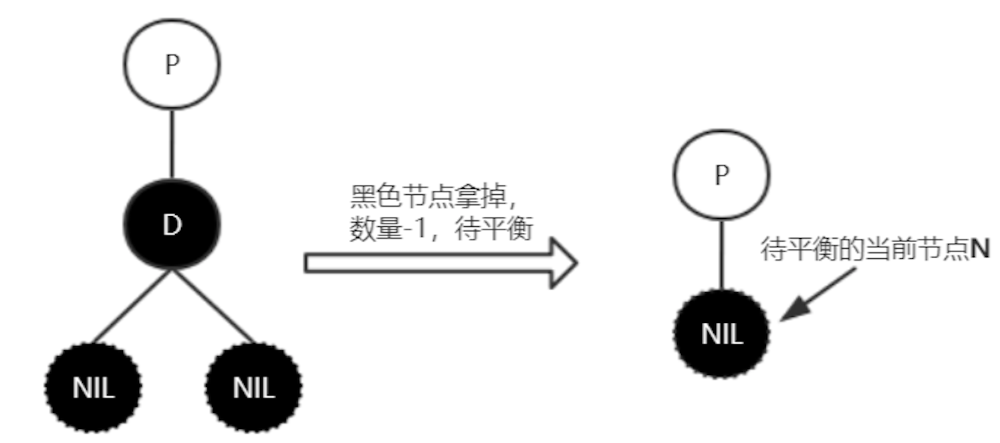

## 5.2 只有一个子节点

只有一个子节点时，**删除节点只能是黑色，其子节点为红色**，否则无法满足红黑树的性质了(`因为新增的子节点均是红色, 经过按照红黑树的性质经过一通变换, 父节点肯定是黑色`)。 此时用删除节点的子节点接到父节点，且将子节点颜色涂黑，保证黑色数量。

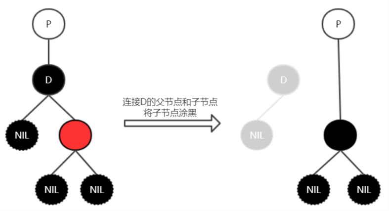

## 5.3 有两个子节点

被删节点有两个子节点时, 删除后使用**后继节点**作为替换的删除节点，情况会转成为5.1或5.2的情形。

> 二叉树节点的后继一般指的是**中序遍历中，该节点的后一个节点**。
>
> 如果指定节点有右子树，那么该节点的后继节点一定是右子树中最左边的节点。
> 如果指定节点没有右子树，则往上找它的父节点。直到当前节点是它的父节点的左孩子，那么这个父节点就是后继节点。

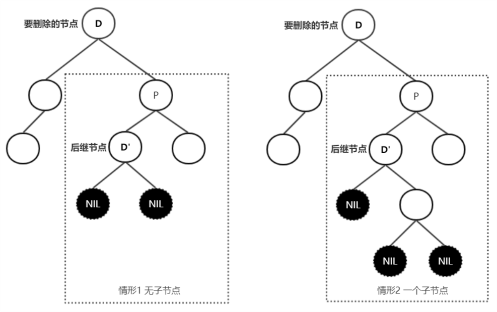

5.3情形总是会转换为5.1或5.2的情形，而情形5.1.1和情形5.2处理平衡非常简单，下文主要讨论的是情形5.1.2：删除**黑色的叶子节点**。因为一旦该节点被拿掉，红黑树中通过该节点的路径黑色节点数量将会减1，而且无法像情形5.2那样将子节点涂黑来达到平衡。**此时只能自底向上进行平衡操作**。

## 5.4 删除后的平衡

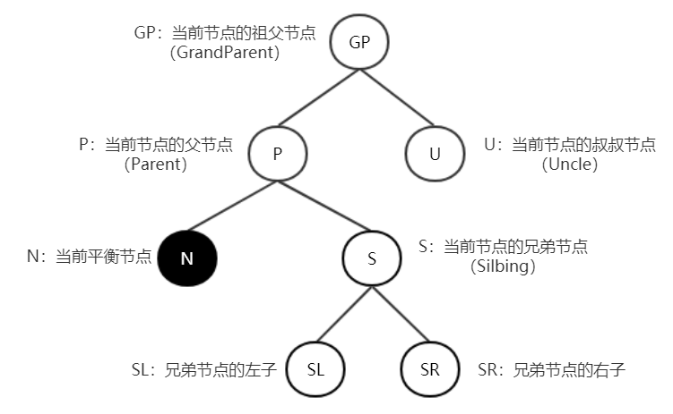

# 附录

参考: https://www.jianshu.com/p/84416644c080

过程动态演示

https://www.cs.usfca.edu/~galles/visualization/RedBlack.html