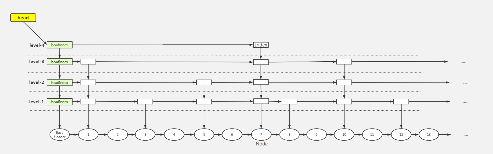

# 逻辑结构




# 核心内部类

- BASE_HEADER  头结点

- head  指向 node(`BASE_HEADER, 普通Object`) 的顶层索引

- Node 静态内部类

- Index 静态内部类

- HeadIndex 静态内部类, 继承自Index


# 操作源码


## 查询

get(key)  -> doGet(key) ，查询指定key对应的value

- 关键方法`findPredecessor(key, cmp) ` 

```java
/**
 * 查询返回小于当前key, 且带有索引节点的node
 * 同时清理/出队被删除的node的index
 */
private Node<K,V> findPredecessor(Object key, Comparator<? super K> cmp) {
    if (key == null)
        throw new NullPointerException(); // don't postpone errors
    // 要求: q.key < 目标key <= r.key
    for (;;) {
        for (Index<K,V> q = head, r = q.right, d;;) {
            if (r != null) {
                Node<K,V> n = r.node;
                K k = n.key;
                if (n.value == null) {
                    if (!q.unlink(r))
                        break;           // restart
                    r = q.right;         // reread r
                    continue;
                }

                if (cpr(cmp, key, k) > 0) {
                    // 目标key > node的key, q,r都往右边挪一个索引
                    q = r;
                    r = r.right;
                    continue;
                }
            }

            // 目标key <= node的key, 往下一级索引跳
            if ((d = q.down) == null)
                // down == null, 说明已经没有下一级索引了. 因此node是目标节点
                return q.node;
            // down != null, 跳下一级索引
            q = d;
            r = d.right;
        }
    }
}
```


## 新增

put(k, v) -> doPut(k, v ..)，添加指定key-value到跳跃表内

- 情况1：跳跃表内存在key一致元素，做替换
- 情况2：插入新元素，无须给新元素生成索引节点
- 情况3：插入新元素，需要给新元素生成索引节点，且索引高度 < maxLevel
- 情况4：插入新元素，需要给新元素生成索引节点，且索引高度 > maxLevel

```java
private V doPut(K key, V value, boolean onlyIfAbsent) {
    Node<K,V> z;             // added node
    if (key == null)
        throw new NullPointerException();
    Comparator<? super K> cmp = comparator;
    // outer外层循环, 处理并发冲突, 重试等情况
    outer: for (;;) {
        for (Node<K,V> b = findPredecessor(key, cmp), n = b.next;;) {
            if (n != null) {
                Object v; int c;
                Node<K,V> f = n.next; //f只是用来辅助右移的
                if (n != b.next)               // inconsistent read
                    break;
                if ((v = n.value) == null) {   // n is deleted
                    n.helpDelete(b, f);
                    break;
                }
                if (b.value == null || v == n) // b is deleted
                    break;

                // node关系: b -> n -> f
                // 若目标key > n.key, 继续右移一个node
                if ((c = cpr(cmp, key, n.key)) > 0) {
                    b = n;
                    n = f;
                    continue;
                }
                if (c == 0) {
                    if (onlyIfAbsent || n.casValue(v, value)) {
                        @SuppressWarnings("unchecked") V vv = (V)v;
                        return vv;
                    }
                    break; // restart if lost race to replace value
                }
                // else c < 0; fall through
            }

            z = new Node<K,V>(key, value, n);
            // cas操作, 把b.next更换为新节点z
            if (!b.casNext(n, z))
                break;         // restart if lost race to append to b
            break outer;
        }
    }

    // 下面是维护索引的逻辑

    // int随机数
    int rnd = ThreadLocalRandom.nextSecondarySeed();
    // 0x80000001 => 10000000 00000000 00000000 00000001
    // 条件成立: rnd最高位, 最低位都是0, 概率1/2 * 1/2 = 1/4
    if ((rnd & 0x80000001) == 0) { // test highest and lowest bits
        // level 新节点z的索引级别
        // 当前跳表最大索引级别
        int level = 1, max;

        // 根据随机数rnd计算当前z节点应该有多少层索引,
        // 算法: 从第二位开始, 有多少个连续的1
        // 若 rnd: 10000000 00000000 00000000 00000110, 那么level是3
        // 若 rnd: 10000000 00000000 00000000 11111110, 那么level是8
        // 计算得到的 level => 3
        while (((rnd >>>= 1) & 1) != 0) {
            ++level;
        }
        //
        Index<K,V> idx = null;
        HeadIndex<K,V> h = head;

        // 假设 得到的数是：0b 0000 1111 0000 1111 0000 1111 0000 0110，计算得出的 level = 3
        // 假设 h.level = 3 ，该条件成立...
        if (level <= (max = h.level)) {
            for (int i = 1; i <= level; ++i)
                idx = new Index<K,V>(z, idx, null);
            // 这个循环创建这么一套索引
            // index-3  ←idx
            //   ↓
            // index-2
            //   ↓
            // index-1
            //   ↓
            // z-node
        }
        // 假设 得到的数是：0b 0000 1111 0000 1111 0000 1111 0000 1110，计算得出的 level = 4
        // 假设 h.level = 3，会执行到else
        else {
            // try to grow by one level
            // level重置为 原maxLevel+1，比如说 原head->index.level = 3, => level = 4
            level = max + 1; // hold in array and later pick the one to use
            // 创建一个index数组，长度是 level + 1,假设 level is 4， 创建的数组长度为 5.
            // ??使用数组的原因, 是因为次类是并发类. 变更索引时候需要上分段锁, 与ConcurrentHashMap操作类似
            @SuppressWarnings("unchecked")Index<K,V>[] idxs =
                (Index<K,V>[])new Index<?,?>[level+1];

            // 原来 index[0] 的这个数组slot 并没有使用, 只使用 [1,level] 这些数组slot了。
            for (int i = 1; i <= level; ++i)
                // index-4   ← idx
                //   ↓
                // index-3
                //   ↓
                // index-2
                //   ↓
                // index-1
                //   ↓
                //  z-node
                idxs[i] = idx = new Index<K,V>(z, idx, null);

            //
            for (;;) {
                h = head;
                int oldLevel = h.level;

                // 并发情况下才有可能成立
                if (level <= oldLevel) // lost race to add level
                    break;
                // newh 最终会指向 最新的 head 节点。
                HeadIndex<K,V> newh = h;
                // oldbase 指向 baseHeader 节点。
                Node<K,V> oldbase = h.node;

                // 升级 baseHeader 索引，升高一级。
                for (int j = oldLevel+1; j <= level; ++j)
                    newh = new HeadIndex<K,V>(oldbase, newh, idxs[j], j);
                // 执行完for循环之后，baseHeader 索引长这个样子..
                // index-4             →             index-4
                //   ↓                                  ↓
                // index-3                           index-3     ← idx
                //   ↓                                  ↓
                // index-2                           index-2
                //   ↓                                  ↓
                // index-1                           index-1
                //   ↓                                  ↓
                // baseHeader         ....            z-node


                // cas成功后，map.head 字段指向 最新的 headIndex，即上图中 baseHeader 的 index-4 节点。
                if (casHead(h, newh)) {
                    // h 指向最新的 index-4 节点， idx 指向 z-node 的index-3 节点。
                    // 为什么 idx 要指向 z-node 的 index-3 节点？
                    // 因为从index-3 ~ index-1 的这些z-node的索引节点 都没有插入到 索引链表...接下来要做的事情就是 将 这些 索引节点 插入链表。
                    h = newh;
                    idx = idxs[level = oldLevel];
                    break;
                }
            }
        }

        // idx 指向z-node 最上层的 且 尚未与前驱 index 串联起来的 index。
        // 情况1：z-node 计算出来的z-level <= headLevel，假设 headLevel = 3, z-level = 3
        // => idx -> index-3
        // 情况2：z-node 计算出来的z-level > headLevel，假设 headLevel = 3, z-level = 5,
        // 程序接下来会重置z-level = headLevel + 1 => 4，并创建出 高度为 4 的index 索引。
        // => idx -> index-3


        // 一下逻辑是处理z-node对应的indexNode. 加入到对应层级索引链表中

        // insertionLevel 代表 z-node 尚未处理 队列关系的 层级...
        // 比如 情况1 时，insertionLevel = 3
        //     情况2 时，insertionLevel = 3
        // find insertion points and splice in
        splice: for (int insertionLevel = level;;) {
            // baseHeader 最高层的index level 赋值给j。 情况1时是3，情况2时是4
            int j = h.level;

            for (Index<K,V> q = h, r = q.right, t = idx;;) {
                if (q == null || t == null)
                    break splice;
                if (r != null) {
                    Node<K,V> n = r.node;
                    // compare before deletion check avoids needing recheck
                    int c = cpr(cmp, key, n.key);
                    if (n.value == null) {
                        if (!q.unlink(r))
                            break;
                        r = q.right;
                        continue;
                    }
                    if (c > 0) {
                        q = r;
                        r = r.right;
                        continue;
                    }
                }

                // 执行到这里，说明r 底层 node.key > key

                if (j == insertionLevel) {
                    if (!q.link(r, t))
                        break; // restart
                    if (t.node.value == null) {
                        findNode(key);
                        break splice;
                    }
                    if (--insertionLevel == 0)
                        break splice;
                }

                if (--j >= insertionLevel && j < level)
                    t = t.down;
                q = q.down;
                r = q.right;
            }
        }
    }
    return null;
}
```


## 删除

remove(k) -> doRemove(k ..)，删除指定key对应的元素

1. 设置指定元素value为null
2. 将指定node从node链表移除
3. 将指定node的index节点 从 对应的 index 链表移除


```java
final V doRemove(Object key, Object value) {
    if (key == null)
        throw new NullPointerException();
    Comparator<? super K> cmp = comparator;
    outer: for (;;) {
        for (Node<K,V> b = findPredecessor(key, cmp), n = b.next;;) {
            Object v; int c;
            if (n == null)
                break outer;
            Node<K,V> f = n.next;
            if (n != b.next)                    // inconsistent read
                break;
            if ((v = n.value) == null) {        // n is deleted
                n.helpDelete(b, f);
                break;
            }
            if (b.value == null || v == n)      // b is deleted
                break;
            if ((c = cpr(cmp, key, n.key)) < 0)
                break outer;
            if (c > 0) {
                b = n;
                n = f;
                continue;
            }
            // 命中, n就是要删除的key对应的node
            if (value != null && !value.equals(v))
                break outer;
            // 把要删除的目标node的value设为null
            if (!n.casValue(v, null))
                break;
            // appendMarker: 目标node的next替换为一个标记节点以表示删除(key=null, value=标记节点自己, next=f)
            if (!n.appendMarker(f) || !b.casNext(n, f))
                findNode(key);                  // retry via findNode
            else {
                // 有清除被删除node的索引功能
                findPredecessor(key, cmp);      // clean index
                if (head.right == null) {
                    // head指向最高level的headIndex, head.right==null说明最高level只剩下当前这个headIndex节点. 
                    // 因此执行level降级
                    tryReduceLevel();
                }
            }
            @SuppressWarnings("unchecked") V vv = (V)v;
            return vv;
        }
    }
    return null;
}
```


# 与ConcurrentHashMap的对比


- `ConcurrentHashMap`是无序的, 跳表是key有序的, 并且提供导航功能
- `ConcurrentHashMap`允许初始化调整负载因子(默认0.75)
  - 一个节点在Bucket中出现的概率是符合泊松分布的，使用0.75为负载因子，可以降低节点在某一个特定桶中出现的概率，降低了hash 冲突，也就降低了查询时间，同时也不会因为负载因子过小而导致hash表过大，占用过多的内存空间。
- `ConcurrentSkipListMap`支持更高点并发.  
  - 时间复杂度能稳定在log(N), 和线程数几乎无关。也就是说在数据量一定的情况下，并发的线程越多，`ConcurrentSkipListMap`越能体现出他的优势。

