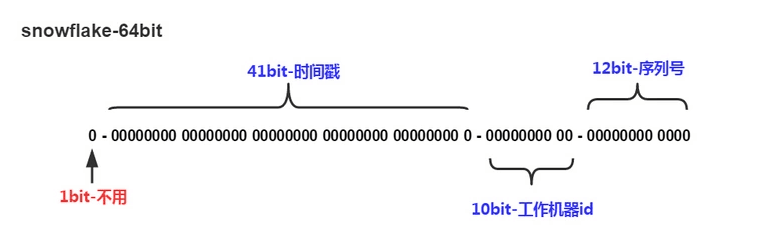

> SnowFlake算法是分布式自增ID生成算法, 生成id的结果是一个64bit大小的整数


它的结构如下图：



- 1位，符号位，固定为0标识正整数。二进制中符号位1表负数，0表整数。
- 41位，时间戳位（毫秒）。
  - 41位可以表示$2^{41}$个毫秒值，转化成单位年则是$(2^{41}) / (1000 * 60 * 60 * 24 * 365) = 69$年, 足够一般公司使用.
  - 注意，41位时间戳存储的是时间戳差值（当前时间戳 - 开始时间戳)，这里的的开始时间戳是id生成器开始使用的时间，由我们程序来指定的.
- 10位，用来记录工作机器id。
   - 可以部署$2^{10} = 1024$个节点，包括5位dataCenterId和5位workerId, 或者10位workerId
   - 5位（bit）取值范围0~31($2^{5}-1$)，来表示不同的datecenterId或workerId
   - 如果10位都用来表示workId, 可以表示1024个机器(0~1023)。
- 12位，序列号，用来记录同毫秒内产生的不同id。
   - 12位（bit）可以表示的最大正整数是$2^{12}-1 = 4095$，来表示同一机器同一时间截（毫秒)内产生的4095个ID序号.

**由于在Java中64bit的整数是long类型，所以在Java中SnowFlake算法生成的id可以用long来存储的。**

**SnowFlake可以保证：**
- 所有生成的id按时间趋势递增
- 整个分布式系统内不会产生重复id（因为有datacenterId和workerId来做区分）

其中, workId使用服务器hostName生成，dataCenterId使用IP生成，这样可以最大限度防止10位机器码重复，但是由于两个ID都不能超过32，只能取余数，还是难免产生重复，但是实际使用中，hostName和IP的配置一般连续或相近，只要不是刚好相隔32位，就不会有问题，况且，hostName和IP同时相隔32的情况更加是几乎不可能的事，平时做的分布式部署，一般也不会超过10台容器。

```java
/**
 * 依赖apache的commons-lang3, version: 3.8
 */
private static Long getWorkId(){
    try {
        String hostAddress = Inet4Address.getLocalHost().getHostAddress();
        int[] ints = StringUtils.toCodePoints(hostAddress);
        int sums = 0;
        for(int b : ints){
            sums += b;
        }
        return (long)(sums % 32);
    } catch (UnknownHostException e) {
        // 如果获取失败，则使用随机数备用
        return RandomUtils.nextLong(0,31);
    }
}
 
private static Long getDataCenterId(){
    int[] ints = StringUtils.toCodePoints(SystemUtils.getHostName());
    int sums = 0;
    for (int i: ints) {
        sums += i;
    }
    return (long)(sums % 32);
}
```


完整代码如下

```xml
<!-- dataCenterId与workId的生成依赖这个包 -->
<dependency>
    <groupId>org.apache.commons</groupId>
    <artifactId>commons-lang3</artifactId>
    <version>3.8</version>
</dependency>
```


```java
/**
 * Twitter_Snowflake
 *
 * SnowFlake的优点是，整体上按照时间自增排序，并且整个分布式系统内不会产生ID碰撞(由数据中心ID和机器ID作区分)，并且效率较高，经测试，SnowFlake每秒能够产生26万ID左右。
 *
 * SnowFlake的结构如下(每部分用-分开):
 *
 * 0 - 0000000000 0000000000 0000000000 0000000000 0 - 00000 - 00000 - 000000000000 <br>
 * 1位标识，由于long基本类型在Java中是带符号的，最高位是符号位，正数是0，负数是1，所以id一般是正数，最高位是0
 *
 * 41位时间戳(毫秒级)，注意，41位时间戳不是存储当前时间的时间戳，而是存储时间戳的差值（当前时间戳 - 开始时间戳)
 * 得到的值），这里的的开始时间戳，一般是我们的id生成器开始使用的时间，由我们程序来指定的（如下面程序IdWorker类的startTime属性）。
 * 41位的时间戳，可以使用69年，年T = (1L << 41) / (1000L * 60 * 60 * 24 * 365) = 69<br>
 *
 * 10位的数据机器位，可以部署在1024个节点，包括5位datacenterId和5位workerId, 或者10位都是workerId<br>
 *
 * 12位序列，毫秒内的计数，12位的计数顺序号支持每个节点每毫秒(同一机器，同一时间戳)产生4096个ID序号<br>
 *
 * 加起来刚好64位，为一个Long型
 *
 */
public class SnowflakeIdWorker {

    // ==============================Fields===========================================
    /** 开始时间戳 (2020-01-01), 程序自定义 */
    private final long startEpoch = 1489111610226L;

    /** 机器id所占的位数 */
    private final long workerIdBits = 5L;
    /** 数据标识id所占的位数 */
    private final long dataCenterIdBits = 5L;
    /** 序列在id中占的位数 */
    private final long sequenceBits = 12L;

    /** 支持的最大机器id，结果是31 (这个移位算法可以很快的计算出几位二进制数所能表示的最大十进制数) */
    private final long maxWorkerId = -1L ^ (-1L << workerIdBits);
    /** 支持的最大数据区标识id，结果是31 */
    private final long maxDataCenterId = -1L ^ (-1L << dataCenterIdBits);

    /** 机器ID向左移12位 */
    private final long workerIdShift = sequenceBits;
    /** 数据标识id向左移17位(12+5) */
    private final long dataCenterIdShift = sequenceBits + workerIdBits;
    /** 时间戳向左移22位(5+5+12) */
    private final long timestampLeftShift = sequenceBits + workerIdBits + dataCenterIdBits;

    /** 生成序列的掩码，这里为4095 (0b111111111111=0xfff=4095) */
    private final long sequenceMask = -1L ^ (-1L << sequenceBits);

    /** 工作机器ID(0~31) */
    private long workerId;

    /** 数据中心ID(0~31) */
    private long dataCenterId;

    /** 毫秒内序列(0~4095) */
    private long sequence = 0L;

    /** 上次生成ID的时间戳 */
    private long lastTimestamp = -1L;

    private static SnowflakeIdWorker idWorker;

    static {
        idWorker = new SnowflakeIdWorker(getWorkId(), getDataCenterId());
    }

    //==============================Constructors=====================================
    /**
     * 构造函数
     * @param workerId 工作ID (0~31)
     * @param dataCenterId 数据中心ID (0~31)
     */
    public SnowflakeIdWorker(long workerId, long dataCenterId) {
        if (workerId > maxWorkerId || workerId < 0) {
            throw new IllegalArgumentException(String.format("workerId can't be greater than %d or less than 0", maxWorkerId));
        }
        if (dataCenterId > maxDataCenterId || dataCenterId < 0) {
            throw new IllegalArgumentException(String.format("dataCenterId can't be greater than %d or less than 0", maxDataCenterId));
        }
        this.workerId = workerId;
        this.dataCenterId = dataCenterId;
    }

    // ==============================Methods==========================================
    /**
     * 获得下一个ID (该方法是线程安全的)
     * @return SnowflakeId
     */
    public synchronized long nextId() {
        long timestamp = timeGen();

        //如果当前时间小于上一次ID生成的时间戳，说明系统时钟回退过这个时候应当抛出异常
        if (timestamp < lastTimestamp) {
            throw new RuntimeException(
                    String.format("Clock moved backwards.  Refusing to generate id for %d milliseconds", lastTimestamp - timestamp));
        }

        //如果是同一时间生成的，则进行毫秒内序列
        if (lastTimestamp == timestamp) {
            sequence = (sequence + 1) & sequenceMask;
            //毫秒内序列溢出
            if (sequence == 0) {
                //阻塞到下一个毫秒,获得新的时间戳
                timestamp = tilNextMillis(lastTimestamp);
            }
        }
        //时间戳改变，毫秒内序列重置
        else {
            sequence = 0L;
        }

        //上次生成ID的时间戳
        lastTimestamp = timestamp;

        //移位并通过或运算拼到一起组成64位的ID
        return ((timestamp - startEpoch) << timestampLeftShift)
                | (dataCenterId << dataCenterIdShift)
                | (workerId << workerIdShift)
                | sequence;
    }

    /**
     * 阻塞到下一个毫秒，直到获得新的时间戳
     * @param lastTimestamp 上次生成ID的时间戳
     * @return 当前时间戳
     */
    protected long tilNextMillis(long lastTimestamp) {
        long timestamp = timeGen();
        while (timestamp <= lastTimestamp) {
            timestamp = timeGen();
        }
        return timestamp;
    }

    /**
     * 返回以毫秒为单位的当前时间
     * @return 当前时间(毫秒)
     */
    protected long timeGen() {
        return System.currentTimeMillis();
    }

    /**
     * 依赖apache的commons-lang3, version: 3.8
     */
    private static Long getWorkId(){
        try {
            String hostAddress = Inet4Address.getLocalHost().getHostAddress();
            //转换unicode位码
            int[] ints = StringUtils.toCodePoints(hostAddress);
            int sums = 0;
            for(int b : ints){
                sums += b;
            }
            return (long)(sums % 32);
        } catch (UnknownHostException e) {
            // 解析不到ip地址, 则使用随机数备用
            return RandomUtils.nextLong(0,31);
        }
    }

    private static Long getDataCenterId(){
        int[] ints = StringUtils.toCodePoints(SystemUtils.getHostName());
        int sums = 0;
        for (int i: ints) {
            sums += i;
        }
        return (long)(sums % 32);
    }

    /**
     * 静态工具类
     *
     * @return
     */
    public static synchronized Long generateId(){
        long id = idWorker.nextId();
        return id;
    }

    //==============================Test=============================================
    /** 测试 */
    public static void main(String[] args) {
        System.out.println(System.currentTimeMillis());
        long startTime = System.nanoTime();
        for (int i = 0; i < 50000; i++) {
            long id = SnowflakeIdWorker.generateId();
            System.out.println(id);
        }
        System.out.println((System.nanoTime()-startTime)/1000000+"ms");
    }
}
```


另外, 如果不需要dataCenter, 那么10位机器位可以都用来标识workerId, 对代码稍作修改即可, 顺便提供10位workId的生成代码: 

```java
/**
 * 通过IP生成机器ID。因为机器标识最长是10位，故只取IP的后两段生成机器ID（从右到左截取）
 */
public static int getMachineIdByIp(String ip) {
    String addr;
    try {
        addr = Inet4Address.getLocalHost().getHostAddress();
    } catch (UnknownHostException e) {
        // 解析不到ip地址, 
        return 0;
    }
    
    String[] arr = ip.split("\\.");
    String bs = Integer.toBinaryString(Integer.parseInt(arr[arr.length - 1]));
    bs = right(Integer.toBinaryString(Integer.parseInt(arr[arr.length - 2])), 2) + padLeft(bs, '0', 8);
    return Integer.parseInt(bs, 2);
}
```

