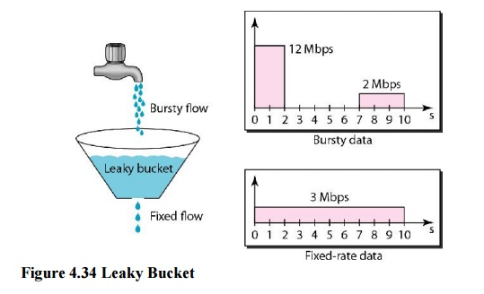
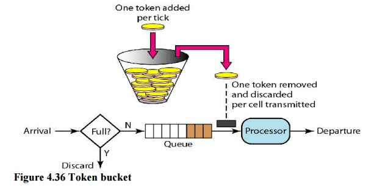

# 常见限流算法

## 1. 固定窗口算法（Fixed Window）

固定窗口算法是一种最简单的限流算法，它根据限流的条件，将请求时间映射到一个时间窗口，再使用计数器累加访问次数。譬如限流条件为每分钟 5 次，那么就按照分钟为单位映射时间窗口，假设一个请求时间为 11:00:45，时间窗口就是 11:00:00 ~ 11:00:59，在这个时间窗口内设定一个计数器，每来一个请求计数器加一，当这个时间窗口的计数器超过 5 时，就触发限流条件。当请求时间落在下一个时间窗口内时（11:01:00 ~ 11:01:59），上一个窗口的计数器失效，当前的计数器清零，重新开始计数。

计数器算法非常容易实现，在单机场景下可以使用 `AtomicLong`、`LongAdder` 或 `Semaphore` 来实现计数，而在分布式场景下可以通过 Redis 的 `INCR` 和 `EXPIRE` 等命令并结合 `EVAL` 或 lua 脚本来实现，[Redis 官网提供了几种简单的实现方式](https://redis.io/commands/INCR#pattern-rate-limiter)。无论是请求频率限流还是并发量限流都可以使用这个算法。

不过这个算法的缺陷也比较明显，那就是存在严重的临界问题。由于每过一个时间窗口，计数器就会清零，这使得限流效果不够平滑，恶意用户可以利用这个特点绕过我们的限流规则。如下图所示，我们的限流条件本来是每分钟 5 次，但是恶意用户在 11:00:00 ~ 11:00:59 这个时间窗口的后半分钟发起 5 次请求，接下来又在 11:01:00 ~ 11:01:59 这个时间窗口的前半分钟发起 5 次请求，这样我们的系统就在 1 分钟内承受了 10 次请求。（[图片来源](https://medium.com/figma-design/an-alternative-approach-to-rate-limiting-f8a06cf7c94c)）


## 2. 滑动窗口算法（Rolling Window 或 Sliding Window）

为了解决固定窗口算法的临界问题，可以将时间窗口划分成更小的时间窗口，然后随着时间的滑动删除相应的小窗口，而不是直接滑过一个大窗口，这就是滑动窗口算法。我们为每个小时间窗口都设置一个计数器，大时间窗口的总请求次数就是每个小时间窗口的计数器的和。如下图所示，我们的时间窗口是 5 秒，可以按秒进行划分，将其划分成 5 个小窗口，时间每过一秒，时间窗口就滑过一秒：（[图片来源](https://segmentfault.com/a/1190000023126434)）


每次处理请求时，都需要计算所有小时间窗口的计数器的和，考虑到性能问题，划分的小时间窗口不宜过多，譬如限流条件是每小时 N 个，可以按分钟划分为 60 个窗口，而不是按秒划分成 3600 个。当然如果不考虑性能问题，划分粒度越细，限流效果就越平滑。相反，如果划分粒度越粗，限流效果就越不精确，出现临界问题的可能性也就越大，当划分粒度为 1 时，滑动窗口算法就退化成了固定窗口算法。由于这两种算法都使用了计数器，所以也被称为 **计数器算法（Counters）**。

进一步思考我们发现，如果划分粒度最粗，也就是只有一个时间窗口时，滑动窗口算法退化成了固定窗口算法；那如果我们把划分粒度调到最细，又会如何呢？那么怎样才能让划分的时间窗口最细呢？时间窗口细到一定地步时，意味着每个时间窗口中只能容纳一个请求，这样我们可以省略计数器，只记录每个请求的时间，然后统计一段时间内的请求数有多少个即可。具体的实现可以参考 [这里的 Redis sorted set 技巧](https://engineering.classdojo.com/blog/2015/02/06/rolling-rate-limiter/) 和 [这里的 Sliding window log 算法](https://medium.com/figma-design/an-alternative-approach-to-rate-limiting-f8a06cf7c94c)。

## 3. 漏桶算法（Leaky Bucket）

除了计数器算法，另一个很自然的限流思路是将所有的请求缓存到一个队列中，然后按某个固定的速度慢慢处理，这其实就是[漏桶算法（Leaky Bucket）](http://en.wikipedia.org/wiki/Leaky_bucket)。漏桶算法假设将请求装到一个桶中，桶的容量为 M，当桶满时，请求被丢弃。在桶的底部有一个洞，桶中的请求像水一样按固定的速度（每秒 r 个）漏出来。我们用下面这个形象的图来表示漏桶算法：（[图片来源](http://www.brainkart.com/article/Techniques-to-Improve-QoS_13490/)）



桶的上面是个水龙头，我们的请求从水龙头流到桶中，水龙头流出的水速不定，有时快有时慢，这种忽快忽慢的流量叫做 **Bursty flow**。如果桶中的水满了，多余的水就会溢出去，相当于请求被丢弃。从桶底部漏出的水速是固定不变的，可以看出漏桶算法可以平滑请求的速率。

漏桶算法可以通过一个队列来实现，如下图所示：


当请求到达时，不直接处理请求，而是将其放入一个队列，然后另一个线程以固定的速率从队列中读取请求并处理，从而达到限流的目的。注意的是这个队列可以有不同的实现方式，比如设置请求的存活时间，或将队列改造成 PriorityQueue，根据请求的优先级排序而不是先进先出。当然队列也有满的时候，如果队列已经满了，那么请求只能被丢弃了。漏桶算法有一个缺陷，在处理突发流量时效率很低，于是人们又想出了下面的令牌桶算法。

## 4. 令牌桶算法（Token Bucket）

[令牌桶算法（Token Bucket）](http://en.wikipedia.org/wiki/Token_bucket)是目前应用最广泛的一种限流算法，它的基本思想由两部分组成：**生成令牌** 和 **消费令牌**。

- 生成令牌：假设有一个装令牌的桶，最多能装 M 个，然后按某个固定的速度（每秒 r 个）往桶中放入令牌，桶满时不再放入；
- 消费令牌：我们的每次请求都需要从桶中拿一个令牌才能放行，当桶中没有令牌时即触发限流，这时可以将请求放入一个缓冲队列中排队等待，或者直接拒绝；

令牌桶算法的图示如下：（[图片来源](http://www.brainkart.com/article/Techniques-to-Improve-QoS_13490/)）



在上面的图中，我们将请求放在一个缓冲队列中，可以看出这一部分的逻辑和漏桶算法几乎一模一样，只不过在处理请求上，一个是以固定速率处理，一个是从桶中获取令牌后才处理。

仔细思考就会发现，令牌桶算法有一个很关键的问题，就是桶大小的设置，正是这个参数可以让令牌桶算法具备处理突发流量的能力。譬如将桶大小设置为 100，生成令牌的速度设置为每秒 10 个，那么在系统空闲一段时间的之后（桶中令牌一直没有消费，慢慢的会被装满），突然来了 50 个请求，这时系统可以直接按每秒 50 个的速度处理，随着桶中的令牌很快用完，处理速度又会慢慢降下来，和生成令牌速度趋于一致。这是令牌桶算法和漏桶算法最大的区别，漏桶算法无论来了多少请求，只会一直以每秒 10 个的速度进行处理。当然，处理突发流量虽然提高了系统性能，但也给系统带来了一定的压力，如果桶大小设置不合理，突发的大流量可能会直接压垮系统。

通过上面对令牌桶的原理分析，一般会有两种不同的实现方式。第一种方式是启动一个内部线程，不断的往桶中添加令牌，处理请求时从桶中获取令牌，和上面图中的处理逻辑一样。第二种方式不依赖于内部线程，而是在每次处理请求之前先实时计算出要填充的令牌数并填充，然后再从桶中获取令牌。下面是第二种方式的一种经典实现，其中 `capacity` 表示令牌桶大小，`refillTokensPerOneMillis` 表示填充速度，每毫秒填充多少个，`availableTokens` 表示令牌桶中还剩多少个令牌，`lastRefillTimestamp` 表示上一次填充时间。

```java
public class TokenBucket {
    // 令牌桶大小
    private final long capacity;
    // 填充速度，每毫秒填充多少个
    private final double refillTokensPerOneMillis;
    // 令牌桶中还剩多少个令牌
    private double availableTokens;
    // 上一次填充时间
    private long lastRefillTimestamp;
 
    public TokenBucket(long capacity, long refillTokens, long refillPeriodMillis) {
        this.capacity = capacity;
        this.refillTokensPerOneMillis = (double) refillTokens / (double) refillPeriodMillis;
        this.availableTokens = capacity;
        this.lastRefillTimestamp = System.currentTimeMillis();
    }
 
    synchronized public boolean tryConsume(int numberTokens) {
		// 获取令牌前, 先填充令牌桶
        refill();
        if (availableTokens < numberTokens) {
            return false;
        } else {
            availableTokens -= numberTokens;
            return true;
        }
    }
 
    private void refill() {
        long currentTimeMillis = System.currentTimeMillis();
        if (currentTimeMillis <= lastRefillTimestamp) {
            return;
        }
        long millisSinceLastRefill = currentTimeMillis - lastRefillTimestamp;
        double refill = millisSinceLastRefill * refillTokensPerOneMillis;
        this.availableTokens = Math.min(capacity, availableTokens + refill);
        this.lastRefillTimestamp = currentTimeMillis;
    }
}
```

可以像下面这样创建一个令牌桶（桶大小为 100，且每秒生成 100 个令牌）：

```
TokenBucket limiter = new TokenBucket(100, 100, 1000);
```

从上面的代码片段可以看出，令牌桶算法的实现非常简单也非常高效，仅仅通过几个变量的运算就实现了完整的限流功能。核心逻辑在于 `refill()` 这个方法，在每次消费令牌时，计算当前时间和上一次填充的时间差，并根据填充速度计算出应该填充多少令牌。在重新填充令牌后，再判断请求的令牌数是否足够，如果不够，返回 false，如果足够，则减去令牌数，并返回 true。

在实际的应用中，往往不会直接使用这种原始的令牌桶算法，一般会在它的基础上作一些改进，比如，填充速率支持动态调整，令牌总数支持透支，基于 Redis 支持分布式限流等，不过总体来说还是符合令牌桶算法的整体框架。


# 一些开源项目

有很多开源项目中都实现了限流的功能，这一节通过一些开源项目的学习，了解限流是如何实现的。

## 1. Guava 的 RateLimiter

[Google Guava](https://github.com/google/guava/) 是一个强大的核心库，包含了很多有用的工具类，例如：集合、缓存、并发库、字符串处理、I/O 等等。其中在并发库中，Guava 提供了两个和限流相关的类：[RateLimiter](https://github.com/google/guava/blob/master/guava/src/com/google/common/util/concurrent/RateLimiter.java) 和 [SmoothRateLimiter](https://github.com/google/guava/blob/master/guava/src/com/google/common/util/concurrent/SmoothRateLimiter.java)。Guava 的 RateLimiter 基于令牌桶算法实现，不过在传统的令牌桶算法基础上做了点改进，支持两种不同的限流方式：**平滑突发限流（SmoothBursty）** 和 **平滑预热限流（SmoothWarmingUp）**。

下面的方法可以创建一个平滑突发限流器（SmoothBursty）：

```
RateLimiter limiter = RateLimiter.create(5);
```

`RateLimiter.create(5)` 表示这个限流器容量为 5，并且每秒生成 5 个令牌，也就是每隔 200 毫秒生成一个。我们可以使用 `limiter.acquire()` 消费令牌，如果桶中令牌足够，返回 0，如果令牌不足，则阻塞等待，并返回等待的时间。我们连续请求几次：

```java
System.out.println(limiter.acquire());
System.out.println(limiter.acquire());
System.out.println(limiter.acquire());
System.out.println(limiter.acquire());
```

输出结果如下：

```
0.0
0.198239
0.196083
0.200609
```

可以看出限流器创建之后，初始会有一个令牌，然后每隔 200 毫秒生成一个令牌，所以第一次请求直接返回 0，后面的请求都会阻塞大约 200 毫秒。另外，`SmoothBursty` 还具有应对突发的能力，而且 **还允许消费未来的令牌**，比如下面的例子：

```java
RateLimiter limiter = RateLimiter.create(5);
System.out.println(limiter.acquire(10));
System.out.println(limiter.acquire(1));
System.out.println(limiter.acquire(1));
```

会得到类似下面的输出：

```
0.0
1.997428
0.192273
0.200616
```

限流器创建之后，初始令牌只有一个，但是我们请求 10 个令牌竟然也通过了，只不过看后面请求发现，第二次请求花了 2 秒左右的时间把前面的透支的令牌给补上了。

Guava 支持的另一种限流方式是平滑预热限流器（SmoothWarmingUp），可以通过下面的方法创建：

```java
RateLimiter limiter = RateLimiter.create(2, 3, TimeUnit.SECONDS);
System.out.println(limiter.acquire(1));
System.out.println(limiter.acquire(1));
System.out.println(limiter.acquire(1));
System.out.println(limiter.acquire(1));
System.out.println(limiter.acquire(1));
```

第一个参数还是每秒创建的令牌数量，这里是每秒 2 个，也就是每 500 毫秒生成一个，后面的参数表示从冷启动速率过渡到平均速率的时间间隔，也就是所谓的热身时间间隔（warm up period）。我们看下输出结果：

```
0.0
1.329289
0.994375
0.662888
0.501287
```

第一个请求还是立即得到令牌，但是后面的请求和上面平滑突发限流就完全不一样了，按理来说 500 毫秒就会生成一个令牌，但是我们发现第二个请求却等了 1.3s，而不是 0.5s，后面第三个和第四个请求也等了一段时间。不过可以看出，等待时间在慢慢的接近 0.5s，直到第五个请求等待时间才开始变得正常。从第一个请求到第五个请求，这中间的时间间隔就是热身阶段，可以算出热身的时间就是我们设置的 3 秒。

关于热身的算法很有意思，也比较烧脑，有兴趣的同学可以参考 [这里](https://zhuanlan.zhihu.com/p/60979444) 和 [这里](https://juejin.im/post/6844903783432978439) 的过程分析。

## 2. Bucket4j

[Bucket4j](https://github.com/vladimir-bukhtoyarov/bucket4j) 是一个基于令牌桶算法实现的强大的限流库，它不仅支持单机限流，还支持通过诸如 [Hazelcast](http://hazelcast.com/products/hazelcast/)、[Ignite](https://ignite.apache.org/)、[Coherence](http://www.oracle.com/technetwork/middleware/coherence/overview/index.html)、[Infinispan](http://infinispan.org/) 或其他兼容 [JCache API (JSR 107)](https://www.jcp.org/en/jsr/detail?id=107) 规范的分布式缓存实现分布式限流。

在使用 Bucket4j 之前，我们有必要先了解 Bucket4j 中的几个核心概念：

- Bucket
- Bandwidth
- Refill

`Bucket` 接口代表了令牌桶的具体实现，也是我们操作的入口。它提供了诸如 `tryConsume` 和 `tryConsumeAndReturnRemaining` 这样的方法供我们消费令牌。可以通过下面的构造方法来创建 `Bucket`：

```
Bucket bucket = Bucket4j.builder().addLimit(limit).build();``if(bucket.tryConsume(1)) {``  ``System.out.println("ok");``} else {``  ``System.out.println("error");``}
```

`Bandwidth` 的意思是带宽，可以理解为限流的规则。Bucket4j 提供了两种方法来创建 Bandwidth：`simple` 和 `classic`。下面是 simple 方式创建的 Bandwidth，表示桶大小为 10，填充速度为每分钟 10 个令牌：

```
Bandwidth limit = Bandwidth.simple(10, Duration.ofMinutes(1));
```

simple 方式桶大小和填充速度是一样的，classic 方式更灵活一点，可以自定义填充速度，下面的例子表示桶大小为 10，填充速度为每分钟 5 个令牌：

```
Refill filler = Refill.greedy(5, Duration.ofMinutes(1));``Bandwidth limit = Bandwidth.classic(10, filler);
```

其中，`Refill` 用于填充令牌桶，可以通过它定义填充速度，Bucket4j 有两种填充令牌的策略：**间隔策略（intervally）** 和 **贪婪策略（greedy）**。在上面的例子中我们使用的是贪婪策略，如果使用间隔策略可以像下面这样创建 `Refill`：

```
Refill filler = Refill.intervally(5, Duration.ofMinutes(1));
```

所谓间隔策略指的是每隔一段时间，一次性的填充所有令牌，比如上面的例子，会每隔一分钟，填充 5 个令牌，如下所示：


而贪婪策略会尽可能贪婪的填充令牌，同样是上面的例子，会将一分钟划分成 5 个更小的时间单元，每隔 12 秒，填充 1 个令牌，如下所示：


在了解了 Bucket4j 中的几个核心概念之后，我们再来看看官网介绍的一些特性：

- 基于令牌桶算法
- 高性能，无锁实现
- 不存在精度问题，所有计算都是基于整型的
- 支持通过符合 JCache API 规范的分布式缓存系统实现分布式限流
- 支持为每个 Bucket 设置多个 Bandwidth
- 支持同步和异步 API
- 支持可插拔的监听 API，用于集成监控和日志
- 不仅可以用于限流，还可以用于简单的调度

Bucket4j 提供了丰富的文档，推荐在使用 Bucket4j 之前，先把官方文档中的 [基本用法](https://github.com/vladimir-bukhtoyarov/bucket4j/blob/master/doc-pages/basic-usage.md) 和 [高级特性](https://github.com/vladimir-bukhtoyarov/bucket4j/blob/master/doc-pages/advanced-usage.md) 仔细阅读一遍。另外，关于 Bucket4j 的使用，推荐这篇文章 [Rate limiting Spring MVC endpoints with bucket4j](https://golb.hplar.ch/2019/08/rate-limit-bucket4j.html)，这篇文章详细的讲解了如何在 Spring MVC 中使用拦截器和 Bucket4j 打造业务无侵入的限流方案，另外还讲解了如何使用 Hazelcast 实现分布式限流；另外，[Rate Limiting a Spring API Using Bucket4j](https://www.baeldung.com/spring-bucket4j) 这篇文章也是一份很好的入门教程，介绍了 Bucket4j 的基础知识，在文章的最后还提供了 [Spring Boot Starter](https://github.com/MarcGiffing/bucket4j-spring-boot-starter) 的集成方式，结合 Spring Boot Actuator 很容易将限流指标集成到监控系统中。

和 Guava 的限流器相比，Bucket4j 的功能显然要更胜一筹，毕竟 Guava 的目的只是用作通用工具类，而不是用于限流的。使用 Bucket4j 基本上可以满足我们的大多数要求，不仅支持单机限流和分布式限流，而且可以很好的集成监控，搭配 Prometheus 和 Grafana 简直完美。值得一提的是，有很多开源项目譬如 [JHipster API Gateway](https://www.jhipster.tech/api-gateway/#rate_limiting) 就是使用 Bucket4j 来实现限流的。

Bucket4j 唯一不足的地方是它只支持请求频率限流，不支持并发量限流，另外还有一点，虽然 Bucket4j 支持分布式限流，但它是基于 Hazelcast 这样的分布式缓存系统实现的，不能使用 Redis，这在很多使用 Redis 作缓存的项目中就很不爽，所以我们还需要在开源的世界里继续探索。

## 3. Resilience4j

[Resilience4j](https://github.com/resilience4j/resilience4j) 是一款轻量级、易使用的高可用框架。用过 Spring Cloud 早期版本的同学肯定都听过 [Netflix Hystrix](https://github.com/Netflix/Hystrix)，Resilience4j 的设计灵感就来自于它。自从 Hystrix 停止维护之后，官方也推荐大家使用 Resilience4j 来代替 Hystrix。


Resilience4j 的底层采用 [Vavr](https://github.com/vavr-io/vavr)，这是一个非常轻量级的 Java 函数式库，使得 Resilience4j 非常适合函数式编程。Resilience4j 以装饰器模式提供对函数式接口或 lambda 表达式的封装，提供了一波高可用机制：**重试（Retry）**、**熔断（Circuit Breaker）**、**限流（Rate Limiter）**、**限时（Timer Limiter）**、**隔离（Bulkhead）**、**缓存（Caceh）** 和 **降级（Fallback）**。我们重点关注这里的两个功能：[限流（Rate Limiter）](https://github.com/resilience4j/resilience4j#ratelimiter) 和 [隔离（Bulkhead）](https://github.com/resilience4j/resilience4j#bulkhead)，Rate Limiter 是请求频率限流，Bulkhead 是并发量限流。

Resilience4j 提供了两种限流的实现：**SemaphoreBasedRateLimiter** 和 **AtomicRateLimiter**。**SemaphoreBasedRateLimiter** 基于信号量实现，用户的每次请求都会申请一个信号量，并记录申请的时间，申请通过则允许请求，申请失败则限流，另外有一个内部线程会定期扫描过期的信号量并释放，很显然这是令牌桶的算法。**AtomicRateLimiter** 和上面的经典实现类似，不需要额外的线程，在处理每次请求时，根据距离上次请求的时间和生成令牌的速度自动填充。关于这二者的区别可以参考这篇文章 [Rate Limiter Internals in Resilience4j](https://dzone.com/articles/rate-limiter-internals-in-resilience4j)。

Resilience4j 也提供了两种隔离的实现：**SemaphoreBulkhead** 和 **ThreadPoolBulkhead**，通过信号量或线程池控制请求的并发数，具体的用法参考官方文档，这里不再赘述。

下面是一个同时使用限流和隔离的例子：

```java
// 创建一个 Bulkhead，最大并发量为 150
BulkheadConfig bulkheadConfig = BulkheadConfig.custom()
    .maxConcurrentCalls(150)
    .maxWaitTime(100)
    .build();
Bulkhead bulkhead = Bulkhead.of("backendName", bulkheadConfig);
 
// 创建一个 RateLimiter，每秒允许一次请求
RateLimiterConfig rateLimiterConfig = RateLimiterConfig.custom()
    .timeoutDuration(Duration.ofMillis(100))
    .limitRefreshPeriod(Duration.ofSeconds(1))
    .limitForPeriod(1)
    .build();
RateLimiter rateLimiter = RateLimiter.of("backendName", rateLimiterConfig);
 
// 使用 Bulkhead 和 RateLimiter 装饰业务逻辑
Supplier<String> supplier = () -> backendService.doSomething();
Supplier<String> decoratedSupplier = Decorators.ofSupplier(supplier)
  .withBulkhead(bulkhead)
  .withRateLimiter(rateLimiter)
  .decorate();
 
// 调用业务逻辑
Try<String> try = Try.ofSupplier(decoratedSupplier);
assertThat(try.isSuccess()).isTrue();
```

Resilience4j 在功能特性上比 Bucket4j 强大不少，而且还支持并发量限流。不过最大的遗憾是，Resilience4j 不支持分布式限流。


## 4. 其他

网上还有很多限流相关的开源项目，不可能一一介绍，这里列出来的只是冰山之一角：

- https://github.com/mokies/ratelimitj
- https://github.com/wangzheng0822/ratelimiter4j
- https://github.com/wukq/rate-limiter
- https://github.com/marcosbarbero/spring-cloud-zuul-ratelimit
- https://github.com/onblog/SnowJena
- https://gitee.com/zhanghaiyang/spring-boot-starter-current-limiting
- https://github.com/Netflix/concurrency-limits

