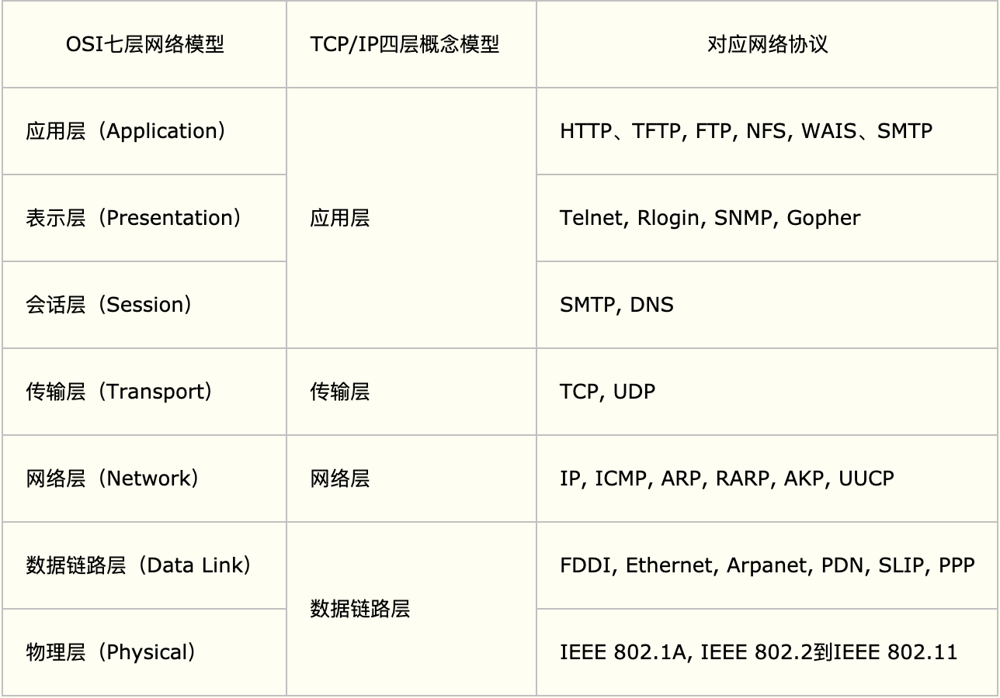
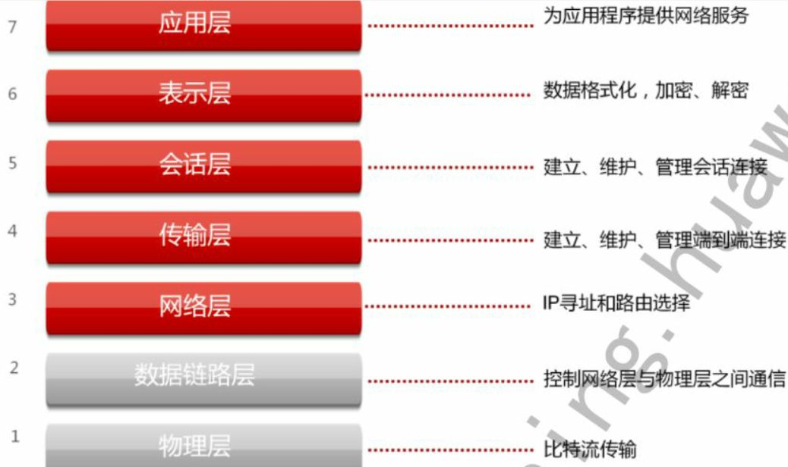
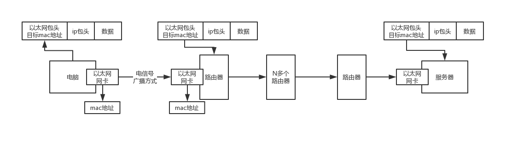
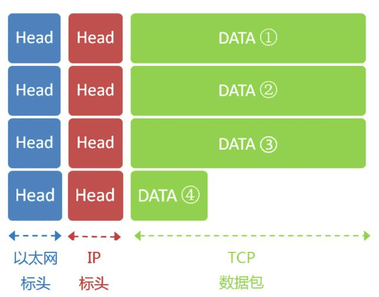
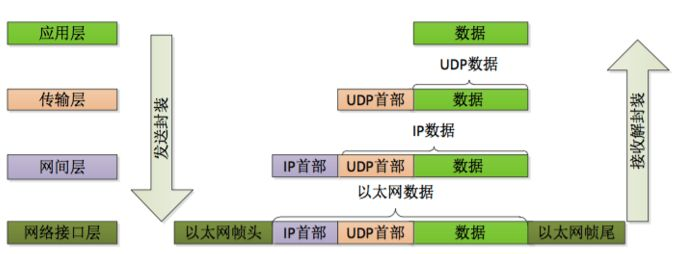

# 1. OSI 7层模型和TCP/IP 4层模型

**关系**

- OSI引入了服务、接口、协议、分层的概念，TCP/IP借鉴了OSI的这些概念建立TCP/IP模型。

- OSI先有模型，后有协议，先有标准，后进行实践；而TCP/IP则相反，先有协议和应用再提出了模型，且是参照的OSI模型。

- OSI是一种理论下的模型，而TCP/IP已被广泛使用，成为网络互联事实上的标准。

- 七层结构记忆方法：**应、表、会、传、网、数、物**

  

**专有名词**

**OSI**: `open system interconnection` 开放式系统互联参考模型

**TCP**：`transmission control protocol` 传输控制协议

**UDP**：`user data protocol` 用户数据报协议

# 2. OSI各层作用

## 2.1 物理层

- 通过光缆, 电缆, 无线电波等物理方式把设备连接起来. 
- 负责传输0和1的电路信号. 
- 不同局域网的通信, 需要ISP互联网服务供应商的物理链接
- Modem调制解调器工作于这一层, 把以太网协议数据包解析一个个很小的单位，叫做**信元**，接着把这个信元再次**转换**为**电路信号**，然后就会通过连着的网线发送出去. 

## 2.2 数据链路层(以太网协议)

- **网卡**根据**以太网协议**把电信号处理成数据包(帧), 并控制数据包的传输
- 要求每个网卡必须有**MAC地址**, MAC标识数据包的发送者/接受者
- **网络交换机**是通过**mac地址**来寻址和传输数据包的,  **负责局域网内的通信**, 以及拓展局域网内的设备数量
- 广播: 设备把数据包通过网络交换机以**广播方式**发送给局域网(子网)内所有的设备, 设备接受到数据包后根据自身MAC匹配判断

## 2.3 网络层(IP协议)

- 建立**主机(IP) - 主机(IP)的连接**

- 根据IP协议分配IP地址, IP类型分v4, v6.

  - IPv4 //todo
  - IPv6

- 子网掩码. 不同**IP地址**跟**子网掩码**做**与运算**可以识别同在一个局域网的设备.

- ARP协议(Address Resolution Protocol地址解析协议)

  - 每个设备都有一个arp缓存表, 用于保存每个设备的IP与MAC的对应关系, 将IP地址解析为MAC地址
  - 主机发送信息时将包含目标IP地址的ARP请求广播到局域网络上的所有主机，并接收返回消息，以此确定目标的物理地址；收到返回消息后将该IP地址和物理地址存入本机ARP缓存中并保留一定时间，下次请求时直接查询ARP缓存以节约资源。

- 路由. 

  - 负责两个局域网的通信.  路由通过**IP寻址**.  
  - 现代路由器也有网络交换机角色
    - 路由器配置了两块网卡. 分别连接一个局域网.
    - 网关通常指路由器的IP. 
  - 工作过程: 一个局域网内的机器之间通信，就是在数据包里写上对方的mac地址，然后交换机广播出去ok了；但是如果是跨局域网的通信，就是写上对方的ip地址，然后先通过mac地址广播到路由器，让路由器再根据另外一个子网的ip地址转换为mac地址，通过另外一个子网的交换机广播过去. (路由器与路由器之间也是在一个局域网). 

  

- 拆包

  - 以太网数据包的数据部分，最大长度为**1500字节(Byte)**，当IP包过大时，会拆成多个IP包，但是IP包的头部包含了每个数据包的序号。
  - 

## 2.4 传输层(TCP/UDP协议)

- 建立**端口 - 端口的连接**
- 端口
  - 取值方位 0 ~ 65535
    - 0-1023系统端口
    - 其他是应用程序端口
- TCP/UDP协议
  - 基于端口的通信协议
  - 在数据包里加入端口号，可以通过端口号进行点对点的通信了
  - TCP: 可靠, 会拆包, 会重发.  经过三次握手建立连接，流式拆包发送数据，四次握手断开连接. 
  - UDP: 不可靠. 只负责发数据, 对方是否收到不管. 
  
  

## 2.5 会话层

todo

## 2.6 表示层

todo

## 2.7 应用层  

- TCP协议中的数据部分的**数据格式**. 
  - HTTP协议与邮件SMTP协议在TCP包的数据部分, 数据格式规定不一样, 解析方式也不一样. 
- 

数据包在TCP/IP 4层模型传送时的封装和解封装

# 3. DNS服务器

Domain Name System 域命名服务器, 维护一个域名(例如 www.baidu.com )对应的ip地址的。